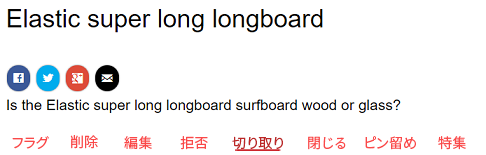
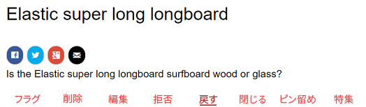
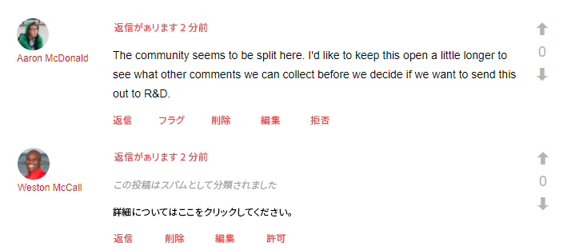
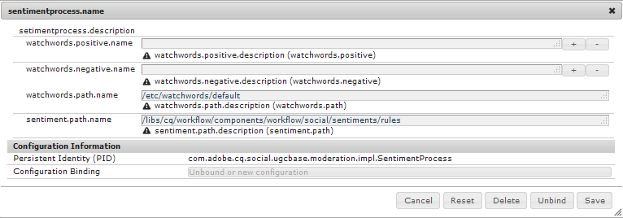
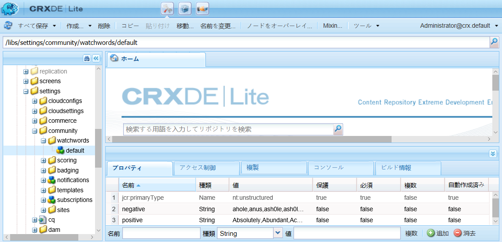

# コミュニティコンテンツのモデレート {#moderating-community-content}

## 概要 {#overview}

コミュニティコンテンツは、ユーザー生成コンテンツ（UGC）とも呼ばれ、メンバー（サインインした訪問者）がパブリッシュ環境で以下のいずれかのコミュニティコンポーネントを操作してコンテンツを投稿したときに作成されます。

* [ブログ](/help/communities/blog-feature.md):メンバーがブログ記事またはコメントを投稿します。
* [カレンダー](/help/communities/calendar.md):メンバーがカレンダーイベントまたはコメントを投稿します。
* [コメント](/help/communities/comments.md):メンバーはコメントを投稿したり、コメントに返信したりします。

* [フォーラム](/help/communities/forum.md):メンバは、新しいトピックを投稿したり、トピックに返信したりします。
* [理想](/help/communities/ideation-feature.md):メンバーは、アイデアまたはコメントを投稿します。
* [QnA](/help/communities/working-with-qna.md):メンバーが質問を作成するか、質問に回答します。
* [レビュー](/help/communities/reviews.md):メンバーは、項目を評価する際にコメントを投稿します。

UGC のモデレートは、肯定的な投稿を見分けるだけでなく、否定的な投稿（スパムや暴言など）を制限するためにも役立ちます。UGCは、次の複数の環境でモデレートできます。

* [コミュニティコンテンツの保存](working-with-srp.md)

* [一括モデレートコンソール](moderation.md)

   The Moderation console is accessible by administrators and [community moderators](/help/communities/users.md) in the public environment as well as by administrators in the author environment. This is possible when community content is stored in a [common store](/help/communities/working-with-srp.md).

* [コンテキスト内モデレート](in-context.md)

   投稿環境でのモデレートは、管理者およびコミュニティのモデレーターが、コンテンツが投稿されたページで直接実行できます。

## モデレートアクション {#moderation-actions}

投稿コンテンツ（UGC）に対して実行できるアクションは、ユーザーの種類と環境によって異なります。次の表では、ユーザーIDに基づく様々な役割について、次の用語で説明しています。

* `Admin`

   A user who is a member of [community-administrators](users.md) group.

* `Moderator`

   A member of a [community moderators](users.md#publishenvironmentusersandgroups) group (has [moderator permissions](in-context.md#moderatorpermissions)).

* `Creator`

   コンテンツを投稿したユーザー。

* `Member`

   特別な権限のないログインユーザー。

* `Visitor`

   匿名ユーザー。

<table>
 <tbody>
  <tr>
   <td> </td>
   <td><strong>管理者</strong></td>
   <td><strong>モデレーター</strong></td>
   <td><strong>作成者</strong></td>
   <td><strong>メンバー</strong></td>
   <td><strong>訪問者</strong></td>
   <td><strong>発生する イベント</strong></td>
   <td><strong>事前モデレート</strong></td>
  </tr>
  <tr>
   <td><strong>編集／ 削除</strong></td>
   <td>X</td>
   <td>X</td>
   <td>X</td>
   <td> </td>
   <td> </td>
   <td> </td>
   <td> </td>
  </tr>
  <tr>
   <td><strong>切り取り</strong></td>
   <td>X</td>
   <td>X</td>
   <td> </td>
   <td> </td>
   <td> </td>
   <td> </td>
   <td> </td>
  </tr>
  <tr>
   <td><strong>拒否</strong></td>
   <td>X</td>
   <td>X</td>
   <td> </td>
   <td> </td>
   <td> </td>
   <td>X</td>
   <td> </td>
  </tr>
  <tr>
   <td><strong>閉じる／ 再度開く</strong></td>
   <td>X</td>
   <td>X</td>
   <td> </td>
   <td> </td>
   <td> </td>
   <td>X</td>
   <td>X  </td>
  </tr>
  <tr>
   <td><strong>フラグ／ フラグ解除</strong></td>
   <td>X</td>
   <td>X</td>
   <td> </td>
   <td>X</td>
   <td> </td>
   <td>X</td>
   <td> </td>
  </tr>
  <tr>
   <td><strong>アクセス設定</strong></td>
   <td>X</td>
   <td>X</td>
   <td> </td>
   <td> </td>
   <td> </td>
   <td>X</td>
   <td>X</td>
  </tr>
 </tbody>
</table>

### 編集／削除 {#edit-delete}

投稿後、作成者、管理者またはコミュニティモデレーターは、投稿を編集または削除できます。

UGC を削除すると、リポジトリから消去され、復元できなくなります。

### 切り取り {#cut}

管理者またはコミュニティモデレーターは、1 つ以上のフォーラムトピックまたは Q&amp;A の質問を、ある場所から別の場所に移動できます。同じメンバーが両方のサイトでモデレート権限を持っている場合、1つのコミュニティサイトから別のコミュニティサイトに移動することもできます。

切り取りのアクションを選択すると、コンテンツはクリップボードにコピーされます。複数の投稿をコピーして、グループとして新しい場所に移動できます。

 

別の場所で、クリップボードにコンテンツが存在するときには、新しい投稿の横に「貼り付け」ボタンと貼り付けられる投稿数が表示されます。「貼り付け」ボタンには、貼り付けの代わりにクリップボードをクリアするオプションが含まれています。

### 拒否 {#deny}

モデレーターは、公開済みのサイトで特定の UGC の表示を禁止できます。管理者およびコミュニティのモデレーターに対しては、投稿は引き続き使用可能で、スパムとして注釈が付けられます。

### 閉じる／再度開く {#close-reopen}

閉じるのアクションは、会話（フォーラムトピックまたは最初のコメント）のスレッド全体に作用し、後続のすべての投稿または返信も含まれます。

閉じるを実行すると、返信がそれ以上できなくなり、さらにモデレートアクションもできなくなります。

何か操作を実行するには、トピックまたはコメントを再度開く必要があります。

閉じる／再度開くのアクションは、管理者またはコミュニティモデレーターが実行できます。

### フラグ／フラグ解除 {#flag-unflag}

フラグ設定は、サインインしたメンバー（コンテンツの作成者を除く）が投稿のコンテンツに問題があることを示す手段です。フラグが付けられると、フラグ解除アイコンが表示され、同じメンバーがコンテンツのフラグを解除できます。

コンテキスト内モデレートは、設定によりメンバーが投稿にフラグを付けた理由を選択可能にできます。選択可能なフラグ理由のリストは、カスタム理由を入力できるかどうかを含めて設定できます。 フラグの理由は UGC と共に保存されますが、その理由によって特定のアクションが呼び出されることはありません。通知をトリガーするフラグの数のみ。 フラグ付きのコンテンツには注釈が付けられ、モデレーターが操作できるようになります。

すべてのフラグと、フラグを付けた人、フラグの理由はシステムで追跡され、しきい値に達するとイベントが送信されます。UGCがコミュニティのモデレーターによって許可されている場合、これらのフラグはアーカイブされます。 許可およびアーカイブの後にフラグが設定された場合は、以前のフラグ設定はなかったものとして、後のフラグがアーカイブされます。

### 許可 {#allow}

許可のアクションは、フラグが設定された UGC や、拒否された UGC、事前モデレートシステムで承認されなかった UGC に対するオプションです。許可アクションは、フラグ付きまたは拒否/スパムのステータスが存在する場合はクリアし、フラグ付きのデータをアーカイブします。

## 一般的なモデレートの概念 {#common-moderation-concepts}

### 事前モデレート {#premoderation}

UGC の事前モデレートがおこなわれる場合、投稿は、モデレートアクションで承認されるまでは公開サイトに表示されません。During creation of a [community site](/help/communities/sites-console.md), checking the box [Content is Premoderated](sites-console.md#moderation) will enable premoderation for the entire site. コンポーネントをページに配置したら、モデレートをサポートするコンポーネントを、編集ダイアログの設定を使用して、モデレート前の設定用に設定できます。

* [ユーザー](comments.md) ・モデ [レート](reviews.md)/プ **[!UICONTROL リモデレートでのコメ]** ントとレビュー ****。

* [フォーラム](/help/communities/forum.md)Qn [,](/help/communities/ideation-feature.md)Qn [,](/help/communities/working-with-qna.md)Calendar calendar [, in Settings](/help/communities/calendar.md), **[!UICONTROL Settings > Moderated Moderated Moderated]****** Qn,

### スパム検出 {#spam-detection}

スパム検出は自動モデレート機能で、送信された不要なユーザーの生成コンテンツをスパムとしてマークして除外するフィルターを提供します。 有効にすると、事前に設定されたスパム単語の集まりに基づいて、ユーザーが生成したコンテンツがスパムかどうかを識別します。 デフォルトのスパムワードは次の場所にあります。

`/libs/settings/community/sites/moderation/spamdetector-conf/profiles/spam_words.txt`.

ただし、デフォルトのスパムワードをカスタマイズまたは拡張するには、[overlay](/help/communities/overlay-comments.md) を使用して、デフォルトのスパムワードの構造に従って /apps ディレクトリ内にスパムワードを作成します。

スパムワードを含むユーザー生成投稿（ブログやフォーラム、コメントなど、あらゆるコンテンツタイプの投稿）には、「この投稿はスパムとして分類されました」というテキストが表示されます。 スパムワードを含む（ブログ、フォーラム、コメントなど、すべてのコンテンツタイプで生成された）投稿は、投稿の上に「この投稿はスパムとして分類されました」というテキストでマークされます。

モデレーターは、このような投稿を表示して同じようにマーキングし、サイトへの表示を許可または拒否できます。これらの投稿に対するモデレートアクションは、コンテキスト内でおこなうことも、一括モデレート UI でおこなうこともできます。

スパム検出エンジンを有効にするには、次の手順に従います。

1. Open [Web Console](https://localhost:4502/system/console/configMgr), by going to `/system/console/configMgr`.

1. **AEM Communities Auto Moderation** 設定を見つけて編集します。
1. Add the **[!UICONTROL SpamProcess]** entry.

>[!NOTE]
>
>スパム検出は英語ロケールにのみ実装されます。

### 好感度 {#sentiment}

好感度は、投稿（UGC）内に存在する肯定的および否定的なキーワード（[ウォッチワード](#configuringwatchwords)）の数に基づいて計算されます。

好感度分析では、あらかじめ設定した一連のルールが使用され、UGC の好感度が計算されます。デフォルトのルールは次の場所にあります。 `/libs/cq/workflow/components/workflow/social/sentiments/rules.`

ルールにより生成される値は、1（すべて否定的、肯定的な言葉なし）～ 10（すべて肯定的、否定的な言葉なし）です。値 5 は中立の好感度を表し、これがデフォルトになります。

/libs コンポーネントで定義されているルールを以下に示します。

* ルール1:正の単語および負の単語が1つ以上ない場合は、値を1に設定します。
* ルール 2：否定的な言葉が 1 つもなく、肯定的な言葉が少なくとも 1 つある場合は、値を 10 に設定.
* ルール3:肯定の単語よりも否定の単語が多い場合は、値を3に設定します。
* ルール4:負の単語よりも肯定の単語が多い場合は、値を8に設定します。

ルールを上書きまたは追加するには、デフォルトのルールの構造に従って、/apps ディレクトリに一連のルールを作成します。好感度設定を編集してルールの場所を指定します。

分析が完了すると、好感度が UGC と共に保存されます。

[一括モデレートコンソール](/help/communities/moderation.md)では、肯定的、否定的または中立のいずれかの好感度で UGC をフィルタリングして表示できます。

#### ウォッチワード {#watchwords}

AEM communities provides a *watchword analyzer* as a step in the process to evalute [sentiment](#sentiment). 監視ワードによって提供されるセンチメント値に対する貢献度は、投稿されたコンテンツで使用されるネガティブな監視ワードとポジティブな監視ワード、および禁止された単語が比較された結果です。

#### 好感度とウォッチワードの設定 {#configure-sentiment-and-watchwords}

好感度のルールと同様に、肯定的および否定的なウォッチワードのリストをカスタマイズできます。

ウォッチワードのデフォルトのリストは、リポジトリ内のノードのプロパティとして、デフォルトと同様に入力できます。また、単語のリストを使用して OSGi サービス `sentimentprocess.name` を設定することで、デフォルトを上書きしても入力できます。

The **sentimentprocess.name** may also be modified to reference the location of a custom set of sentiment rules.

好感度とウォッチワードを設定するには：

* 作成者インスタンスに管理者としてログインします。
* Open [Web Console](https://localhost:4502/system/console/configMgr).
* Locate `sentimentprocess.name`.
* 編集モードで開く設定を選択します。

* **肯定的な監視ワード**

   デフォルトを上書きするための、肯定的な好感度に影響を与える単語のコンマ区切りリストです。デフォルトは空のリストです。

* **否定的な監視ワード**

   デフォルトを上書きするための、否定的な好感度に影響を与える単語のコンマ区切りリストです。デフォルトは空のリストです。

* **監視ワードノードへの明示的なパス**

   The repository location of a node containing default `positive` and `negative` properties specifying default watchwords. デフォルトは `/libs/settings/community/watchwords/default` です。

* **センチメントルール**

   肯定的および否定的ウォッチワードに基づいて好感度を計算するルールのリポジトリの場所です。Default is `/libs/cq/workflow/components/workflow/social/sentiments/rules` (however, there is no longer any workflow involved).

Following is an example of a custom entry for the default watchwords, when `Explicit Path to Watchwords Node` is set to `/libs/settings/community/watchwords/default`.

### モデレーター権限 {#moderator-permissions}

The following permissions, when assigned to the same resource, are collectively referred to as `moderator permissions`:

* `Read`
* `Modify`
* `Create`
* `Delete`
* `Replicate`

