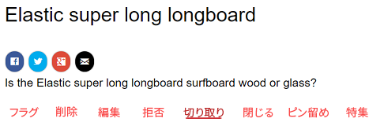
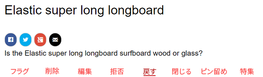
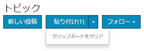
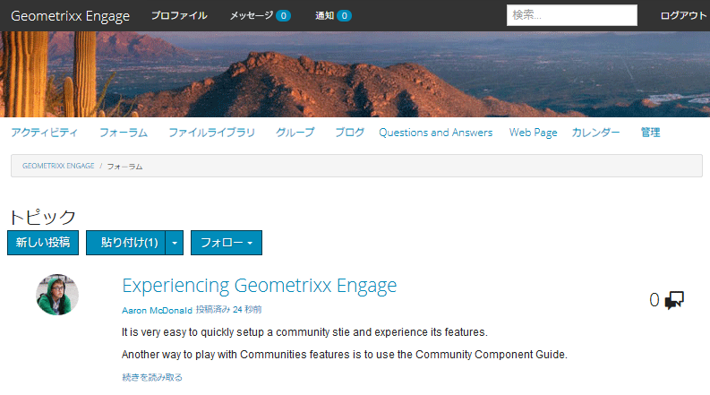
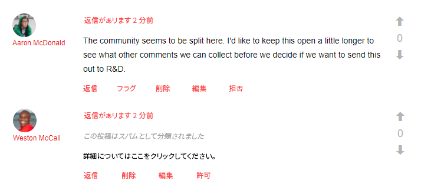
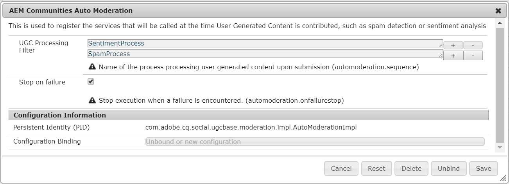
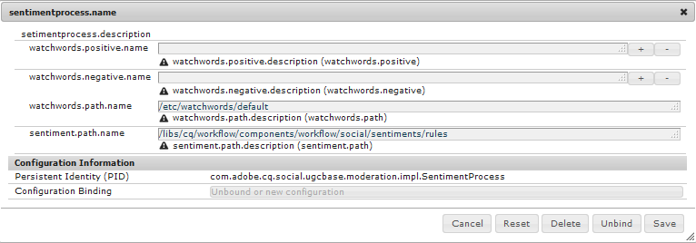
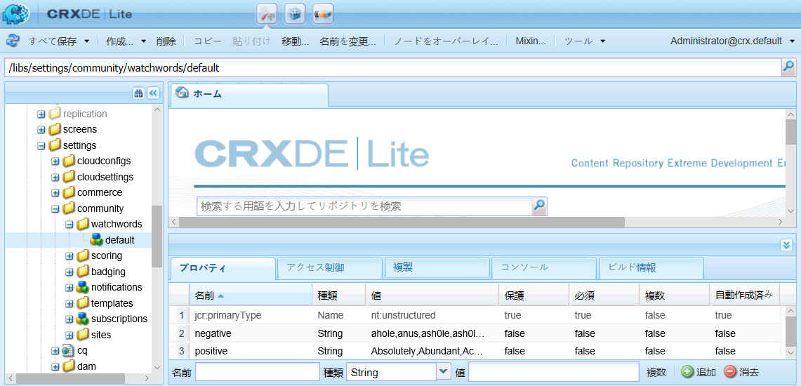

# コミュニティコンテンツのモデレート {#moderating-community-content}

## 概要 {#overview}

コミュニティコンテンツは、ユーザー生成コンテンツ（UGC）とも呼ばれ、メンバー（サイト訪問者にサインイン）が、次のいずれかのコミュニティコンポーネントを使用して、公開されたコミュニティサイトからコンテンツを投稿したときに作成されます。

* [ ブログ ](/help/communities/blog-feature.md)：メンバーがブログ記事またはコメントを投稿します。
* [ カレンダー](/help/communities/calendar.md)：メンバーがカレンダーイベントまたはコメントを投稿します。
* [ コメント ](/help/communities/comments.md)：メンバーがコメントを投稿するか、コメントに返信します。

* [ フォーラム ](/help/communities/forum.md)：メンバーは新しいトピックを投稿するか、トピックに返信します。
* [ アイデア ](/help/communities/ideation-feature.md): メンバーがアイデアまたはコメントを投稿します。
* [QnA](/help/communities/working-with-qna.md): メンバーが質問を作成するか、質問に回答します。
* [ レビュー](/help/communities/reviews.md)：メンバーがアイテムを評価する際にコメントを投稿します。

UGCの管理は、肯定的な貢献を認識し、否定的な貢献（スパムや悪用言語など）を制限するのに役立ちます。 UGCは、次のような複数の環境から管理できます。

* [コミュニティコンテンツストレージ](working-with-srp.md)

* [一括管理コンソール](moderation.md)

  モデレーションコンソールには、公開環境の管理者と[ コミュニティモデレーター](/help/communities/users.md)およびオーサー環境の管理者がアクセスできます。 これは、コミュニティコンテンツが[共通ストア ](/help/communities/working-with-srp.md)に保存されている場合に可能です。

* [インコンテクストモデレーション](in-context.md)

  公開環境でのモデレーションは、コンテンツが投稿されたページ上で管理者やコミュニティのモデレーターが直接実行できます。

## モデレーション活動 {#moderation-actions}

投稿されたコンテンツ（UGC）で実行できるアクションは、ユーザーIDと環境によって異なります。 次の表では、ユーザーIDに従って様々な役割を説明するために、次の用語を使用しています。

* `Admin`

  [community-administrators](users.md) グループのメンバーであるユーザー。

* `Moderator`

  [ コミュニティモデレーター](users.md#publishenvironmentusersandgroups) グループのメンバー（[ モデレーター権限](in-context.md#moderatorpermissions)）。

* `Creator`

  コンテンツを投稿したユーザー。

* `Member`

  特別な権限のないサインインユーザー。

* `Visitor`

  匿名ユーザー。

<table>
 <tbody>
  <tr>
   <td> </td>
   <td><strong>管理者</strong></td>
   <td><strong>モデレーター</strong></td>
   <td><strong>作成者</strong></td>
   <td><strong>メンバー</strong></td>
   <td><strong>訪問者</strong></td>
   <td><strong>イベント  がトリガーされました</strong></td>
   <td><strong>事前定義済み</strong></td>
  </tr>
  <tr>
   <td><strong>編集/ 削除</strong></td>
   <td>X</td>
   <td>X</td>
   <td>X</td>
   <td> </td>
   <td> </td>
   <td> </td>
   <td> </td>
  </tr>
  <tr>
   <td><strong>カット</strong></td>
   <td>X</td>
   <td>X</td>
   <td> </td>
   <td> </td>
   <td> </td>
   <td> </td>
   <td> </td>
  </tr>
  <tr>
   <td><strong>拒否</strong></td>
   <td>X</td>
   <td>X</td>
   <td> </td>
   <td> </td>
   <td> </td>
   <td>X</td>
   <td> </td>
  </tr>
  <tr>
   <td><strong>閉じる/ を再度開く</strong></td>
   <td>X</td>
   <td>X</td>
   <td> </td>
   <td> </td>
   <td> </td>
   <td>X</td>
   <td>X  </td>
  </tr>
  <tr>
   <td><strong>フラグ/ のフラグ解除</strong></td>
   <td>X</td>
   <td>X</td>
   <td> </td>
   <td>X</td>
   <td> </td>
   <td>X</td>
   <td> </td>
  </tr>
  <tr>
   <td><strong>許可</strong></td>
   <td>X</td>
   <td>X</td>
   <td> </td>
   <td> </td>
   <td> </td>
   <td>X</td>
   <td>X</td>
  </tr>
 </tbody>
</table>

### 編集/削除 {#edit-delete}

投稿が作成された後は、作成者、管理者、またはコミュニティ モデレーターが編集または削除できます。

UGCが削除されると、リポジトリから削除され、復元されない可能性があります。

### カット {#cut}

管理者やコミュニティのモデレーターは、1つ以上のフォーラムのトピックやQnAの質問をある場所から別の場所に移動することができます。 これには、同じメンバーが両方のサイトに対するモデレーション権限を持っている場合、あるコミュニティサイトから別のコミュニティサイトへの移行が含まれます。

「カット」アクションを選択すると、コンテンツがクリップボードにコピーされます。 複数の投稿をコピーし、グループとして新しい場所に移動できます。

別の場所では、クリップボードにコンテンツが存在する場合、新しい投稿の横に貼り付けボタンが表示され、貼り付ける投稿の数が示されます。 「ペースト」ボタンには、ペーストの代わりにクリップボードをクリアするオプションが含まれています。

### 拒否 {#deny}

モデレーターは、UGCを公開サイトに表示したままにできない場合があります。 管理者とコミュニティのモデレーターには、投稿は引き続き利用可能であり、迷惑メールとして注釈が付けられます。

### 閉じる/再び開く {#close-reopen}

「閉じる」アクションは、会話のスレッド全体（フォーラムのトピックまたは最初のコメント）に対して実行され、その後のすべての投稿または返信が含まれます。

クローズすると、それ以上の返信やモデレーションアクションは許可されません。

操作を実行するには、トピックまたはコメントを再度開く必要があります。

閉じる/再開アクションは、管理者またはコミュニティ モデレータが実行できます。

### フラグ/フラグ解除 {#flag-unflag}

フラグ付けは、コンテンツの作成者を除く任意のサインインメンバーが、投稿のコンテンツに問題があることを示す手段です。 フラグが設定されると、フラグ解除アイコンが表示され、同じメンバーがコンテンツのフラグを解除できるようになります。

インコンテクスト モデレーションを設定して、メンバーが投稿にフラグを立てるときに理由を選択できるようにすることができます。 選択可能なフラグ理由のリストは、カスタム理由を入力できるかどうかを含めて設定可能です。 フラグの理由はUGCと共に保存されますが、その理由は特定のアクションをトリガーしません。 通知をトリガーするフラグの数のみです。 フラグが設定されたコンテンツには注釈が付けられます。これにより、モデレーターがアクションを実行できます。

システムは、フラグが付けられたすべてのフラグ、フラグの理由を追跡し、しきい値に達したときにイベントを送信します。 UGCがコミュニティモデレーターによって許可されている場合、これらのフラグはアーカイブされます。 許可およびアーカイブ後、後続のフラグが存在する場合、前のフラグがないかのようにアーカイブされます。

### 許可 {#allow}

「許可」アクションは、事前に管理されたシステムでフラグ付けされた、拒否された、または承認されていないUGCのオプションです。 「許可」アクションは、存在するフラグ付きまたは拒否/スパムステータスをクリアし、フラグ付きデータをアーカイブします。

## モデレーションの共通概念 {#common-moderation-concepts}

### 事前緩和 {#premoderation}

UGCをプレモデレーションすると、モデレーションアクションで承認されるまで、投稿は公開されたサイトに表示されません。 [ コミュニティサイト ](/help/communities/sites-console.md)の作成中、「[ コンテンツは事前定義済み](sites-console.md#moderation)」チェックボックスをオンにすると、サイト全体の事前調整が有効になります。 コンポーネントがページに配置されている場合、モデレーションをサポートするコンポーネントは、編集ダイアログの設定を使用してプレモデレーション用に設定できます。

* [ コメント ](comments.md)および[件のレビュー](reviews.md)
**[!UICONTROL User Moderation]** > **[!UICONTROL Pre-Moderation]**&#x200B;に含まれます。

* [ フォーラム ](/help/communities/forum.md)、[ アイデア ](/help/communities/ideation-feature.md)、[QnA](/help/communities/working-with-qna.md)、および[ カレンダー](/help/communities/calendar.md)
**[!UICONTROL 設定]** > **[!UICONTROL モデレート]**&#x200B;で。

### スパム検出 {#spam-detection}

迷惑メール検出は、自動節約機能であり、送信されたユーザー生成コンテンツの望ましくない部分を迷惑メールとしてマークして除外します。 有効にすると、事前に設定されたスパム単語のコレクションにもとづいて、ユーザー生成コンテンツがスパムであるかどうかを識別します。 デフォルトのスパムワードは、次の場所に用意されています

`/libs/settings/community/sites/moderation/spamdetector-conf/profiles/spam_words.txt`。

ただし、デフォルトのスパム語をカスタマイズまたは拡張するには、[ オーバーレイ ](/help/communities/overlay-comments.md)を含むデフォルトのスパム語の構造に従って、/apps ディレクトリに一連の単語を作成します。

スパムワードを含むユーザー生成の投稿（ブログ、フォーラム、コメントなど、すべてのコンテンツタイプ）には、投稿の上に「この投稿はスパムとして分類されました」というテキストが表示されます。

モデレーターはそのような投稿を見て、サイトに表示されないことをマークできます。 これらの投稿に対するモデレーションアクションは、インコンテクストまたはバルクモデレーション UIを使用して実行できます。

スパム検出エンジンを有効にするには、次の手順に従います。

1. `/system/console/configMgr`に移動して、[Web コンソール ](https://localhost:4502/system/console/configMgr)を開きます。

1. **AEM Communities Auto Moderation**&#x200B;設定を見つけて、編集します。
1. **[!UICONTROL SpamProcess]** エントリを追加します。

>[!NOTE]
>
>スパム検出は、英語のロケールにのみ実装されます。

### 好感度 {#sentiment}

センチメントは、投稿（UGC）に含まれるポジティブなキーワードとネガティブなキーワードの数（[ ウォッチワード ](#configuringwatchwords)）にもとづいて計算されます。

センチメント分析では、事前設定済みの一連のルールを使用して、UGCのセンチメントを計算します。 デフォルトのルールは`/libs/cq/workflow/components/workflow/social/sentiments/rules`です。

ルールが生成する値は、1 （すべて負の単語、正の単語なし）から10 （すべて正の単語、負の単語なし）までです。 センチメントの値が5の場合、センチメントは中立的であり、デフォルト値です。

/libs コンポーネントで定義されるルールは次のとおりです。

* ルール 1：正の単語がない場合は値を1に設定し、少なくとも1つの負の単語を設定します。
* ルール 2：負の単語がなく、少なくとも1つの正の単語がある場合は、値を10に設定します。
* ルール 3：正の単語よりも負の単語が多い場合は、値を3に設定します。
* ルール 4：負の単語よりも正の単語が多い場合は、値を8に設定します。

ルールを上書きまたは追加するには、デフォルトのルールの構造に従って、/apps ディレクトリにルールのセットを作成します。 センチメント設定を編集して、ルールの場所を特定できるようにします。

分析が完了すると、センチメントはUGCと共に保存されます。

[ バルクモデレーションコンソール ](/help/communities/moderation.md)から、センチメントが負、中立、正のいずれであるかに基づいて、UGCをフィルタリングして表示できます。

#### Watchwords {#watchwords}

AEM Communitiesでは、[センチメント](#sentiment)を評価するプロセスの手順として、*ウォッチワードアナライザー*&#x200B;を提供しています。 ウォッチワードが提供するセンチメント価値への貢献度は、投稿されたコンテンツで使用されるネガティブとポジティブなウォッチワードと禁止された単語の比較によるものです。

#### センチメントとウォッチワードの設定 {#configure-sentiment-and-watchwords}

ポジティブとネガティブなウォッチワードのリストは、センチメントルールのようにカスタマイズできます。

ウォッチワードのデフォルトのリストは、デフォルトと同様に、リポジトリ内のノードのプロパティとして入力するか、単語のリストでOSGi サービス `sentimentprocess.name`を設定してデフォルトを上書きすることで入力できます。

**sentimentprocess.name**&#x200B;は、センチメントルールのカスタムセットの場所を参照するように変更することもできます。

センチメントとウォッチワードを設定するには：

* オーサーインスタンスに管理者としてログインします。
* [Web コンソール ](https://localhost:4502/system/console/configMgr)を開きます。
* `sentimentprocess.name` を見つけます。
* 設定を選択すると、編集モードで開くことができます。

* **肯定的なウォッチワード**

  デフォルトを上書きする正のセンチメントに貢献する単語のコンマ区切りリスト。 デフォルトは空リストです。

* **否定的なウォッチワード**

  デフォルトを上書きする負のセンチメントの原因となる単語のコンマ区切りリスト。 デフォルトは空リストです。

* **Watchwords ノードへの明示的なパス**

  既定のウォッチワードを指定する既定の`positive`および`negative` プロパティを含むノードのリポジトリの場所。 デフォルトは `/libs/settings/community/watchwords/default` です。

* **センチメントルール**

  肯定的および否定的なウォッチワードに基づいてセンチメントを計算するためのルールのリポジトリの場所。 デフォルトは`/libs/cq/workflow/components/workflow/social/sentiments/rules`です（ただし、ワークフローは含まれていません）。

次に、`Explicit Path to Watchwords Node`が`/libs/settings/community/watchwords/default`に設定されている場合のデフォルトのウォッチワードのカスタムエントリの例を示します。

### モデレーター権限 {#moderator-permissions}

同じリソースに割り当てられた次の権限は、総称して`moderator permissions`と呼ばれます。

* `Read`
* `Modify`
* `Create`
* `Delete`
* `Replicate`
