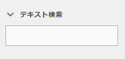
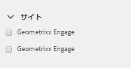
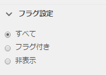
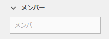
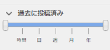
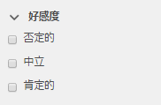
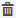
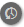
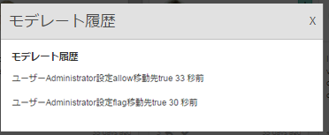
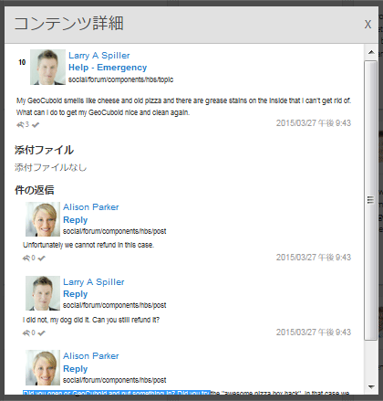

# モデレートコンソール  {#moderation-console}

AEM Communitiesでは、管理者とコミュニティモデレーター（モデレーターとして割り当てられた信頼できるコミュニティメンバー）が、オーサー環境とパブリッシュ環境の両方でコミュニティコンテンツ[の一括モデレートを実行できます。](/help/communities/moderate-ugc.md)

管理者とコミュニティモデレーターは、パブリッシュ環境で[コンテキスト内モデレート](/help/communities/in-context.md)を実行することもできます。

すべての[コミュニティサイト](/help/communities/sites-console.md)の機能は、管理権限を持つログインユーザーが使用できる`Administration`メニュー項目です。 `Administration`リンクをクリックすると、モデレートコンソールにアクセスできます。

モデレートコンソールでは、管理者とコミュニティモデレーターが、モデレート権限を持っているすべてのユーザー生成コンテンツ（UGC）にアクセスできます。複数のサイトのモデレートを許可されている場合は、すべてのサイトにわたる投稿を表示したり、選択したコミュニティサイトでフィルターしたりできます。

詳しくは、[ユーザーとユーザーグループの管理](/help/communities/users.md)を参照してください。

モデレートコンソールでは以下の操作を実行できます。

* モデレートタスクを一括で実行します。
* UGCの検索。
* UGCの詳細の表示。
* UGC作成者の詳細の表示

管理者または` [moderator permissions](/help/communities/in-context.md#identifyingtrustedmembers)`を持つメンバーとしてサインインした場合にのみ、モデレートタスクを実行できます。

## パブリッシュ環境からのアクセス {#publish-environment-access}

公開済みのコミュニティサイトからモデレートコンソールにアクセスするには、コミュニティモデレーターがサインインしたときに表示される管理リンクからアクセスします。

管理リンクを選択すると、以下のモデレートコンソールが表示されます。

## オーサー環境からのアクセス {#author-environment-access}

オーサー環境でモデレートコンソールに移動するには、

* グローバルナビゲーションから、**[!UICONTROL コミュニティ]**/**[!UICONTROL モデレート]**&#x200B;を選択します。

管理者として、または[モデレーター権限](/help/communities/in-context.md#identifyingtrustedmembers)を持つメンバーとしてサインインしている場合にのみ、モデレートタスクを実行できます。 表示されるコミュニティコンテンツは、サインインしたメンバーがモデレートを許可されているものだけです。

>[!NOTE]
>
>パブリッシュ環境の UGC をオーサー環境で表示できるのは、選択した SRP で共通ストアが実装されている場合のみです。例えば、デフォルトではストレージはJSRPで、オーサーとパブリッシュに共通するストアではありません。 [コミュニティコンテンツストレージ](/help/communities/working-with-srp.md)を参照してください。

## モデレートコンソールの UI {#moderation-console-ui}

左側のナビゲーションレール（オーサー環境では表示されますが、パブリッシュ環境では表示されません）の他に、モデレートコンソールの UI には次の主な領域があります。

* **[トップナビゲーションバー](#top-navigation-bar)**
* **[ツールバー](#toolbar)**
* **[コンテンツ領域](#content-area)**

### 上部ナビゲーションバー {#top-navigation-bar}

上部ナビゲーションバーはすべてのコンソールで共通です。詳しくは、[基本操作](/help/sites-authoring/basic-handling.md)を参照してください。

### ツールバー {#toolbar}

上部ナビゲーションバーの下にツールバーがあり、その左側に次の切り替えスイッチがあります。

* [フィルターレール](/help/communities/moderation.md#filterrail)コンテンツのフィルター条件のプロパティを選択できるレールが開きます。

上部ナビゲーションバーの下にツールバーがあり、その左側に次の切り替えスイッチがあります。

[フィルターレール](/help/communities/moderation.md#filterrail)「検索」を選択すると、コンテンツのフィルター条件のプロパティを選択できるレールが開きます。

### コンテンツ領域 {#content-area}

コンテンツ領域には、投稿された UGC に関する以下の情報が表示されます。

* UGCが投稿されました
* メンバー名
* メンバーアバター
* 投稿の場所。
* 投稿された日時。
* 投稿への返信数。
*  投稿に関連付けられたセンチメント
* 承認された場合は、チェックマークが表示されます。
* 添付ファイルがある場合は、ペーパークリップが表示されます。

>[!NOTE]
> 
>コンテンツ領域には&#x200B;*無限スクロール*&#x200B;が備わっています。つまり、コンテンツの最後に達するまでスクロールを続行できます。 ツールバーは、スクロール時もコンテンツ領域の上の位置に固定されて表示されます。

### フィルターレール {#ootbfilters}

サイドパネルアイコンをクリックすると、フィルターレールが開きます。 コンテンツ領域の左側に表示されるフィルターレールには、様々なフィルターが用意されており、それぞれのフィルターは、コンテンツ領域に表示される参照元のUGCに直ちに影響します。

各カテゴリ内のフィルタは&#x200B;**OR**&#39;dで、異なるカテゴリのフィルタは&#x200B;**AND**&#39;dです。

例えば、**質問**&#x200B;と&#x200B;**回答**&#x200B;の両方をチェックすると、**質問** *または*&#x200B;回答&#x200B;**回答**&#x200B;のいずれかのコンテンツが表示されます。

ただし、**質問**&#x200B;と&#x200B;**保留**&#x200B;を選択すると、**質問**&#x200B;で&#x200B;**保留中**&#x200B;のコンテンツのみが表示されます。

>[!NOTE]
>
>コミュニティモデレーターは、モデレートコンソール UI で事前定義されたフィルターをブックマークできます。これらのフィルターは、URL の末尾に（クエリ文字列パラメーターとして）追加されるので、モデレーターはブックマークしたフィルターに戻ったり、これらのリンクを共有することもできます。

フィルターレールが開いているときに「検索」アイコンを選択すると、サイドパネルが閉じます。ただし、フィルターレールを閉じて、ユーザー生成コンテンツのみを表示するには、「検索」アイコンをクリックし、「コンテンツのみ」オプションを選択します。

#### コンテンツのパス {#content-path}

コンテンツのパスは、表示される UGC 参照を、指定したコンテンツリポジトリに配置されている投稿のみに限定します。

#### テキスト検索 {#text-search}

テキスト検索は、表示される UGC 参照を、入力したテキストを含む投稿のみに限定します。

#### サイト {#site}

サイトは、表示される UGC 参照を、選択したコミュニティサイトへの投稿のみに限定します。サイトがチェックされていない場合は、UGCへの参照がすべて表示されます。

>[!NOTE]
>
>管理者が一括モデレートコンソールにアクセスしたときは、[サイト作成ウィザード](/help/communities/sites-console.md)を使わずに作成したサイト（Geometrixx サンプルサイトなど）も含め、すべての UGC 参照が表示されます。
>
>信頼されているコミュニティメンバーが一括モデレートコンソールにアクセスしたときは、そのメンバーがモデレート権限を持つコミュニティサイト用に作成された UGC 参照のみが表示されます。これらの UGC 参照はサイトフィルターでフィルタリングできます。

#### コンテンツタイプ {#content-type}

コンテンツタイプは、表示される UGC 参照を、選択したリソースタイプの投稿のみに限定します。次に示すタイプの中から 1 つ以上選択できます。何も選択しない場合は、すべてのタイプが表示されます。

* **コメント**
* **フォーラムトピック**
* **フォーラム返信**
* **Q&amp;A 質問**
* **Q&amp;A 回答**
* **ブログ記事**
* **ブログコメント**
* **カレンダーイベント**
* **カレンダーコメント**
* **ファイルライブラリフォルダー**
* **ファイルライブラリ文書**
* **アイデア**
* **アイディエーションのコメント**

#### 追加のコンテンツタイプ {#additional-content-types}

フィルター条件のリソースをさらに追加するには：

* オーサーインスタンスに管理者としてログインします。
* [Webコンソール](https://localhost:4502/system/console/configMgr)を開きます。
* `AEM Communities Moderation Dashboard Filters`を探します。
* 編集モードで開く設定を選択します。
* フィルター対象のコンポーネントのResourceTypeを入力します。

   * 例えば、含まれる投票コンポーネントに対してフィルターを設定するには、次のように入力します。

      `Voting=social/tally/components/hbs/voting`
   

* 「保存」を選択します。
* コミュニティ — モデレートコンソールを更新します。

その結果、`Content Type`フィルターグループの下の`Voting`に対して選択可能な新しいフィルターが作成されます。

このフィルターを選択すると、ダッシュボードのコンテンツに、入力した ResourceType に一致する UGC が表示されます。

#### ステータス {#status}

ステータスは、表示される UGC 参照を、選択したステータスの投稿のみに限定します。「保留中」、「承認」、「拒否」、「終了」のステータス（ブログ記事の場合は「ドラフト」と「スケジュール済み」、Q&amp;A 質問の場合は「回答済み」と「未回答」もあります）のうち、1 つ以上を選択できます。何も選択しなかった場合は、すべてのものが表示されます。

>[!NOTE]
>
>「未回答」ステータスのみを選択すると、回答済みの質問を除く（すべてのコンテンツタイプの）すべてのコンテンツが表示されます。これは、未回答の質問とフォーラムトピックやブログ記事、コメントなどのコンテンツには、回答済みの質問に関係するプロパティが存在しないからです。

#### フラグ設定 {#flagging}

フラグ設定は、表示される UGC 参照を、フラグが付いている投稿または非表示の投稿のみに限定します。

コンテンツにフラグが設定された後は、「**フラグ**」ボタンをもう一度選択して、そのコンテンツのフラグを解除するまで、フラグが設定されたままになります。 フラグには重要やフォローアップなどのレベルがないことに注意してください。

#### メンバー {#members}

メンバーは、表示される UGC 参照を、特定のメンバー（メンバー名を入力して指定）が投稿した UGC のみに限定します。

#### 過去に投稿済み {#posted-in-the-last}

過去に投稿済みは、表示される UGC 参照を、1 時間、1 日以内、1 週間、1 ヶ月または 1 年以内に投稿されたものに限定します。

#### 好感度 {#sentiment}

 センチメントは、表示されるUGC参照を、好感度が肯定的、否定的または中立の投稿のみに制限します。

## カスタムフィルター{#custom-filters}

[フィルターレール](/help/communities/moderation.md#ootbfilters)の既製のフィルターに加えて、メタデータに対するカスタムフィルターをモデレートUIに追加できます。 開発者は、GitHubのサンプルコードを使用して、既存のモデレートUIフィルターを拡張できます。

Githubの[サンプルプロジェクト](https://github.com/Adobe-Marketing-Cloud/aem-communities-extensions/tree/main/aem-communities-moderation-filter)は、タグフィルターを実装し、ユーザー生成コンテンツに特定のタグが適用されているかどうかに基づいてUGCリストをフィルタリングします。 サンプルコードに従って、他の類似のUGCメタデータフィールド用に類似のフィルターを作成できます。

タグフィルターのサンプルをインストールするには：

1. AEMオーサー([https://[aem-author]:4502/crx/packmgr/index.jsp](https://aem65-communities-demo.corp.adobe.com:4502/crx/packmgr/index.jsp))インスタンスとAEMパブリッシュ([https://[aem-publish]:4503/crx/packmgr/index.jsp](https://aem65-communities-demo.corp.adobe.com:4502/crx/packmgr/index.jsp))インスタンスでパッケージマネージャーを開きます。
1. GitHubコードからパッケージ`com.adobe.social.sample.moderation.filter.ui.apps-1.0-SNAPSHOT.zip`を構築し、インストールして有効にします。
1. AEMオーサー(`https://[aem-author]:4502/system/console/bundles`)インスタンスとAEMパブリッシュ(`https://[aem-publish]:4503/system/console/bundles`)インスタンスのバンドルコンソールを開きます。
1. GitHubからパッケージ` [com](https://sample-moderation-filter.com/).adobe.social.sample.moderation.filter.core-1.0-SNAPSHOT.jar`を構築し、インストールして有効にします。
1. AEMオーサー([https://[aem-author]:4502/crx/de/index.jsp#/apps/social/moderation/facets](https://aem65-communities-demo.corp.adobe.com:4502/crx/de/index.jsp#/apps/social/moderation/facets))の&#x200B;**/apps/social/moderation/facets**&#x200B;ノードに移動し、AEMパブリッシュ([https://[aem-publish]:4502/crx/de/index.jsp#/aps/s/socos/moderation/instance&lt;a5/fa5>)に移動します。.](https://aem65-communities-demo.corp.adobe.com:4502/crx/de/index.jsp#/apps/social/moderation/facets)
1. `jcr:read`権限を持つテクニカルユーザー&#x200B;**communities-utility-reader**&#x200B;を追加します。

既存のコミュニティサイトにカスタムフィルターを公開するには：

1. 既存のモデレートページ`Clientlibs`の`/content/we-retail/us/en/community/moderation/shell3/jcr:content/head/clientlibs.`を編集

   * 新しいカテゴリ`cq.social.hbs.moderation.v2.`を追加します

1. `/content/we-retail/us/en/community/moderation/shell3/jcr:content/rails/searchWell/items/filters.` に移動します。

   * 新しいコンポーネント`sling:resourceType = social/moderation/v2/filters.`に設定

1. `/content/we-retail/us/en/community/moderation/shell3/jcr:content/views/content/items/modcontainer` にアクセスします。

   * 新しいコンポーネント`sling:resourceType = social/moderation/v2/modcontainer`に設定します。

## モデレートアクション {#moderation-actions}

[モデレートアクション](/help/communities/moderate-ugc.md#moderation-actions)は、コンテンツ領域で選択された 1 つ以上のコンテンツに対して実行したり、コンテンツの詳細表示時に実行したりできます。

投稿を一括モデレートするには、コンテンツ領域で、投稿の選択()アイコンをクリックします。投稿の上にマウスを置くと（デスクトップ）、または投稿の上で指を押しながら（モバイル）表示されます。 この操作をおこなうと、複数選択モードに入ります。複数選択モードでは、一括でモデレートする投稿をクリックするだけで選択できます。ツールバーに表示されるボタンを使用して、選択した投稿に対してモデレートアクションを実行します。どのアクションをおこなうときも、必ず確認メッセージが表示されます。

コンテンツ領域内の 1 つの投稿のみをモデレートする場合は、その投稿の上にマウスポインターを置く（デスクトップの場合）か、その投稿を指で長押しして（モバイルの場合）ボタンを表示します。1 つのコンテンツを操作するときは、削除アクションの場合に限り確認メッセージが表示されます。

### 複数の投稿のモデレート  {#moderating-multiple-posts}

投稿の`Select`アイコンをクリックして、一括選択モードに入ります。

一括選択モードを終了するには、ツールバーのキャンセル（x）アイコンを選択します。

複数の投稿に対して実行できるモデレートアクションは次のとおりです。

* 拒否
* 削除
* 投稿を閉じる／再度開く

これらのアクションを実行できるアイコンは、複数の投稿を選択したときにのみツールバーに表示されます。

### 1 つの投稿のモデレート {#moderating-a-single-post}

単一選択モードでは、次の操作が可能です。

* ユーザー名を選択して、ユーザーの詳細を表示します。
* 投稿へのリンクを選択して、コンテキスト内の投稿を表示します。
* [返信](#reply)
* [アクセス設定](#allow)
* [拒否](#deny)
* [削除](#delete)
* [閉じる](#close)
* [モデレート履歴](#moderation-history)を表示
* [View Details](#viewdetails)

モデレートアクションアイコンの上にあるカード表示には、投稿のテキストが表示され、下には次を示すデータが表示されます。

* 返信がある場合は、返信の数が前に付きます。
* フラグが設定されている場合。
* 承認されている場合。
* UGCが投稿された日時。

#### 返信 {#reply}

1つの投稿を操作する場合、UGCタイプが返信をサポートし、返信を許可するように設定されている場合は、返信アイコンが表示されます。

#### アクセス設定 {#allow}

1 つの投稿を操作するときに、その投稿がフラグ付きか、拒否されている場合は、許可アイコンが表示されます。フラグが設定されている場合、「許可」を選択するとすべてのフラグがクリアされます。

#### 拒否 {#deny}

**拒否**&#x200B;モデレートアクションは、モデレートされているコンテンツに対してのみ使用でき、モデレートされていないコンテンツには表示されません（複数選択モードの場合を除く）。

モデレート対象でないコンテンツは、必ず承認された状態になります。

モデレート対象のコンテンツは、最初は保留中のステータスになり、後で承認または拒否に変更できます。

保留中から別のステータスに変更されたコンテンツが、保留中に戻ることはありません。承認または拒否のステータスに設定されたコンテンツは、いつでも別のステータスに変更できます。

#### 削除 {#delete}

単一選択モードまたは一括モードで、アイテムを選択して削除できます。削除のアクションを実行すると、確認ダイアログが表示されます。削除すると、それらの項目は直ちにコンテンツ領域から消えます。 **UGCを削除すると、リポジトリから完全に削除され、後で取得することはできません**。

#### 閉じる {#close}

1つの投稿を操作する場合、UGCタイプがそのリソースのそれ以上の投稿を防ぐ機能をサポートしている場合は、閉じるアイコンが表示されます。

#### Moderation History {#moderation-history}

1 つの投稿を操作するときに、投稿にカーソルを合わせると、モデレート履歴アイコンが表示されます。アイコンを選択すると、UGC投稿に関して実行されたアクションの履歴を含むパネルが表示されます。

複数の UGC 投稿のコンテンツ領域に戻るには、表示詳細ウィンドウの右上隅の X を選択します。

以下に例を示します。

#### 詳細を表示 {#view-detail}

1 つの投稿を操作するときに、その UGC を詳細モードで開くと、より詳しい情報を表示できます。

そのためには、投稿の上にマウスポインターを置いて`View Detail`アイコンを表示し、選択して投稿の詳細を含むパネルを表示します。

複数の UGC 投稿のコンテンツ領域に戻るには、表示詳細ウィンドウの右上隅の X を選択します。

以下に例を示します。

