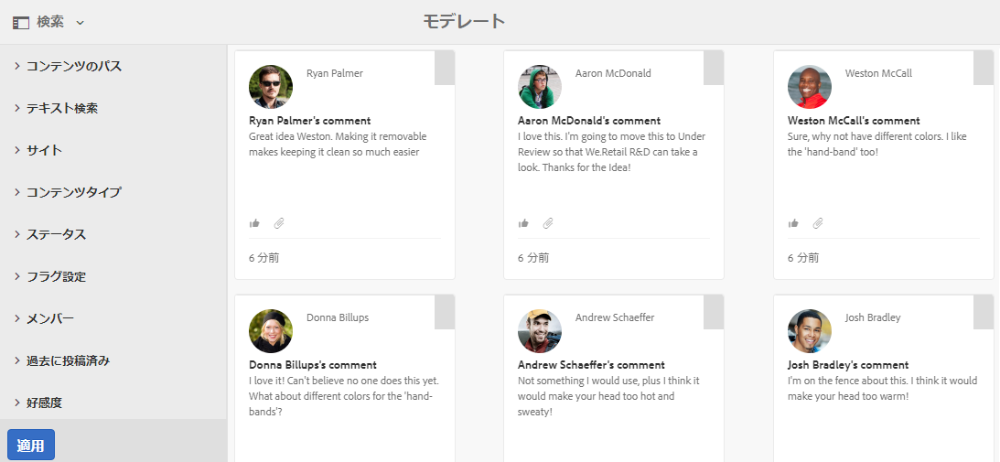
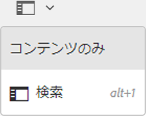
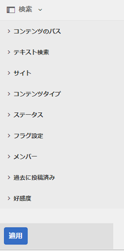
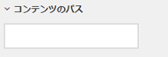
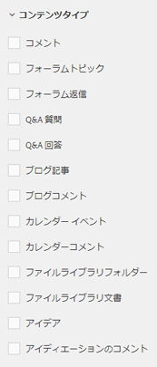
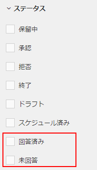
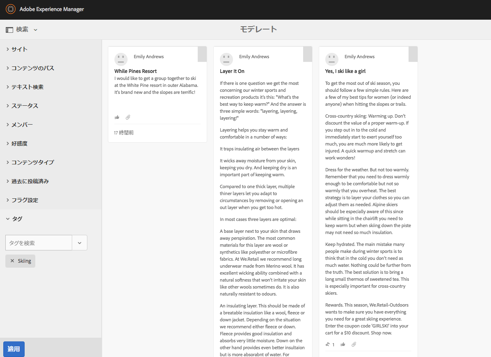
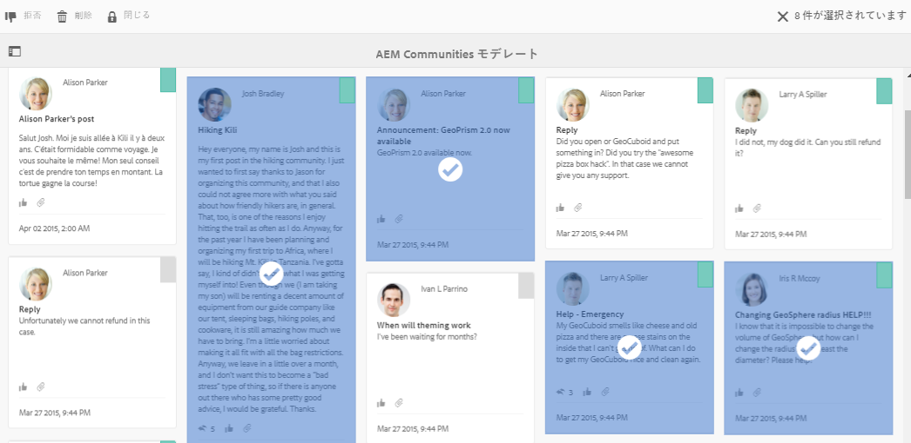
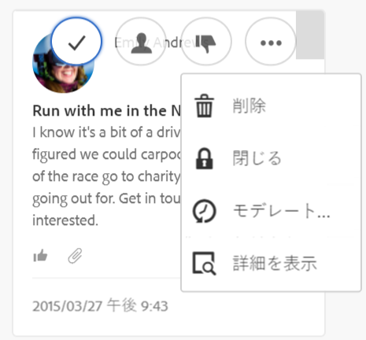

# モデレートコンソール {#moderation-console}

In AEM Communities, bulk [moderation of community content](/help/communities/moderate-ugc.md) is possible from both the author and publish environments by administrators and community moderators (trusted community members assigned as moderators).

Administrators and community moderators may also perform [in-context moderation](/help/communities/in-context.md) in the publish environment.

A feature of all [community sites](/help/communities/sites-console.md) is an `Administration` menu item available to users who sign in with administrative privileges. The `Administration` link provides access to the Moderation console.

モデレートコンソールでは、管理者とコミュニティモデレーターが、モデレート権限を持っているすべてのユーザー生成コンテンツ（UGC）にアクセスできます。複数のサイトのモデレートを許可されている場合は、すべてのサイトにわたる投稿を表示したり、選択したコミュニティのサイトでフィルターしたりできます。

For more detailed information visit [Managing Users and User Groups](/help/communities/users.md).

モデレートコンソールでは以下の操作を実行できます。

* モデレートタスクの一括実行。
* UGCの検索を参照してください。
* UGCの詳細の表示を参照してください。
* UGC作成者の詳細の表示。

Only when signed in as an administrator, or a member with ` [moderator permissions](/help/communities/in-context.md#identifyingtrustedmembers)`, may moderation tasks be performed.

## パブリッシュ環境からのアクセス {#publish-environment-access}

公開済みのコミュニティサイトからモデレートコンソールにアクセスするには、コミュニティモデレーターがサインインしたときに表示される管理リンクからアクセスします。

管理リンクを選択すると、以下のモデレートコンソールが表示されます。

## オーサー環境からのアクセス {#author-environment-access}

オーサー環境でモデレートコンソールに移動するには、

* From global navigation, select **[!UICONTROL Communities]** > **[!UICONTROL Moderation]**.

Only when signed in as an administrator, or as a member with [moderator permissions](/help/communities/in-context.md#identifyingtrustedmembers), moderation tasks can be performed. 表示されるコミュニティコンテンツは、サインインしたメンバーがモデレートを許可されるものだけです。

>[!NOTE]
>
>パブリッシュ環境の UGC をオーサー環境で表示できるのは、選択した SRP で共通ストアが実装されている場合のみです。例えば、デフォルトではストレージはJSRPで、作成者と発行の共通のストアではありません。 See [Community Content Storage](/help/communities/working-with-srp.md).

## モデレートコンソールの UI {#moderation-console-ui}

左側のナビゲーションレール（オーサー環境では表示されますが、パブリッシュ環境では表示されません）の他に、モデレートコンソールの UI には次の主な領域があります。

* **[トップナビゲーションバー](#top-navigation-bar)**
* **[ツールバー](#toolbar)**
* **[コンテンツ領域](#content-area)**

### 上部ナビゲーションバー {#top-navigation-bar}

上部ナビゲーションバーはすべてのコンソールで共通です。For more information, see [Basic Handling](/help/sites-authoring/basic-handling.md).

### ツールバー {#toolbar}

上部ナビゲーションバーの下にツールバーがあり、その左側に次の切り替えスイッチがあります。

* [フィルターレール](/help/communities/moderation.md#filterrail)コンテンツのフィルター条件のプロパティを選択できるレールが開きます。

上部ナビゲーションバーの下にツールバーがあり、その左側に次の切り替えスイッチがあります。

[フィルターレール](/help/communities/moderation.md#filterrail)「検索」を選択すると、コンテンツのフィルター条件のプロパティを選択できるレールが開きます。

### コンテンツ領域 {#content-area}

コンテンツ領域には、投稿された UGC に関する以下の情報が表示されます。

* UGC投稿済み
* メンバー名
* 会員アバター
* 投稿の場所。
* 投稿された日時。
* 投稿への返信の数。
* [投稿に関連付け](/help/communities/moderate-ugc.md#sentiment) られたセンチメント
* 承認されると、チェックマークが表示されます。
* 添付ファイルがある場合は、クリップが表示されます。

>[!NOTE]
> 
>The content area features an *infinite scroll*, which means that it will allow you to continue scrolling until you have reached the end of the content. ツールバーは、スクロール時もコンテンツ領域の上の位置に固定されて表示されます。

### フィルターレール {#ootbfilters}

サイドパネルアイコンをクリックすると、フィルターパネルが開きます。 コンテンツ領域の左側に表示されるフィルターレールは、様々なフィルターを提供し、それぞれがコンテンツ領域に表示される参照先のUGCに直接影響を与えます。

The filters within each category are **OR**&#39;d together, and the filters in different categories are **AND**&#39;d together.

For example, if you check both **Question** and **Answer**, you will see content that is either a **Question** *or* an **Answer**.

However if you check **Question** and **Pending**, you will only see content that is a **Question** and is **Pending**.

>[!NOTE]
>
>コミュニティモデレーターは、モデレートコンソール UI で事前定義されたフィルターをブックマークできます。これらのフィルターは、URL の末尾に（クエリ文字列パラメーターとして）追加されるので、モデレーターはブックマークしたフィルターに戻ったり、これらのリンクを共有することもできます。

フィルターレールが開いているときに「検索」アイコンを選択すると、サイドパネルが閉じます。ただし、フィルターレールを閉じて、ユーザー生成コンテンツのみを表示するには、「検索」アイコンをクリックし、「コンテンツのみ」オプションを選択します。

#### コンテンツのパス {#content-path}

コンテンツのパスは、表示される UGC 参照を、指定したコンテンツリポジトリに配置されている投稿のみに限定します。

#### テキスト検索 {#text-search}

テキスト検索は、表示される UGC 参照を、入力したテキストを含む投稿のみに限定します。

#### サイト {#site}

サイトは、表示される UGC 参照を、選択したコミュニティサイトへの投稿のみに限定します。サイトがチェックされていない場合は、UGCへのすべての参照が表示されます。

>[!NOTE]
>
>管理者が一括モデレートコンソールにアクセスしたときは、[サイト作成ウィザード](/help/communities/sites-console.md)を使わずに作成したサイト（Geometrixx サンプルサイトなど）も含め、すべての UGC 参照が表示されます。
>
>信頼されているコミュニティメンバーが一括モデレートコンソールにアクセスしたときは、そのメンバーがモデレート権限を持つコミュニティサイト用に作成された UGC 参照のみが表示されます。これらの UGC 参照はサイトフィルターでフィルタリングできます。

#### コンテンツタイプ {#content-type}

コンテンツタイプは、表示される UGC 参照を、選択したリソースタイプの投稿のみに限定します。次に示すタイプの中から 1 つ以上選択できます。何も選択しない場合は、すべてのタイプが表示されます。

* **コメント**
* **フォーラムトピック**
* **フォーラム返信**
* **Q&amp;A 質問**
* **Q&amp;A 回答**
* **ブログ記事**
* **ブログコメント**
* **カレンダーイベント**
* **カレンダーコメント**
* **ファイルライブラリフォルダー**
* **ファイルライブラリ文書**
* **アイデア**
* **アイディエーションのコメント**

#### 追加のコンテンツタイプ {#additional-content-types}

フィルター条件のリソースをさらに追加するには：

* 作成者インスタンスに管理者としてログインします。
* Open [Web Console](https://localhost:4502/system/console/configMgr).
* Locate `AEM Communities Moderation Dashboard Filters`.
* 編集モードで開く設定を選択します。
* フィルタするコンポーネントのResourceTypeを入力します。

   * 例えば、含まれる投票コンポーネントをフィルタするには、次のように入力します。

      `Voting=social/tally/components/hbs/voting`

* 「保存」を選択します。
* コミュニティ — モデレートコンソールを更新します。

The result is a new selectable filter for `Voting` under the `Content Type` filter group.

このフィルターを選択すると、ダッシュボードのコンテンツに、入力した ResourceType に一致する UGC が表示されます。

#### ステータス {#status}

ステータスは、表示される UGC 参照を、選択したステータスの投稿のみに限定します。「保留中」、「承認」、「拒否」、「終了」のステータス（ブログ記事の場合は「ドラフト」と「スケジュール済み」、Q&amp;A 質問の場合は「回答済み」と「未回答」もあります）のうち、1 つ以上を選択できます。何も選択しなかった場合は、すべてのものが表示されます。

>[!NOTE]
>
>「未回答」ステータスのみを選択すると、回答済みの質問を除く（すべてのコンテンツタイプの）すべてのコンテンツが表示されます。これは、未回答の質問とフォーラムトピックやブログ記事、コメントなどのコンテンツには、回答済みの質問に関係するプロパティが存在しないからです。

#### フラグ設定 {#flagging}

フラグ設定は、表示される UGC 参照を、フラグが付いている投稿または非表示の投稿のみに限定します。

Once a piece of content is flagged, it remains flagged until you unflag that single piece of content by selecting the **Flag** button once again. フラグには重要やフォローアップなどのレベルがないことに注意してください。

#### メンバー {#members}

メンバーは、表示される UGC 参照を、特定のメンバー（メンバー名を入力して指定）が投稿した UGC のみに限定します。

#### 過去に投稿済み {#posted-in-the-last}

過去に投稿済みは、表示される UGC 参照を、1 時間、1 日以内、1 週間、1 ヶ月または 1 年以内に投稿されたものに限定します。

#### 好感度 {#sentiment}

[好感度](/help/communities/moderate-ugc.md#sentiment) （好感度）は、参照されるUGCの表示を、好感度値が正、負または中立の投稿に制限します。

## Custom Filters {#custom-filters}

フィルターパネルの初期設定のフィルター以外に 、メタデータの追加のカスタムフィルターをモデレートUIに追加できます。 開発者は、Githubのサンプルコードを使用して、既存のモデレートUIフィルターを拡張できます。

Githubのサ [ンプルプロジェクトは](https://github.com/Adobe-Marketing-Cloud/aem-communities-extensions/tree/master/aem-communities-moderation-filter) 、タグフィルターを実装し、特定のタグがユーザー生成コンテンツに適用されるかどうかに基づいてUGCリストをフィルターします。 サンプルコードに従って、他の類似したUGCメタデータフィールドに類似したフィルターを作成することができます。

タグフィルターのサンプルをインストールするには：

1. AEM作成者(https://[aem-author]:[4502/crx/packmgr/index.jsp](https://aem65-communities-demo.corp.adobe.com:4502/crx/packmgr/index.jsp))インスタンスとAEM発行(https://[aem-publish]:4503/crx/packmgr/index.jsp)インスタンスでパッケージマネージャーを開きます。
1. Githubコードからパッ `com.adobe.social.sample.moderation.filter.ui.apps-1.0-SNAPSHOT.zip` ケージを構築し、インストールして有効にします。
1. AEM作成者()インスタンスとAEM発行( `https://[aem-author]:4502/system/console/bundles`)インスタンスでバンドルコンソールを `https://[aem-publish]:4503/system/console/bundles`開きます。
1. Githubからパッケージ ` [com](https://sample-moderation-filter.com/).adobe.social.sample.moderation.filter.core-1.0-SNAPSHOT.jar` を構築し、インストールして有効にします。
1. AEM Author(https://[aem-author]:4502/crx/de/index.jsp#/apps/social/moderation/facets **)およびAEM Publish(** https://[aem-publish]:4502/crx/de/index.jsp#/apps/social/moderation/facets)インスタンスの/apps/social/moderation/facetsノードに移動します。
1. 権限を持追加つ技術ユー **ザー** communities `jcr:read` -utility-reader。

既存のコミュニティサイトにカスタムフィルターを公開するには：

1. 既存のモデ `Clientlibs` レートページの編集 `/content/we-retail/us/en/community/moderation/shell3/jcr:content/head/clientlibs.`

   * 新追加カテゴリ `cq.social.hbs.moderation.v2.`

1. `/content/we-retail/us/en/community/moderation/shell3/jcr:content/rails/searchWell/items/filters.` に移動します。

   * 新しいコンポーネントに設定 `sling:resourceType = social/moderation/v2/filters.`

1. `/content/we-retail/us/en/community/moderation/shell3/jcr:content/views/content/items/modcontainer` にアクセスします。

   * 新しいコンポーネントに設定しま `sling:resourceType = social/moderation/v2/modcontainer`す。

## モデレートアクション {#moderation-actions}

[モデレートアクション](/help/communities/moderate-ugc.md#moderation-actions)は、コンテンツ領域で選択された 1 つ以上のコンテンツに対して実行したり、コンテンツの詳細表示時に実行したりできます。

To bulk-moderate the posts, in the content area click the Select ( ) icon on a post, which appears on hovering over it with the mouse (desktop) or pressing and holding a finger on the post (mobile). この操作をおこなうと、複数選択モードに入ります。複数選択モードでは、一括でモデレートする投稿をクリックするだけで選択できます。ツールバーに表示されるボタンを使用して、選択した投稿に対してモデレートアクションを実行します。どのアクションをおこなうときも、必ず確認メッセージが表示されます。

コンテンツ領域内の 1 つの投稿のみをモデレートする場合は、その投稿の上にマウスポインターを置く（デスクトップの場合）か、その投稿を指で長押しして（モバイルの場合）ボタンを表示します。1 つのコンテンツを操作するときは、削除アクションの場合に限り確認メッセージが表示されます。

### 複数の投稿のモデレート {#moderating-multiple-posts}

Enter the bulk selection mode by clicking the `Select` icon on a post:

一括選択モードを終了するには、ツールバーのキャンセル（x）アイコンを選択します。

複数の投稿に対して実行できるモデレートアクションは次のとおりです。

* 拒否
* 削除
* 投稿を閉じる／再度開く

これらのアクションを実行できるアイコンは、複数の投稿を選択したときにのみツールバーに表示されます。

### 1 つの投稿のモデレート {#moderating-a-single-post}

単一選択モードでは、次のことが可能です。

* 表示ユーザーの詳細を表示するには、ユーザー名を選択します。
* 表示するには、投稿へのリンクを選択します。
* [返信](#reply)
* [許可](#allow)
* [拒否](#deny)
* [削除](#delete)
* [閉じる](#close)
* View [Moderation History](#moderation-history)
* [詳細を表示](#viewdetails)

モデレートアクション表示の上にあるカードアイコンは、投稿のテキストで、下のアイコンは、次を示すデータです。

* 返信がある場合は、返信数の前に返信数が表示されます。
* フラグ付きの場合。
* 承認されている場合。
* UGCが投稿された日。

#### 返信 {#reply}

単一の投稿で作業する場合、UGCタイプが返信をサポートし、返信を許可するように設定されていると、返信アイコンが表示されます。

#### アクセス設定 {#allow}

1 つの投稿を操作するときに、その投稿がフラグ付きか、拒否されている場合は、許可アイコンが表示されます。フラグが付いている場合、「許可」を選択すると、すべてのフラグがクリアされます。

#### 拒否 {#deny}

The **Deny** moderation action is only available for content that is moderated, and does not appear on unmoderated content except in multi-selection mode.

モデレート対象でないコンテンツは、必ず承認された状態になります。

モデレート対象のコンテンツは、最初は保留中のステータスになり、後で承認または拒否に変更できます。

保留中から別のステータスに変更されたコンテンツが、保留中に戻ることはありません。承認または拒否のステータスに設定されたコンテンツは、いつでも別のステータスに変更できます。

#### 削除 {#delete}

単一選択モードまたは一括モードで、アイテムを選択して削除できます。削除のアクションを実行すると、確認ダイアログが表示されます。削除すると、その項目はコンテンツ領域からすぐに消えます。 **UGCを削除すると、リポジトリから完全に削除され、後で取得できなくなります**。

#### 閉じる {#close}

単一の投稿で作業する場合、UGCタイプがそのリソースのそれ以上の投稿を防ぐ機能をサポートしている場合は、閉じるアイコンが表示されます。

#### Moderation History {#moderation-history}

1 つの投稿を操作するときに、投稿にカーソルを合わせると、モデレート履歴アイコンが表示されます。アイコンを選択すると、UGC投稿に関して行われたアクションの履歴を含むペインが表示されます。

複数の UGC 投稿のコンテンツ領域に戻るには、表示詳細ウィンドウの右上隅の X を選択します。

次に例を示します。

#### 詳細を表示 {#view-detail}

1 つの投稿を操作するときに、その UGC を詳細モードで開くと、より詳しい情報を表示できます。

To do so, hover over the post to display the `View Detail` icon and select it to display a panel containing more details of the post.

複数の UGC 投稿のコンテンツ領域に戻るには、表示詳細ウィンドウの右上隅の X を選択します。

次に例を示します。

