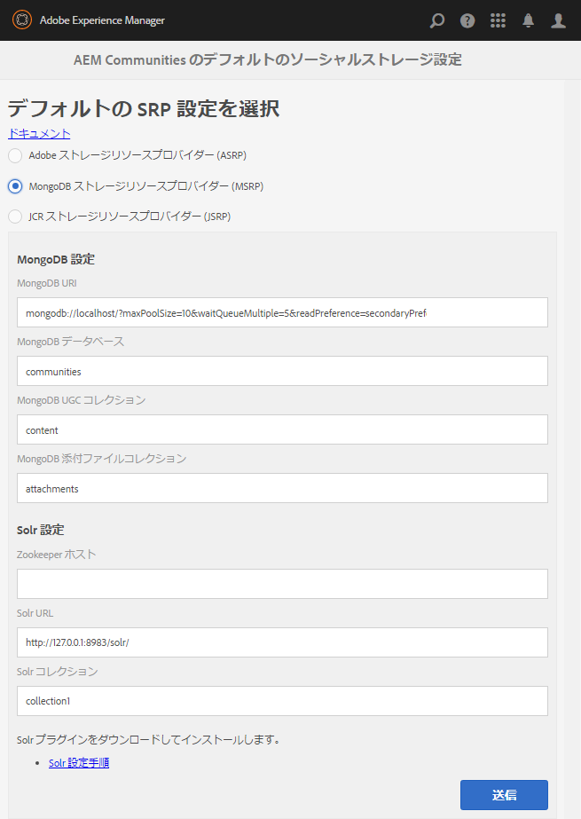

# MSRP - MongoDB ストレージリソースプロバイダー {#msrp-mongodb-storage-resource-provider}

## MSRP について {#about-msrp}

MSRPを共通ストアとして使用するようにAEM Communitiesを設定した場合、ユーザー生成コンテンツ(UGC)は、すべての作成者インスタンスと発行インスタンスからアクセスでき、同期や複製は不要です。

[SRP オプションの特性](working-with-srp.md#characteristics-of-srp-options)と[推奨されるトポロジ](topologies.md)も参照してください。

## 要件 {#requirements}

* [MongoDB](https://www.mongodb.org/)：

   * バージョン2.6以降
   * Mongoや共有を設定する必要がない
   * Strongly recommend use of a [replica set](#mongoreplicaset)
   * AEMと同じホスト上で実行するか、リモートで実行可能

* [Apache Solr](https://lucene.apache.org/solr/)：

   * バージョン4.10またはバージョン5
   * Solr には Java 1.7 以降が必要です。
   * サービスは不要
   * 実行モードの選択：
      * スタンドアロンモード
      * [SolrCloud モード](solr.md#solrcloud-mode)（実稼動環境で推奨）
   * 多言語検索(MLS)の選択：
      * [標準の MLS のインストール](solr.md#installing-standard-mls)
      * [高度な MLS のインストール](solr.md#installing-advanced-mls)

## MongoDB 設定 {#mongodb-configuration}

### MSRP の選択 {#select-msrp}

[ストレージ設定コンソール](srp-config.md) では、デフォルトのストレージ設定を選択できます。これにより、使用するSRPの実装が識別されます。

オーサー環境でストレージ設定コンソールにアクセスするには:

* From global navigation, select **[!UICONTROL Tools]** > **[!UICONTROL Communities]** > **[!UICONTROL Storage Configuration]**.



* Select **[!UICONTROL MongoDB Storage Resource Provider (MSRP)]**
* **[!UICONTROL MongoDB 設定]**

   * **[!UICONTROL MongoDB URI]**

      *default*: mongodb://localhost/?maxPoolSize=10&amp;waitQueueMultiple=5&amp;readPreference=secondaryPreferred

   * **[!UICONTROL MongoDB データベース]**

      *default*: コミュニティ

   * **[!UICONTROL MongoDB UGC コレクション]**

      *default*: content

   * **[!UICONTROL MongoDB 添付ファイルコレクション]**

      *default*: attachments

* **[!UICONTROL SolrConfiguration]**

   * **[](https://cwiki.apache.org/confluence/display/solr/Using+ZooKeeper+to+Manage+Configuration+Files)Zookeeper ホスト&#x200B;**

      When running in [SolrCloud mode](solr.md#solrcloud-mode) with an external ZooKeeper, set this value to the `HOST:PORT` for the ZooKeeper, such as *my.server.com:2181*

      ZooKeeperアンサンブルの場合は、 `HOST:PORT` host1:2181,host2:2181など、コンマで区切った *値を入力します*

      内部ZooKeeperを使用してスタンドアロンモードでSolrを実行する場合は、空白のままにします。
      *デフォルト*: *&lt;空白>*

      * **[!UICONTROL Solr URL]**スタンドアロンモードで Solr と通信するために使用する URL。SolrCloud モードで実行している場合は、空白のままにします。

         *デフォルト*: https://127.0.0.1:8983/solr/

      * **[!UICONTROL Solr コレクション]**Solr コレクションの名前。

         *デフォルト*: collection1

* Select **[!UICONTROL Submit]**

>[!NOTE]
>
>mongoDB データベース（デフォルトの名前は `communities`）を、[ノードストアまたはデータ（バイナリ）ストア](../../help/sites-deploying/data-store-config.md)で使用されているデータベースの名前に設定することはできません。See also [Storage Elements in AEM 6.5](../../help/sites-deploying/storage-elements-in-aem-6.md).


### MongoDB レプリカセット {#mongodb-replica-set}

本番環境では、プライマリ/セカンダリ・レプリケーションと自動フェイルオーバーを実装するMongoDBサーバのクラスタであるレプリカ・セットをセットアップすることを強くお勧めします。

レプリカセットについて詳しくは、MongoDB の [レプリケーション](https://docs.mongodb.org/manual/replication/)に関するドキュメントを参照してください。

レプリカセットの操作と、アプリケーションと MongoDB のインスタンスとの間の接続を定義する方法については、MongoDB の[接続文字列の URI フォーマット](https://docs.mongodb.org/manual/reference/connection-string/)に関するドキュメントを参照してください。

#### レプリカセットに接続するための URL の例  {#example-url-for-connecting-to-a-replica-set}

```shell
# Example url for:
# servers "mongoserver1", "mongoserver2", "mongoserver3"
# replica set 'rs0'
# port numbers only necessary if not default port 27017
mongodb://mongoserver1:<mongoport1>,mongoserver2:<mongoport2>,mongoserver3:<mongoport3>/?replicaSet=rs0&maxPoolSize=100&waitQueueMultiple=50&readPreference=secondaryPreferred
```

## Solr 設定 {#solr-configuration}

別々のコレクションを使用することで、1 つの Solr をノードストア（Oak）と共通ストア（MSRP）の間で共有できます。

Oak と MSRP のコレクションがどちらも高頻度で使用される場合は、パフォーマンス上の理由から 2 つ目の Solr をインストールすることもできます。

For production environments, [SolrCloud mode](solr.md#solrcloud-mode) provides improved performance over standalone mode (a single, local Solr setup).

設定について詳しくは、[SRP 用の Solr 設定](solr.md)を参照してください。

### アップグレード {#upgrading}

MSRPを使用して設定された以前のバージョンからアップグレードする場合は、次の操作が必要です。

1. Perform the [upgrade to AEM Communities](upgrade.md)
1. 新しいSolr構成ファイルのインストール
   * For [standard MLS](solr.md#installing-standard-mls)
   * For [advanced MLS](solr.md#installing-advanced-mls)
1. Reindex MSRP
See section [MSRP Reindex Tool](#msrp-reindex-tool)

## 設定の公開 {#publishing-the-configuration}

すべてのオーサーインスタンスとパブリッシュインスタンスで、MSRP が共通ストアとして指定されている必要があります。

同じ設定を発行環境で使用できるようにするには、オーサーインスタンスにログインし、次の手順に従います。

* Navigate from main menu to **[!UICONTROL Tools]** > **[!UICONTROL Operations]** > **[!UICONTROL Replication]**.
* Select **[!UICONTROL Activate Tree]**
* **[!UICONTROL 開始パス]**:
   * 参照先 `/etc/socialconfig/srpc/`
* Select **[!UICONTROL Activate]**

## ユーザーデータの管理 {#managing-user-data}

パブリッシュ環境で頻繁に入力されるユーザー、ユーザープロファイルおよびユーザーグループについては、以下を参照してください。******

* [ユーザーの同期](sync.md)
* [ユーザーとユーザーグループの管理](users.md)

## MSRP インデックス再作成ツール {#msrp-reindex-tool}

新しい設定ファイルをインストールしたり、Solr のインデックスを修復したりするときは、MSRP 用の Solr のインデックス再作成用の HTTP エンドポイントを使用できます。

このツールでは、MongoDB が MSRP の情報源になるので、バックアップを取るときは MongoDB だけで十分です。**

UGCツリー全体のインデックスを再作成するか、*path *dataパラメータで指定した特定のサブツリーのみを再インデックスできます。

このツールは、コマンドラインから cURL などの HTTP ツールを使用して実行できます。

インデックスを再構築する際、メモリとパフォーマンスの間には、*batchSize *dataパラメータで制御されるトレードオフがあります。このパラメータは、バッチごとに再インデックスされるUGCレコードの数を指定します。

適切なデフォルト値は 5000 です。

* メモリに問題がある場合は、より小さい数値を指定します
* 速度に問題がある場合は、速度を上げるには、大きい値を指定します

### cURL コマンドを使用した MSRP インデックス再作成ツールの実行 {#running-msrp-reindex-tool-using-curl-command}

以下に示す cURL コマンドは、MSRP に格納されている UGC のインデックス再作成の HTTP リクエストに必要なコマンドです。

基本的な形式は以下のとおりです。

cURL -u *signin* -d *data* *reindex-url*

*signin* = administrator-id:passwordExample: admin:admin

*data* = &quot;batchSize=*size*&amp;path=*path&quot;*

*size* = 1回の操作で再インデックスするUGCエントリの数
`/content/usergenerated/asi/mongo/`

*path* =再インデックスするUGCツリーのルート位置

* すべてのUGCのインデックスを再作成するには、 `asipath`
   `/etc/socialconfig/srpc/defaultconfiguration`
* インデックスを一部のUGCに限定するには、 `asipath`

*reindex-url* = SRPの再インデックスのエンドポイント
`http://localhost:4503/services/social/datastore/mongo/reindex`

>[!NOTE]
>
>If you are [reindexing DSRP Solr](dsrp.md), the URL is **/services/social/datastore/rdb/reindex**


### MSRP インデックス再作成の例 {#msrp-reindex-example}

```shell
curl -s -u admin:admin -d 'batchSize=10000&path=/content/usergenerated/asi/mongo/' http://localhost:4503/services/social/datastore/mongo/reindex
```

## MSRP のデモの実行方法 {#how-to-demo-msrp}

MSRP をデモ用に設定するには、[MongoDB をデモ用に設定する方法](demo-mongo.md)を参照してください。

## トラブルシューティング {#troubleshooting}

### UGC が MongoDB で表示されない {#ugc-not-visible-in-mongodb}

ストレージオプションの設定を確認し、MSRP がデフォルトのプロバイダーに設定されているかを確認してください。デフォルトでは、ストレージリソースプロバイダーはJSRPです。

On all author and publish AEM instances, revisit the [Storage Configuration console](srp-config.md) or check the AEM repository:

* In JCR, if [/etc/socialconfig](http://localhost:4502/crx/de/index.jsp#/etc/socialconfig/)

   * Does not contain an [srpc](http://localhost:4502/crx/de/index.jsp#/etc/socialconfig/srpc) node, it means the storage provider is JSRP.
   * If the srpc node exists and contains node [defaultconfiguration](http://localhost:4502/crx/de/index.jsp#/etc/socialconfig/srpc/defaultconfiguration), the defaultconfiguration&#39;s properties should define MSRP to be the default provider.

### アップグレード後に UGC が表示されない {#ugc-disappears-after-upgrade}

If upgrading from an exisitng AEM Communities 6.0 site, any pre-existing UGC must be converted to conform to the structure required for the [SRP](srp.md) API after upgrading to AEM Communities 6.3.

GitHubには、この目的で使用できるオープンソースツールがあります。

* [AEM Communities UGC Migration Tool](https://github.com/Adobe-Marketing-Cloud/communities-ugc-migration)

移行ツールは、旧バージョンのAEMソーシャルコミュニティからUGCを書き出すようにカスタマイズして、AEM Communities6.1以降に読み込むことができます。

### エラー - undefined field provider_id {#error-undefined-field-provider-id}

以下のエラーがログに表示された場合は、Solr スキーマファイルが適切に設定されていません。

#### JsonMappingException: undefined field provider_id {#jsonmappingexception-undefined-field-provider-id}

```xml
Caused by: com.fasterxml.jackson.databind.JsonMappingException: undefined field provider_id
at com.fasterxml.jackson.databind.ser.DefaultSerializerProvider.serializeValue(DefaultSerializerProvider.java:129)
at com.fasterxml.jackson.databind.ObjectMapper.writeValue(ObjectMapper.java:1819)
at com.adobe.cq.social.scf.core.BaseSocialComponent.toJSONString(BaseSocialComponent.java:196)
... 124 common frames omitted
```

To resolve the error, when following the instructions for [Installing Standard MLS](solr.md#installing-standard-mls), ensure:

* XML設定ファイルが正しいSolrの場所にコピーされました。
* 新しい設定ファイルを既存のファイルと置き換えた後に Solr を再起動した.

### MongoDB へのセキュア接続が失敗する {#secure-connection-to-mongodb-fails}

MongoDB サーバーへのセキュア接続の試みが、クラス定義が見つからないという理由で失敗する場合は、MongoDB ドライバーバンドル `mongo-java-driver`（公開されている maven リポジトリで入手可能）を更新する必要があります。

1. Download the driver from [https://search.maven.org/#artifactdetails%7Corg.mongodb%7Cmongo-java-driver%7C2.13.2%7Cjar](https://search.maven.org/#artifactdetails%7Corg.mongodb%7Cmongo-java-driver%7C2.13.2%7Cjar) (version 2.13.2 or later).
1. バンドルをAEMインスタンスの「crx-quickstart/install」フォルダーにコピーします。
1. AEM インスタンスを再起動します。

## リソース {#resources}

* [MongoDB を備えた AEM](../../help/sites-deploying/aem-with-mongodb.md)
* [MongoDB ドキュメント](https://docs.mongodb.org/)

