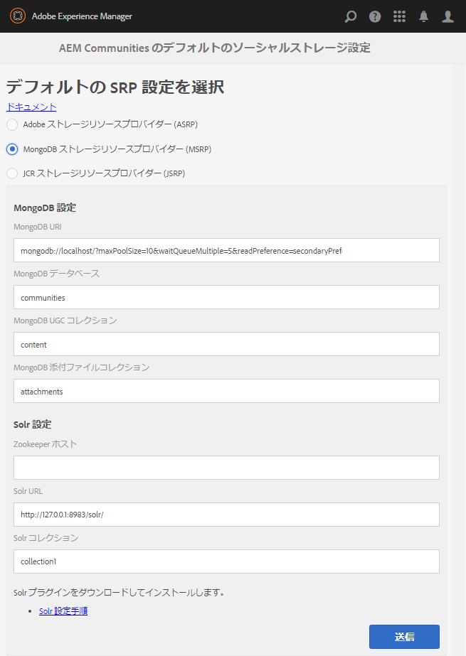

# MSRP - MongoDB ストレージリソースプロバイダー {#msrp-mongodb-storage-resource-provider}

## MSRPについて {#about-msrp}

AEM CommunitiesがMSRPを共通ストアとして使用するように設定されている場合、同期やレプリケーションを必要とせずに、ユーザー生成コンテンツ（UGC）はすべてのオーサーインスタンスとパブリッシュインスタンスからアクセスできます。

[SRP オプションの特性](working-with-srp.md#characteristics-of-srp-options)および[推奨トポロジ ](topologies.md)も参照してください。

## 要件 {#requirements}

* [MongoDB](https://www.mongodb.org/):

   * バージョン 2.6以降
   * Mongosやshardingを設定する必要はありません
   * [ レプリカセット ](#mongoreplicaset)の使用を強くお勧めします
   * AEMと同じホストで実行するか、リモートで実行する可能性があります

* [Apache Solr](https://lucene.apache.org/solr/):

   * Solr バージョン 7.0
   * SolrにはJava 1.7以降が必要です
   * サービスは必要ありません
   * 実行モードの選択：
      * スタンドアロンモード
      * [SolrCloud モード ](solr.md#solrcloud-mode) （実稼動環境に推奨）
   * 多言語検索（MLS）の選択：
      * [標準MLSのインストール](solr.md#installing-standard-mls)
      * [高度なMLSのインストール](solr.md#installing-advanced-mls)

## MongoDB設定 {#mongodb-configuration}

### MSRPを選択 {#select-msrp}

[ ストレージ設定コンソール ](srp-config.md)では、使用するSRPの実装を特定するデフォルトのストレージ設定を選択できます。

オーサーで、ストレージ設定コンソールにアクセスするには、次の手順を実行します。

* グローバルナビゲーションから、**[!UICONTROL ツール]**/**[!UICONTROL コミュニティ]**/**[!UICONTROL ストレージ設定]**&#x200B;を選択します。



* **[!UICONTROL MongoDB ストレージリソースプロバイダー（MSRP）]**&#x200B;を選択
* **[!UICONTROL mongoDB設定]**

   * **[!UICONTROL mongoDB URI]**

     *default*: mongodb://localhost/?maxPoolSize=10&amp;waitQueueMultiple=5&amp;readPreference=secondaryPreferred

   * **[!UICONTROL mongoDB データベース]**

     *default*: communities

   * **[!UICONTROL mongoDB UGC コレクション]**

     *default*: content

   * **[!UICONTROL mongoDB Attachment Collection]**

     *default*：添付ファイル

* **[!UICONTROL SolrConfiguration]**

   * **[Zookeeper](https://cwiki.apache.org/confluence/display/solr/Using+ZooKeeper+to+Manage+Configuration+Files) ホスト**

     外部ZooKeeperを使用して[SolrCloud モード ](solr.md#solrcloud-mode)で実行する場合は、ZooKeeperの&#x200B;*my.server.com:2181*&#x200B;など、この値を`HOST:PORT`に設定します

     ZooKeeper Ensembleの場合、*host1:2181,host2:2181*&#x200B;など、`HOST:PORT`個のコンマ区切りの値を入力します

     内部ZooKeeperを使用してスタンドアロンモードでSolrを実行する場合は、空白のままにします。
     *Default*: *&lt;blank>*

      * **[!UICONTROL Solr URL]**
スタンドアロンモードでSolrと通信するために使用されるURL。
SolrCloud モードで実行している場合は、空白のままにします。
        *Default*: https://127.0.0.1:8983/solr/

      * **[!UICONTROL Solr コレクション]**
Solr コレクション名。
        *Default*: collection1

* 「**[!UICONTROL 送信]**」を選択します。

>[!NOTE]
>
>デフォルトの名前`communities`であるmongoDB データベースは、[ ノードストアまたはデータ（バイナリ）ストア ](../../help/sites-deploying/data-store-config.md)に使用されるデータベースの名前に設定しないでください。 AEM 6.5](../../help/sites-deploying/storage-elements-in-aem-6.md)の[Storage Elementsも参照してください。

### MongoDB レプリカセット {#mongodb-replica-set}

実稼動環境では、プライマリセカンダリレプリケーションと自動フェイルオーバーを実装するMongoDB サーバーのクラスターであるレプリカセットをセットアップすることを強くお勧めします。

レプリカセットについて詳しくは、MongoDBの[ レプリケーション ](https://docs.mongodb.org/manual/replication/)のドキュメントを参照してください。

レプリカセットを操作し、アプリケーションとMongoDB インスタンス間の接続を定義する方法については、MongoDBの[接続文字列URI形式](https://docs.mongodb.org/manual/reference/connection-string/) ドキュメントを参照してください。

#### レプリカセットに接続するためのURLの例  {#example-url-for-connecting-to-a-replica-set}

```shell
# Example url for:
# servers "mongoserver1", "mongoserver2", "mongoserver3"
# replica set 'rs0'
# port numbers only necessary if not default port 27017
mongodb://mongoserver1:<mongoport1>,mongoserver2:<mongoport2>,mongoserver3:<mongoport3>/?replicaSet=rs0&maxPoolSize=100&waitQueueMultiple=50&readPreference=secondaryPreferred
```

## Solr 設定 {#solr-configuration}

Solr インストールは、異なるコレクションを使用して、ノードストア（Oak）と共通ストア（MSRP）の間で共有される場合があります。

Oak コレクションとMSRP コレクションの両方を集中的に使用する場合は、パフォーマンス上の理由から2番目のSolrをインストールできます。

実稼動環境の場合、[SolrCloud モード ](solr.md#solrcloud-mode)では、スタンドアロンモード（単一のローカル Solr セットアップ）よりもパフォーマンスが向上します。

構成の詳細については、[Solr Configuration for SRP](solr.md)を参照してください。

### アップグレード {#upgrading}

MSRPで設定された以前のバージョンからアップグレードする場合は、次のことが必要になります。

1. AEM Communities](upgrade.md)への[ アップグレードを実行します
1. 新しいSolr設定ファイルのインストール
   * [標準MLS](solr.md#installing-standard-mls)の場合
   * [Advanced MLS](solr.md#installing-advanced-mls)の場合
1. MSRPのインデックス再作成
セクション [MSRP インデックス再作成ツール ](#msrp-reindex-tool)を参照してください

## 設定の公開 {#publishing-the-configuration}

MSRPは、すべてのオーサーインスタンスとパブリッシュインスタンスの共通ストアとして識別する必要があります。

パブリッシュ環境で同じ設定を使用できるようにするには、オーサーインスタンスにログインし、次の手順に従います。

* メインメニューから&#x200B;**[!UICONTROL ツール]**/**[!UICONTROL 操作]**/**[!UICONTROL レプリケーション]**&#x200B;に移動します。
* 「**[!UICONTROL ツリーをアクティブ化]**」を選択
* **[!UICONTROL パスの開始]**:
   * `/etc/socialconfig/srpc/`を参照
* **[!UICONTROL アクティブ化]**&#x200B;を選択

## ユーザーデータの管理 {#managing-user-data}

*ユーザー*、*ユーザープロファイル*&#x200B;および&#x200B;*ユーザーグループ*&#x200B;について、パブリッシュ環境で頻繁に入力される情報については、次を参照してください

* [ユーザー同期](sync.md)
* [ユーザーとユーザーグループの管理](users.md)

## MSRP インデックス再作成ツール {#msrp-reindex-tool}

新しい設定ファイルをインストールしたり、破損したSolr インデックスを修復したりする場合に、MSRP用にSolrを再インデックス化するためのHTTP エンドポイントがあります。

このツールを使用すると、MongoDBはMSRPの&#x200B;*truth*&#x200B;のソースとなります。バックアップはMongoDBでのみ実行できます。

UGC ツリー全体をインデックス付けするか、*path *data パラメーターで指定された特定のサブツリーのみをインデックス付けできます。

このツールは、cURLまたはその他のHTTP ツールを使用してコマンドラインから実行できます。

インデックス再作成を行う場合、*batchSize *data パラメーターによって制御されるメモリとパフォーマンスの間にはトレードオフがあります。このパラメーターは、バッチごとにインデックス再作成されるUGC レコードの数を指定します。

合理的なデフォルトは5000です。

* メモリに問題がある場合は、より小さい数値を指定します
* 速度に問題がある場合は、より大きな数値を指定して速度を上げます

### cURL コマンドを使用したMSRP インデックス再作成ツールの実行 {#running-msrp-reindex-tool-using-curl-command}

次のcURL コマンドは、HTTP リクエストがMSRPに格納されたUGCを再インデックス化するために必要なことを示しています。

基本的な形式は次のとおりです。

cURL -u *signin* -d *data* *reindex-url*

*signin* =管理者id:password
例：admin:admin

*data* = &quot;batchSize=*size*&amp;path=*path&quot;*

*size* =操作ごとに再インデックス化するUGC エントリの数
`/content/usergenerated/asi/mongo/`

*path* =再インデックスを作成するUGCのツリーのルートの場所

* すべてのUGCを再インデックスするには、の`asipath` プロパティの値を指定します
  `/etc/socialconfig/srpc/defaultconfiguration`
* インデックスを一部のUGCに制限するには、`asipath`のサブツリーを指定します

*reindex-url* = SRPのインデックス再作成のエンドポイント
`http://localhost:4503/services/social/datastore/mongo/reindex`

>[!NOTE]
>
>[DSRP Solr](dsrp.md)をインデックス再作成している場合、URLは&#x200B;**/services/social/datastore/rdb/reindex**&#x200B;です

### MSRPの再インデックスの例 {#msrp-reindex-example}

```shell
curl -s -u admin:admin -d 'batchSize=10000&path=/content/usergenerated/asi/mongo/' http://localhost:4503/services/social/datastore/mongo/reindex
```

## MSRPのデモ方法 {#how-to-demo-msrp}

デモ環境または開発環境のMSRPをセットアップするには、[ デモ用MongoDBのセットアップ方法](demo-mongo.md)を参照してください。

## トラブルシューティング {#troubleshooting}

### MongoDBでUGCが表示されない {#ugc-not-visible-in-mongodb}

ストレージオプションの設定を確認して、MSRPがデフォルトプロバイダーに設定されていることを確認します。 デフォルトでは、ストレージリソースプロバイダーはJSRPです。

すべてのオーサーインスタンスとパブリッシュAEM インスタンスで、[Storage Configuration Console](srp-config.md)を再訪問するか、AEM リポジトリを確認します。

* JCRで、[/etc/socialconfig](http://localhost:4502/crx/de/index.jsp#/etc/socialconfig/)の場合

   * [srpc](http://localhost:4502/crx/de/index.jsp#/etc/socialconfig/srpc) ノードが含まれていません。これは、ストレージプロバイダーがJSRPであることを意味します。
   * srpc ノードが存在し、ノード [defaultconfiguration](http://localhost:4502/crx/de/index.jsp#/etc/socialconfig/srpc/defaultconfiguration)が含まれている場合、defaultconfigurationのプロパティでMSRPをデフォルトプロバイダーとして定義する必要があります。

### アップグレード後にUGCが消える {#ugc-disappears-after-upgrade}

既存のAEM Communities 6.0 サイトからアップグレードする場合、既存のUGCは、AEM Communities 6.3にアップグレードした後、[SRP](srp.md) APIに必要な構造に準拠するように変換する必要があります。

GitHubには、次のような目的で利用できるオープンソースツールがあります。

* [AEM Communities UGC Migration Tool](https://github.com/Adobe-Marketing-Cloud/communities-ugc-migration)

移行ツールは、以前のバージョンのAEM ソーシャルコミュニティからUGCを書き出し、AEM Communities 6.1以降に読み込むようにカスタマイズできます。

### エラー – フィールド provider_idが定義されていません {#error-undefined-field-provider-id}

ログに次のエラーが表示された場合は、Solr スキーマファイルが正しく設定されていないことを示します。

#### JsonMappingException：未定義のフィールド provider_id {#jsonmappingexception-undefined-field-provider-id}

```xml
Caused by: com.fasterxml.jackson.databind.JsonMappingException: undefined field provider_id
at com.fasterxml.jackson.databind.ser.DefaultSerializerProvider.serializeValue(DefaultSerializerProvider.java:129)
at com.fasterxml.jackson.databind.ObjectMapper.writeValue(ObjectMapper.java:1819)
at com.adobe.cq.social.scf.core.BaseSocialComponent.toJSONString(BaseSocialComponent.java:196)
... 124 common frames omitted
```

このエラーを解決するには、[標準MLS](solr.md#installing-standard-mls)のインストールに関する手順に従って、次のことを確認します。

* XML設定ファイルが正しいSolrの場所にコピーされました。
* Solrは、新しい設定ファイルが既存の設定ファイルに置き換わった後に再起動されました。

### MongoDBへのセキュアな接続が失敗する {#secure-connection-to-mongodb-fails}

クラス定義が見つからなかったためにMongoDB サーバーへのセキュアな接続が失敗した場合は、公開されているMaven リポジトリから利用可能なMongoDB ドライバーバンドル `mongo-java-driver`を更新する必要があります。

1. ドライバーを[https://search.maven.org/#artifactdetails%7Corg.mongodb%7Cmongo-java-driver%7C2.13.2%7Cjar](https://search.maven.org/#artifactdetails%7Corg.mongodb%7Cmongo-java-driver%7C2.13.2%7Cjar) （バージョン 2.13.2以降）からダウンロードします。
1. AEM インスタンスの「crx-quickstart/install」フォルダーにバンドルをコピーします。
1. AEM インスタンスを再起動します。

## リソース {#resources}

* [MongoDB を備えた AEM](../../help/sites-deploying/aem-with-mongodb.md)
* [MongoDB ドキュメント](https://docs.mongodb.org/)
