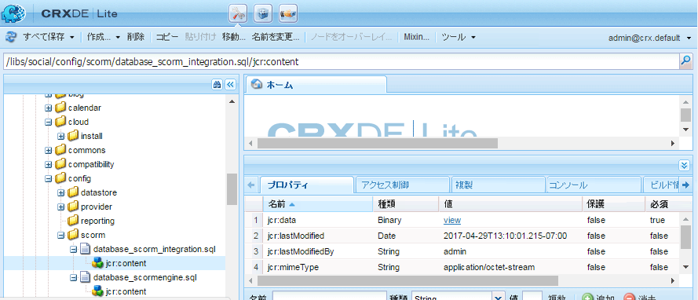

# イネーブルメント機能のための MySQL 設定 {#mysql-configuration-for-enablement-features}

MySQL は、イネーブルメントリソースの SCORM 追跡データおよびレポートデータに主に使用されるリレーショナルデータベースです。ビデオの一時停止/再開の追跡など、その他の機能の表が含まれています。

この手順では、MySQL サーバーに接続する方法、イネーブルメントデータベースを構築する方法およびデータベースに初期データを入力する方法について説明します。

## 要件 {#requirements}

MySQL をコミュニティサイトのイネーブルメント機能用に設定する前に、以下をおこなう必要があります。

* Install [MySQL server](https://dev.mysql.com/downloads/mysql/) Community Server version 5.6:
   * バージョン5.7はSCORMではサポートされていません。
   * 作成者のAEMインスタンスと同じサーバーを使用できます。
* On all AEM instances, install the official [JDBC driver for MySQL](deploy-communities.md#jdbc-driver-for-mysql).
* Install [MySQL workbench](https://dev.mysql.com/downloads/tools/workbench/).
* On all AEM instances, install the [SCORM package](enablement.md#scorm).

## MySQL のインストール {#installing-mysql}

対象 OS の手順に従い、MySQL をダウンロードしてインストールする必要があります。

### 小文字のテーブル名 {#lower-case-table-names}

SQL では大文字と小文字が区別されます。大文字と小文字が区別されるオペレーティングシステムでは、すべてのテーブル名を小文字にする設定を含める必要があります。

例えば、Linux OS でテーブル名をすべて小文字に指定するには、

* ファイルの編集 `/etc/my.cnf`
* In the `[mysqld]` section, add the following line: `lower_case_table_names = 1`

### UTF8 文字セット {#utf-character-set}

より優れた多言語対応を実現するには、UTF8 文字セットを使用する必要があります。

以下の操作で MySQL の文字セットを UTF8 に変更します。
* mysql> SET NAMES &#39;utf8&#39;;

以下の操作で MySQL データベースをデフォルトから UTF8 に変更します。
* ファイルの編集 `/etc/my.cnf`
* セクションで、次を追加し `[client]` ます。 `default-character-set=utf8`
* セクションで、次を追加し `[mysqld]` ます。 `character-set-server=utf8`

## MySQL Workbench のインストール {#installing-mysql-workbench}

MySQL Workbench には、スキーマと初期データをインストールする SQL スクリプトを実行するための UI が用意されています。

MySQL Workbenchは、ターゲットOSの指示に従ってダウンロードし、インストールする必要があります。

## イネーブルメント機能のための接続 {#enablement-connection}

MySQL Workbench を初めて起動したときは（他の目的で既に使用されていない場合）、接続はまだ表示されません。

### 新しい接続の設定 {#new-connection-settings}

1. Select the &#39;+&#39; icon to the right of `MySQL Connections`.
1. In the dialog `Setup New Connection`, enter values appropriate for your platform for demonstration purposes, with the author AEM instance and MySQL on the same server:
   * 接続名: `Enablement`
   * 接続方法： `Standard (TCP/IP)`
   * Hostname：`127.0.0.1`
   * ユーザー名: `root`
   * パスワード: `no password by default`
   * デフォルトスキーマ: `leave blank`
1. Select `Test Connection` to verify the connection to the running MySQL service.

**備考**:
* デフォルトのポートは `3306` です。
* The `Connection Name` chosen is entered as the `datasource` name in [JDBC OSGi configuration](#configure-jdbc-connections).

#### 成功した接続 {#successful-connection}

#### 新しい接続 Enablement {#new-enablement-connection}

## データベースのセットアップ {#database-setup}

新しい接続 Enablement を開くと、テストスキーマとデフォルトのユーザーアカウントがあります。

### SQL スクリプトの取得 {#obtain-sql-scripts}

SQL スクリプトを取得するには、オーサーインスタンスで CRXDE Lite を使用します。The [SCORM package](deploy-communities.md#scorm) must be installed:

1. CRXDE Liteを参照：
   * 例：[http://localhost:4502/crx/de](http://localhost:4502/crx/de)
1. フォルダを展開し `/libs/social/config/scorm/` ます
1. ダウンロード `database_scormengine.sql`
1. ダウンロード `database_scorm_integration.sql`

スキーマをダウンロードする方法の1つは、次のことです。

* Select the `jcr:content` node for the sql file.
* Notice the value for the `jcr:data` property is a view link.
* 表示リンクを選択して、データをローカルファイルに保存します。

### SCORM データベースの作成 {#create-scorm-database}

作成する有効化SCORMデータベースは次のとおりです。

* name: `ScormEngineDB`
* 以下のスクリプトから作成：
   * リストとして: `database_scormengine.sql`
   * data: `database_scorm_integration.sql`
Follow the steps below (
[open](#step-open-sql-file), [execute](#step-execute-sql-script))を使用して各 [SQLスクリプトをインストールします](#obtain-sql-scripts) 。 [必要に応じて更新し](#refresh) 、スクリプトの実行結果を確認します。

データをインストールする前にスキーマをインストールしてください。

>[!CAUTION]
>
>データベース名を変更した場合は、以下の設定で適切な名前を指定してください。：
>
>* [JDBC 設定](#configure-jdbc-connections)
>* [SCORM 設定](#configure-scorm)

#### 手順 1：SQL ファイルを開く {#step-open-sql-file}

MySQL Workbench で、以下の設定をおこないます。

* [ファイル]プルダウンメニューから
*  `Open SQL Script ...`
* この順序で、次のいずれかを選択します。
   1. `database_scormengine.sql`
   1. `database_scorm_integration.sql`

#### 手順 2：SQL スクリプトの実行 {#step-execute-sql-script}

In the Workbench window for the file opened in Step 1, select the `lightening (flash) icon` to execute the script.

`database_scormengine.sql` スクリプトを実行して SCORM データベースを作成するときは、完了までに少し時間がかかる場合があります。

#### 更新 {#refresh}

スクリプトの実行が完了したら、新しいデータベースを表示するために、`SCHEMAS` の `Navigator` セクションを更新する必要があります。以下のように、「SCHEMAS」の右側にある更新アイコンを使用します。

#### 結果：scormenginedb {#result-scormenginedb}

SCHEMAS のインストールと更新が完了すると、`scormenginedb` が表示されます。

## Configure JDBC Connections {#configure-jdbc-connections}

**Day Commons JDBC Connections Pool** の OSGi 設定では、MySQL JDBC ドライバーを設定します。

すべての AEM パブリッシュインスタンスおよびオーサーインスタンスが、同じ MySQL サーバーを指している必要があります。

When MySQL runs on a server different from AEM, the server hostname must be specified in place of &#39;localhost&#39; in the JDBC connector (which populates the [ScormEngine](#configurescormengineservice) config).

* 各作成者および発行AEMインスタンス
* 管理者権限を持つサインイン
* Access the [web console](../../help/sites-deploying/configuring-osgi.md)
   * For example, [http://localhost:4502/system/console/configMgr](http://localhost:4502/system/console/configMgr)
* Folio Builder `Day Commons JDBC Connections Pool`
* Select the `+` icon to create a new configuration

   

* 次の値を入力します。
   * **[!UICONTROL JDBC ドライバークラス]**: `com.mysql.jdbc.Driver`
   * **DBC接続URIJ**: `jdbc:mysql://localhost:3306/aem63reporting` MySQLサーバーが&#39;this&#39; AEMサーバーと同じでない場合は、localhostの代わりにserverを指定します。
   * **[!UICONTROL ユーザー名]**:「root」でない場合は、MySQLサーバーの設定済みユーザー名をrootにするか、入力します。
   * **[!UICONTROL パスワード]**:MySQLにパスワードが設定されていない場合は、このフィールドをクリアします。それ以外の場合は、MySQLユーザー名に設定済みのパスワードを入力します。
   * **[!UICONTROL データソース名]**:MySQL接続に対して入力された名前 （例： &#39;enablement&#39;）。
* 「**[!UICONTROL 保存]**」を選択します。

## SCORM の設定 {#configure-scorm}

### AEM Communities ScormEngine Service {#aem-communities-scormengine-service}

**AEM Communities ScormEngine Service** の OSGi 設定では、イネーブルメントコミュニティで MySQL サーバーを使用するために SCORM を設定します。

[SCORM パッケージ](deploy-communities.md#scorm-package)がインストールされているときは、設定が表示されます。

すべてのパブリッシュインスタンスおよびオーサーインスタンスが、同じ MySQL サーバーを指している必要があります。

When MySQL runs on a server different from AEM, the server hostname must be specified in place of &#39;localhost&#39; in the ScormEngine Serivce, which is typically populated from the [JDBC Connection](#configure-jdbc-connections) config.

* 各作成者および発行AEMインスタンス
* 管理者権限を持つサインイン
* Access the [web console](../../help/sites-deploying/configuring-osgi.md)
   * For example, [http://localhost:4502/system/console/configMgr](http://localhost:4502/system/console/configMgr)
* Folio Builder `AEM Communities ScormEngine Service`
* 編集アイコンを選択します

   

* Verify the following parameter values are consistent with the [JDBC Connection](#configurejdbcconnectionspool) config:
   * **[!UICONTROL JDBC接続URI]**: `jdbc:mysql://localhost:3306/ScormEngineDB` *ScormEngineDB* は、SQLスクリプトのデフォルトのデータベース名です
   * **[!UICONTROL ユーザー名]**:「root」でない場合は、MySQLサーバーの設定済みのユーザー名をルートにするか、入力します。
   * **[!UICONTROL パスワード]**:MySQLにパスワードが設定されていない場合は、このフィールドをクリアします。それ以外の場合は、MySQLユーザー名に設定済みのパスワードを入力します
* 次のパラメーターに関して：
   * **[!UICONTROL Scormユーザーパスワード]**:編集しない

      内部でのみ使用する場合：AEM CommunitiesがSCORMエンジンと通信するのに使う特別なサービス利用者のためです。
* Select **[!UICONTROL Save]**

### Adobe Granite CSRF Filter {#adobe-granite-csrf-filter}

イネーブルメントコースがすべてのブラウザーで正しく動作するかを確認するには、Mozilla を CSRF フィルターでは確認されないユーザーエージェントとして追加する必要があります。

* 管理者権限でAEM発行インスタンスにログインします。
* Access the [web console](../../help/sites-deploying/configuring-osgi.md)
   * For example, [http://localhost:4503/system/console/configMgr](http://localhost:4503/system/console/configMgr)
* Locate `Adobe Granite CSRF Filter`.
* 編集アイコンを選択します。

   

* Select the `[+]` icon to add a Safe User Agent.
* Enter `Mozilla/*`.
* 「**[!UICONTROL 保存]**」を選択します。

