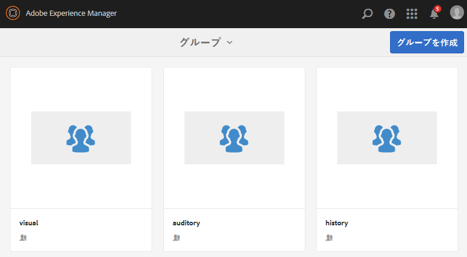

# ネストされたグループの作成{#authoring-nested-groups}

## オーサー環境でのグループの作成 {#creating-groups-on-author}

AEM作成者インスタンスで、グローバルナビゲーションから次の操作を行います。

* **[!UICONTROL コミュニティ]**/**[!UICONTROL サイト]**&#x200B;を選択します。
* **[!UICONTROL エンゲージメントフォルダー]**&#x200B;を選択して開きます。
* **[!UICONTROL はじめに/チュートリアル]**&#x200B;英語のサイトのカードを選択します。

   * カードの画像を選択します。
   * アイコンを&#x200B;*選択しないでください*。

そうすると、[グループコンソール](/help/communities/groups.md)に移動します。

グループ機能は、グループのインスタンスが作成されるフォルダーとして表示されます。グループフォルダーを選択して、開きます。公開時に作成されたグループは表示されます。

## メインの Arts グループの作成 {#create-main-arts-group}

このグループを作成できるのは、engage のサイト構造にグループ機能が含まれているからです。サイトの`Reference Template`内の関数の設定は、デフォルトで有効なグループテンプレートの選択を許可します。 したがって、この新しいグループに対して選択されるテンプレートは`Reference Group`です。

これらのコンソールは、コミュニティのサイトコンソールに似ています。

* 「**[!UICONTROL グループを作成]**」を選択します。

* **コミュニティグループテンプレート**：

   * **[!UICONTROL コミュニティグループのタイトル]**:アート。
   * **[!UICONTROL コミュニティグループの説明]**:様々な芸術団体の親グループ。
   * **[!UICONTROL コミュニティグループルート]**: *デフォルトのままにします*。
   * **[!UICONTROL 利用可能な追加のコミュニティグループ言語]**:ドロップダウンメニューを使用して、使用可能なコミュニティグループ言語を選択します。このメニューには、親コミュニティサイトを作成できる言語がすべて表示されます。この中から言語を選択することで、1 回の手順で複数のロケールにグループを作成できます。指定した複数の言語で、それぞれのコミュニティサイトのグループコンソールに同じグループが作成されます。
   * **[!UICONTROL コミュニティグループ名]**:芸術
   * **[!UICONTROL テンプレート]**:ドロップダウンして選択  `Reference Group.`
   * 「**[!UICONTROL 次へ]**」を選択します。

引き続き、他のパネルで以下の値を設定します。

* **[!UICONTROL デザイン]**

   * デザインを変更するか、既定の親サイトのデザインを許可します。
   * 「**[!UICONTROL 次へ]**」を選択します。

* **[!UICONTROL 設定]**

   * **[!UICONTROL モデレート]**

      * 空のままにします（親サイトから継承）。
   * **[!UICONTROL メンバーシップ]**

      * デフォルト`Optional Membership.`を使用

      * **[!UICONTROL サムネール]**
         * `optional.*`
      * **[!UICONTROL 「次へ]**」を選択します。

* 「**[!UICONTROL 作成]**」を選択します。

### Arts グループ内でのグループのネスト {#nesting-groups-within-arts-group}

`groups`フォルダーに2つのグループが含まれるようになりました（ページを更新）。

#### グループの公開 {#publish-group}

`arts` グループ内でネストされるグループを作成する前に、`arts` カードにカーソルを合わせ、公開アイコンを選択してそのグループを公開します。

グループが公開されたことが確認されるまで待機します。

`arts`グループには`groups`フォルダーも含める必要がありますが、空で新しいグループを作成できるフォルダーも含まれます。 アートグループフォルダーに移動し、3つのネストされたグループを作成します。それぞれ異なるメンバーシップ設定になります。

1. **[!UICONTROL ビジュアル]**

   * タイトル: `Visual Arts`
   * 名前：`visual`
   * テンプレート: `Reference Group`
   * メンバーシップ：パブリックグループ`Optional Membership`を選択し、すべてのメンバーに対して開きます。

1. **[!UICONTROL Auditory]**

   * タイトル: `Auditory Arts`
   * 名前：`auditory`
   * テンプレート: `Reference Group`
   * メンバーシップ：`Required Membership`を選択します。開いたグループで、メンバーが参加できます。

1. **[!UICONTROL History]**

   * タイトル: `Art History`
   * 名前：`history`
   * テンプレート: `Reference Group`
   * メンバーシップ：`Restricted Membership`を選択します。シークレットグループは招待されたメンバーにのみ表示されます。 例として、[デモユーザー](/help/communities/tutorials.md#demo-users) `emily.andrews@mailinator.com`を招待します。

ページを更新して、ネストされた 3 つのグループ（サブコミュニティ）すべてを表示します。

Communitiesのサイトコンソールからネストされたグループに移動するには：

* **[!UICONTROL エンゲージメントフォルダー]**&#x200B;を選択
* 「**[!UICONTROL はじめに/チュートリアルカード]**」を選択します
* **[!UICONTROL グループ]**&#x200B;フォルダーを選択
* **[!UICONTROL アートカード]**&#x200B;を選択
* **[!UICONTROL グループ]**&#x200B;フォルダーを選択

## グループの公開 {#publishing-groups}

メインコミュニティサイトの公開後：

* 各グループを個別に公開する：

   * グループが公開されたことの確認を待っています。

* 次の階層化されたグループを公開する前に親グループを公開する：

   * すべてのグループは、トップダウン方式で公開する必要があります。

## パブリッシュ環境でのエクスペリエンス {#experience-on-publish}

サインイン時に、様々なグループを体験することができます。例えば、[デモユーザー](/help/communities/tutorials.md#demo-users)は次の用途に使用されます。

* Art/History グループメンバー：emily.andrews@mailinator.com／password
   * 制限付き（秘密）グループ、アート/履歴が表示されます。
   * オプションの（パブリック）グループを表示できます。
   * 制限付き（開いている）グループに参加できます。

* グループマネージャー：aaron.mcdonald@mailinator.com／password

   * オプションの（パブリック）グループを表示できます。
   * 制限付き（開いている）グループに参加できます。
   * 制限付き（秘密）グループを表示できません。

オーサー環境で Communities の[メンバーコンソールとグループコンソール](/help/communities/members.md)にアクセスすると、コミュニティグループに対応する様々なメンバーグループに他のユーザーを追加できます。

