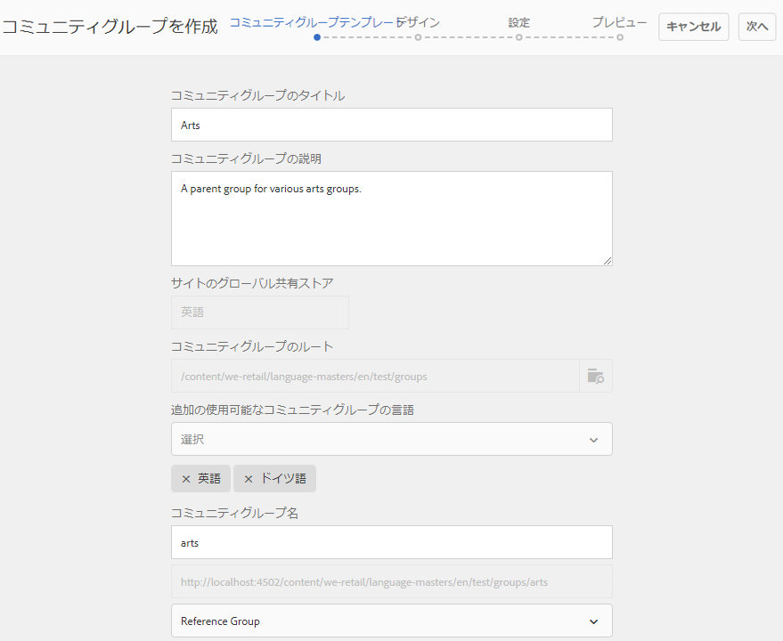
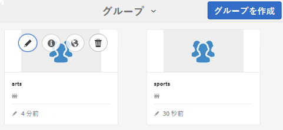

# ネストされたグループの作成{#authoring-nested-groups}

## オーサー環境でのグループの作成 {#creating-groups-on-author}

AEM作成者インスタンスで、グローバルナビゲーションから次の操作を行います。

* Select **[!UICONTROL Communities] > **[!UICONTROL Sites]**.
* Select **[!UICONTROL engage folder]** to open it.
* Select the card for the **[!UICONTROL Getting Started Tutorial]** English site.

   * カードの画像を選択します。
   * Do *not* select an icon.

そうすると、[グループコンソール](/help/communities/groups.md)に移動します。

グループ機能は、グループのインスタンスが作成されるフォルダーとして表示されます。グループフォルダーを選択して、開きます。公開時に作成されたグループが表示されます。

## メインの Arts グループの作成 {#create-main-arts-group}

このグループを作成できるのは、engage のサイト構造にグループ機能が含まれているからです。The configuration of the function in the site&#39;s `Reference Template` defaults to allowing the selection of any enabled group template. したがって、この新しいグループに対して選択されたテンプレートがになりま `Reference Group`す。

これらのコンソールは、Communitiesのサイトコンソールに似ています。

* Select **[!UICONTROL Create Group]**.

* **コミュニティグループテンプレート**：

   * **[!UICONTROL コミュニティグループのタイトル]**:アート。
   * **[!UICONTROL コミュニティグループの説明]**:様々な芸術団体の親集団。
   * **[!UICONTROL コミュニティグループルート]**:デフォル *トのままにします*。
   * **[!UICONTROL 利用可能なコミュニティグループの追加言語]**:ドロップダウンメニューを使用して、利用可能なコミュニティグループの言語を選択します。 このメニューには、親コミュニティサイトを作成できる言語がすべて表示されます。この中から言語を選択することで、1 回の手順で複数のロケールにグループを作成できます。指定した複数の言語で、それぞれのコミュニティサイトのグループコンソールに同じグループが作成されます。
   * **[!UICONTROL コミュニティグループ名]**:芸術
   * **[!UICONTROL テンプレート]**:ドロップダウンして選択 `Reference Group.`
   * 「**[!UICONTROL 次へ]**」を選択します。

引き続き、他のパネルで以下の値を設定します。

* **[!UICONTROL デザイン]**

   * デザインを変更するか、既定の親サイトのデザインを許可します。
   * 「**[!UICONTROL 次へ]**」を選択します。

* **[!UICONTROL 設定]**

   * **[!UICONTROL モデレート]**

      * 空のままにします（親サイトから継承）。
   * **[!UICONTROL メンバーシップ]**

      * Use default `Optional Membership.`

      * **[!UICONTROL サムネール]**
         * `optional.*`
      * **[!UICONTROL 「次へ]**」を選択します。

* 「**[!UICONTROL 作成]**」を選択します。

### Arts グループ内でのグループのネスト {#nesting-groups-within-arts-group}

これで、フ `groups` ォルダーに2つのグループが含まれるようになりました（ページを更新）。

#### グループの公開 {#publish-group}

`arts` グループ内でネストされるグループを作成する前に、`arts` カードにカーソルを合わせ、公開アイコンを選択してそのグループを公開します。

グループが公開されたことが確認されるまで待機します。

The `arts` group should also contain a `groups` folder, but one that is empty and in which new groups can be created. アートグループフォルダーに移動し、3つのネストされたグループを作成し、それぞれ異なるメンバーシップ設定を持ちます。

1. **[!UICONTROL ビジュアル]**

   * タイトル: `Visual Arts`
   * 名前: `visual`
   * テンプレート: `Reference Group`
   * Membership: select `Optional Membership`, a public group, open to all members.

1. **[!UICONTROL Auditory]**

   * タイトル: `Auditory Arts`
   * 名前: `auditory`
   * テンプレート: `Reference Group`
   * Membership: select `Required Membership`, an open group, available for members to join.

1. **[!UICONTROL History]**

   * タイトル: `Art History`
   * 名前: `history`
   * テンプレート: `Reference Group`
   * メンバーシップ：シークレ `Restricted Membership`ットグループを選択します。招待されたメンバーにのみ表示されます。 例として、デモユーザーを招 [待します](/help/communities/tutorials.md#demo-users)`emily.andrews@mailinator.com`。

ページを更新して、ネストされた 3 つのグループ（サブコミュニティ）すべてを表示します。

Communities Sitesコンソールからネストされたグループに移動するには：

* Select **[!UICONTROL engage folder]**
* Select **[!UICONTROL Getting Started Tutorial card]**
* Select **[!UICONTROL Groups]** folder
* Select **[!UICONTROL arts card]**
* Select **[!UICONTROL Groups]** folder

## グループの公開 {#publishing-groups}

メインコミュニティサイトの公開後：

* 各グループを個別に公開する：

   * グループが公開されたことの確認を待っています。

* 次の場所にネストされたグループを公開する前に親グループを公開する：

   * すべてのグループは、トップダウン方式で公開する必要があります。

## パブリッシュ環境でのエクスペリエンス {#experience-on-publish}

It is possible to experience the different groups when signed in, for example with the [demo users](/help/communities/tutorials.md#demo-users) used for:

* Art/History グループメンバー：emily.andrews@mailinator.com／password
   * 制限付きの（秘密の）グループ、芸術/歴史が表示されます。
   * オプションの（パブリック）グループを表示できます。
   * 制限付き（開いている）グループに参加できます。

* グループマネージャー：aaron.mcdonald@mailinator.com／password

   * オプションの（パブリック）グループを表示できます。
   * 制限付き（開いている）グループに参加できます。
   * 制限付き（シークレット）グループを表示できません。

オーサー環境で Communities の[メンバーコンソールとグループコンソール](/help/communities/members.md)にアクセスすると、コミュニティグループに対応する様々なメンバーグループに他のユーザーを追加できます。

