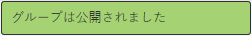

# ネストされたグループの作成{#authoring-nested-groups}

## オーサー環境でのグループの作成 {#creating-groups-on-author}

AEM オーサーインスタンスで、グローバルナビゲーションから次の操作を実行します。

* 選択 **[!UICONTROL コミュニティ]** > **[!UICONTROL サイト]**.
* 選択 **[!UICONTROL エンゲージフォルダー]** をクリックして開きます。
* のカードを選択します。 **[!UICONTROL 入門チュートリアル]** 英語のサイト。

   * カード画像を選択します。
   * 実行 *not* アイコンを選択します。

その結果、 [グループコンソール](/help/communities/groups.md):

グループ機能は、グループのインスタンスが作成されるフォルダーとして表示されます。 グループフォルダを選択して開きます。 公開時に作成されたグループが表示されます。

## メインアートグループを作成 {#create-main-arts-group}

このグループは、エンゲージメントのサイト構造にグループ機能が含まれているので作成できます。 サイトの `Reference Template` デフォルトでは、有効なグループテンプレートを選択できます。 したがって、この新しいグループ用に選択されたテンプレートが `Reference Group`.

これらのコンソールは、コミュニティサイトコンソールに似ています。

* 選択 **[!UICONTROL グループを作成]**

* **コミュニティグループテンプレート**:

   * **[!UICONTROL コミュニティグループのタイトル]**:芸術
   * **[!UICONTROL コミュニティグループの説明]**:様々な芸術グループの親グループ
   * **[!UICONTROL コミュニティグループのルート]**: *デフォルトのままにする*
   * **[!UICONTROL 追加の利用可能なコミュニティグループの言語]**:ドロップダウンメニューを使用して、使用可能なコミュニティグループの言語を選択します。 親コミュニティサイトが作成されたすべての言語がメニューに表示されます。 ユーザーは、この 1 つの手順で、複数のロケールでグループを作成するために、これらの言語の中から選択できます。 各コミュニティサイトのグループコンソールで、指定した複数の言語で同じグループが作成されます。
   * **[!UICONTROL コミュニティグループ名]**:芸術
   * **[!UICONTROL テンプレート]**:ドロップダウンして選択 `Reference Group`
   * 選択 **[!UICONTROL 次へ]**

次の設定を使用して、他のパネルを続行します。

* **[!UICONTROL Design]**

   * デザインを変更するか、既定の親サイトのデザインを許可します。
   * 「**[!UICONTROL 次へ]**」を選択します。

* **[!UICONTROL 設定]**

   * **[!UICONTROL モデレート]**

      * 空のままにします（親サイトから継承）。

   * **[!UICONTROL メンバーシップ]**

      * デフォルトを使用 `Optional Membership.`

      * **[!UICONTROL サムネール]**
         * `optional.*`

      * **[!UICONTROL 「次へ]**」を選択します。

* 「**[!UICONTROL 作成]**」を選択します。

### Arts Group 内のグループのネスト {#nesting-groups-within-arts-group}

この `groups` フォルダーに 2 つのグループが含まれるようになりました（ページを更新）。

#### グループを公開 {#publish-group}

内にネストされたグループを作成する前に `arts` グループの上に `arts` カードを選択し、公開アイコンを選択して公開します。

グループが公開されたことを確認するまで待ちます。

この `arts` グループには、 `groups` フォルダー内に作成されますが、空で新しいグループを作成できるフォルダー内に作成されます。 arts グループフォルダーに移動し、それぞれ異なるメンバーシップ設定を持つネストされた 3 つのグループを作成します。

1. **[!UICONTROL ビジュアル]**

   * タイトル: `Visual Arts`
   * 名前：`visual`
   * テンプレート: `Reference Group`
   * メンバーシップ：選択 `Optional Membership`：すべてのメンバーに対して開かれる公開グループ。

1. **[!UICONTROL 聴覚]**

   * タイトル: `Auditory Arts`
   * 名前：`auditory`
   * テンプレート: `Reference Group`
   * メンバーシップ：選択 `Required Membership`：メンバーが参加できる、開いたグループ。

1. **[!UICONTROL History]**

   * タイトル: `Art History`
   * 名前：`history`
   * テンプレート: `Reference Group`
   * メンバーシップ：選択 `Restricted Membership`：シークレットグループ。招待されたメンバーにのみ表示されます。 例として、 [デモユーザー](/help/communities/tutorials.md#demo-users) `emily.andrews@mailinator.com`.

ページを更新して、ネストされた 3 つのグループ（サブコミュニティ）をすべて表示します。

コミュニティサイトコンソールからネストされたグループに移動するには：

* 選択 **[!UICONTROL エンゲージフォルダー]**
* 選択 **[!UICONTROL はじめにチュートリアルカード]**
* 選択 **[!UICONTROL グループ]** フォルダー
* 選択 **[!UICONTROL アートカード]**
* 選択 **[!UICONTROL グループ]** フォルダー

## 発行グループ {#publishing-groups}

メインコミュニティサイトを公開した後：

* 各グループを個別に公開する：

   * グループが公開されたことを確認するのを待っています。

* 次の中にネストされたグループを公開する前に、親グループを公開します。

   * すべてのグループは、トップダウン方式で公開する必要があります。

## 公開時のエクスペリエンス {#experience-on-publish}

ログイン時に様々なグループが表示されます。例えば、 [デモユーザー](/help/communities/tutorials.md#demo-users) 次に使用：

* アート/履歴グループのメンバー：emily.andrews@mailinator.com/password
   * 制限された（秘密の）グループ、arts/history が表示されます。
   * オプションの（公開）グループを表示できます。
   * 制限付き（開く）グループに参加できます。

* グループマネージャ：aaron.mcdonald@mailinator.com/password

   * オプションの（公開）グループを表示できます。
   * 制限付き（開く）グループに参加できます。
   * 制限付き（秘密）グループを表示できません。

コミュニティにアクセス [メンバーコンソールとグループコンソール](/help/communities/members.md) オーサー環境で、コミュニティグループに対応する様々なメンバーグループに他のユーザーを追加します。
