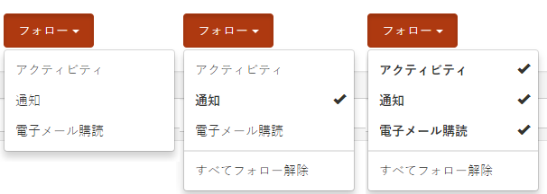
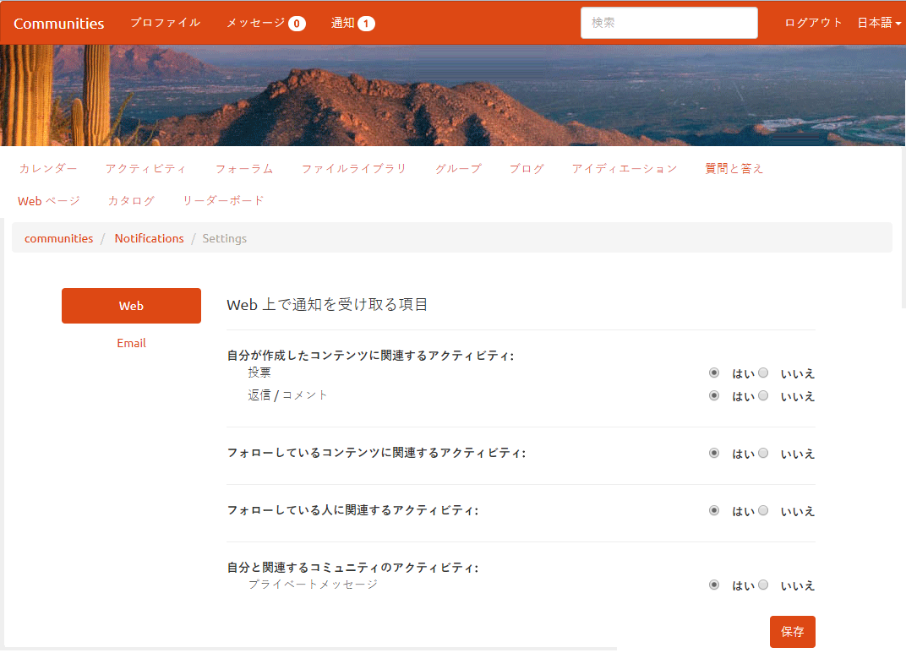
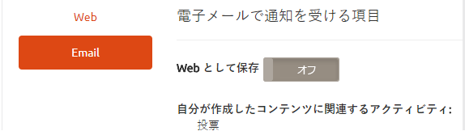
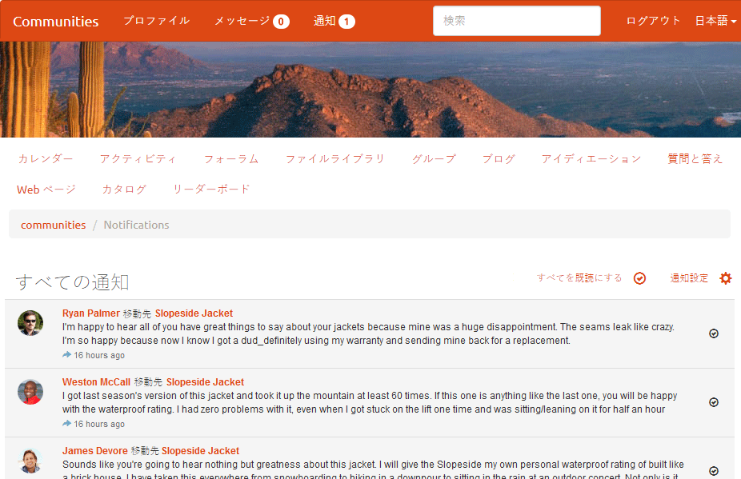
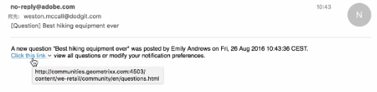

# コミュニティの通知 {#communities-notifications}

## 概要 {#overview}

AEM Communities には、サインインしているコミュニティメンバーにとって興味深いイベントを表示する通知セクションが用意されています。

通知は[アクティビティ](/help/communities/essentials-activities.md)や[購読](/help/communities/subscriptions.md)と同様に、以下に基づいて生成されます。：

* コンテンツを投稿するメンバー。
* メンバーが別のメンバーに従うことを選択した。
* 特定のトピック、記事、その他のコンテンツのスレッドに従うことを選択したメンバー。
* ユーザーが生成したコンテンツ内の別のコミュニティメンバーにタグ付け(@mention)するメンバー。

通知とアクティビティおよび購読の違いは次のとおりです。

* 通知セクションへのリンクは、コミュニティサイトのヘッダーに常に表示されます。

   * アクティビティは、[アクティビティストリーム関数](/help/communities/functions.md#activity-stream-function)をコミュニティサイトの構造に含める必要があります。
   * 購読には電子メール](/help/communities/email.md)の[設定が必要です。

* 通知の実装は、拡張性とプラグ可能なチャネルを通じて行われます。

   * アクティビティはWeb上でのみ使用できます。
   * 購読は電子メールでのみ使用できます。

Communities [FP1](/help/communities/deploy-communities.md#latestfeaturepack)の時点で、使用可能な通知チャネルは次のとおりです。

* `Notifications`リンクを使用してアクセスしたWebチャネルー。
* 電子メールが正しく設定されている場合に使用できる電子メールチャネル。

今後のチャネルとしてモバイルおよびデスクトップがあります。

### 要件 {#requirements}

**電子メールの設定**

通知の電子メールチャネルを機能させるには、電子メールを設定する必要があります。

電子メールを設定する手順については、[電子メールの設定](/help/communities/analytics.md)を参照してください。

**フォローの有効化**

フォローを有効にするようにコンポーネントを設定する必要があります。次の機能を使用できるのは、[blog](/help/communities/blog-feature.md)、[フォーラム](/help/communities/forum.md)、[QnA](/help/communities/working-with-qna.md)、[カレンダー](/help/communities/calendar.md)、[ファイルライブラリ](/help/communities/file-library.md)、[コメント](/help/communities/comments.md)です。

**注意**：

* コミュニティ[サイトテンプレート](/help/communities/sites.md)および[グループテンプレート](/help/communities/tools-groups.md)内で使用されるコンポーネントは、既に従うように設定されている場合があります。

* メンバプロファイルは、他のメンバが従うように既に構成されています。

## フォローによる通知 {#notifications-from-following}



「**[!UICONTROL フォロー]**」ボタンを使用すると、エントリをアクティビティや購読、通知としてフォローできます。「**[!UICONTROL フォロー]**」ボタンを選択するたびに、選択のオン/オフを切り替えることができます。 `Email Subscriptions`選択は、設定時にのみ存在します。

フォロー方法が選択されると、ボタンのテキストが「**[!UICONTROL フォロー中]**」に変わります。 便宜上、`Unfollow All`を選択して、すべてのメソッドをオフにすることができます。

「**[!UICONTROL フォロー]**」ボタンが表示されます。

* 別のメンバーのプロファイルを表示する場合。
* フォーラム、QnA、ブログなどのメイン機能ページ：

   * その一般的な機能のすべてのアクティビティに従います。

* フォーラムトピック、QnA質問、ブログ記事など、特定のエントリの場合：

   * 特定のエントリのすべてのアクティビティに従います。

## 通知設定の管理 {#managing-notification-settings}

通知ページから通知設定リンクを選択すると、各メンバーは通知の受信方法を管理することができます。

Web チャネルは常に有効になっています。



電子メールチャネルでは、Web チャネルの場合と同様の設定が用意されていますが、別途適切な[電子メールの設定](/help/communities/email.md)が必要です。

電子メールチャネルは、デフォルトでオフになっています。



これはメンバーがオンにすることもできますが、それでも電子メールの設定によって決まります。


## 通知の表示 {#viewing-notifications}

### Web 通知 {#web-notifications}

[ウィザードで作成されたコミュニティサイト](/help/communities/sites-console.md)に、バナーの上にあるサイトのヘッダーバーに`Notifications`機能へのリンクが含まれるようになりました。 メッセージとは異なり、通知はすべてのコミュニティサイトに対して作成されますが、メッセージはサイト作成プロセス中に有効にする必要があります。

公開済みサイトにアクセスする場合、`Notifications`リンクを選択すると、そのメンバーに関するすべての通知が表示されます。



### 電子メール通知 {#email-notifications}

電子メールチャネルを有効にすると、メンバーは、Web 上のコンテンツへのリンクが記載されている電子メールを受信します。



## 電子メール通知のカスタマイズ{#customize-email-notifications}

組織は、**/libs/settings/community/templates/email/html**&#x200B;にあるテンプレートを[オーバーレイ](/help/communities/client-customize.md#overlays)することで、電子メール通知をカスタマイズできます。

例えば、（コミュニティコンポーネントの）メンション電子メール通知を変更するには、**@mentions**&#x200B;サポートを有効にしたコンポーネントのテンプレートに、動詞&#x200B;**mention**&#x200B;のif **条件を追加します。**

ブログコメント内の@mentionの電子メール通知テンプレートを変更するには、次の場所にテンプレートを置いてください。**/libs/settings/community/templates/email/html/social.journal.components.hbs.comment/en**

```java
{{#equals this.verb "mention"}}\
    A new mention <a href="{{objectUrl}}">comment</a> {{#if this.target.properties.[jcr:title]}}to the article "{{{target.displayName}}}" {{/if}}was added by {{{user.name}}} on {{dateUtil this.published format="EEE, d MMM yyyy HH:mm:ss z"}}.\n \
{{/equals}}\
```

