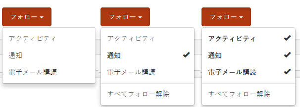
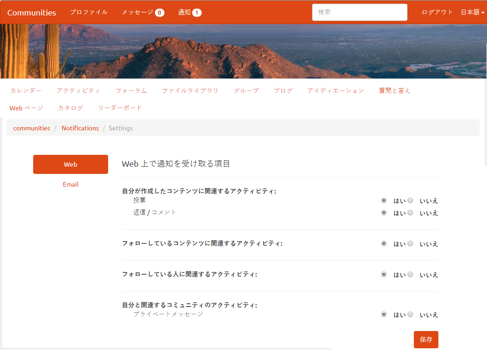
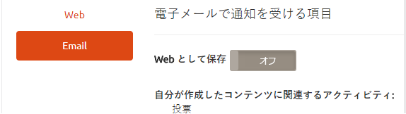
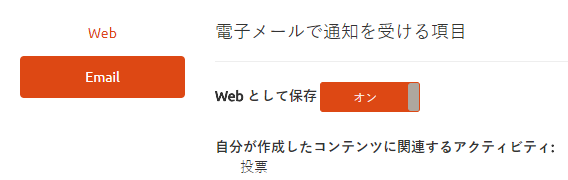
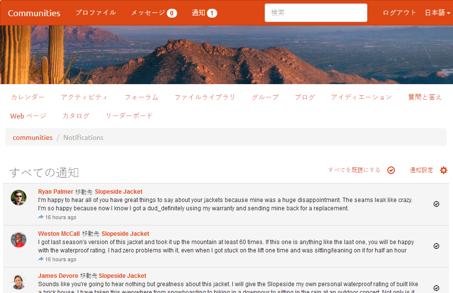
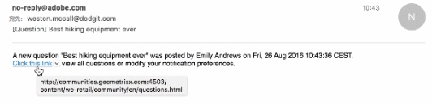

# コミュニティの通知 {#communities-notifications}

## 概要 {#overview}

AEM Communitiesには、サインインコミュニティメンバーに関心のあるイベントを表示する「通知」セクションが用意されています。

通知は、[ アクティビティ ](/help/communities/essentials-activities.md)および[ サブスクリプション ](/help/communities/subscriptions.md)と似ています。次の原因が考えられます。

* コンテンツを投稿するメンバー。
* 別のメンバーをフォローすることを選択したメンバー。
* 特定のトピック、記事、その他のコンテンツのスレッドに従うことを選択するメンバー。
* メンバのタグ付け（@mention）は、ユーザ生成コンテンツ内の他のコミュニティメンバーに対して行われる。

通知とアクティビティおよびサブスクリプションの違いは次のとおりです。

* 通知セクションへのリンクは、常にコミュニティサイトのヘッダーに表示されます。

   * アクティビティでは、[ アクティビティストリーム関数](/help/communities/functions.md#activity-stream-function)をコミュニティサイトの構造に含める必要があります。
   * サブスクリプションを購入するには、電子メール ](/help/communities/email.md)の[設定が必要です。

* 通知の実装は、拡張性と接続性に優れたチャネルを通じて行われます。

   * アクティビティはwebでのみ使用できます。
   * サブスクリプションは、メールでのみ利用できます。

コミュニティ [FP1](/help/communities/deploy-communities.md#latestfeaturepack)の時点で、使用可能な通知チャネルは次のとおりです。

* `Notifications` リンクを使用してアクセスされたWeb チャネル。
* 電子メールが適切に設定されている場合に使用できる電子メールチャネル。

将来のチャネルは、モバイルとデスクトップです。

### 要件 {#requirements}

**メールの設定**

通知を有効にするには、電子メールを設定する必要があります。

電子メールの設定方法については、[電子メールの設定](/help/communities/analytics.md)を参照してください。

**フォローを有効にする**

以下を有効にするには、コンポーネントを設定する必要があります。 次の機能を許可するのは、[ ブログ ](/help/communities/blog-feature.md)、[ フォーラム ](/help/communities/forum.md)、[QnA](/help/communities/working-with-qna.md)、[ カレンダー](/help/communities/calendar.md)、[ ファイルライブラリ ](/help/communities/file-library.md)、および[ コメント ](/help/communities/comments.md)です。

**メモ**：

* コミュニティ [ サイトテンプレート ](/help/communities/sites.md)および[ グループテンプレート ](/help/communities/tools-groups.md)内で使用されているコンポーネントは、既にフォローするように設定されている可能性があります。

* メンバープロファイルは、他のメンバーがフォローできるように既に設定されています。

## フォローからの通知 {#notifications-from-following}



「**[!UICONTROL フォロー]**」ボタンは、アクティビティ、サブスクリプション、通知などのエントリをフォローするための手段を提供します。 「**[!UICONTROL フォロー]**」ボタンを選択するたびに、選択範囲のオンとオフを切り替えることができます。 `Email Subscriptions`の選択は、設定時にのみ存在します。

次のいずれかの方法を選択すると、ボタンのテキストが&#x200B;**[!UICONTROL 次]**&#x200B;に変わります。 便宜上、`Unfollow All`を選択してすべてのメソッドをオフにすることができます。

「**[!UICONTROL フォロー]**」ボタンが表示されます。

* 他のメンバーのプロファイルを表示する場合。
* フォーラム、QnA、ブログなどの主要機能ページで、次の操作を行います。

   * その一般的な機能のすべてのアクティビティに従います。

* フォーラムのトピック、QnAの質問、ブログ記事など、特定のエントリの場合：

   * その特定のエントリのすべてのアクティビティに従います。

## 通知設定の管理 {#managing-notification-settings}

通知ページから「通知設定」リンクを選択すると、各メンバーが通知の受信方法を管理できます。

Web チャネルは常に有効です。



電子メール ](/help/communities/email.md)の適切な[設定に依存する電子メールチャネルは、web チャネルと同じ設定を提供します。

メールチャネルはデフォルトでオフになっています。



メンバーがオンにすることはできますが、設定するメールによって異なります。



## 通知の表示 {#viewing-notifications}

### Web通知 {#web-notifications}

[ ウィザードが作成したコミュニティサイト ](/help/communities/sites-console.md)には、バナーの上にあるサイトのヘッダーバーに`Notifications`機能へのリンクが含まれるようになりました。 メッセージとは異なり、通知はコミュニティサイトごとに作成されますが、メッセージはサイト作成プロセスで有効にする必要があります。

公開されたサイトにアクセスすると、`Notifications` リンクを選択すると、メンバーのすべての通知が表示されます。



### メール通知 {#email-notifications}

メールチャネルが有効になっている場合、メンバーはweb上のコンテンツへのリンクを含むメールを受信します。



## メール通知のカスタマイズ {#customize-email-notifications}

組織は、**/libs/settings/community/templates/email/html**&#x200B;のテンプレートを[ オーバーレイ ](/help/communities/client-customize.md#overlays)することで、メール通知をカスタマイズできます。

例えば、（コミュニティコンポーネントの）メンションメール通知を変更するには、**@mentions** サポートを有効にしたコンポーネントのテンプレートに、動詞&#x200B;**メンション**&#x200B;の&#x200B;**if**&#x200B;条件を追加します。

ブログコメントの@mentionのメール通知テンプレートを変更するには、標準テンプレートの&#x200B;**/libs/settings/community/templates/email/html/social.journal.components.hbs.comment/en**&#x200B;に配置します。

```java
{{#equals this.verb "mention"}}\
    A new mention <a href="{{objectUrl}}">comment</a> {{#if this.target.properties.[jcr:title]}}to the article "{{{target.displayName}}}" {{/if}}was added by {{{user.name}}} on {{dateUtil this.published format="EEE, d MMM yyyy HH:mm:ss z"}}.\n \
{{/equals}}\
```
