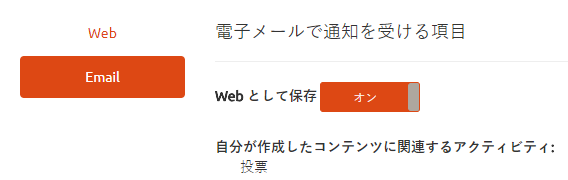

# コミュニティの通知 {#communities-notifications}

## 概要 {#overview}

AEM Communities には、サインインしているコミュニティメンバーにとって興味深いイベントを表示する通知セクションが用意されています。

通知は[アクティビティ](/help/communities/essentials-activities.md)や[購読](/help/communities/subscriptions.md)と同様に、以下に基づいて生成されます。：

* コンテンツを投稿するメンバー。
* 別のメンバーに従うことを選択したメンバー。
* 特定のトピック、記事、およびコンテンツの他のスレッドをフォローすることを選択したメンバー。
* メンバーが、ユーザー生成コンテンツ内の別のコミュニティメンバーにタグ付け(@mention)します。

通知とアクティビティおよび購読は、次の点で異なります。

* 通知セクションへのリンクは、コミュニティサイトのヘッダーに常に存在します。

   * アクティビティでは、コミュニティサイトの構造に[アクティビティストリーム関数](/help/communities/functions.md#activity-stream-function)を含める必要があります。
   * サブスクリプションには、電子メール](/help/communities/email.md)の設定が必要です。[

* 通知の実装は、拡張性とプラグ可能なチャネルを通じておこないます。

   * アクティビティはWebでのみ使用できます。
   * 購読はEメールを使用した場合にのみ利用できます。

コミュニティ[FP1](/help/communities/deploy-communities.md#latestfeaturepack)の時点で、使用可能な通知チャネルは次のとおりです。

* `Notifications`リンクを使用してアクセスするWebチャネル。
* Eメールチャネル。Eメールが正しく設定されている場合に使用できます。

今後のチャネルとしてモバイルおよびデスクトップがあります。

### 要件 {#requirements}

**電子メールの設定**

通知の電子メールチャネルを機能させるには、電子メールを設定する必要があります。

電子メールを設定する手順については、[電子メールの設定](/help/communities/analytics.md)を参照してください。

**フォローの有効化**

フォローを有効にするようにコンポーネントを設定する必要があります。以下を可能にする機能には、[blog](/help/communities/blog-feature.md)、[forum](/help/communities/forum.md)、[Q&amp;A](/help/communities/working-with-qna.md)、[calendar](/help/communities/calendar.md)、[filelibrary](/help/communities/file-library.md)、[comments](/help/communities/comments.md)があります。

**注意**：

* コミュニティ[サイトテンプレート](/help/communities/sites.md)および[グループテンプレート](/help/communities/tools-groups.md)内で使用されるコンポーネントは、既に従うように設定されている場合があります。

* メンバープロファイルは、他のメンバーがフォローできるように既に設定されています。

## フォローによる通知 {#notifications-from-following}


「**[!UICONTROL フォロー]**」ボタンを使用すると、エントリをアクティビティや購読、通知としてフォローできます。「**[!UICONTROL フォロー]**」ボタンを選択するたびに、選択のオン/オフを切り替えることができます。 `Email Subscriptions`は、設定時にのみ表示されます。

フォロー方法が選択されると、ボタンのテキストが「**[!UICONTROL フォロー中]**」に変わります。 便宜上、`Unfollow All`を選択してすべてのメソッドをオフに切り替えることができます。

「**[!UICONTROL フォロー]**」ボタンが表示されます。

* 別のメンバーのプロファイルを表示する場合。
* フォーラム、Q&amp;A、ブログなどのメイン機能ページでは、次の操作をおこないます。

   * その一般的な機能のすべてのアクティビティに従います。

* フォーラムトピック、Q&amp;A質問、ブログ記事などの特定のエントリの場合：

   * その特定のエントリのすべてのアクティビティに従います。

## 通知設定の管理 {#managing-notification-settings}

通知ページから通知設定リンクを選択すると、各メンバーは通知の受信方法を管理することができます。

Web チャネルは常に有効になっています。


電子メールチャネルでは、Web チャネルの場合と同様の設定が用意されていますが、別途適切な[電子メールの設定](/help/communities/email.md)が必要です。

電子メールチャネルは、デフォルトでオフになっています。


これはメンバーがオンにすることもできますが、それでも電子メールの設定によって決まります。



## 通知の表示 {#viewing-notifications}

### Web 通知 {#web-notifications}

[ウィザードで作成されたコミュニティサイト](/help/communities/sites-console.md)に、バナーの上にあるサイトのヘッダーバーに`Notifications`機能へのリンクが含まれるようになりました。 メッセージとは異なり、通知はコミュニティサイトごとに作成され、メッセージはサイト作成プロセス中に有効にする必要があります。

公開済みサイトにアクセスする際に、`Notifications`リンクを選択すると、そのメンバーに関するすべての通知が表示されます。


### 電子メール通知 {#email-notifications}

電子メールチャネルを有効にすると、メンバーは、Web 上のコンテンツへのリンクが記載されている電子メールを受信します。


## 電子メール通知のカスタマイズ{#customize-email-notifications}

組織は、**/libs/settings/community/templates/email/html**&#x200B;にあるテンプレートを[オーバーレイ](/help/communities/client-customize.md#overlays)することで、電子メール通知をカスタマイズできます。

例えば、（コミュニティコンポーネントの）メンション電子メール通知を変更するには、**@mentions**&#x200B;サポートを有効にしたコンポーネントのテンプレートに、動詞&#x200B;**mention**&#x200B;の&#x200B;**if**&#x200B;条件を追加します。

ブログコメント内の@mentionの電子メール通知テンプレートを変更するには、次の場所に標準テンプレートを配置します。**/libs/settings/community/templates/email/html/social.journal.components.hbs.comment/en**

```java
{{#equals this.verb "mention"}}\
    A new mention <a href="{{objectUrl}}">comment</a> {{#if this.target.properties.[jcr:title]}}to the article "{{{target.displayName}}}" {{/if}}was added by {{{user.name}}} on {{dateUtil this.published format="EEE, d MMM yyyy HH:mm:ss z"}}.\n \
{{/equals}}\
```
