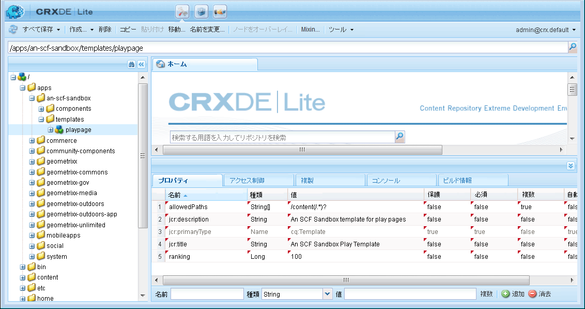
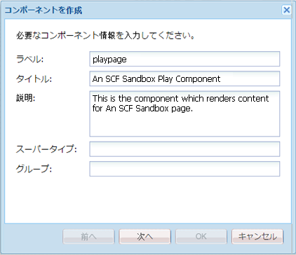

# 外観の変更 {#alter-the-appearance}

## スクリプトの変更 {#modify-the-script}

comment.hbsスクリプトは、各コメントの全体的なHTMLを作成します。

投稿された各コメントの横のアバターを表示しないようにするには：

1. コピー `comment.hbs`元 `libs`: `apps`

   1.  `/libs/social/commons/components/hbs/comments/comment/comment.hbs`
   1. Select **[!UICONTROL Copy]**
   1.  `/apps/social/commons/components/hbs/comments/comment`
   1. Select **[!UICONTROL Paste]**

1. Open the overlaid `comment.hbs`

   * ノードを重複クリック `comment.hbs` する `/apps/social/commons/components/hbs/comments/comment folder`

1. 次の行を探し、削除するかコメントアウトします。

```xml
  <aside class="scf-comment-author">
        </img>
```

Either delete the lines, or surround them with `<!--` and `-->` to comment them out. また、アバターの位置を視覚的に示すインジケーターとして「xxx」という文字が追加されています。

```xml
   xxx
   <!-- do not display avatar with comment
    <aside class="scf-comment-author">
        </img>
```

### オーバーレイのレプリケート {#replicate-the-overlay}

レプリケーションツールを使用して、オーバーレイされたコメントコンポーネントをパブリッシュインスタンスにプッシュします。

>[!NOTE]
>
>より強固なレプリケーション形式は、パッケージマネージャーでパッケージを作成し、それを[アクティベート](/help/sites-administering/package-manager.md#replicating-packages)することです。パッケージは、書き出しおよびアーカイブできます。

From the global navigation, select **[!UICONTROL Tools]** > **[!UICONTROL Deployment]** > **[!UICONTROL Replication]** and click **[!UICONTROL Activate Tree]**.

For the Start Path enter `/apps/social/commons` and select **[!UICONTROL Activate]**.



### 結果の表示 {#view-results}

パブリッシュインスタンスに管理者としてログインする(例：https://localhost:4503/crx/de as admin/admin)と、オーバーレイされたコンポーネントが存在することを確認できます。

ログアウトして `aaron.mcdonald@mailinator.com/password` として再ログインし、ページを更新した場合は、投稿されたコメントはアバターと一緒には表示されなくなっており、代わりに単純な「xxx」が表示されることがわかります。



