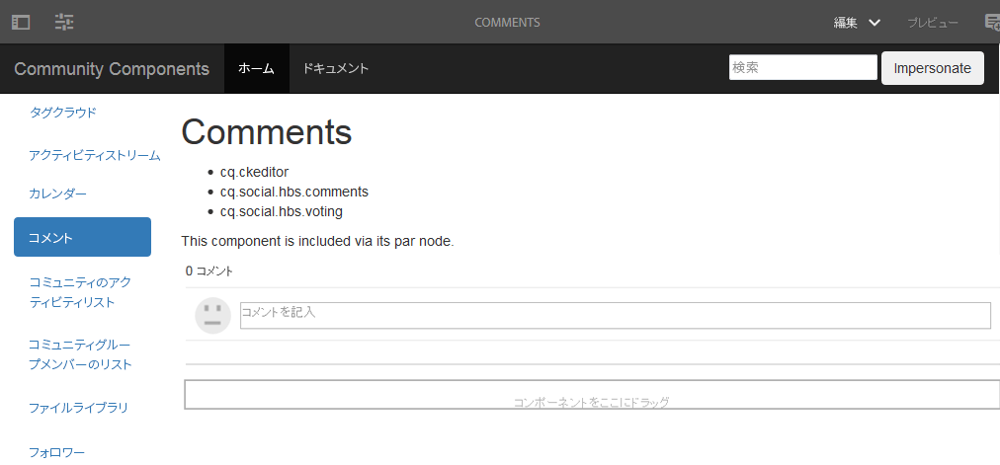

# コメントページの作成 {#create-comments-page}

**[⇐コメントをオーバーレイコンポーネントノードを](overlay-comments.md)[作成する>](overlay-create-nodes.md)**

## コメントページ {#comments-page}

The [Community Components guide](components-guide.md) provides the ability to easily experience overlaying the comments component.

オーサーインスタンスでページを表示します。

* [http://localhost:4502/editor.html/content/community-components/en/comments.html](http://localhost:4502/editor.html/content/community-components/en/comments.html)

**[⇐コメントをオーバーレイコンポーネントノードを](overlay-comments.md)[作成する>](overlay-create-nodes.md)**