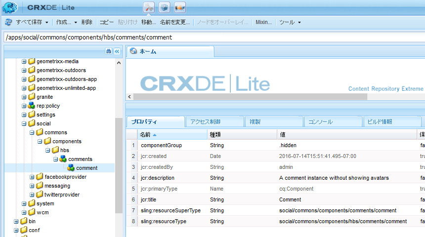

# ノードの作成 {#create-nodes}

Overlay the comment system with a custom version by copying the minimal number of files necessary from `/libs` into `/apps` and modifying them in `/apps`.

>[!CAUTION]
>
>再インストールやアップグレードをおこなうと、/libs フォルダーは削除されたり、置換されたりすることがありますが、/apps フォルダーの内容が変更されることはないので、/libs フォルダーの内容を編集することはありません。

Using [CRXDE Lite](../../help/sites-developing/developing-with-crxde-lite.md) on an author instance, begin by creating a path in the /apps folder which is identical to the path to the overlaid components in the /libs folder.

複製するパスは次のとおりです。

* `/libs/social/commons/components/hbs/comments/comment`

パス内の一部のノードはフォルダーで、一部はコンポーネントです。

1. Browse to [http://localhost:4502/crx/de/index.jsp](http://localhost:4502/crx/de/index.jsp)
1. Create `/apps/social` (if it does not already exist)
   * ノードを選択 `/apps`
   * **[!UICONTROL 作成／フォルダー...]** を選択します。
      * 名前を入力: `social`
1. ノードを選択 `social`
   * **[!UICONTROL 作成]** / **[!UICONTROL フォルダ…]**
      * 名前を入力: `commons`
1. ノードを選択 `commons`
   * **[!UICONTROL 作成／フォルダー...]** を選択します。
      * 名前を入力: `components`
1. ノードを選択 `components`
   * **[!UICONTROL 作成／フォルダー...]** を選択します。
      * 名前を入力: `hbs`
1. ノードを選択 `hbs`
   * **[!UICONTROL 作成]** /コンポーネント **[!UICONTROL を作成…]**
      * ラベルを入力： `comments`
      * Enter Title: `Comments`
      * Enter Description: `List of comments without showing avatars`
      * スーパータイプ： `social/commons/components/comments`
      * グループの入力： `Communities`
      * Click **[!UICONTROL Next]** until **[!UICONTROL OK]**
1. ノードを選択 `comments`

   * **[!UICONTROL 作成]** /コンポーネント **[!UICONTROL を作成…]**

      * ラベルを入力： `comment`
      * Enter Title: `Comment`
      * Enter Description: `A comment instance without avatars`
      * スーパータイプ： `social/commons/components/comments/comment`
      * グループの入力： `.hidden`
      * Click **[!UICONTROL Next]** until **[!UICONTROL OK]**
   * 「**[!UICONTROL すべて保存]**」を選択します。
1. Delete the default `comments.jsp`
   * ノードを選択 `/apps/social/commons/components/hbs/comments/comments.jsp`
   * Select **[!UICONTROL Delete]**
1. デフォルトのcomment.jspの削除
   * ノードを選択 `/apps/social/commons/components/hbs/comments/comment/comment.jsp`
   * Select **[!UICONTROL Delete]**
   * 「**[!UICONTROL すべて保存]**」を選択します。

>[!NOTE]
>
>In order to preserve the inheritance chain, the `Super Type` (property `sling:resourceSuperType`) of the overlay components are set to the same value as the `Super Type` of the components being overlaid, in this case:
>
>* `social/commons/components/comments`
>* `social/commons/components/comments/comment`

The overlay&#39;s own `Type`(property `sling:resourceType`) must be a relative self-reference so that any content not found in /apps is then looked for in /libs.
* 名前：`sling:resourceType`
* 型：`String`
* 値：`social/commons/components/hbs/comments`

1. Select the green `[+] Add`
   * 名前：`sling:resourceType`
   * 型：`String`
   * 値：`social/commons/components/hbs/comments/comment`
1. Select the green `[+] Add`
   * 「**[!UICONTROL すべて保存]**」を選択します。

