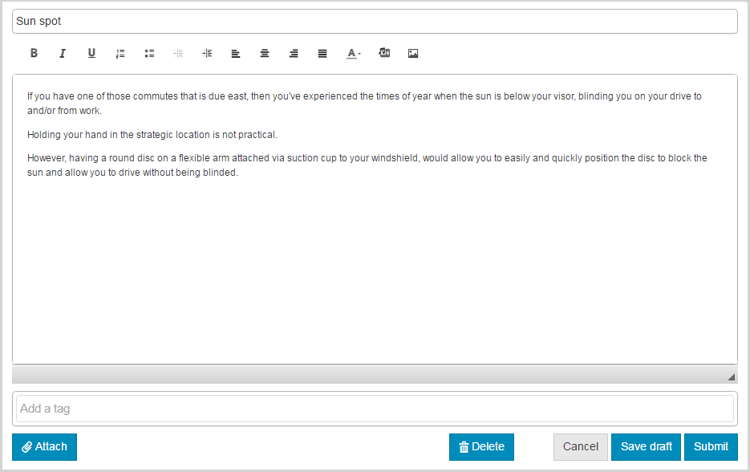
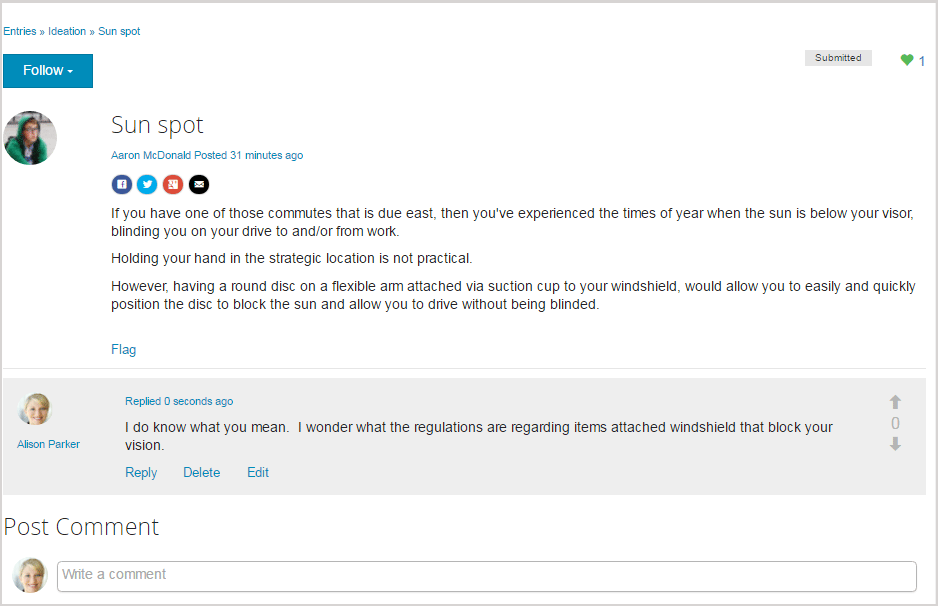

# 公開したサイトを使ってみる {#experience-the-published-site}

## パブリッシュサーバー上の新しいサイトの参照 {#browse-to-new-site-on-publish}

新しく作成したコミュニティサイトが公開されたので、次はこのサイト作成時に表示された URL を参照します。ただし、このとき参照するのはパブリッシュサーバー上の URL です。次に例を示します。

* 作成者URL = https://localhost:4502/content/sites/engage/en.html
* 発行URL = https://localhost:4503/content/sites/engage/en.html

どのメンバーがオーサーインスタンスにサインインし、どのメンバーがパブリッシュインスタンスにサインインしているかを混乱なく把握するために、インスタンスごとに異なるブラウザーを使用することを推奨します。

公開済みサイトに初めてアクセスするときは、通常、そのサイト訪問者はまだサインインしておらず、匿名です。

`https://localhost:4503/content/sites/engage/en.html {#http-localhost-content-sites-engage-en-html}`

## 匿名のサイト訪問者 {#anonymous-site-visitor}

匿名サイト訪問者のUIには、次の情報が表示されます。

* サイトのタイトル（はじめにのチュートリアル）
* プロファイルリンク
* メッセージのリンクなし
* 通知リンクなし
* 検索フィールド
* ログインリンク
* ブランドバナー
* リファレンスサイトテンプレートに含まれるコンポーネントのメニューリンク。

様々なリンクを選択すると、読み取り専用モードになります。

### JCRでの匿名アクセスの禁止 {#prevent-anonymous-access-on-jcr}

既知の制限により、コミュニティサイトのコンテンツはjcrコンテンツとjsonを通じて匿名訪問者に表示されますが、 **匿名アクセスを許可** （サイトのコンテンツに対しては無効）。 ただし、この動作はSlingの制限を回避策として使用して制御できます。

コミュニティサイトのコンテンツを、jcrコンテンツとjsonを通じて匿名ユーザーによるアクセスから保護するには、次の手順に従います。

1. AEM作成者インスタンスで、https:// hostname:port/editor.html/content/site/sitename.htmlに移動します。

   >[!NOTE]
   >
   >ローカライズされたサイトには移動しないでください。

1. 「ページのプロ **パティ」に移動**。

   

1. 「**詳細**」タブに移動します。

   

1. Enable **Authentication Requirement**.
1. 追加ログインページのパス。 For example, **/content/......./GetStarted**.
1. ページを公開します。

## 信頼されているコミュニティメンバー {#trusted-community-member}

This experience assumes [Aaron McDonald](/help/communities/tutorials.md#demo-users) was assigned the roles of [community manager and moderator](/help/communities/create-site.md#roles). If not, return to the author environment to [modify the site settings](/help/communities/sites-console.md#modifying-site-properties) and select Aaron McDonald as both community manager and moderator.

In the upper right corner, select `Log in`, and sign with username (aaron.mcdonald@mailinator.com) and password (password). TwitterまたはFacebookの資格情報を使用してサインインする機能に注目してください。

登録コミュニティのメンバーとしてサインインすると、次のメニュー項目が表示され、コミュニティサイトをクリックして参照できます。

* **プロファイル** ・オプションを使用すると、表示と編集が可能になります。
* [「メッセージ](/help/communities/configure-messaging.md) 」オプションを選択すると、ダイレクトメッセージのセクションに移動し、次の操作を行うことができます。

   1. 表示受信したダイレクトメッセージ（[受信トレイ]）、送信済み（[送信済みアイテム]）、削除済み（[ごみ箱]）。
   1. 個人やグループに送信する新しいダイレクトメッセージを作成します。

* [「通知](/help/communities/notifications.md) 」オプションを選択すると、通知セクションに移動し、関心のあるイベントの表示や通知設定の編集を行うことができます。
* [モデレート権限を持つ場合は、「管理」をクリックすると](/help/communities/published-site.md#moderationlink) 、AEM Communitiesのモデレートページに移動します。

カレンダーページがホームページになっていますが、これは、選択した参照サイトテンプレートの最初に含まれているのがカレンダー機能で、その後にアクティビティストリーム機能、フォーラム機能などが続いているからです。This structure is visible from the [Site Template](/help/communities/sites.md#edit-site-template) console or when modifying site properties in the author environment:

>[!NOTE]
>
>コミュニティのコンポーネントと機能の詳細については、次を参照してください。
>
>* [コミュニティコンポーネント](/help/communities/author-communities.md)（作成者向け）
>* [コンポーネントおよび機能の基本事項](/help/communities/essentials.md)（開発者向け）
>

### フォーラムリンク {#forum-link}

フォーラムリンクを選択すると、基本的なフォーラム機能が表示されます。

メンバーは、新しいトピックを投稿したり、トピックをフォローしたりできます。

サイト訪問者は、様々な方法で投稿を表示したり、並べ替えたりできます。

### グループリンク {#groups-link}

Aaron はグループ管理者なので、グループリンクを選択すると、新しいグループを作成するための画面が表示されます。ここで、グループテンプレートや画像を選択したり、グループをオープンにするかシークレットにするかを設定したり、メンバーを招待したりできます。

パブリッシュ環境でグループを作成する例を次に示します。

Groups may also be created in the author environment and managed within the community site in the author environment ([Community Groups console](/help/communities/groups.md)). The experience of [creating groups on author](/help/communities/nested-groups.md) is next in this tutorial.

参照グループの作成：

1. Select **New Group**
1. **「設定」タブ**

   * Group Name : `Sports`
   * 説明 : `A parent group for various sporting groups`.
   * グループ URL 名 : `sports`
   * Select `Open Group` (allow any community member to participate by joining)

1. **「テンプレート」タブ**

   * Select `Reference Group` (contains a groups function in its structure to allow nested groups)

1. Select **Create Group**

新しいグループが作成されたら、その中に（ネストされる）2 つのグループを作成するために&#x200B;**新しい Sports グループを選択**&#x200B;します。サイト構造はグループ機能では始まらないので、スポーツグループを開いた後に、「グループ」リンクを選択する必要があります。

The second set of links, beginning with `Blog`, belong to the currently selected group, the `Sports` group. By selecting the Sports&#39; `Groups` link, it is possible to nest two groups within the Sports group.

例として、2つ追加します `new groups`。

* One named `Baseball`

   * Leave it set as an `Open Group` (required membership).
   * 「テンプレート」タブで、を選択しま `Conversational Group`す。

* One named `Gymnastics`

   * 設定を(制限付きメン `Member Only Group` バーシップ)に変更します。
   * 「テンプレート」タブで、を選択しま `Conversational Group`す。

**注意**：

* 両方のグループを表示する前に、ページの更新が必要な場合があります。
* This template does *not* include the groups function, so no further nesting of groups will be possible.
* On author, the [Groups console](/help/communities/groups.md) provides a third choice - a `Public Group` (optional membership).

両方のグループが作成されたら、Baseball グループ（オープングループ）を選択し、そのリンクに注目します。

`Discussions` `What's New` `Members`

このグループのリンクは、メインサイトのリンクの下に表示され、結果として、次のように表示されます。

On author - with administrative privileges, navigate to the [Communities Groups console](/help/communities/members.md) and add Weston McCall to the `Community Engage Gymnastics <uid> Members` group.

引き続きパブリッシュ環境で、Aaron McDonald としてログアウトし、次のように匿名のサイト訪問者として Sports グループ内のグループを表示します。

* 開始ホームページ
* Select `Groups` link
* Select `Sports` link
* Select the Sports&#39; `Groups` link

Baseball グループのみが表示されます。

Weston McCall（weston.mccall@dodgit.com／password）としてログインし、同じ場所に移動します。Westonは、オープングループとプライベ `Join` ートグループ `Baseball` のどちらかを使用で `enter or Leave` きることに注意して `Gymnastics` ください。

### Web ページリンク {#web-page-link}

Web ページリンクを選択すると、サイトに含まれる基本的な Web ページが表示されます。標準のAEMオーサリングツールを使用して、作成者環境のこのページにコンテンツを追加できます。

For example, go to **author** instance, open the `engage` folder in the [Communities Sites console](/help/communities/sites-console.md), select the **Open Site** icon to enter author edit mode. Then select preview mode to select the `Web Page` link, then select edit mode to add Title and Text components. 最後に、ページのみまたはサイト全体を再公開します。

### モデレートリンク {#moderationlink}

When the community member has moderation privileges, then the Moderation link will be visible and selecting it will display the community content posted and allow it to be [moderated](/help/communities/moderate-ugc.md) in a manner similar to the [moderation console](/help/communities/moderation.md) in the author environment.

ブラウザーの戻るボタンを使用して、公開したサイトに戻ります。Most consoles are not accessible from global navigation in the publish environment. 

## 自己登録 {#self-registration}

ログアウトした後に、新しいユーザー登録を作成できます。

*  `Log In`
*  `Sign up for a new account`

 

デフォルトでは、電子メールアドレスがログイン ID になります。このチェックボックスをオフにすると、訪問者は独自のログインID（ユーザー名）を入力できます。 ユーザー名は、公開ユーザーで一意である必要があります。環境

After specifying the user&#39;s name, email, and password, selecting `Sign Up` will create the user and enable them to sign.

Once signed in, the first page presented is their `Profile` page, which they can personalize.

メンバーが自分のログイン ID を忘れた場合は、電子メールアドレスを使用して回復することができます。

