# 公開したサイトを使ってみる {#experience-the-published-site}

## 公開時に新しいサイトを参照 {#browse-to-new-site-on-publish}

新しく作成されたコミュニティサイトが公開されたので、サイトの作成時に表示されるURLを参照しますが、公開サーバーで次のように表示されます。

* オーサーURL = https://localhost:4502/content/sites/engage/en.html
* 公開URL = https://localhost:4503/content/sites/engage/en.html

オーサーとパブリッシュでログインしているメンバーに関する混乱を最小限に抑えるには、各インスタンスに対して異なるブラウザーを使用することをお勧めします。

公開されたサイトに最初にアクセスした場合、サイト訪問者は通常、既にサインインしておらず、匿名です。

`https://localhost:4503/content/sites/engage/en.html {#http-localhost-content-sites-engage-en-html}`

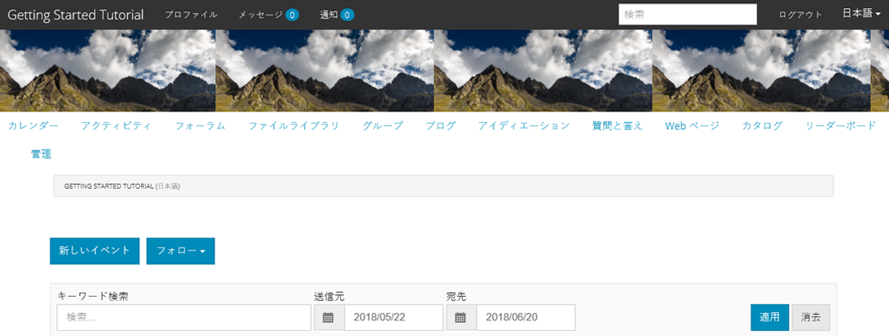

## 匿名サイト訪問者 {#anonymous-site-visitor}

匿名のサイト訪問者は、UIに次の情報を表示します。

* サイトのタイトル（入門チュートリアル）
* プロファイルリンクなし
* メッセージリンクがありません
* 通知リンクがありません
* 検索フィールド
* ログインリンク
* ブランドバナー
* 参照サイトテンプレートに含まれるコンポーネントのメニューリンク。

様々なリンクを選択すると、読み取り専用モードになっていることがわかります。

### JCRでの匿名アクセスの禁止 {#prevent-anonymous-access-on-jcr}

既知の制限により、jcr コンテンツとjsonを通じてコミュニティサイトのコンテンツが匿名の訪問者に公開されますが、**匿名アクセスを許可**&#x200B;はサイトのコンテンツに対して無効になっています。 ただし、この動作は、回避策としてSling制限を使用して制御できます。

jcr コンテンツとjsonを通じて匿名ユーザーによるアクセスからコミュニティサイトのコンテンツを保護するには、次の手順に従います。

1. AEM オーサーインスタンスで、https:// hostname:port/editor.html/content/site/sitename.htmlに移動します。

   >[!NOTE]
   >
   >ローカライズされたサイトには移動しないでください。

1. **ページプロパティ**&#x200B;に移動します。

   

1. 「**詳細**」タブに移動します。

1. **認証要件**&#x200B;を有効にします。

   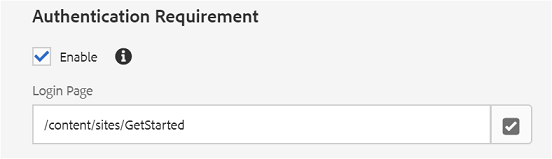

1. ログインページのパスを追加します。 例：**/content/......./GetStarted**
1. ページを公開します。

## 信頼できるコミュニティメンバー {#trusted-community-member}

このエクスペリエンスでは、[Aaron McDonald](/help/communities/tutorials.md#demo-users)が[&#x200B; コミュニティマネージャーおよびモデレーター](/help/communities/create-site.md#roles)の役割を割り当てられていることを前提としています。 そうでない場合は、オーサー環境に戻って[&#x200B; サイト設定を変更](/help/communities/sites-console.md#modifying-site-properties)し、コミュニティマネージャーとモデレーターの両方としてAaron McDonaldを選択します。

右上隅の「`Log in`」を選択し、ユーザー名（aaron.mcdonald@mailinator.com）とパスワード（パスワード）で署名します。 TwitterまたはFacebookの資格情報でログインする機能に注意してください。

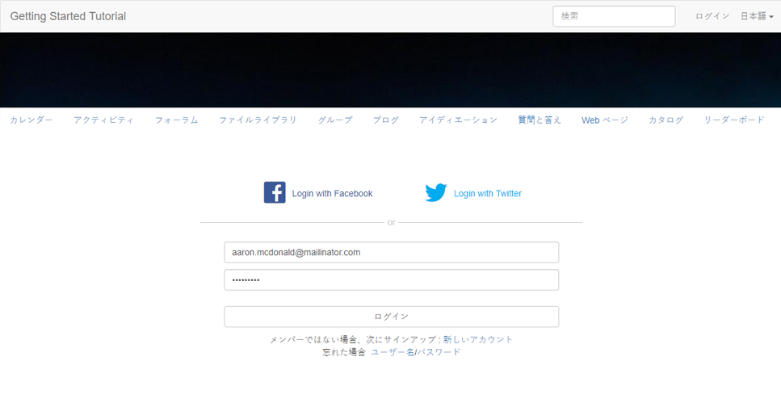

登録したコミュニティメンバーとしてログインしたら、次のメニュー項目に注意して、コミュニティサイトをクリックして検索します。

* **プロファイル** オプションを使用すると、プロファイルを表示および編集できます。
* [&#x200B; メッセージ &#x200B;](/help/communities/configure-messaging.md) オプションを使用すると、ダイレクトメッセージングセクションに移動します。このセクションでは、次の操作を実行できます。

   1. 受信（受信トレイ）、送信（送信済みアイテム）、削除（ゴミ箱）したダイレクトメッセージを表示します。
   1. 新しいダイレクトメッセージを作成して、個人やグループに送信できます。

* [通知](/help/communities/notifications.md) オプションを選択すると、通知セクションに移動します。このセクションでは、関心のあるイベントを表示したり、通知設定を編集したりできます。
* 管理権限がある場合、[管理](/help/communities/published-site.md#moderationlink)からAEM Communities モデレーションページに移動します。

選択した参照サイトテンプレートには、まずカレンダー機能が含まれ、次にアクティビティストリーム機能、フォーラム機能などが含まれているため、カレンダーページがホームページであることに注意してください。 この構造は、[&#x200B; サイトテンプレート &#x200B;](/help/communities/sites.md#edit-site-template) コンソールから、またはオーサー環境でサイトプロパティを変更する場合に表示されます。

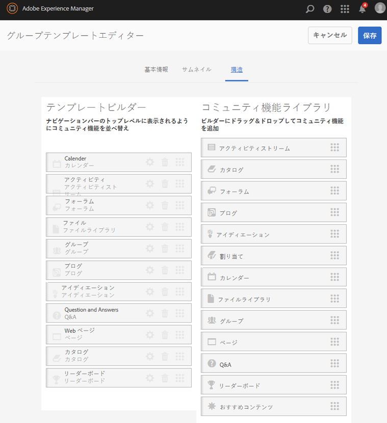

>[!NOTE]
>
>コミュニティのコンポーネントと機能について詳しくは、次のサイトを参照してください。
>
>* [&#x200B; コミュニティコンポーネント &#x200B;](/help/communities/author-communities.md) （作成者向け）
>* [&#x200B; コンポーネント、関数、および機能の基本](/help/communities/essentials.md) （開発者向け）

### フォーラムリンク {#forum-link}

「フォーラム」リンクを選択して、基本的なフォーラム機能を表示します。

会員は、新しいトピックを投稿したり、トピックに従ったりすることができます。

サイト訪問者は、投稿を表示したり、様々な方法で並べ替えたりできます。

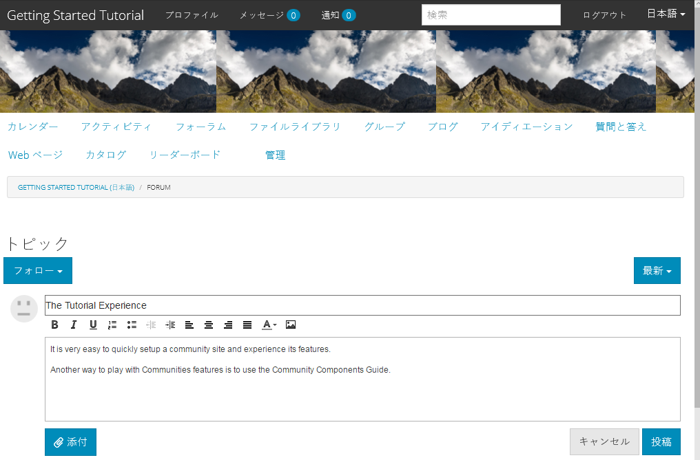

### グループリンク {#groups-link}

Aaronはグループ管理者なので、「グループ」リンクを選択すると、グループのテンプレート、画像、グループがオープンかシークレットか、メンバーを招待してコミュニティグループを作成できます。

これは、パブリッシュ環境でグループを作成する例です。

グループはオーサー環境で作成し、オーサー環境（[&#x200B; コミュニティグループコンソール &#x200B;](/help/communities/groups.md)）のコミュニティサイト内で管理することもできます。 オーサー[&#128279;](/help/communities/nested-groups.md)で グループを作成する方法については、次のチュートリアルで説明します。

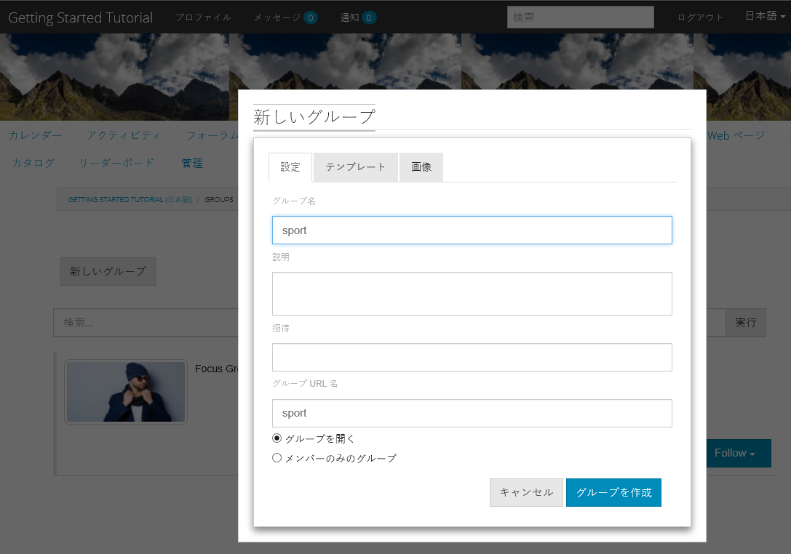

参照グループを作成します。

1. **新しいグループ**&#x200B;を選択
1. **設定タブ**

   * グループ名：`Sports`
   * 説明：`A parent group for various sporting groups`。
   * グループ URL名：`sports`
   * `Open Group`を選択します（参加してコミュニティ メンバーの参加を許可します）

1. **テンプレートのタブ**

   * `Reference Group`を選択します（ネストされたグループを許可するグループ関数が構造内に含まれています）

1. 「**グループを作成**」を選択

   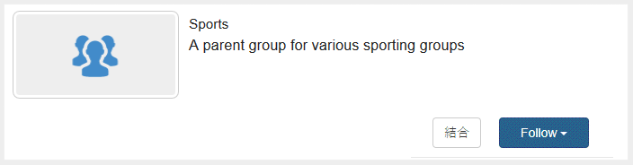

新しいグループを作成したら、**新しいスポーツグループ**&#x200B;を選択して、その中に2つのグループ（ネスト）を作成します。 サイト構造がグループ機能で始まることはできないので、スポーツグループを開いた後、グループ リンクを選択する必要があります。

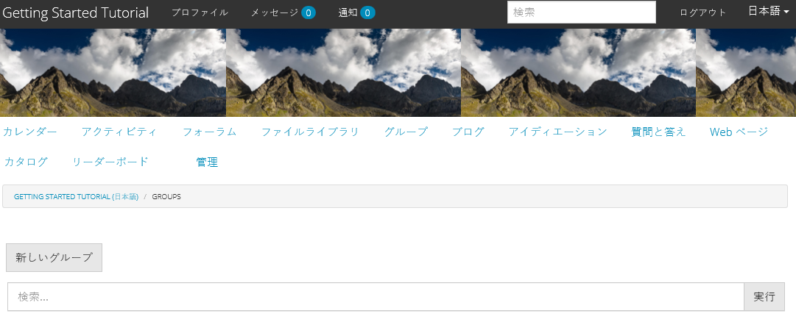

`Blog`で始まる2番目のリンク セットは、現在選択されているグループ（`Sports` グループ）に属しています。 スポーツの`Groups` リンクを選択すると、スポーツグループ内に2つのグループをネストできます。

例として、2つの`new groups`を追加します。

* `Baseball`という名前の1つ

   * `Open Group` （必須メンバーシップ）に設定したままにします。
   * 「テンプレート」タブで、「`Conversational Group`」を選択します。

* `Gymnastics`という名前の1つ

   * 設定を`Member Only Group` （制限付きメンバーシップ）に変更します。
   * 「テンプレート」タブで、「`Conversational Group`」を選択します。

**通知**:

* 両方のグループを表示する前に、ページの更新が必要になる場合があります。
* このテンプレートには&#x200B;*not*&#x200B;にグループ関数が含まれていないため、グループをさらにネストすることはできません。
* 作成者の場合、[&#x200B; グループコンソール &#x200B;](/help/communities/groups.md)は3つ目の選択肢を提供します – `Public Group` （オプションのメンバーシップ）。

両方のグループを作成したら、ベースボールグループと開いているグループを選択し、そのリンクを確認します。

`Discussions` `What's New` `Members`

グループのリンクは、メインサイトのリンクの下に表示され、次の表示になります。

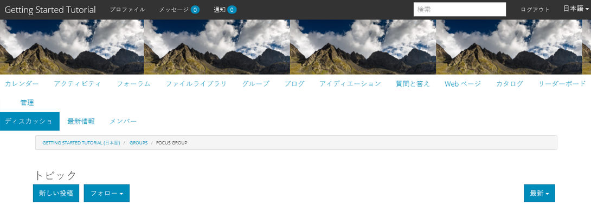

作成者 – 管理者権限で[&#x200B; コミュニティグループコンソール &#x200B;](/help/communities/members.md)に移動し、Weston McCallを`Community Engage Gymnastics <uid> Members` グループに追加します。

公開を続け、Aaron McDonaldとしてログアウトし、Sports Groupのグループを匿名のサイト訪問者として表示します。

* ホームページから
* `Groups` リンクを選択
* `Sports` リンクを選択
* 「`Groups`」リンクを選択

野球部だけが見える。

Weston McCall （weston.mccall@dodgit.com / password）としてログインし、同じ場所に移動します。 Westonは、開いている`Baseball` グループを`Join`でき、プライベートな`Gymnastics` グループを`enter or Leave`できます。

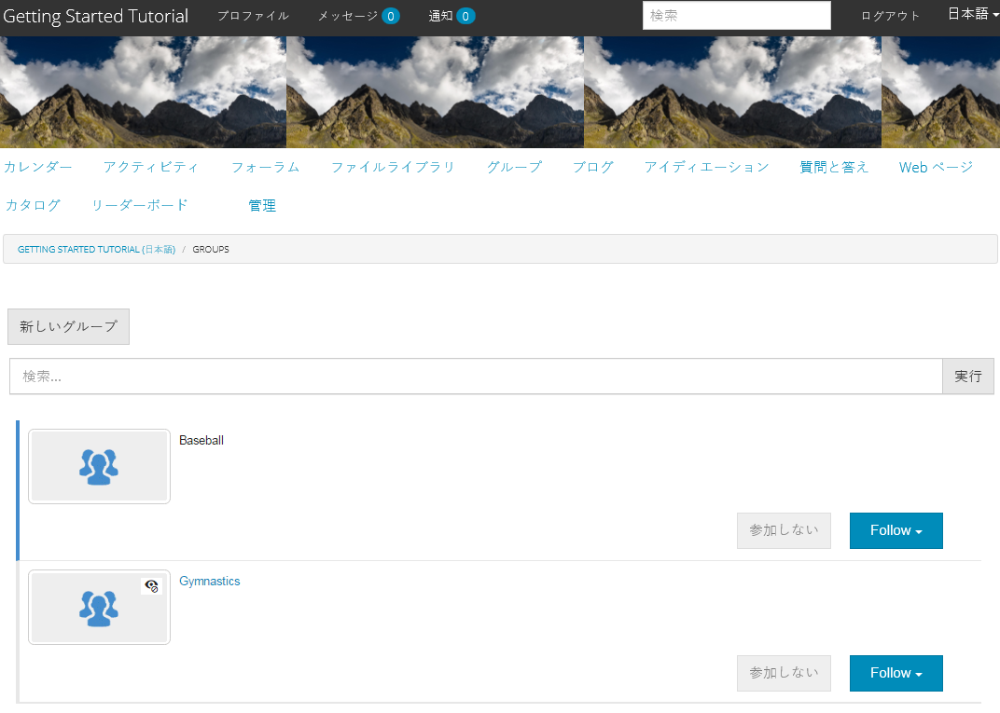

### Web ページリンク {#web-page-link}

「Web ページ」リンクを選択して、サイトに含まれている基本web ページを表示します。 標準のAEM オーサリングツールを使用して、オーサー環境でこのページにコンテンツを追加できます。

例えば、**author** インスタンスに移動し、[Communities Sites コンソール &#x200B;](/help/communities/sites-console.md)で`engage` フォルダーを開き、**サイトを開く** アイコンを選択して作成者編集モードに入ります。 次に、「`Web Page`」リンクを選択できるようにプレビューモードを選択し、次に「編集」モードを選択してタイトルとテキストコンポーネントを追加します。 最後に、ページまたはサイト全体のいずれかを再公開します。

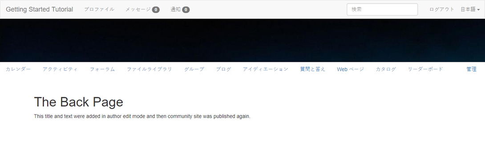

### モデレーションリンク {#moderationlink}

コミュニティメンバーにモデレーション権限がある場合、モデレーションリンクが表示されます。 リンクを選択すると、投稿されたコミュニティコンテンツが表示され、オーサー環境の[&#x200B; モデレーションコンソール &#x200B;](/help/communities/moderation.md)と同様に[&#x200B; モデレーション &#x200B;](/help/communities/moderate-ugc.md)できます。

ブラウザーの「戻る」ボタンを使用して、公開されたサイトに戻ります。 ほとんどのコンソールは、パブリッシュ環境のグローバルナビゲーションからアクセスできません。

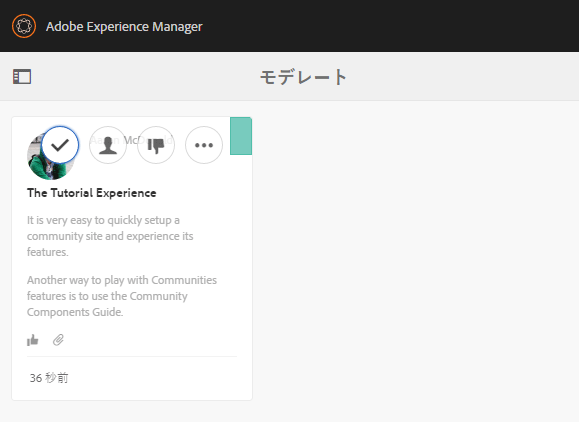

## 自己登録 {#self-registration}

ログアウト後、ユーザー登録を作成できます。

* `Log In` を選択します。
* `Sign up for a new account` を選択します。

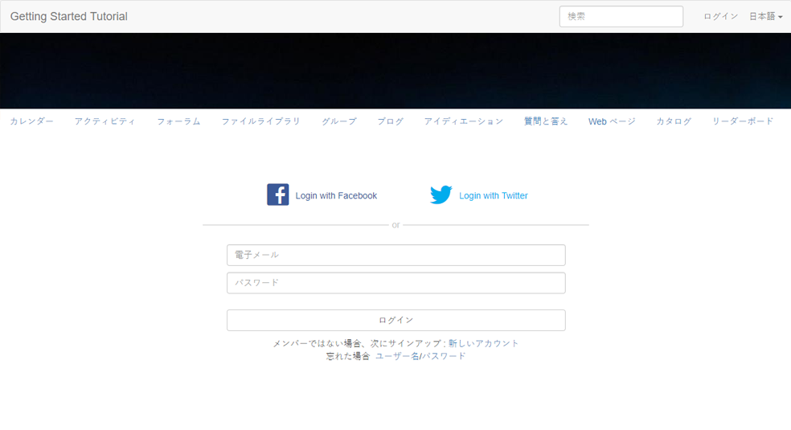

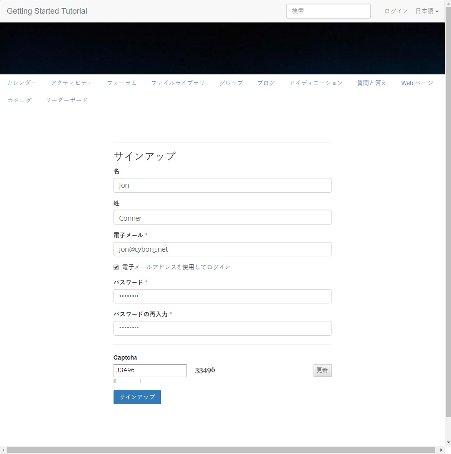

デフォルトでは、メールアドレスはログイン IDです。 チェックを外すと、訪問者は自分のログイン ID （ユーザー名）を入力できます。 ユーザー名は、パブリッシュ環境で一意である必要があります。

ユーザーの名前、電子メール、パスワードを指定した後、`Sign Up`を選択すると、ユーザーが作成され、署名できるようになります。

ログイン後、表示された最初のページは`Profile` ページで、パーソナライズできます。

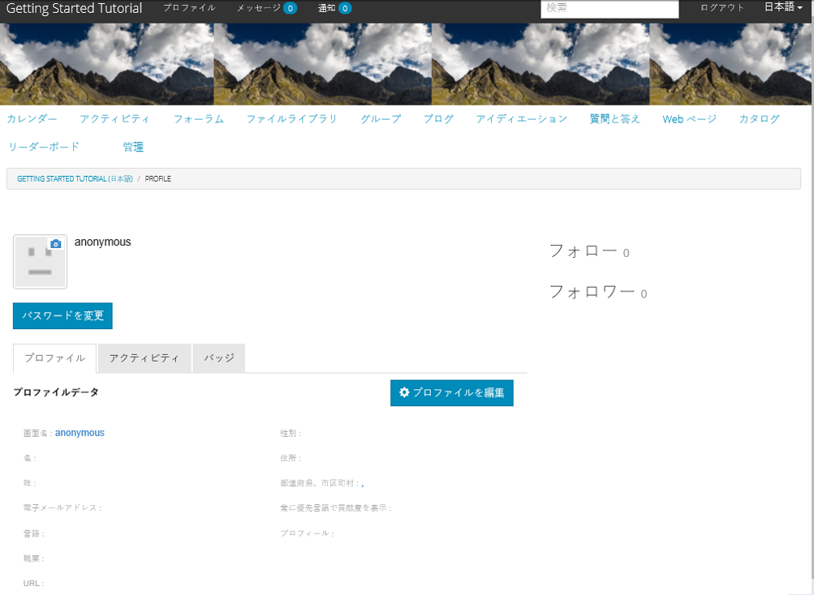

メンバーがログイン IDを忘れた場合、メールアドレスを使用して回復することができます。

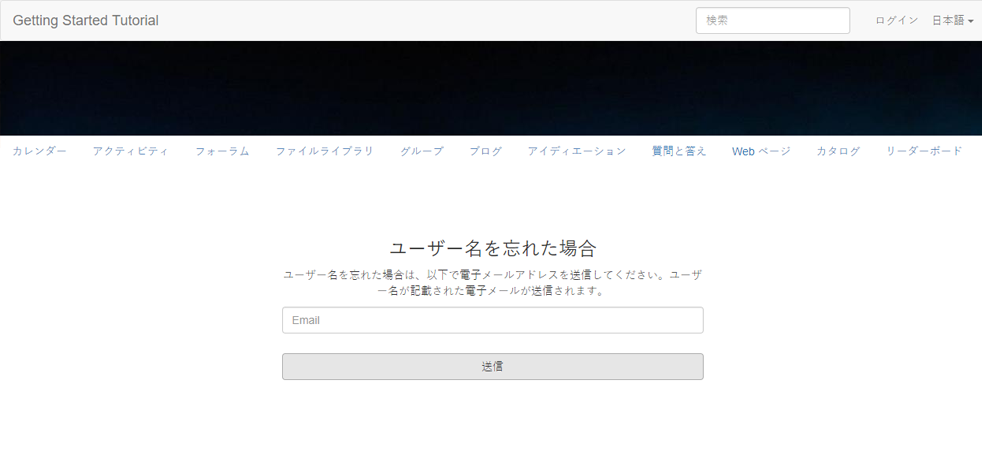
