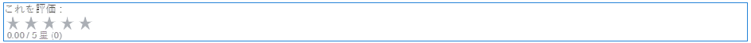
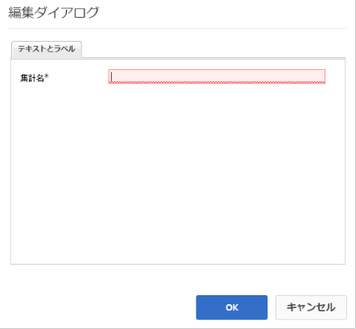

# 評価の使用 {#using-ratings}

`Rating`コンポーネントは、スタンドアロンで、または他のCommunities機能と組み合わせて使用します。 ここでは、ログインコミュニティのメンバーが、コンテンツを評価することで意見を述べることを可能にします。

## 評価をページに追加 {#adding-a-rating-to-a-page}

作成者モードで`Rating`コンポーネントをページに追加するには、コンポーネント`Communities / Rating`を見つけてページ上の位置（メンバーが評価する機能に対する相対位置など）にドラッグします。

必要な情報については、[Communities Components Basics](basics.md)を参照してください。

[必要なクライアント側ライブラリ](rating-basics.md#essentials-for-client-side)が含まれる場合、`Rating`コンポーネントは次のように表示されます。

## 評価の設定 {#configuring-rating}

アクセスする配置済みの`Rating`コンポーネントを選択し、編集ダイアログを開く`Configure`アイコンを選択します。

「**[!UICONTROL テキストとラベル]**」タブでは、評価の内部識別子を指定できます。

**[!UICONTROL Tally Name]**
(*必須*)：このインスタンスを一意に識別す `Rating` る、の単純な名前。リポジトリの有効なノード名を指定する必要があります。

## サイト訪問者のエクスペリエンス  {#site-visitor-experience}

### メンバー {#members}

1 人のメンバーが付けられる評価は 1 つだけです。メンバーは、いつでも評価を変更できます。

### 匿名  {#anonymous}

匿名での評価投稿はサポートされていません。サイト訪問者は参加するには、登録（会員になる）し、サインインする必要があります。

## 追加情報 {#additional-information}

詳しくは、開発者向けの[Rating Essentials](rating-basics.md)ページを参照してください。
