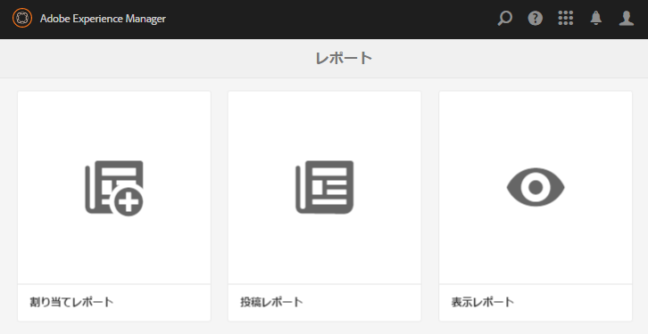
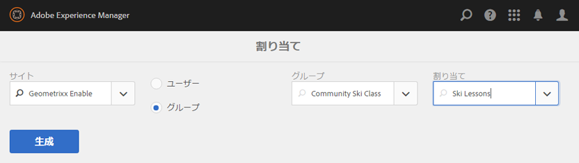
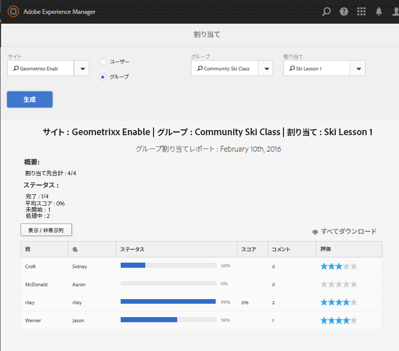
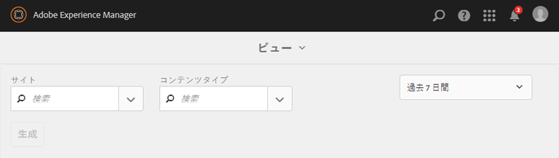
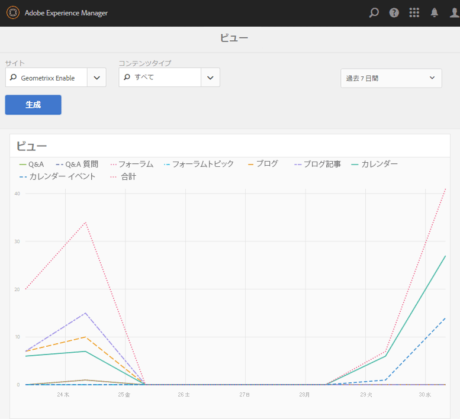
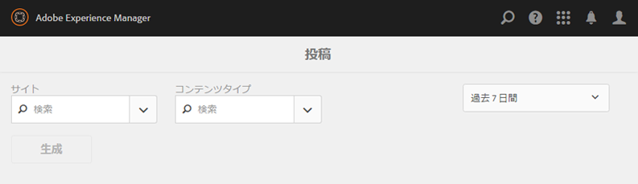
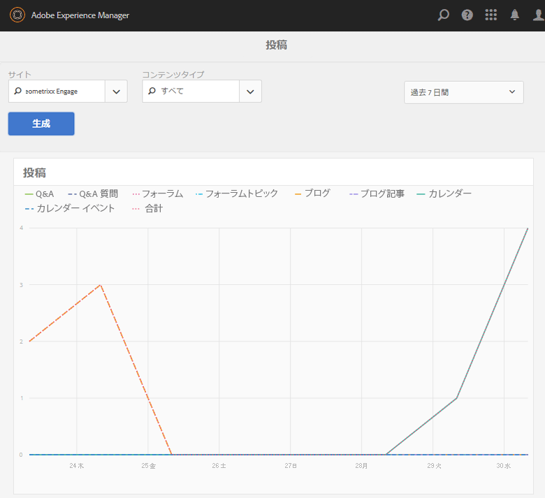

# レポートコンソール {#reports-console}

## 概要 {#overview}

AEM Communities には様々なレポートがあり、オーサー環境から複数の方法でアクセスできます。

通常、レポートには以下のものがあります。

* [割り当てレポート](#assignments-report)

   For an [enablement community](/help/communities/overview.md#enablement-community), provides an overview of learners&#39; progress on their assignments, including an associated score if implementing the SCORM standard.

* [表示レポート](#views-report)

   コミュニティメンバーや任意のコミュニティサイトのサイト訪問者別に、コンテンツの表示のグラフを表示します。

* [投稿レポート](#posts-report)

   コミュニティメンバー別の様々なタイプの投稿を、任意のコミュニティサイトにグラフで表示します。

[Adobe Analyticsを有効にすると](/help/communities/sites-console.md#analytics)、各有効化リソースの表示数、再生数、コメント数、評価数が時間の経過と共にレポートに表示されます。

表形式のレポートは .csv 形式でエクスポートして別の処理に使用できます。

## レポートコンソール {#reporting-consoles}

### コミュニティサイトのレポート {#reports-for-community-sites}

* From global navigation: **[!UICONTROL Navigation]** > **[!UICONTROL Communities]** >  **[!UICONTROL Reports]**

* 次の中から選択します。

   * **[!UICONTROL 割り当てレポート]**

      * 選択したコミュニティサイト、ユーザーまたはグループ、割り当てに関するレポートを生成します。
   * **[!UICONTROL 投稿レポート]**

      * 選択したコミュニティサイト、コンテンツタイプ、期間のレポートを生成します。
   * **[!UICONTROL 表示レポート]**

      * 選択したコミュニティサイト、コンテンツタイプおよび期間のレポートを生成します。。

### イネーブルメントリソースと学習パスのレポート {#reports-for-enablement-resources-and-learning-paths}

* From global navigation: **[!UICONTROL Navigation]** > **[!UICONTROL Communities]** >  **[!UICONTROL Resources]**

* 既存の有効化コミュニティサイトを選択してください：

   * Select **Report** icon to generate reports which cover all enablement resources.
   * 有効化の学習パスを選択します。
   * Select **Report** icon to generate reports for:

      * 付属の有効化リソース。
      * 学習パスに割り当てられた学習者。

* これらのレポートには、次の機能があります。

   * 表データ（CSV形式でダウンロード可能）:

      * 学習者の識別
      * 彼らの地位
      * カタログを使用して割り当てるか、アクセスするか
      * コメントの数
      * 与えられた星評価

詳しくは、リソースコンソールの[レポートセクション](/help/communities/resources.md#report)を参照してください。

## 割り当てレポート {#assignments-report}

割り当てコンソールでは、イネーブルメントコミュニティサイト、ユーザー、グループおよび割り当てによってレポートをフィルタリングできます。

このレポートには、進捗状況に関する情報と、コメントや評価がある場合はそれも表示されます。

レポートのフィルタリング条件を選択します。

* **サイト**

   有効化コミュニティサイトを選択します。

* **ユーザーまたはグループ**
   * 「ユーザー」を選択して、1人の学習者のレポートを生成します。
   * 「グループ」を選択して、学習者のグループに関するレポートを生成します。

   トンネルサービスは、パブリッシュ環境からメンバーとメンバーグループにアクセスします。

* **代入**

   選択した学習者に割り当てられている有効化リソースの中から選択します。

「**生成**」を選択してレポートを作成します。

## Views Report {#views-report}

表示コンソールでは、指定した期間におけるコミュニティ機能別のページ表示回数のレポートを生成できます。

レポートのフィルタリング条件を選択します。

* **[!UICONTROL サイト]**

   コミュニティサイトを選択します。

* **[!UICONTROL コンテンツタイプ]**

   「すべてのコンテンツ」を選択するか、サイトに存在する機能の1つを選択します。

* **[!UICONTROL 時間枠]**

   次のいずれかを選択します。

   * 過去 7 日間
   * 過去 30 日間
   * 過去 90 日間
   * 昨年

Select **[!UICONTROL Generate]** to create the report.

## Posts Report {#posts-report}

投稿コンソールでは、指定した期間におけるコミュニティ機能への投稿数のレポートを生成できます。

レポートのフィルタリング条件を選択します。

* **[!UICONTROL サイト]**

   コミュニティサイトを選択します。

* **[!UICONTROL コンテンツタイプ]**

   「すべてのコンテンツ」を選択するか、サイトに存在する機能の1つを選択します。

* **[!UICONTROL 時間枠]**

   次のいずれかを選択します。

   * 過去 7 日間
   * 過去 30 日間
   * 過去 90 日間
   * 昨年

Select **[!UICONTROL Generate]** to create the report.

## トラブルシューティング {#troubleshooting}

### コミュニティサイトが 1 つも表示されない {#no-community-sites-listed}

コミュニティサイトが 1 つも表示されない場合は、Adobe Analytics がサイトに対して有効になっているかを確認してください。割り当てに関するレポートを選択する場合は、割り当て機能がコミュニティサイトの構造にあることを確認します。

### AEM作成者インスタンスにレポートが表示されない {#reports-do-not-show-in-aem-author-instance}

レポートがAEM作成者インスタンスに表示されない場合は、発行インスタンスでのURLのマッピングなど、カスタマイズ内容を確認します。 URLのマッピングがコミュニティサイトのAEM Publishインスタンスでのみ行われる場合は、 **サイトトレンドレポートのソーシャルコンポーネントファクトリ** の設定で、AEM Authorインスタンスで同じ設定が行われていることを確認します。

