# イネーブルメントリソースの作成と割り当て {#create-and-assign-enablement-resources}

## イネーブルメントリソースの追加 {#add-an-enablement-resource}

新しいコミュニティサイトにイネーブルメントリソースを追加するには：

* 作成者インスタンスでシステム管理者としてログインします。
   * 例：[http://localhost:4502/](http://localhost:4503/)
* グローバルナビゲーションから、**[!UICONTROL コミュニティ]**/**[!UICONTROL リソース]**&#x200B;を選択します。

   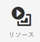

   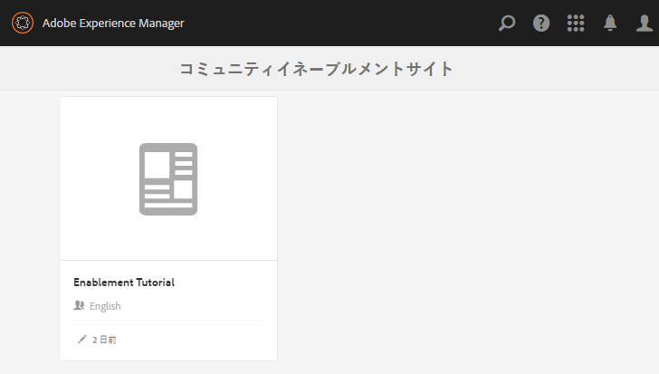
* イネーブルメントリソースを追加するコミュニティサイトを選択します。
   * 「**[!UICONTROL 有効化チュートリアル]**」を選択します。
* メニューから「**[!UICONTROL 作成]**」を選択します。
* 「**[!UICONTROL リソース]**」を選択します。

### 基本情報 {#basic-info}

以下のとおり、リソースの基本情報を入力します。

* **[!UICONTROL サイト名]**

   選択したコミュニティサイトの名前に設定します。有効化のチュートリアル

* **[!UICONTROL リソース名(&amp;A);]**

   スキーレッスン1

* **[!UICONTROL タグ]**

   Tutorial : Sports / Skiing

* **[!UICONTROL カタログに表示]**

   **On**&#x200B;に設定します。

* **[!UICONTROL 説明]**

   初心者向けの雪滑り。

* **[!UICONTROL 画像を追加]**

   割り当て表示内のメンバに対してリソースを表す追加画像。

   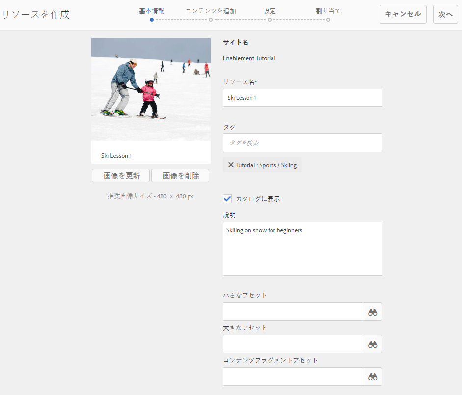

* 「**[!UICONTROL 次へ]**」を選択します。

### コンテンツの追加 {#add-content}

複数のリソースを選択できるように見えますが、選択できるのは 1 つだけです。

右上隅の`'+' icon`を選択して、ソースを識別してリソースを選択するプロセスを開始します。

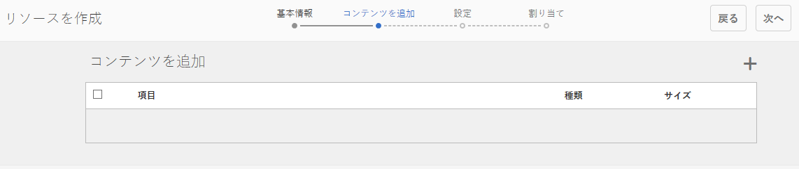

リソースをアップロードします。ビデオリソースの場合は、カスタム開始をアップロードして再生するビデオ画像の前に表示するか、ビデオからサムネールを生成できるようにします（数分かかる場合があります。待つ必要はありません）。

* 「**[!UICONTROL 次へ]**」を選択します。

### 設定 {#settings}

* **[!UICONTROL ソーシャルの設定]**

   デフォルトの設定は、学習者が使用可能なリソースのコメントや評価を体験する場合にのみ使用します。

* **[!UICONTROL 期限]**

   *（オプション）* 割り当てを完了する日付を選択できます。

* **[!UICONTROL リソース作成者]**

   *（オプション）* 空白のままにします。

* **[!UICONTROL リソース連絡先(&amp;A);]**

   *（必須）プルダウンメニューを* 使用して、メンバを選択 `Quinn Harper`します。

* **[!UICONTROL リソースエキスパート]**

   *（オプション）* 空白のままにします。

   **注意**:ユーザーまたはグループが表示されない場合は、ユーザーまたはグループがグループに追加され、 `Community Enable Members` 発行インスタンスで「 ** 保存」されたことを確認します。

   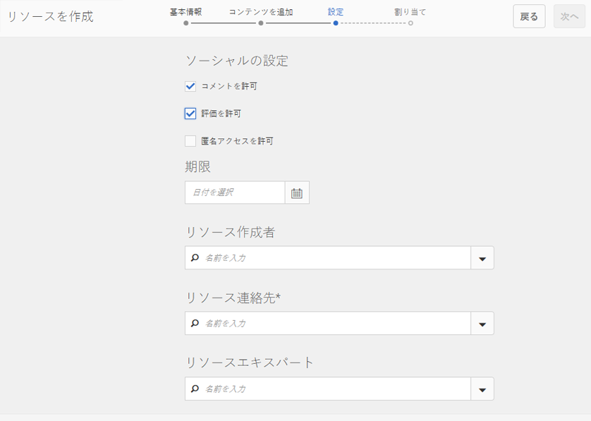

* 「**[!UICONTROL 次へ]**」を選択します。

### 割り当て {#assignments}

* **[!UICONTROL 割り当て先を追加]**

   この有効化リソースは学習パスに追加されるので、設定を解除しておきます。 学習者が、有効化リソースを含む学習パスと共に個々の有効化リソースに割り当てられた場合、学習者は有効化リソースに2回割り当てられます。

   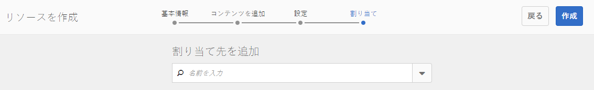

* 「**[!UICONTROL 作成]**」を選択します。

   

リソースが正常に作成されると、リソースコンソールに戻ります。新しく作成されたリソースが選択状態になっています。このコンソールから、学習者の投稿、追加、その他の設定の変更が可能です。

新しいバージョンのイネーブルメントリソースをアップロードする際は、新しいリソースを作成したうえで、古いバージョンのリソースからメンバーを登録解除して新しいバージョンのリソースに登録することを推奨します。

### リソースの公開  {#publish-the-resource}

登録者が割り当てられたリソースを確認できるようにするには、その前に次の手順でリソースを公開する必要があります。

* ワールド`Publish`アイコンを選択

アクティベーションが成功したことを示す以下のメッセージが表示されます。

## 2 つ目のイネーブルメントリソースの追加 {#add-a-second-enablement-resource}

上記の手順を繰り返し、学習パス作成用の関連するイネーブルメントリソースを作成して公開します。

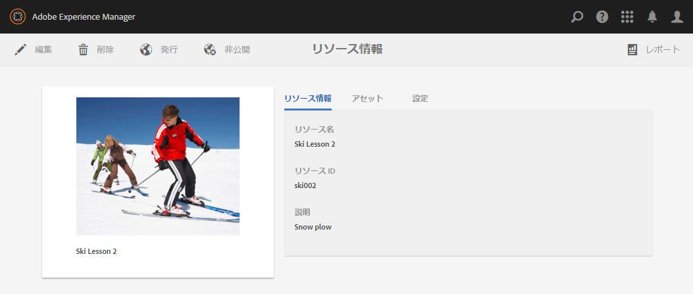

**2番目のリソースを** 発行します。

Enablement Tutorial のリソースのリストに戻ります。

*ヒント：両方のリソースが表示されない場合は、ページを更新します。*

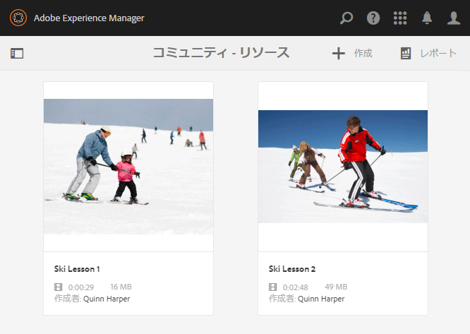

## 学習パスの追加 {#add-a-learning-path}

学習パスは、複数のイネーブルメントリソースを論理的にグループ化して 1 つのコースとしたものです。

* リソースコンソールから`+ Create`を選択します
* **[!UICONTROL 学習パス]**&#x200B;を選択

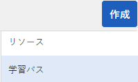

**[!UICONTROL 基本情報]**&#x200B;を追加します。

* **[!UICONTROL 学習パス名]**

   スキーレッスン

* **[!UICONTROL タグ]**

   チュートリアル：スキー

* **[!UICONTROL カタログに表示]**

   チェックを外したままにする

* **[!UICONTROL 画像のアップロード]**

   リソースコンソールで学習パスを表す場合。

   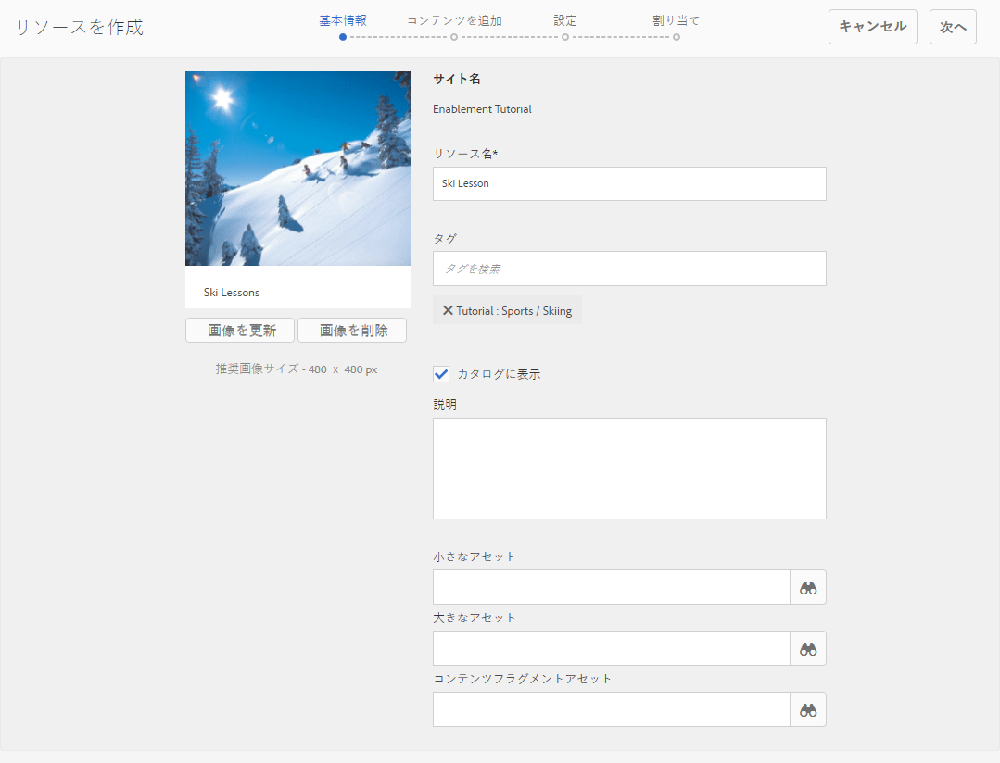

* 「**[!UICONTROL 次へ]**」を選択します。

前提条件となる追加する学習パスがないので、次のパネルをスキップします。

* 「**[!UICONTROL 次へ]**」を選択します。

リソース追加パネルで、次の操作を行います。

* `+ Add Resources`を選択して、学習パスに追加する2つのスキーリソースを選択します。

   注意：**発行済み**&#x200B;のリソースのみが選択可能です。

>[!NOTE]
>
>学習パスと同じレベルのリソースのみを選択できます。例えば、グループ内に作成された学習パスには、グループレベルのリソースのみを使用できます。コミュニティサイト内に作成された学習パスには、そのサイト内のリソースを追加できます。

* 「**[!UICONTROL 送信]**」を選択します。

   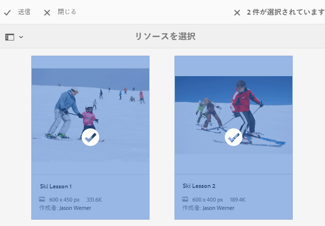

   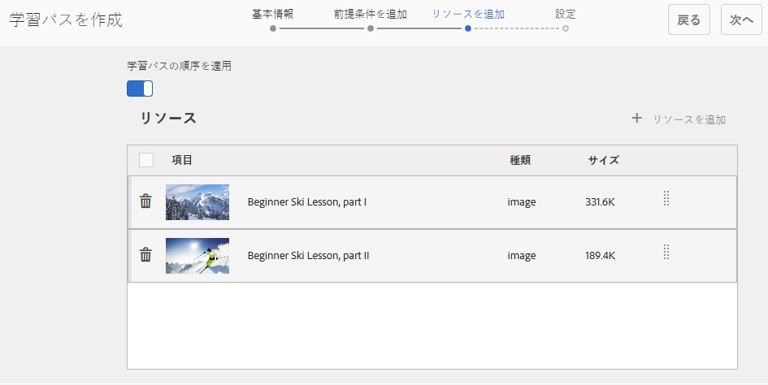

* 「**[!UICONTROL 次へ]**」を選択します。

   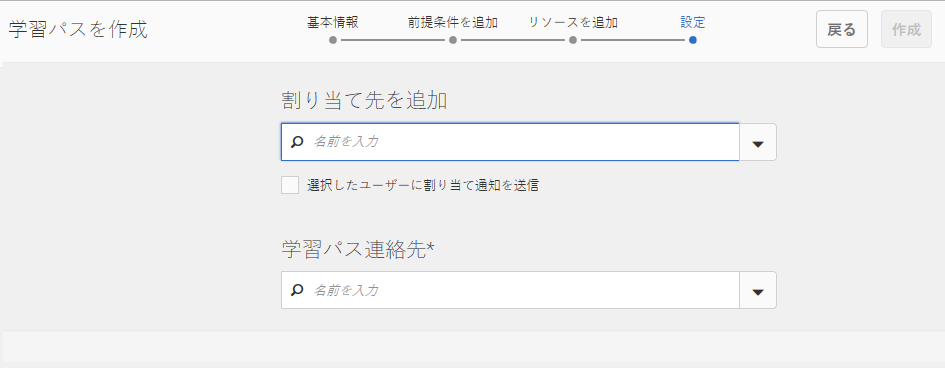

* **[!UICONTROL 割り当て先を追加]**

   プルダウンメニューを使用して`Community Ski Class`グループを選択します。グループには`Riley Taylor`と`Sidney Croft.`が含まれます。

* **[!UICONTROL 学習パス（連絡先）;]**

   *（必須）プルダウンメニューを* 使用して、メンバを選択 `Quinn Harper`します。

* 「**[!UICONTROL 作成]**」を選択します。

   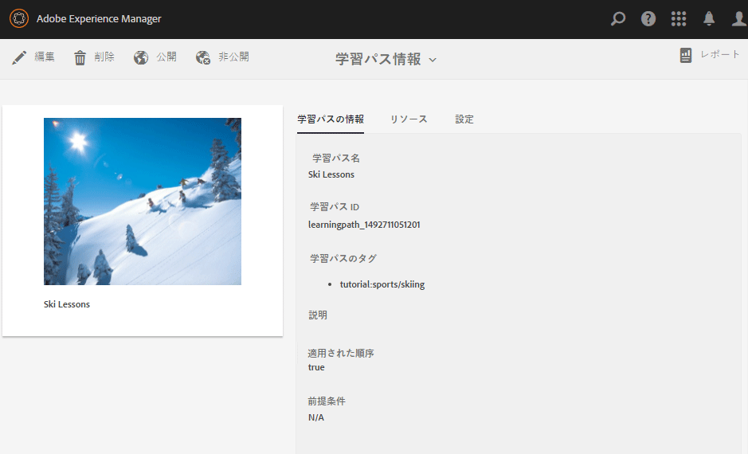

学習パスが正常に作成されると、リソースコンソールに戻ります。新しく作成された学習パスが選択状態になっています。このコンソールから、学習者の投稿、追加、その他の設定の変更が可能です。

学習パスを&#x200B;**公開**&#x200B;します。

