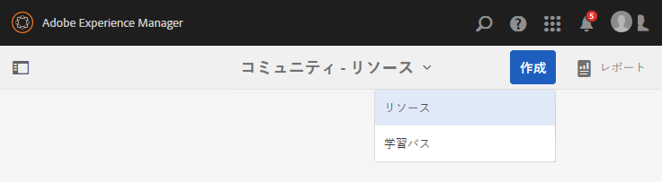

# イネーブルメントリソースの作成と割り当て {#create-and-assign-enablement-resources}

## イネーブルメントリソースの追加 {#add-an-enablement-resource}

新しいコミュニティサイトにイネーブルメントリソースを追加するには：

* オーサーインスタンスでシステム管理者としてログインします。
   * 例： [http://localhost:4502/](http://localhost:4503/)
* グローバルナビゲーションから、**[!UICONTROL コミュニティ]**/**[!UICONTROL リソース]**&#x200B;を選択します。

   

   
* イネーブルメントリソースを追加するコミュニティサイトを選択します。
   * **[!UICONTROL イネーブルメントチュートリアル]**&#x200B;を選択します。
* メニューから「**[!UICONTROL 作成]**」を選択します。
* 「**[!UICONTROL リソース]**」を選択します。

### 基本情報 {#basic-info}

以下のとおり、リソースの基本情報を入力します。

* **[!UICONTROL サイト名]**

   選択したコミュニティサイトの名前に設定します。イネーブルメントチュートリアル

* **[!UICONTROL リソース名(&amp;A);]**

   Ski Lesson 1

* **[!UICONTROL タグ]**

   Tutorial : Sports / Skiing

* **[!UICONTROL カタログに表示]**

   **On**&#x200B;に設定します。

* **[!UICONTROL 説明]**

   雪上滑り初心者。

* **[!UICONTROL 画像を追加]**

   メンバーの割り当てビューで、メンバーにリソースを表す画像を追加します。

   

* 「**[!UICONTROL 次へ]**」を選択します。

### コンテンツの追加 {#add-content}

複数のリソースを選択できるように見えますが、選択できるのは 1 つだけです。

右上隅の`'+' icon`を選択し、ソースを識別してリソースを選択するプロセスを開始します。

リソースをアップロードします。ビデオリソースの場合は、ビデオの再生を開始する前に表示するカスタム画像をアップロードするか、ビデオからサムネールを生成できるようにします（数分かかる場合があります。待つ必要はありません）。

* 「**[!UICONTROL 次へ]**」を選択します。

### 設定 {#settings}

* **[!UICONTROL ソーシャルの設定]**

   学習者がイネーブルメントリソースにコメントや評価を付ける際は、デフォルトの設定のままにします。

* **[!UICONTROL 期限]**

   *（オプション）* 割り当てを完了する日付を選択できます。

* **[!UICONTROL リソース作成者]**

   *（オプション）* 空白のままにします。

* **[!UICONTROL リソース連絡先(&amp;A);]**

   *（必須）* プルダウンメニューを使用してメンバーを選択しま `Quinn Harper`す。

* **[!UICONTROL リソースエキスパート]**

   *（オプション）* 空白のままにします。

   **注意**:ユーザーまたはグループが表示されない場合は、そのユーザーまたはグループがグループに追加され、パブリッシュインス `Community Enable Members` タンスに保 ** 存されていることを確認します。

   

* 「**[!UICONTROL 次へ]**」を選択します。

### 割り当て {#assignments}

* **[!UICONTROL 割り当て先を追加]**

   このイネーブルメントリソースは学習パスに追加されるので、設定を解除します。 学習者が個々のイネーブルメントリソースと、イネーブルメントリソースを含む学習pPathに割り当てられると、学習者はイネーブルメントリソースに2回割り当てられます。

   

* 「**[!UICONTROL 作成]**」を選択します。

   

リソースが正常に作成されると、リソースコンソールに戻ります。新しく作成されたリソースが選択状態になっています。このコンソールから、学習者の公開、追加、その他の設定の変更を行うことができます。

新しいバージョンのイネーブルメントリソースをアップロードする際は、新しいリソースを作成したうえで、古いバージョンのリソースからメンバーを登録解除して新しいバージョンのリソースに登録することを推奨します。

### リソースの公開  {#publish-the-resource}

登録者が割り当てられたリソースを確認できるようにするには、その前に次の手順でリソースを公開する必要があります。

* ワールドの`Publish`アイコンを選択します。

アクティベーションが成功したことを示す以下のメッセージが表示されます。

## 2 つ目のイネーブルメントリソースの追加 {#add-a-second-enablement-resource}

上記の手順を繰り返し、学習パス作成用の関連するイネーブルメントリソースを作成して公開します。

**** 2つ目のリソースを公開します。

Enablement Tutorial のリソースのリストに戻ります。

*ヒント：両方のリソースが表示されない場合は、ページを更新します。*

## 学習パスの追加 {#add-a-learning-path}

学習パスは、複数のイネーブルメントリソースを論理的にグループ化して 1 つのコースとしたものです。

* リソースコンソールで、「`+ Create`」を選択します。
* **[!UICONTROL 学習パス]**&#x200B;を選択します。

**[!UICONTROL 基本情報]**&#x200B;を追加します。

* **[!UICONTROL 学習パス名]**

   Ski Lessons

* **[!UICONTROL タグ]**

   チュートリアル：スキー

* **[!UICONTROL カタログに表示]**

   オフのままにします。

* **[!UICONTROL 画像のアップロード]**

   リソースコンソールで学習パスを表す場合。

   

* 「**[!UICONTROL 次へ]**」を選択します。

前提条件となる追加する学習パスがないので、次のパネルをスキップします。

* 「**[!UICONTROL 次へ]**」を選択します。

リソースを追加パネルで、次の操作を行います。

* `+ Add Resources`を選択して、学習パスに追加する2つのスキーレッスンリソースを選択します。

   注意：選択できるリソースは&#x200B;**公開済み**&#x200B;のみです。

>[!NOTE]
>
>学習パスと同じレベルのリソースのみを選択できます。例えば、グループ内に作成された学習パスには、グループレベルのリソースのみを使用できます。コミュニティサイト内に作成された学習パスには、そのサイト内のリソースを追加できます。

* 「**[!UICONTROL 送信]**」を選択します。

   

   

* 「**[!UICONTROL 次へ]**」を選択します。

   

* **[!UICONTROL 割り当て先を追加]**

   プルダウンメニューを使用して、`Community Ski Class`グループを選択します。このグループには、`Riley Taylor`と`Sidney Croft.`のメンバーが含まれます。

* **[!UICONTROL 学習パスの連絡先(&amp;A);]**

   *（必須）* プルダウンメニューを使用してメンバーを選択しま `Quinn Harper`す。

* 「**[!UICONTROL 作成]**」を選択します。

   

学習パスが正常に作成されると、リソースコンソールに戻ります。新しく作成された学習パスが選択状態になっています。このコンソールから、学習者の公開、追加、その他の設定の変更を行うことができます。

学習パスを&#x200B;**公開**&#x200B;します。
