# イネーブルメントリソースのコンソール  {#enablement-resources-console}

AEM Communities のリソースコンソールは、[イネーブルメントマネージャー](users.md)が、イネーブルメントコミュニティサイトのリソースの作成、管理、メンバーへの割り当てをおこなう場所です。

## 要件 {#requirements}

コミュニティサイトにイネーブルメントリソースを追加する前に、以下のものを含め、AEM インスタンスを適切に設定しておく必要があります。

* SCORM
* FFmpeg

詳しくは、[イネーブルメントの設定](enablement.md)を参照してください。

>[!CAUTION]
>
>コミュニティサイトの作成後に SCORM をインストールした場合は、SCORM をインストールする前に存在していたイネーブルメントリソースを作成し直す必要があります。

>[!NOTE]
>
>[AEM 6.3](deploy-communities.md#latestfeaturepack)と同等のCommunities機能パック[AEM 6.2 FP3](deploy-communities.md#latestfeaturepack)と[AEM 6.1 FP7](https://docs.adobe.com/content/docs/en/aem/6-1/deploy/communities.html#Latest機能パック)のリリースに伴い、イネーブルメント機能に[MySQLデータベース](mysql.md)は不要になりました。

## 用語 {#terminology}

### リソース {#resource}

リソースは[イネーブルメントコミュニティ](overview.md#enablement-community)に欠かせないものです。彼らは、彼らが彼らのスキルを向上させるためにメンバーに割り当てられた資料です。

リソースの特性：

* タイプは次のとおりです。
   * 画像(JPG、PNG、GIF、BMP)
   * ビデオ(MP4)
   * Flash(SWF)
   * Document (PDF)
   * クイズ(SCORM)
* 1つ以上の学習パスから参照できます。

### 学習パス {#learning-path}

学習パスは、メンバーへの割り当てを容易にするために、複数のイネーブルメントリソースを論理的にグループ化したものです。

### メンバーグループ  {#members-group}

コミュニティサイトの作成時にサイトの URL に指定した名前が、様々な役割にふさわしい権限を持つ[サイト固有のユーザーグループ](users.md)を作成する際に使用されます。これらの自動作成されたグループには、`Community <site-name>`というプレフィックスが付きます。

このようなユーザーグループの1つは`Community <site-name> Members`グループで、パブリッシュ環境の登録ユーザーをコミュニティメンバーとして識別します。 例については、 AEM Communitiesを使い始める前に](getting-started-enablement.md)のチュートリアルを参照してください。[

[エンゲージメントコミュニティ](overview.md#egagementcommunity)の場合、サイト訪問者が自己登録またはソーシャルログインを使用できるようにすると、その時点で自動的にメンバーグループに追加されます。

[イネーブルメントコミュニティ](overview.md#enablement-community)の場合は、サイトを非公開にすることを推奨します。非公開のサイトでは、管理者がユーザーをメンバーグループに追加する必要があります。

## コミュニティサイトのイネーブルメントリソースへのアクセス  {#accessing-a-community-site-s-enablement-resources}

### コミュニティリソースへの移動 {#navigate-to-communities-resources}

オーサー環境でリソースコンソールに移動するには、

* グローバルナビゲーションから：**[!UICONTROL ナビゲーション]** > **[!UICONTROL コミュニティ]** > **[!UICONTROL リソース]**

   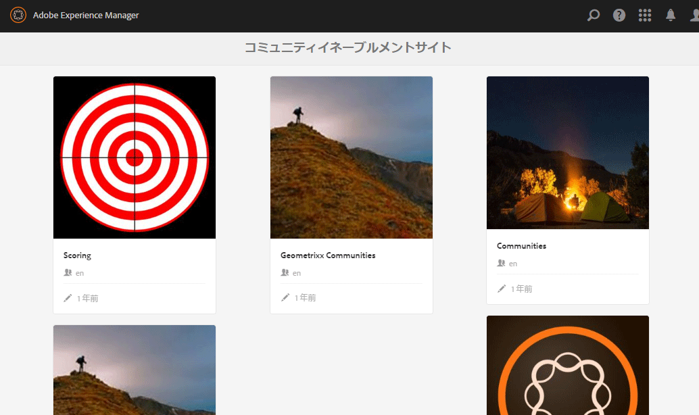

### コミュニティサイトの選択 {#select-a-community-site}

コミュニティリソースコンソールには、すべてのコミュニティサイトが表示されます。

リソースコンソールで特定のコミュニティサイトを選択すると、そのサイトに対してイネーブルメントリソースが作成されます。

特定のコミュニティサイトを選択した後は、既存のイネーブルメントリソースや学習パスにアクセスして管理や変更をおこなったり、新しいイネーブルメントリソースや学習パスを作成したりできます。

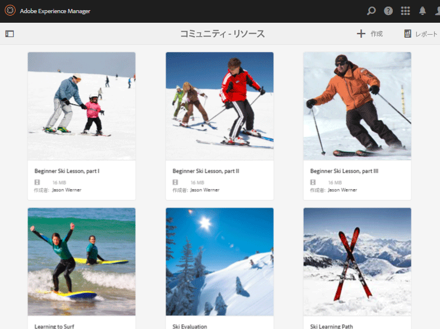

#### 検索 {#search-features}

イネーブルメントリソースまたは学習パスを検索するには、サイドパネル切り替えアイコンを選択します。選択すると、検索パネルがコンソールの左側に開き、検索語句を入力するためのテキストボックスが表示されます。

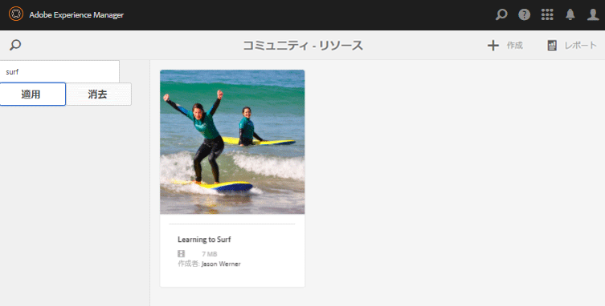

#### 選択モード {#selection-mode}

複数のイネーブルメントリソースを選択するには、まず 1 つ目のカードにカーソルを合わせてチェックマークアイコンをクリックし、選択状態にします。選択したカードを他のカードから選択すると、選択グループに追加されます。 2回目の選択で、カードの選択が解除されます。

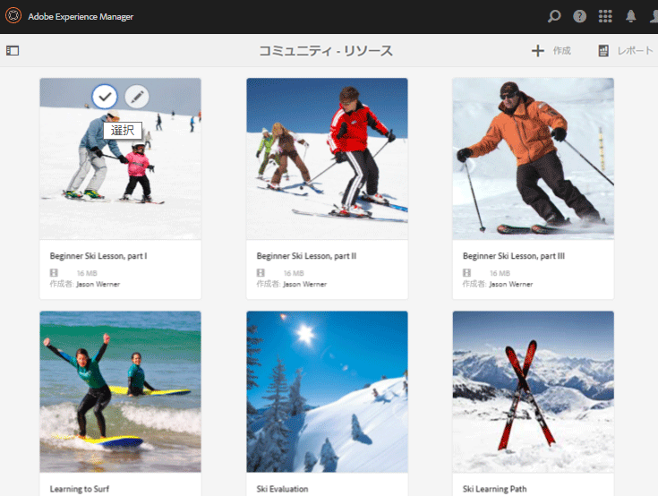

## リソースの作成 {#create-a-resource}

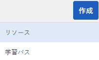

コミュニティサイトに新しいイネーブルメントリソースを追加するには、

* `Create`アイコンを選択します。
* 表示されるサブメニューから、「**[!UICONTROL Resource]**」を選択します。

これにより、次の手順を実行するプロセスが開始されます。

* リソース（名前、カード画像、テキスト）を記述します。
* リソースのコンテンツを選択する。
* リソースのカバー画像の選択
* リソースの連絡先の識別
* メンバーへのリソースの割り当て

リソースがコース（学習パス）に含まれている場合は、メンバーを学習パスに割り当てる必要があります。割り当ては、イネーブルメントリソースの作成後に追加できます。

### 1 基本情報 {#basic-info}

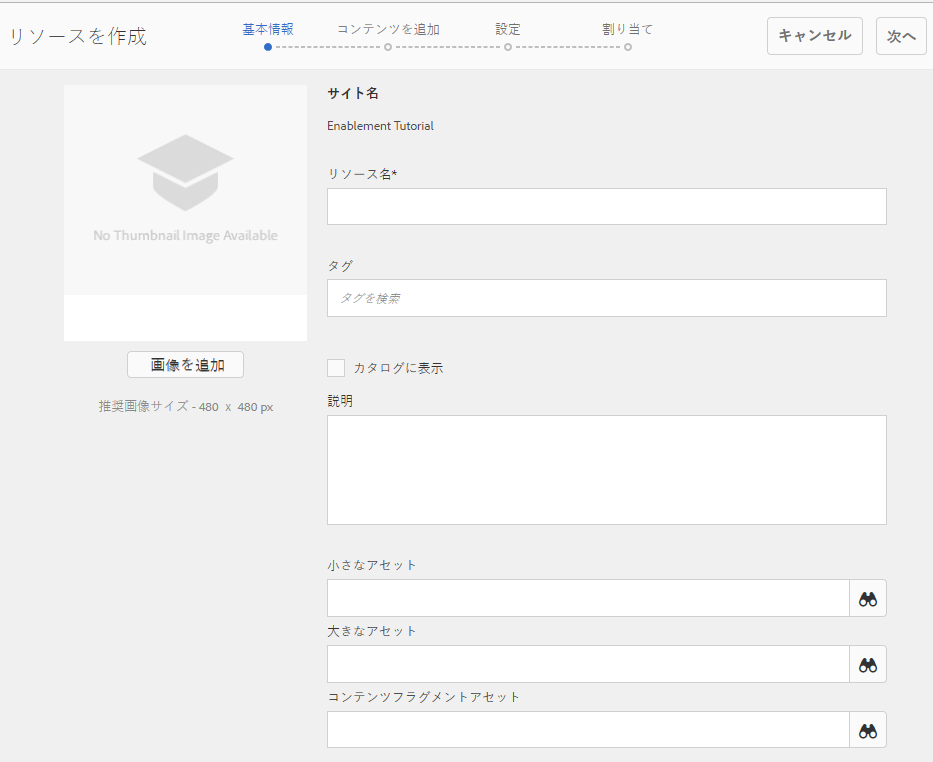

* **[!UICONTROL 画像を追加]**

   （*オプション*）メンバーの割り当てページおよびリソースコンソールでイネーブルメントリソースのカードに表示する画像。 イメージは、サーバーのローカルファイルシステムから選択されます。 画像を指定しない場合、アップロードされたリソースのサムネールが生成されます。

   ***注意***:推奨される画像サイズは、480 x 480ピクセルではありません。カードは様々なブラウザーサイズにレスポンシブデザインなので、表示サイズは220 X 165ピクセルから400 x 165ピクセルまで様々です。

* **[!UICONTROL サイト名]**

   (*readonly*)リソースを追加するコミュニティサイト。

* **[!UICONTROL リソース名]**

   （*必須*）リソースの表示名。 有効なノード名は、表示名から作成されます。

* **[!UICONTROL タグ]**

   （*オプション*）イネーブルメントリソースを1つ以上のカタログに関連付ける1つ以上のタグを選択できます。 [実施可能リソースのタグ付け](tag-resources.md)を参照してください。

* **[!UICONTROL カタログに表示]**

   オフにすると、イネーブルメントリソースはどのカタログにも表示されません。 オンにすると、イネーブルメントリソースがすべてのカタログに表示されます。ただし、[事前にフィルタリングされている](catalog-developer-essentials.md#pre-filters)場合と、メンバーが UI からフィルタリングした場合は除きます。初期設定はオフです。

* **[!UICONTROL 説明]**

   （*オプション*）イネーブルメントリソースに対して表示する説明。

* **[!UICONTROL 小さなアセット]**

   （*オプション*）AEM Assetsから選択します。 カタログ内など、パブリッシュ環境でリソースを表すサムネイル画像です。

* **[!UICONTROL 大きなアセット]**

   （*オプション*）AEM Assetsから選択します。 リソースのメインページなど、パブリッシュ環境でリソースを表す大きな画像です。

* **[!UICONTROL コンテンツフラグメントアセット]**

   （*オプション*）AEM Assetsから選択します。 パブリッシュ環境で参照できるコンテンツフラグメント。ただし、初期設定では使用されません。

* 「**[!UICONTROL 次へ]**」を選択します。

### 2 コンテンツの追加  {#add-content}

複数のイネーブルメントリソースを選択できるように見えますが、選択できるのは 1 つだけです。

右上隅の`'+' icon`を選択し、ソースを識別してリソースを選択するプロセスを開始します。

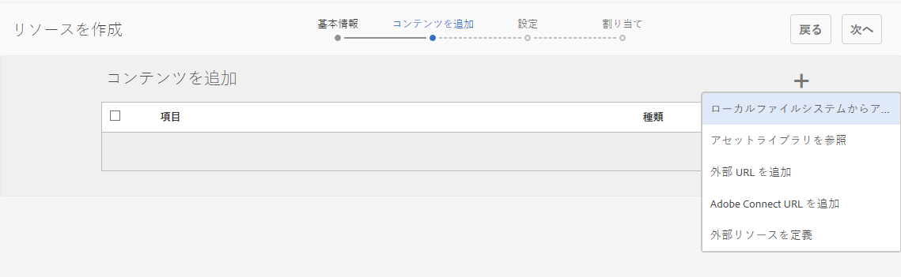

* **[!UICONTROL ローカルファイルからアップロード]**

   ローカルファイルシステムからアップロードする場合は、ネイティブのファイルブラウザーを使用してファイルを選択し、アップロードします。 サポートされるファイルタイプは、SCORM.zip（HTML5またはSWF）、MP4ビデオ、SWF、PDFおよび画像タイプ(JPG、PNG、GIF、BMP)です。 ファイル名がアセットの名前になり、アセットライブラリに追加されます。

* **[!UICONTROL アセットライブラリを参照]**

   アセットライブラリからを選択します。 選択できるのは、コミュニティサイト内に表示されるものに限られます。

* **[!UICONTROL 外部 URL を追加]**

   学習コンテンツへのリンクを入力します。

   表示されたダイアログに以下を入力します。

   * **[!UICONTROL タイトル]**

      イネーブルメントリソースのアセットの名前。

   * **[!UICONTROL URL]**

      アセットのURL。

* **[!UICONTROL Adobe Connect URL を追加]**

   Adobe Connectセッションへのリンクを入力します。

   表示されたダイアログに以下を入力します。

   * **[!UICONTROL タイトル]**

      イネーブルメントリソースのアセットの名前。

   * **[!UICONTROL URL]**

      Adobe Connect セッションの URL です。

* **[!UICONTROL 外部リソースを定義]**

   マテリアルを表示する場所を入力します。 成功ステータスとスコアの値は手動で入力します（[レポート](reports.md)を参照）。 アップロードしたカバー画像を使用して、追加情報を提供できます。

   表示されたダイアログに以下を入力します。

   * **[!UICONTROL タイトル]**

      イネーブルメントリソースのアセットの名前。

   * **[!UICONTROL 場所]**

      教室などの物理的なサイトの場所。

#### 追加されたビデオリソースの例 {#example-of-an-added-video-resource}

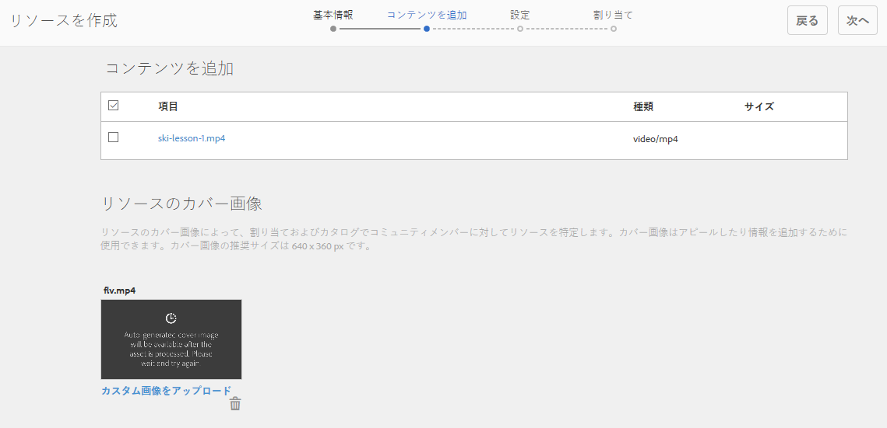

* **[!UICONTROL リソースのカバー画像]**

   カバー画像は、イネーブルメントリソースを最初に閲覧したときに表示される画像です。 例えば、ビデオリソースがまだ再生されていない場合に、カバー画像が表示されます。 カスタム画像がアップロードされない場合は、デフォルトの画像が表示されます。 ビデオリソースの場合、[サムネール](enablement.md#ffmpeg)を生成できますが、ビデオがURLとして参照されている場合は生成されません。 ロケーションリソースの場合、画像を使用して追加情報を提供できます。

   カバー画像の推奨サイズは640 x 360 pxです。

* 「**[!UICONTROL 次へ]**」を選択します。

### 3 設定 {#settings}

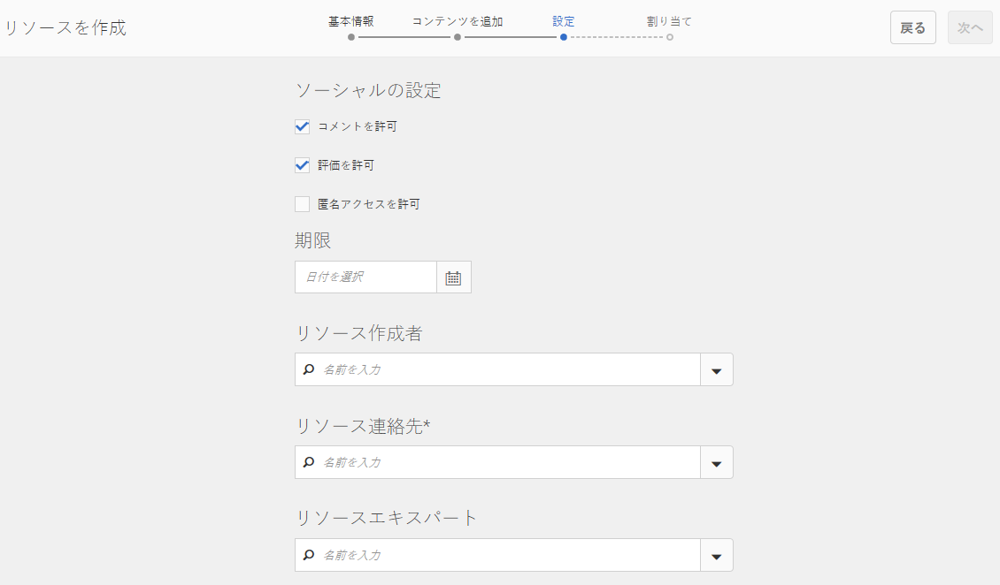

>[!NOTE]
>
>学習パスで参照されるイネーブルメントリソースに学習者を直接登録することはできません。学習者は、学習パスに登録する必要があります。
>
>メンバーがリソースとそのリソースを参照する学習パスの両方に登録されている場合、そのメンバーの割り当てには、単体のリソースと学習パス内のリソースの両方が表示されます。

* **[!UICONTROL ソーシャルの設定]**

   これらの設定は、イネーブルメントリソースに関する入力を学習者に与えるかどうかを制御します。 [モデレート設定](sites-console.md#moderation)は、親コミュニティサイトの設定です。

   * **[!UICONTROL コメントを許可]**

      オンにすると、メンバーはリソースにコメントを付けることができます。 初期設定はオンです。

   * **[!UICONTROL 評価を許可]**

      オンにすると、メンバーはリソースを評価できます。 初期設定はオンです。

   * **[!UICONTROL 匿名アクセスを許可]**

      オンにすると、コミュニティサイトで匿名アクセスも許可されている場合、匿名のサイト訪問者がカタログにリソースを表示できます。 初期設定はオフです。

* **[!UICONTROL 期限]**

   *（オプション）* 割り当てを完了する日付を選択できます。

* **[!UICONTROL リソース作成者]**

   *（オプション）* イネーブルメントリソースの作成者。プルダウンメニューを使用して、[メンバーグループ](#members-group)のメンバーの中から選択します。

* **[!UICONTROL リソース連絡先(&amp;A);]**

   *（必須）* メンバーがイネーブルメントリソースに関して連絡できる人。プルダウンメニューを使用して、[メンバーグループ](#members-group)のメンバーの中から選択します。

* **[!UICONTROL リソースエキスパート]**

   *（オプション）* イネーブルメントリソースに関する専門知識を持つメンバーに連絡できる人。プルダウンメニューを使用して[メンバーグループ](#members-group)のメンバーの中から選択します。

### 4 割り当て {#assignments}

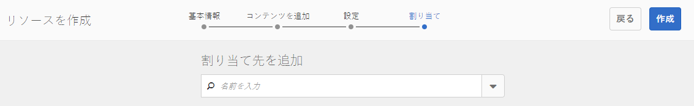

* **[!UICONTROL 割り当て先を追加]**

   プルダウンメニューを使用して、[メンバー](#members-group)から選択します。（太字で表示された）ユーザーとユーザーグループが学習者として登録されます。 メンバーがコミュニティサイトにサインインすると、メンバーが登録しているイネーブルメントリソース（および学習パス）が[割り当て](functions.md#assignments-function)ページに表示されます。

* 「**[!UICONTROL 作成]**」を選択します。

   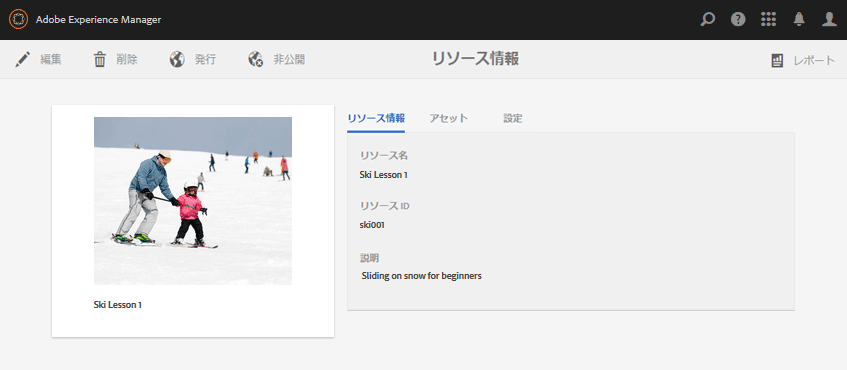

イネーブルメントリソースが正常に作成されると、リソースコンソールに戻ります。新しく作成されたリソースが選択状態になっています。このコンソールから、[リソース](#managing-a-resource)を管理できます。

## 学習パスの作成 {#create-a-learning-path}

新しい学習パスをコミュニティサイトに追加するには、

* `Create`アイコンを選択します。
* 表示されるサブメニューから、「**[!UICONTROL 学習パス]**」を選択します。

これにより、次の手順を実行するプロセスが開始されます。

* 学習パスの識別
* 学習パスを表すカード画像を学習者に提供する。
* 学習パスに含めるイネーブルメントリソースを参照します。
* 必要に応じて、生産資源を順序付けます。
* オプションで、前提条件の学習パスを識別します。
* 学習パスの連絡先の識別。
* メンバーを登録しています。

学習パスに含まれるイネーブルメントリソースについては、リソースごとではなく、学習パスの単位で割り当てをおこなう必要があります。

### 基本情報 {#basic-info-1}

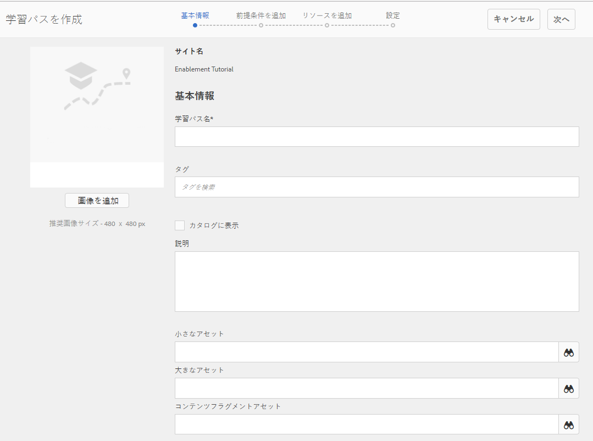

* **[!UICONTROL 画像を追加]**

   （*オプション*）メンバーの割り当てページおよびリソースコンソールの学習パスのカードに表示する画像。 イメージは、サーバーのローカルファイルシステムから選択されます。 画像を指定しない場合、アップロードされたリソースのサムネールが生成されます。

   ***注意***:推奨される画像サイズが480 x 480ピクセルではなくなりました。カードは様々なブラウザーサイズにレスポンシブデザインなので、表示サイズは220 X 165ピクセルから400 x 165ピクセルまで様々です。

* **[!UICONTROL サイト名]**

   （*読み取り専用*）リソースを追加するコミュニティサイト。

* **[!UICONTROL 学習パス名]**

   （*必須*）学習パスの表示名。 有効なノード名は、表示名から作成されます。

* **[!UICONTROL タグ]**

   （*オプション*）学習パスを1つ以上のカタログに関連付ける1つ以上のタグを選択できます。 [実施可能リソースのタグ付け](tag-resources.md)を参照してください。

* **[!UICONTROL カタログに表示]**

   オフにすると、学習パスはどのカタログにも表示されません。 オンにすると、学習パスがすべてのカタログに表示されます。ただし、[事前にフィルタリングされている](catalog-developer-essentials.md#pre-filters)場合と、メンバーが UI からフィルタリングした場合は除きます。カタログに学習パスを表示すると、含まれるすべてのリソースに対して間接的に読み取りアクセス権が付与されます。 初期設定はオフです。

* **[!UICONTROL 説明]**

   （*オプション*）イネーブルメントリソースに対して表示する説明。

* **[!UICONTROL 小さなアセット]**

   （*オプション*）AEM Assetsから選択します。 カタログ内など、パブリッシュ環境でリソースを表すサムネイル画像です。

* **[!UICONTROL 大きなアセット]**

   （*オプション*）AEM Assetsから選択します。 リソースのメインページなど、パブリッシュ環境でリソースを表す大きな画像です。

* **[!UICONTROL コンテンツフラグメントアセット]**

   （*オプション*）AEM Assetsから選択します。 パブリッシュ環境で参照できるコンテンツフラグメント。ただし、初期設定では使用されません。

* 「**[!UICONTROL 次へ]**」を選択します。

### 前提条件を追加 {#add-prerequisites}

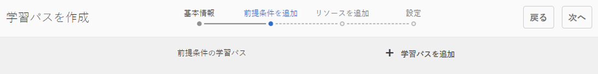

* **[!UICONTROL 前提条件の学習パス]**

   （*オプション*）公開されている他の学習パスを選択した場合は、学習者がこの学習パスを選択できるようにする前に、パスを入力する必要があります。

* 「**[!UICONTROL 次へ]**」を選択します。

### リソースを追加 {#add-resources}

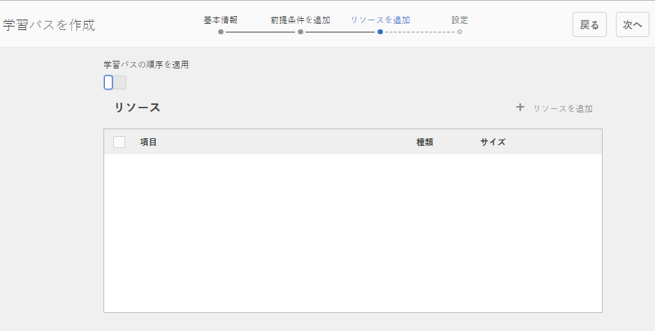

* **[!UICONTROL 学習パスの順序を適用]**

   （*オプション*）「オン」に設定すると、イネーブルメントリソースを追加する順序が、学習パスを進むために学習者が必要となる順序になります。 初期設定はオフです。

* **[!UICONTROL リソース]**

   現在のコミュニティサイト用に作成された&#x200B;*公開済み*&#x200B;イネーブルメントリソースの中から1つ以上のリソースを選択します。

>[!NOTE]
>
>学習パスと同じレベルのリソースのみを選択できます。例えば、グループ内に作成された学習パスには、グループレベルのリソースのみを使用できます。コミュニティサイト内に作成された学習パスには、そのサイト内のリソースを追加できます。

* 「**[!UICONTROL 次へ]**」を選択します。

### 設定 {#settings-1}

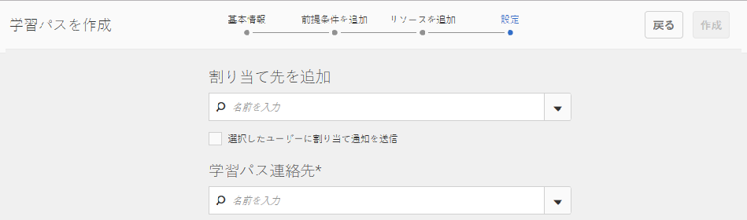

* **[!UICONTROL 登録を追加]**

   プルダウンメニューを使用して、コミュニティサイトの[メンバーグループ](#members-group)のメンバーであるメンバーとメンバーグループ（太字で表示）から選択します。 最初に学習パスを作成する際に、割り当てを追加する必要はありません。 学習パスのプロパティを変更して、後で学習者を追加できます。

* **[!UICONTROL 学習パスの連絡先(&amp;A);]**

   *（必須）* メンバーが学習パスに関して連絡できる人。プルダウンメニューを使用して、コミュニティサイトの[メンバーグループ](#members-group)のメンバーの中から選択します。

* 「**[!UICONTROL 作成]**」を選択します。

>[!NOTE]
>
>学習パスにより参照されているイネーブルメントリソースに、同じ割り当て先（学習者）を登録する必要はありません（該当する場合）。
>
>メンバーがイネーブルメントリソースとそのリソースを参照する学習パスの両方に登録されている場合、そのメンバーの割り当てには、単体のリソースと学習パス内のリソースの両方が表示されます。

## リソースの管理  {#managing-a-resource}

単一のイネーブルメントリソースを管理するには：

* **[!UICONTROL リソース]**&#x200B;コンソールから、リソースを含むコミュニティサイトを選択します。
* リソースを選択します。

選択したイネーブルメントリソースに対し、以下を実行できます。

* プロパティの表示（デフォルト）
* プロパティの編集
* 削除
* 公開
* 非公開

新しいバージョンのイネーブルメントリソースをアップロードする際は、新しいリソースを作成したうえで、古いバージョンのリソースからメンバーを登録解除して新しいバージョンのリソースに登録することを推奨します。

### リソースの編集 {#edit-resource}

鉛筆アイコンを選択すると、イネーブルメントリソースを作成したときと同じ手順が表示されるので、ここで設定を変更できます。

「設定」の手順の割り当て先だけを変更する場合は、変更して保存すると、変更が公開されます。その他の変更を加えた場合は、保存後にリソースを明示的に公開する必要があります。

### リソースの削除 {#delete-resource}

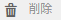

ごみ箱アイコンを選択すると、確認後にイネーブルメントリソースが`Deleted`になります。

### 公開 {#publish}

学習者が割り当てられたイネーブルメントリソースを確認できるようにするには、以下の手順でリソースを公開する必要があります。

* `Publish`のワールドアイコンを選択します。
* ポップアップ表示されるダイアログで、「**[!UICONTROL 公開]**」を再度選択します。
* **[!UICONTROL 閉じる]**&#x200B;を選択します。

ダイアログに「アクションは待機中です」と表示されても、通常はすぐに公開されます。

### 非公開 {#unpublish}

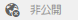

パブリッシュ環境のメンバーが削除せずに一時的にイネーブルメントリソースにアクセスできなくするには、ワールドアイコンを使用してリソースを`Unpublish`します。

### レポート {#report}

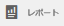

「レポート」アイコンを選択すると、学習者がパブリッシュ環境で割り当てられたイネーブルメントリソースに接したときに生成されるレポートにアクセスできます。レポートは、リソースのタイプに応じて異なります。

すべての学習パスに関して、リソースまたは学習者( `User Report` )に基づくレポートを表示できます。

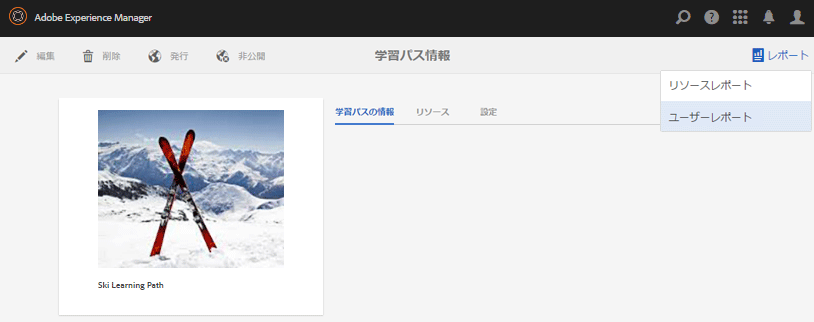

このレポートは、現在のイネーブルメントリソースまたは学習パスに関するものです。表示されるレポートの深さは、[Adobe Analytics](analytics.md)がライセンスを受けてコミュニティサイトで有効になっているかどうかによって異なります。 [タイムライン](#timeline)、[ビューアのエンゲージメント](#viewer-engagement)および[デバイス別のエンゲージメント](#engagement-by-device)レポートは、[ポーリング間隔](analytics.md#report-importer)に基づいてAdobe Analyticsからインポートされます。

どのイネーブルメントリソースでも、Adobe Analytics が有効かどうかに関係なく、[担当者ステータス](#assignee-status)および[評価](#ratings)に関するレポートと、[レポートサマリ](#report-summary)テーブルを利用できます。

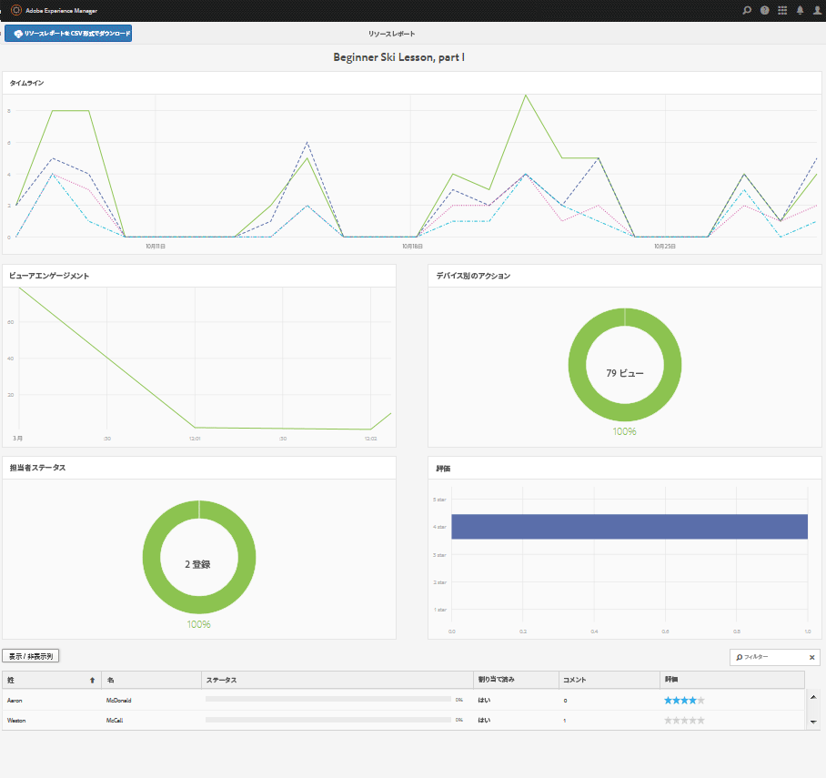

#### タイムライン {#timeline}

Analytics のタイムラインレポートには、このイネーブルメントリソースで以下のイベントが発生した時刻が表示されます。

* **表示**

   表示とは、学習者がリソースの詳細ページを訪問したときのことです。

* **再生**

   再生とは、alNewerがビデオの再生やPDFの開封など、リソースとやり取りするときです。

* **Ratings**

   評価とは、学習者がリソースに星評価を割り当てたときです。

* **コメント**

   コメントは、 alNearnerがコメントを追加したときに表示されます。

縦軸はイベント数です。

横軸はカレンダー時間です。

[Adobe Analytics が必要](sites-console.md#analytics)です。

#### Viewer Engagement {#viewer-engagement}

Analytics のビューアエンゲージメントレポート（ビデオリソース用）には、リソースを表示した学習者の数が表示されます。また、学習者が最後まで再生しなかった場合は、再生をやめた時点が表示されます。

縦軸はこのリソースを表示した学習者の数です。

横軸はこのリソースの期間です。

[Marketing Cloud 組織 ID が必要](sites-console.md#enablement)です。

#### デバイス別のアクション  {#engagement-by-device}

Analytics のデバイス別のアクションレポート（ビデオリソース用）には、デスクトップとモバイルから再生された閲覧数の割合が表示されます。

[Marketing Cloud 組織 ID が必要](sites-console.md#enablement)です。

#### 担当者ステータス  {#assignee-status}

担当者ステータスレポートには、以下の分類に該当する学習者の数が表示されます。

* **未開始**
* **処理中**
* **完了**

#### 評価 {#ratings}

評価レポートには、イネーブルメントリソースを評価した学習者の数が表示されます。それぞれの星評価の数に加え、評価の合計数と平均評価の概要が表示されます。

#### レポートサマリ  {#report-summary}

イネーブルメントリソースの場合、「レポートの概要」は表に表示されます。

* リソースを操作した各学習者
   * ステータス
   * リソースが割り当てられたかどうか
      * カタログでのリソースの検索とは異なります。
      * 投稿されたコメント数
      * 与えられた評価（ある場合）

学習パスのリソースレポートの場合、レポートサマリには以下の内容が表示されます。

* 学習パスに含まれる各リソース
   * 公開ステータス
   * ビュー数
   * 再生回数
   * 平均評価
   * 形式
   * サイズ
   * コミュニティサイト名

学習パス「ユーザーレポート」の場合、「レポート概要」は表に示されます。

* 学習パスに割り当てられている各学習者：
   * 完了したリソースの数。
   * 彼らのステータス。

`Show / hide columns`セレクターを使用して列を選択することで、テーブルの表示を調整できます。

#### CSV 形式でのレポートのダウンロード {#download-report-as-csv}

コンソール上部のボタンを使用して、「レポートの概要」テーブルを CSV 形式でダウンロードできます。

* イネーブルメントリソースの場合：`Download Resource Report as CSV`ボタンを押します。
* 学習パスの場合：`Download Learning Path Report as CSV`ボタンを押します。

一部の列だけを表示するよう選択している場合でも、「レポートの概要」テーブルのすべての列がダウンロードされます。
