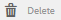
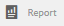

# イネーブルメントリソースのコンソール {#enablement-resources-console}

AEM Communities のリソースコンソールは、[イネーブルメントマネージャー](users.md)が、イネーブルメントコミュニティサイトのリソースの作成、管理、メンバーへの割り当てをおこなう場所です。

## 要件 {#requirements}

コミュニティサイトにイネーブルメントリソースを追加する前に、以下のものを含め、AEM インスタンスを適切に設定しておく必要があります。

* SCORM
* FFmpeg

For details, see [Configuring Enablement](enablement.md).

>[!CAUTION]
>
>コミュニティサイトの作成後に SCORM をインストールした場合は、SCORM をインストールする前に存在していたイネーブルメントリソースを作成し直す必要があります。

>[!NOTE]
>
>[AEM 6.3](deploy-communities.md#latestfeaturepack) 、および同等のCommunities機能パックAEM 6.2 FP3と [AEM 6.1 FP7](deploy-communities.md#latestfeaturepack) (https://docs.adobe.com/content/docs/en/aem/6-1/deploy/communities.html#Latest Feature Pack)のリリース時には、有効化機能を使用するには、 []SQLデータベースのSQLデータベースを使用する必要がなくなりました。

## 用語 {#terminology}

### リソース {#resource}

リソースは[イネーブルメントコミュニティ](overview.md#enablement-community)に欠かせないものです。彼らは、彼らの技能を向上させるために会員に割り当てられた資料です。

リソースの特性：

* 次のタイプの場合があります。
   * 画像(JPG、PNG、GIF、BMP)
   * ビデオ(MP4)
   * Flash(SWF)
   * Document (PDF)
   * クイズ(SCORM)
* 1つ以上の学習パスから参照できます。

### 学習パス {#learning-path}

学習パスは、メンバーへの割り当てを容易にするために、複数のイネーブルメントリソースを論理的にグループ化したものです。

### メンバーグループ {#members-group}

コミュニティサイトの作成時にサイトの URL に指定した名前が、様々な役割にふさわしい権限を持つ[サイト固有のユーザーグループ](users.md)を作成する際に使用されます。All of these automatically created groups are prefixed with `Community <site-name>`.

One such user group is `Community <site-name> Members` group, which identifies registered users in the publish environment as community members. See the tutorial [Getting Started with AEM Communities for Enablement](getting-started-enablement.md) for an example.

For [engagement communities](overview.md#egagementcommunity), it is reasonable to allow site visitors to self-register or use social login, at which point they are automatically added to the members group.

[イネーブルメントコミュニティ](overview.md#enablement-community)の場合は、サイトを非公開にすることを推奨します。非公開のサイトでは、管理者がユーザーをメンバーグループに追加する必要があります。

## コミュニティサイトのイネーブルメントリソースへのアクセス {#accessing-a-community-site-s-enablement-resources}

### コミュニティリソースへの移動 {#navigate-to-communities-resources}

オーサー環境でリソースコンソールに移動するには、

* From global navigation: **[!UICONTROL Navigation]** > **[!UICONTROL Communities]** > **[!UICONTROL Resources]**

   

### コミュニティサイトの選択 {#select-a-community-site}

コミュニティリソースコンソールには、すべてのコミュニティサイトが表示されます。

リソースコンソールで特定のコミュニティサイトを選択すると、そのサイトに対してイネーブルメントリソースが作成されます。

特定のコミュニティサイトを選択した後は、既存のイネーブルメントリソースや学習パスにアクセスして管理や変更をおこなったり、新しいイネーブルメントリソースや学習パスを作成したりできます。

#### 検索 {#search-features}

イネーブルメントリソースまたは学習パスを検索するには、サイドパネル切り替えアイコンを選択します。選択すると、検索パネルがコンソールの左側に開き、検索用語を入力するためのテキストボックスが表示されます。

#### 選択モード {#selection-mode}

複数のイネーブルメントリソースを選択するには、まず 1 つ目のカードにカーソルを合わせてチェックマークアイコンをクリックし、選択状態にします。選択した他のカードを選択すると、そのカードが選択グループに追加されます。 もう一度選択すると、カードの選択が解除されます。

## リソースの作成 {#create-a-resource}

コミュニティサイトに新しいイネーブルメントリソースを追加するには、

* Select the `Create` icon.
* From the sub-menu which displays, select **[!UICONTROL Resource]**.

これにより、次の手順を実行するプロセスが開始されます。

* リソース（名前、カードの画像、テキスト）を説明しています。
* リソースの内容の選択
* リソースの表紙画像を選択する。
* リソースの連絡先を識別しています。
* メンバーへのリソースの割り当て

リソースがコース（学習パス）に含まれている場合は、メンバーを学習パスに割り当てる必要があります。有効化リソースの作成後に割り当てを追加できます。

### 1 基本情報 {#basic-info}

* **[!UICONTROL 画像を追加]**

   (*Optional*) An image to display on the card for the enablement resource in the member&#39;s assignments page as well as the Resources console. イメージは、サーバーのローカルファイルシステムから選択されます。 画像が指定されていない場合は、アップロードされたリソースのサムネールが生成されます。

   ***注意***:推奨される画像サイズは、480 x 480ピクセルではありません。 カードのレスポンシブデザインが様々なブラウザーサイズに対応するので、表示サイズは220 X 165ピクセルから400 x 165ピクセルに変わります。

* **[!UICONTROL サイト名]**

   (*readonly*) The community site to which the resource is being added.

* **[!UICONTROL リソース名]**

   (*Required*) The display name for the resource. 表示名から有効なノード名が作成されます。

* **[!UICONTROL タグ]**

   (*Optional*) One or more tags may be chosen which associate the enablement resource with one or more catalogs. [実施可能リソースのタグ付け](tag-resources.md)を参照してください。

* **[!UICONTROL カタログに表示]**

   オフにすると、有効化リソースはカタログに表示されません。 オンにすると、イネーブルメントリソースがすべてのカタログに表示されます。ただし、[事前にフィルタリングされている](catalog-developer-essentials.md#pre-filters)場合と、メンバーが UI からフィルタリングした場合は除きます。初期設定はオフです。

* **[!UICONTROL 説明]**

   (*Optional*) The description to display for the enablement resource.

* **[!UICONTROL 小さなアセット]**

   (オプ&#x200B;*ション*)AEM Assetsから選択されます。 カタログ内など、パブリッシュ環境でリソースを表すサムネイル画像です。

* **[!UICONTROL 大きなアセット]**

   (オプ&#x200B;*ション*)AEM Assetsから選択されます。 リソースのメインページなど、パブリッシュ環境でリソースを表す大きな画像です。

* **[!UICONTROL コンテンツフラグメントアセット]**

   (オプ&#x200B;*ション*)AEM Assetsから選択されます。 パブリッシュ環境で参照できるコンテンツフラグメント。ただし、初期設定では使用されません。

* 「**[!UICONTROL 次へ]**」を選択します。

### 2 コンテンツの追加 {#add-content}

複数のイネーブルメントリソースを選択できるように見えますが、選択できるのは 1 つだけです。

Select the `'+' icon`, in the upper right corner, to begin the process of choosing the resource by identifying the source.

* **[!UICONTROL ローカルファイルからアップロード]**

   ローカルファイルシステムからアップロードする場合、ネイティブのファイルブラウザーを使用してファイルを選択し、アップロードします。 サポートされるファイルタイプは、SCORM.zip（HTML5またはSWF）、MP4ビデオ、SWF、PDF、画像タイプ(JPG、PNG、GIF、BMP)です。 ファイル名がアセットの名前になり、アセットライブラリに追加されます。

* **[!UICONTROL アセットライブラリを参照]**

   アセットライブラリから選択します。 選択は、コミュニティサイト内に表示されるものに制限されます。

* **[!UICONTROL 外部 URL を追加]**

   学習コンテンツへのリンクを入力します。

   表示されたダイアログに以下を入力します。

   * **[!UICONTROL タイトル]**

      有効化リソースのアセットの名前。

   * **[!UICONTROL URL]**

      アセットのURL。

* **[!UICONTROL Adobe Connect URL を追加]**

   Adobe Connectセッションへのリンクを入力します。

   表示されたダイアログに以下を入力します。

   * **[!UICONTROL タイトル]**

      有効化リソースのアセットの名前。

   * **[!UICONTROL URL]**

      Adobe Connect セッションの URL です。

* **[!UICONTROL 外部リソースを定義]**

   材料を表示する場所を入力します。 The values for the success status and score are entered manually (see [Reports](reports.md)). アップロードされた表紙画像を使用して、追加情報を提供できます。

   表示されたダイアログに以下を入力します。

   * **[!UICONTROL タイトル]**

      有効化リソースのアセットの名前。

   * **[!UICONTROL 場所]**

      教室などの物理サイトの場所。

#### 追加されたビデオリソースの例 {#example-of-an-added-video-resource}

* **[!UICONTROL リソースのカバー画像]**

   カバー画像は、イネーブルメントリソースが最初に表示されたときに表示される画像です。 例えば、ビデオリソースがまだ再生されていない場合は、カバー画像が表示されます。 カスタム画像がアップロードされない場合は、デフォルトの画像が表示されます。 For video resources, it may be possible to [generate a thumbnail](enablement.md#ffmpeg), but only when uploaded and not when the video is referenced as an URL. 場所のリソースの場合、画像を使用して追加情報を提供できます。

   カバー画像の推奨サイズは640 x 360ピクセルです。

* 「**[!UICONTROL 次へ]**」を選択します。

### 3 設定 {#settings}

>[!NOTE]
>
>学習パスで参照されるイネーブルメントリソースに学習者を直接登録することはできません。学習者は、学習パスに登録する必要があります。
>
>メンバーがリソースとそのリソースを参照する学習パスの両方に登録されている場合、そのメンバーの割り当てには、単体のリソースと学習パス内のリソースの両方が表示されます。

* **[!UICONTROL ソーシャルの設定]**

   これらの設定は、学習者がイネーブルメントリソースに関する入力を提供できるかどうかを制御します。 The [moderation settings](sites-console.md#moderation) are those of the parent community site.

   * **[!UICONTROL コメントを許可]**

      このオプションを選択すると、メンバーはリソースに対するコメントを許可されます。 初期設定はオンです。

   * **[!UICONTROL 評価を許可]**

      このオプションを選択すると、メンバーはリソースの評価を許可されます。 初期設定はオンです。

   * **[!UICONTROL 匿名アクセスを許可]**

      このオプションを選択すると、匿名サイト訪問者は、コミュニティサイトで匿名アクセスが許可されている場合に、カタログ内の表示を許可されます。 初期設定はオフです。

* **[!UICONTROL 期限]**

   *（オプション）* 、割り当てを完了する日付を選択できます。

* **[!UICONTROL リソース作成者]**

   *（オプション）* 、イネーブルメントリソースの作成者。 プルダウンメニューを使用して、[メンバーグループ](#members-group)のメンバーの中から選択します。

* **[!UICONTROL Resource Contact&amp;ast;]**

   *（必須）* 、有効化リソースに関してメンバーが連絡できる人。 プルダウンメニューを使用して、[メンバーグループ](#members-group)のメンバーの中から選択します。

* **[!UICONTROL リソースエキスパート]**

   *（オプション）* 、イネーブルメントリソースに関する専門知識を持つメンバーが連絡を取ることができる人。 プルダウンメニューを使用して[メンバーグループ](#members-group)のメンバーの中から選択します。

### 4 割り当て {#assignments}

* **[!UICONTROL 割り当て先を追加]**

   Use the pulldown menu to select from [members](#members-group) - The users and user groups (listed in bold face) - who are to be enrolled as Learners. When members sign into the community site, the enablement resources (and learning paths) in which they are enrolled will appear on their [Assignments](functions.md#assignments-function) page.

* 「**[!UICONTROL 作成]**」を選択します。

   

イネーブルメントリソースが正常に作成されると、リソースコンソールに戻ります。新しく作成されたリソースが選択状態になっています。From this console, it is possible to [manage the resource](#managing-a-resource).

## 学習パスの作成 {#create-a-learning-path}

新しい学習パスをコミュニティサイトに追加するには、

* Select the `Create` icon
* From the sub-menu which displays, select **[!UICONTROL Learning Path]**.

これにより、次の手順を実行するプロセスが開始されます。

* 学習パスの識別。
* 学習者に学習パスを表すカード画像を提供する。
* 学習パスに含めるイネーブルメントリソースの参照。
* 必要に応じて、リソースを並べ替えます。
* 必要に応じて、前提条件の学習パスを識別します。
* 学習パスの連絡先の識別。
* メンバーの登録。

学習パスに含まれるイネーブルメントリソースについては、リソースごとではなく、学習パスの単位で割り当てをおこなう必要があります。

### 基本情報 {#basic-info-1}

* **[!UICONTROL 画像を追加]**

   (*Optional*) An image to display on the card for the learning path in the member&#39;s assignments page as well as the Resources console. イメージは、サーバーのローカルファイルシステムから選択されます。 画像が指定されていない場合は、アップロードされたリソースのサムネールが生成されます。

   ***注意***:推奨される画像サイズが480 x 480ピクセルではなくなりました。 カードのレスポンシブデザインが様々なブラウザーサイズに対応するので、表示サイズは220 X 165ピクセルから400 x 165ピクセルに変わります。

* **[!UICONTROL サイト名]**

   (*Readonly*) The community site to which the resource is being added.

* **[!UICONTROL 学習パス名]**

   (必&#x200B;*須*)学習パスの表示名。 表示名から有効なノード名が作成されます。

* **[!UICONTROL タグ]**

   (*Optional*) One or more tags may be chosen which associate the learning path with one or more catalogs. [実施可能リソースのタグ付け](tag-resources.md)を参照してください。

* **[!UICONTROL カタログに表示]**

   このチェックボックスをオフにすると、学習パスはどのカタログにも表示されません。 オンにすると、学習パスがすべてのカタログに表示されます。ただし、[事前にフィルタリングされている](catalog-developer-essentials.md#pre-filters)場合と、メンバーが UI からフィルタリングした場合は除きます。カタログに学習パスを表示すると、その中に含まれるすべてのリソースにREADアクセス権が間接的に付与されます。 初期設定はオフです。

* **[!UICONTROL 説明]**

   (*Optional*) The description to display for the enablement resource.

* **[!UICONTROL 小さなアセット]**

   (オプ&#x200B;*ション*)AEM Assetsから選択されます。 カタログ内など、パブリッシュ環境でリソースを表すサムネイル画像です。

* **[!UICONTROL 大きなアセット]**

   (オプ&#x200B;*ション*)AEM Assetsから選択されます。 リソースのメインページなど、パブリッシュ環境でリソースを表す大きな画像です。

* **[!UICONTROL コンテンツフラグメントアセット]**

   (オプ&#x200B;*ション*)AEM Assetsから選択されます。 パブリッシュ環境で参照できるコンテンツフラグメント。ただし、初期設定では使用されません。

* 「**[!UICONTROL 次へ]**」を選択します。

### 前提条件を追加 {#add-prerequisites}

* **[!UICONTROL 前提条件の学習パス]**

   (*Optional*) When other published learning paths are selected, they must be completed before a learner can select this learning path.

* 「**[!UICONTROL 次へ]**」を選択します。

### リソースを追加 {#add-resources}

* **[!UICONTROL 学習パスの順序を適用]**

   (*Optional*) If set to On, then the order in which the enablement resources are added is the order in which learners are required to proceed through the learning path. 初期設定はオフです。

* **[!UICONTROL リソース]**

   One or more Resources chosen from among the *published* enablement resources created for the current community site.

>[!NOTE]
>
>学習パスと同じレベルのリソースのみを選択できます。例えば、グループ内に作成された学習パスには、グループレベルのリソースのみを使用できます。コミュニティサイト内に作成された学習パスには、そのサイト内のリソースを追加できます。

* 「**[!UICONTROL 次へ]**」を選択します。

### 設定 {#settings-1}

* **[!UICONTROL 登録を追加]**

   Use the pulldown menu to select from the members and member groups (listed in bold face) who are members of the community site&#39;s [members group](#members-group). 最初に学習パスを作成する際に、割り当てを追加する必要はありません。 学習パスのプロパティを変更して、後で学習者を追加できます。

* **[!UICONTROL 学習パスの連絡先(&amp;A);ast;]**

   *（必須）* 、メンバーが学習パスに関して連絡できる人。 プルダウンメニューを使用して、コミュニティサイトの[メンバーグループ](#members-group)のメンバーの中から選択します。

* 「**[!UICONTROL 作成]**」を選択します。

>[!NOTE]
>
>学習パスにより参照されているイネーブルメントリソースに、同じ割り当て先（学習者）を登録する必要はありません（該当する場合）。
>
>メンバーがイネーブルメントリソースとそのリソースを参照する学習パスの両方に登録されている場合、そのメンバーの割り当てには、単体のリソースと学習パス内のリソースの両方が表示されます。

## リソースの管理 {#managing-a-resource}

単一の有効化リソースを管理するには：

* リソースコン **[!UICONTROL ソールから]** 、リソースを含むコミュニティサイトを選択します。
* リソースを選択します。

選択したイネーブルメントリソースに対し、以下を実行できます。

* プロパティの表示（デフォルト）
* プロパティの編集
* 削除
* 公開
* 非公開

新しいバージョンのイネーブルメントリソースをアップロードする際は、新しいリソースを作成したうえで、古いバージョンのリソースからメンバーを登録解除して新しいバージョンのリソースに登録することを推奨します。

### リソースの編集 {#edit-resource}

鉛筆アイコンを選択すると、イネーブルメントリソースを作成したときと同じ手順が表示されるので、ここで設定を変更できます。

「設定」の手順の割り当て先だけを変更する場合は、変更して保存すると、変更が公開されます。その他の変更が行われた場合は、保存後にリソースを明示的に発行する必要があります。

### リソースの削除 {#delete-resource}

By selecting the trashcan icon, the enablement resource will be `Deleted` after confirmation.

### 公開 {#publish}

学習者が割り当てられたイネーブルメントリソースを確認できるようにするには、以下の手順でリソースを公開する必要があります。

* Select the world icon to `Publish`.
* In the dialog which pops up, select **[!UICONTROL Publish]** again.
* Select **[!UICONTROL Close]**.

ダイアログに「アクションは待機中です」と表示されても、通常はすぐに公開されます。

### 非公開 {#unpublish}

To temporarily make the enablement resources unaccessible to members in the publish environment without deleting it, use the world icon to `Unpublish` the resource.

### レポート {#report}

「レポート」アイコンを選択すると、学習者がパブリッシュ環境で割り当てられたイネーブルメントリソースに接したときに生成されるレポートにアクセスできます。レポートは、リソースのタイプによって異なります。

For all learning paths, it is possible to view a report based either on resources or learners ( `User Report`.)

このレポートは、現在のイネーブルメントリソースまたは学習パスに関するものです。The depth of reporting provided depends on whether or not [Adobe Analytics](analytics.md) is licensed and enabled for the community site. The [Timeline](#timeline), [Viewer Engagement](#viewer-engagement), and [Engagement by Device](#engagement-by-device) reports are imported from Adobe Analytics based on the [polling interval](analytics.md#report-importer).

どのイネーブルメントリソースでも、Adobe Analytics が有効かどうかに関係なく、[担当者ステータス](#assignee-status)および[評価](#ratings)に関するレポートと、[レポートサマリ](#report-summary)テーブルを利用できます。

#### タイムライン {#timeline}

Analytics のタイムラインレポートには、このイネーブルメントリソースで以下のイベントが発生した時刻が表示されます。

* **表示**

   表示とは、学習者がリソースの詳細ページを訪問したときのことです。

* **再生**

   再生とは、ビデオの再生やPDFの開き方など、すべての学習者がリソースを操作する場合のことです。

* **Ratings**

   評価とは、学習者がリソースに星評価を割り当てたときのことです。

* **コメント**

   コメントは、alLearnerがコメントを追加したときに使用されます。

縦軸はイベント数です。

横軸はカレンダー時間です。

[Adobe Analytics が必要](sites-console.md#analytics)です。

#### Viewer Engagement {#viewer-engagement}

Analytics のビューアエンゲージメントレポート（ビデオリソース用）には、リソースを表示した学習者の数が表示されます。また、学習者が最後まで再生しなかった場合は、再生をやめた時点が表示されます。

縦軸はこのリソースを表示した学習者の数です。

横軸はこのリソースの期間です。

[Marketing Cloud 組織 ID が必要](sites-console.md#enablement)です。

#### デバイス別のアクション {#engagement-by-device}

Analytics のデバイス別のアクションレポート（ビデオリソース用）には、デスクトップとモバイルから再生された閲覧数の割合が表示されます。

[Marketing Cloud 組織 ID が必要](sites-console.md#enablement)です。

#### 担当者ステータス {#assignee-status}

担当者ステータスレポートには、以下の分類に該当する学習者の数が表示されます。

* **未開始**
* **処理中**
* **完了**

#### 評価 {#ratings}

評価レポートには、イネーブルメントリソースを評価した学習者の数が表示されます。それぞれの星評価の数に加え、評価の合計数と平均評価の概要が表示されます。

#### レポートサマリ {#report-summary}

有効化リソースの場合、「レポートの概要」は表です。

* リソースに対して何らかの操作を行った各学習者
   * 彼らのステータス
   * リソースが割り当てられたかどうか
      * カタログ内のリソースを見つけるのとは対照的に
      * 投稿されたコメントの数
      * 与えられた評価（ある場合）

学習パスのリソースレポートの場合、レポートサマリには以下の内容が表示されます。

* 学習パスに含まれる各リソース
   * 公開ステータス
   * 表示数
   * 再生回数
   * 平均評価
   * ファイル形式
   * サイズ
   * コミュニティサイト名

学習パスのユーザレポートの場合、レポートサマリは表で示されます。

* 学習パスに割り当てられている各学習者：
   * 完了したリソースの数。
   * 彼らの地位。

It is possible to adjust the display of the table by selecting columns using the `Show / hide columns` selector.

#### CSV 形式でのレポートのダウンロード {#download-report-as-csv}

コンソール上部のボタンを使用して、「レポートの概要」テーブルを CSV 形式でダウンロードできます。

* 有効化リソースの場合：ボタ `Download Resource Report as CSV` ン。
* 学習パスの場合：ボタ `Download Learning Path Report as CSV` ン。

一部の列だけを表示するよう選択している場合でも、「レポートの概要」テーブルのすべての列がダウンロードされます。
