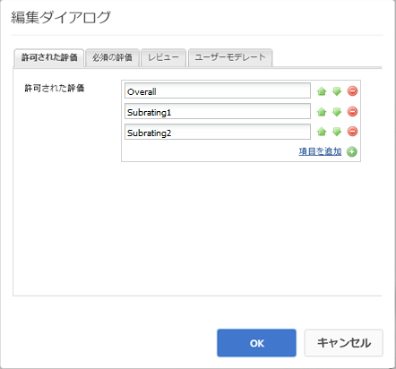
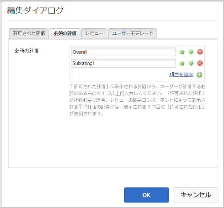
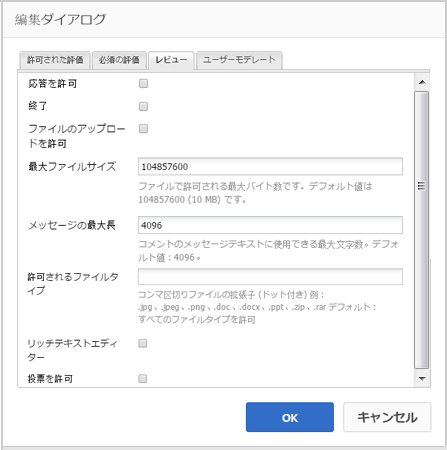
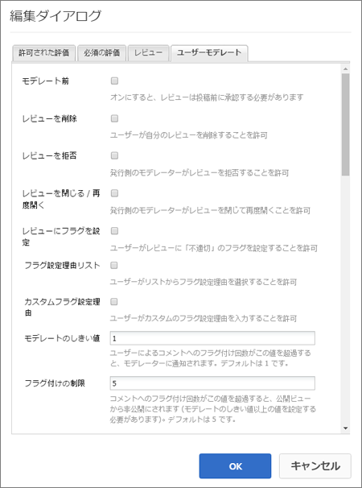
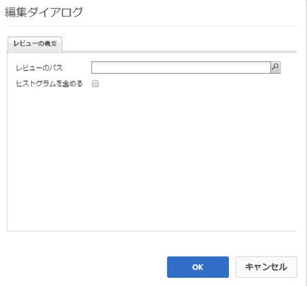
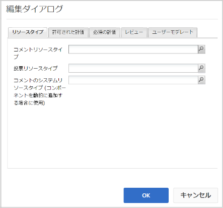

# レビューおよびレビューの概要（表示）の使用 {#using-reviews-and-reviews-summary-display}

The `Reviews` component is a composite of [Comments](comments.md) and [Rating](rating.md) components ready for use.

The `Reviews Summary (Display)` component provides a summary of an active or closed instance of a `Reviews` component for display elsewhere on the site.

>[!NOTE]
>
>匿名でのレビュー投稿はサポートされていません。サイト訪問者は参加するには、登録（会員になる）し、サインインする必要があります。 ログインした訪問者は、いつでもレビューを更新できます。

## レビューをページに追加 {#adding-a-review-to-a-page}

作成者モードでページに `Reviews` コンポーネントを追加するには、コンポーネントブラウザを使用してコンポーネントを検索 `Communities / Reviews` し、ページ上の位置（ユーザが確認できる機能に対する相対位置など）にドラッグします。

For necessary information, visit [Communities Components Basics](basics.md).

[必要なクライアント側のライブラリが含まれる場合](reviews-basics.md#essentials-for-client-side) 、これがコンポー `Reviews` ネントの表示方法です。

## レビューの設定 {#configuring-reviews}

Select the placed `Reviews` component to access and select the `Configure` icon which opens the edit dialog.

Under the **[!UICONTROL Allowed Ratings]** tab, specify the complete list of ratings to be shown to members. The first rating should be an overall/general rating, as it is the rating which provides the average rating for the `Review Summary (Display)` component. デフォルト設定の次の2つの評価には、「サブレーティング1」または「サブレーティング2」以外の異なるタイトルを付ける必要があります。

* **[!UICONTROL 許可された評価]**

   メンバーが選択できる評価のリスト。

   表示される選択肢を変更するには、上向き矢印、下向き矢印および削除ボタンを使用します。

   評価の選択肢を追加するには、「**[!UICONTROL 項目を追加]**」をクリックします。

Under the **[!UICONTROL Required Ratings]** tab, re-enter items from the list of **[!UICONTROL Allowed Ratings]** that are required to be rated. [評価の許可]タブで項目が指定されていない場合は、その項目がメンバによって送信されたときにマークが付いていない状態になることがあります。

Web サイト上では、必須の評価はアスタリスク付きで表示されます。項目が必須でマークが付いていない場合は、メンバーにメッセージが表示され、必須の評価がすべてマークされるまで送信が拒否されます。

* **[!UICONTROL 必須の評価]**

   許可されている評価のサブセット。必要な評価を示します。

   表示される選択肢を変更するには、上向き矢印、下向き矢印および削除ボタンを使用します。

   回答の選択肢を追加するには、「**[!UICONTROL 項目を追加]**」をクリックします。

>[!NOTE]
>
>If an item is entered on the **[!UICONTROL Required Ratings]** tab that is not specified on the **[!UICONTROL Allowed Ratings]** tab, then it is not included in the items to rate.

Under the **[!UICONTROL Reviews]** tab, specify how reviews are handled.

* **[!UICONTROL 応答を許可]**

   オンの場合、レビューへの返信を許可します。 初期設定はオフです。

* **[!UICONTROL 閉じる]**

   このオプションを選択すると、レビューは新しいレビューと返信に対して閉じられます。 初期設定はオフです。

* **[!UICONTROL ファイルのアップロードを許可]**

   このオプションを選択すると、レビュー用に添付ファイルをアップロードできます。 初期設定はオフです。

* **最大ファイルサイズ**

   「 **[!UICONTROL Allow File Uploads]** 」がオンになっている場合にのみ関連します。 このフィールドは、アップロードするファイルのサイズ（バイト単位）を制限します。デフォルトは 10 MB です。

* **[!UICONTROL メッセージの最大長]**

   テキストボックスに入力できる最大文字数。 初期設定は 4096 文字です。

* **[!UICONTROL 許可されるファイルタイプ]**

   「 **[!UICONTROL Allow File Uploads]** 」がオンになっている場合にのみ関連します。 ドット付きのファイル拡張子をコンマ区切りで指定します（例：.jpg, .jpeg, .png, .doc, .docx, .pdf）。ファイルの種類を指定すると、指定されていないファイルは許可されません。 初期設定は、すべてのファイルタイプを許可するように指定されません。

* **[!UICONTROL リッチテキストエディター]**

   オンの場合、投稿はマークアップと共に入力される場合があります。 初期設定はオフです。

* **[!UICONTROL 投票を許可]**

   オンの場合、トピックに投票機能を含めます。 初期設定はオフです。

Under the **[!UICONTROL User Moderation]** tab, specify how the posted reviews are managed. For more information, see [Moderating User Generated Content](moderate-ugc.md).

* **[!UICONTROL 事前モデレート]**

   オンにした場合、レビューが発行サイトに表示される前に、レビューを承認する必要があります。 初期設定はオフです。

* **[!UICONTROL レビューを削除]**

   オンの場合、レビューを投稿したメンバーには、レビューを削除する機能が与えられます。 初期設定はオフです。

* **[!UICONTROL レビューを拒否]**

   オンの場合、モデレーターがレビューを拒否できます。 初期設定はオフです。

* **[!UICONTROL レビューを閉じる / 再度開く]**

   オンにした場合、モデレーターがレビューを閉じて再度開くことを許可します。 初期設定はオフです。

* **[!UICONTROL レビューにフラグを設定]**

   このオプションを選択すると、メンバーは不適切としてレビューにフラグを付けることができます。 初期設定はオフです。

* **[!UICONTROL フラグ設定理由リスト]**

   このオプションを選択すると、レビューに不適切としてフラグを付ける理由をドロップダウンリストから選択できます。 初期設定はオフです。

* **[!UICONTROL カスタムフラグ設定理由]**

   このオプションを選択すると、レビューに不適切としてフラグを付ける場合に、メンバーが自分の理由でレビューを入力できるようになります。 初期設定はオフです。

* **[!UICONTROL モデレートのしきい値]**

   メンバーがレビューにフラグを付ける必要がある回数を入力します。この回数を超えるとモデレーターに通知されます。 初期設定は1回です。

* **[!UICONTROL フラグ付けの制限]**

   レビューが公開表示に表示されなくなるまでにフラグを付ける必要がある回数を入力します。 This number must be greater than or equal to the **[!UICONTROL Moderation Threshold]**. 初期設定は 5 です。

### レビューの概要（表示）をページに追加 {#adding-a-review-summary-display-to-a-page}

To add a `Reviews Summary (Display)` component to a page in author mode, locate the component

* `Communities / Reviews Summary (Display)`

コンポーネントを探し、ページ上のアクティブなレビューまたは閉じられたレビューを表示する位置にドラッグします。

For necessary information, visit [Communities Components Basics](basics.md).

[必要なクライアント側のライブラリが含まれる場合](reviews-basics.md#essentials-for-client-side) 、これがコンポー `Reviews Summary (Display)`ネントの表示方法です。

>[!NOTE]
>
>「平均」は、要約するレビューの「許可された評価」タブに指定されている最初の項目への投票を反映します。

### レビューの概要（表示）の設定 {#configuring-reviews-summary-display}

Select the placed `Reviews Summary (Display)` component to access and select the `Configure` icon which opens the edit dialog.

「**[!UICONTROL レビューの概要]**」タブでは、以下の項目を設定します。

* `Review Path`

   要約するコン `reviews`ポーネントの配置インスタンスを入力または参照します。例えば、 [Geometrixxの関与サイトのWebページに追加した場合](getting-started.md) 、パスは次のようになります。

   `/content/sites/engage/en/page/jcr:content/content/primary/reviews`

* `Include histogram`

   選択した場合、集計するレビューに含まれる各星評価の数を示す棒グラフを表示します。 初期設定はオフです。

### カスタムレビュータイプへの変更 {#changing-to-a-custom-review-type}

レビューコンポーネントは、コメントシステムを使用します。

コメントリソースタイプを変更すると、デフォルトを使用するコメントのインスタンスではなく、開発者によってカスタマイズ（拡張）されたコメントのインスタンスが生成されるようになります。

Once the custom resource types is known, enter [Design Mode](../../help/sites-authoring/default-components-designmode.md) and double click on the placed `Comments` component to open a dialog with an additional tab.

Under the **[!UICONTROL Resource Types]** tab, specify the custom resourceType for new instances of the `Comments or Voting` components:

* **[!UICONTROL コメントリソースタイプ]**

   /apps内の拡張 `comment`コンポーネント（1つのコメント）のresourceTypeに移動します。 例： `/apps/social/commons/components/hbs/comments/comment`

   このリソースは、訪問者がコメントを投稿したときに作成されたUGCのresourceTypeを識別します。

* **[!UICONTROL 投票リソースタイプ]**

   /apps内の拡張 `voting`コンポーネントのresourceTypeに移動します。 例： `/apps/social/components/hbs/voting`

   このリソースは、訪問者が投票を行ったときに作成されたUGCのリソースタイプを識別します。

* **[!UICONTROL コメントシステムリソースタイプ]**

   /apps内の拡張 `comments`コンポーネント（コメントシステム）のresourceTypeに移動します。 Leave blank unless the page template [dynamically includes](scf.md#add-or-include-a-communities-component) the Comment System in the underlying script instead of being added to the page as a resource (comments node). Learn more by reading about the [{{include}} helper](handlebars-helpers.md#include).

## サイト訪問者のエクスペリエンス {#site-visitor-experience}

### モデレーターおよび管理者 {#moderators-and-administrators}

サインインしているユーザーがモデレーター権限または管理者権限を持っている場合は、誰がレビューを作成したかにかかわらず、コンポーネントの設定によって許可されているモデレートタスクを実行できます。

### メンバー {#members}

サイト訪問者がログインしたとき、設定に応じて、次の操作が行われます。

* 新しいレビューの投稿
* 自分のレビューの編集
* 自分のレビューの削除
* 他のユーザーのレビューコメントにフラグを付ける

1 人のメンバーが付けられる評価は 1 つだけです。メンバーは、いつでも評価を変更できます。

### 匿名 {#anonymous}

サインインしていないサイト訪問者は、投稿されたレビューを閲覧することしかできず（サポートされている場合は翻訳も可）、評価またはレビューを追加したり、他のユーザーのレビューコメントにフラグを設定することはできません。

## 追加情報 {#additional-information}

More information may be found on the [Review Essentials](reviews-basics.md) page for developers.

For moderation of posted comments, see [Moderating User Generated Content](moderate-ugc.md).

投稿されたコメントの翻訳については、[ユーザー生成コンテンツの翻訳](translate-ugc.md)を参照してください。
