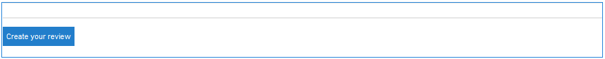

# レビューおよびレビューの概要（表示）の使用 {#using-reviews-and-reviews-summary-display}

The `Reviews`component is a composite of [ `Comments`](comments.md) and [ `Rating`](rating.md) components ready for use.

The `Reviews Summary (Display)` component provides a summary of an active or closed instance of a `Reviews` component for display elsewhere on the site.

>[!NOTE]
>
>匿名でのレビュー投稿はサポートされていません。サイト訪問者が参加するには、登録（会員になる）し、サインインする必要があります。 ログインした訪問者は、いつでもレビューを更新できます。

## レビューをページに追加 {#adding-a-review-to-a-page}

作成者モード `Reviews``Communities / Reviews` でページにコンポーネントを追加するには、コンポーネントブラウザを使用してコンポーネントを検索し、ユーザがレビューする機能に対する相対位置など、ページ上の位置にドラッグします。

For necessary information, visit [Communities Components Basics](basics.md).

When the [required client-side libraries](reviews-basics.md#essentials-for-client-side) are included, this is how the `Reviews`component will appear.

## レビューの設定 {#configuring-reviews}

Select the placed `Reviews` component to access and select the `Configure` icon which opens the edit dialog.

Under the **[!UICONTROL Allowed Ratings]** tab, specify the complete list of ratings to be shown to members. The first rating should be an overall/general rating, as it is the rating which provides the average rating for the `Review Summary (Display)` component. デフォルト設定の次の2つの評価には、「Subrating 1」または「Subrating 2」以外の異なるタイトルを付ける必要があります。

* **[!UICONTROL 許可された評価]**

   メンバーが選択できる評価のリストです。

   表示される選択肢を変更するには、上向き矢印、下向き矢印および削除ボタンを使用します。

   評価の選択肢を追加するには、「**[!UICONTROL 項目を追加]**」をクリックします。

Under the **[!UICONTROL Required Ratings]** tab, re-enter items from the list of **[!UICONTROL Allowed Ratings]** that are required to be rated. [レーティングの許可]タブで項目が指定されている場合は、その項目がメンバーから送信されたときにマークが付いていない状態になる場合があります。

Web サイト上では、必須の評価はアスタリスク付きで表示されます。アイテムが必須で、マークが付いていない場合は、すべての必須レーティングがマークされるまで、メッセージがメンバーに表示され、送信が拒否されます。

* **[!UICONTROL 必須の評価]**

   許可されている評価のサブセットで、必要な評価を示します。

   表示される選択肢を変更するには、上向き矢印、下向き矢印および削除ボタンを使用します。

   回答の選択肢を追加するには、「**[!UICONTROL 項目を追加]**」をクリックします。

>[!NOTE]
>
>If an item is entered on the **[!UICONTROL Required Ratings]** tab that is not specified on the **[!UICONTROL Allowed Ratings]** tab, then it is not included in the items to rate.

Under the **[!UICONTROL Reviews]** tab, specify how reviews are handled.

* **[!UICONTROL 応答を許可]**&#x200B;オンにすると、レビューに対する返信が許可されます。初期設定はオフです。

* **[!UICONTROL 閉じる]**&#x200B;オンにすると、レビューは新しいレビューや返信を受け付けなくなります。初期設定はオフです。

* **[!UICONTROL ファイルのアップロードを許可]**&#x200B;オンにすると、レビューに対して添付ファイルをアップロードできます。初期設定はオフです。

* **最大ファイルサイズ&#x200B;******「ファイルのアップロードを許可」がオンの場合にのみ関係します。このフィールドは、アップロードするファイルのサイズ（バイト単位）を制限します。デフォルトは 10 MB です。

* **[!UICONTROL メッセージの最大長]**&#x200B;テキストボックスに入力できる最大文字数です。初期設定は 4096 文字です。

* **[!UICONTROL 許可されるファイルタイプ]**「**[!UICONTROL ファイルのアップロードを許可]**」がオンの場合にのみ関係します。ドット付きのファイル拡張子をコンマ区切りで指定します（例：.jpg, .jpeg, .png, .doc, .docx, .pdf）。ファイルタイプを指定した場合、指定しなかったファイルは許可されません。 初期設定はnoneで、すべてのファイルタイプが許可されます。

* **[!UICONTROL リッチテキストエディター]**&#x200B;オンにすると、マークアップを使用して投稿を入力できます。初期設定はオフです。

* **[!UICONTROL 投票を許可]**&#x200B;オンにすると、トピックに投票機能が組み込まれます。初期設定はオフです。

Under the **[!UICONTROL User Moderation]** tab, specify how the posted reviews are managed. For more information, see [Moderating User Generated Content](moderate-ugc.md).

* **[!UICONTROL モデレート前]**&#x200B;オンにすると、レビューを公開サイトに表示する前に承認が必要になります。初期設定はオフです。

* **[!UICONTROL レビューを削除]**&#x200B;オンにすると、レビューを投稿したメンバーはそのレビューを削除できます。初期設定はオフです。

* **[!UICONTROL レビューを拒否]**&#x200B;オンにすると、モデレーターはレビューを拒否できます。初期設定はオフです。

* **[!UICONTROL レビューを閉じる／再度開く]**&#x200B;オンにすると、モデレーターはレビューを閉じたり、再度開いたりすることができます。初期設定はオフです。

* **[!UICONTROL レビューにフラグを設定]**&#x200B;オンにすると、メンバーはレビューに「不適切」のフラグを設定できます。初期設定はオフです。

* **[!UICONTROL フラグ設定理由リスト]**&#x200B;オンにすると、メンバーはレビューに「不適切」のフラグを設定した理由をドロップダウンリストから選択できます。初期設定はオフです。

* **[!UICONTROL カスタムフラグ設定理由]**&#x200B;オンにすると、メンバーはレビューに「不適切」のフラグを設定した独自の理由を入力できます。初期設定はオフです。

* **[!UICONTROL モデレートのしきい値]**&#x200B;メンバーがレビューに何回フラグを設定したらモデレーターに通知するかを指定します。初期設定は1回(1)です。

* **[!UICONTROL フラグ付けの制限]**&#x200B;レビューに何回フラグが設定されたら、公開表示から非公開にするかを指定します。This number must be greater than or equal to the **[!UICONTROL Moderation Threshold]**. 初期設定は 5 です。

### レビューの概要（表示）をページに追加 {#adding-a-review-summary-display-to-a-page}

To add a `Reviews Summary (Display)` component to a page in author mode, locate the component

* `Communities / Reviews Summary (Display)`

コンポーネントを探し、ページ上のアクティブなレビューまたは閉じられたレビューを表示する位置にドラッグします。

For necessary information, visit [Communities Components Basics](basics.md).

When the [required client-side libraries](reviews-basics.md#essentials-for-client-side) are included, this is how the `Reviews Summary (Display)`component will appear.

>[!NOTE]
>
>「平均」は、要約するレビューの「許可された評価」タブに指定されている最初の項目への投票を反映します。

### レビューの概要（表示）の設定 {#configuring-reviews-summary-display}

Select the placed `Reviews Summary (Display)` component to access and select the `Configure` icon which opens the edit dialog.

「**[!UICONTROL レビューの概要]**」タブでは、以下の項目を設定します。

* `Review Path`

   要約するコンポーネントの配置済みインスタンスを入 `reviews`力または参照します。例えば、 [Geometrixx EngageサイトのWebページに追加した場合](getting-started.md) 、パスは次のようになります。

   /content/sites/engage/jp/page/jcr:content/content/primary/reviews

* `Include histogram`

   このチェックボックスをオンにすると、集計されるレビューに含まれる各星レーティングの数を示す棒グラフが表示されます。 初期設定はオフです。

### カスタムレビュータイプへの変更 {#changing-to-a-custom-review-type}

レビューコンポーネントは、コメントシステムを使用します。

コメントリソースタイプを変更すると、デフォルトを使用するコメントのインスタンスではなく、開発者によってカスタマイズ（拡張）されたコメントのインスタンスが生成されるようになります。

Once the custom resource types is known, enter [Design Mode](../../help/sites-authoring/default-components-designmode.md) and double click on the placed `Comments` component to open a dialog with an additional tab.

Under the **[!UICONTROL Resource Types]** tab, specify the custom resourceType for new instances of the `Comments or Voting`components:

* **[!UICONTROL コメントリソースタイプ]**

   /apps内の拡張コンポーネント(1 `comment`つのコメント)のresourceTypeに移動します。 例：`/apps/social/commons/components/hbs/comments/comment`

   このリソースは、訪問者がコメントを投稿したときに作成されたUGCのresourceTypeを識別します。

* **[!UICONTROL 投票リソースタイプ]**

   /apps内の拡張コンポーネントのresourceType `voting`に移動します。 例：`/apps/social/components/hbs/voting`

   このリソースは、訪問者が投票を行ったときに作成されたUGCのリソースタイプを識別します。

* **[!UICONTROL コメントシステムリソースタイプ]**

   /apps内の拡張コンポーネント(コメン `comments`トシステム)のresourceTypeに移動します。 Leave blank unless the page template [dynamically includes](scf.md#add-or-include-a-communities-component) the Comment System in the underlying script instead of being added to the page as a resource (comments node). Learn more by reading about the [{{include}} helper](handlebars-helpers.md#include)

## サイト訪問者のエクスペリエンス {#site-visitor-experience}

### モデレーターおよび管理者 {#moderators-and-administrators}

サインインしているユーザーがモデレーター権限または管理者権限を持っている場合は、誰がレビューを作成したかにかかわらず、コンポーネントの設定によって許可されているモデレートタスクを実行できます。

### メンバー {#members}

サイト訪問者がサインインすると、設定に応じて次のことができます。

* 新しいレビューの投稿
* 自分のレビューの編集
* 自分のレビューの削除
* 他のユーザーのレビューコメントにフラグを付ける

1 人のメンバーが付けられる評価は 1 つだけです。メンバーは、いつでも評価を変更できます。

### 匿名 {#anonymous}

サインインしていないサイト訪問者は、投稿されたレビューを閲覧することしかできず（サポートされている場合は翻訳も可）、評価またはレビューを追加したり、他のユーザーのレビューコメントにフラグを設定することはできません。

## 追加情報 {#additional-information}

More information may be found on the [Review Essentials](reviews-basics.md) page for developers.

For moderation of posted comments, see [Moderating User Generated Content](moderate-ugc.md).

投稿されたコメントの翻訳については、[ユーザー生成コンテンツの翻訳](translate-ugc.md)を参照してください。
