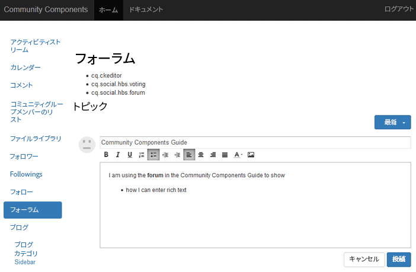

# リッチテキストエディターの基本事項  {#rich-text-editor-essentials}

## 概要 {#overview}

リッチテキストエディター（RTE）では、マークアップを使用してテキストを入力できます。

コミュニティコンポーネントの場合、[オーサー環境のリッチテキストエディター](../../help/sites-authoring/rich-text-editor.md)に似ていますが、パブリッシュ環境で入力されたテキストに影響します。



## リッチテキストエディターの有効化 {#enabling-rich-text-editor}

ユーザー生成コンテンツ（UGC）を許可するコミュニティコンポーネントを有効にすることによって、RTE を許可することができます。コンポーネントがページに追加されたか、[関数](functions.md)に含まれたかによって、RTEはデフォルトで有効になる場合と無効になる場合があります。

有効になっていない場合は、[作成者編集モード](sites-console.md#authoring-site-content)に入り、編集するコンポーネントを選択して、`Rich Text Editor`チェックボックスを選択します。

RTE は、次のコミュニティコンポーネントに使用できます。

* [ブログ](blog-feature.md)
* [カレンダー](calendar.md)
* [コメント](comments.md)
* [Filelibrary](file-library.md)
* [フォーラム](forum.md)
* [メッセージ](configure-messaging.md)
* [Q&amp;A](working-with-qna.md)
* [レビュー](reviews.md)

## カスタマイズ {#customization}

リッチテキストエディターのカスタマイズは、[CKEditor](https://www.ckeditor.com/) に基づいて実装した場合に可能になります。

コミュニティコンポーネントの現在の設定は、次のリポジトリにある `cq.social.  scf   clientlib` に含まれています。

`/libs/clientlibs/social/commons/scf/ckrte.js`

今後のアップグレードにより編集内容が上書きされる可能性があるので、cq.social.scf clientlib を変更しないことをお勧めします。

### カスタマイズの例：インラインリンク {#example-customization-inline-links}

セキュリティ上の懸念事項により、デフォルトでメンバーに表示されるリッチテキストアイコンのセットにハイパーリンクオプションは含まれません。UGCでhrefが許可されている場合、悪戯の能力は大きくなります。

ツールバーにハイパーリンクオプションを追加するには：

* 追加`links`という名前のツールバー
   * `{ name: 'links', items: [ 'Link','Unlink','Anchor' ] }`
* 「**[!UICONTROL すべて保存]**」を選択します。

#### /libs/clientlibs/social/commons/scf/ckrte.js {#libs-clientlibs-social-commons-scf-ckrte-js}

```
CKRte.prototype.config = {
    toolbar: [
        { name: "basicstyles",
           items: ["Bold", "Italic", "Underline", "NumberedList", "BulletedList", "Outdent", "Indent", "JustifyLeft", "JustifyCenter", "JustifyRight", "JustifyBlock", "TextColor"]
        },
        { name: 'links',
           items: [ 'Link','Unlink','Anchor' ]
        }
    ],
    autoParagraph: false,
    autoUpdateElement: false,
    removePlugins: "elementspath",
    resize_enabled: false
};
```

