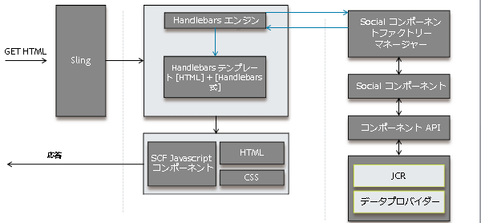
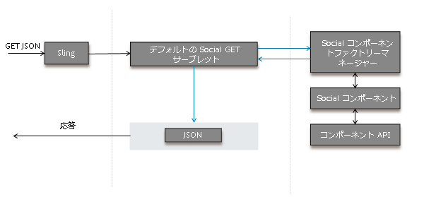
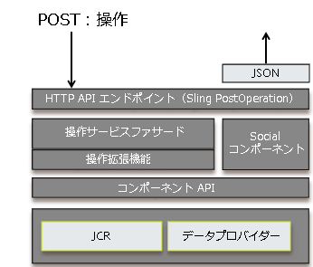

# ソーシャルコンポーネントフレームワーク {#social-component-framework}

ソーシャルコンポーネントフレームワーク（SCF）によって、サーバー側とクライアント側の両方で、コミュニティコンポーネントの設定、カスタマイズおよび拡張のプロセスが簡素化されます。

フレームワークの利点

* **機能**:すぐに使用できる統合性。80%の使用例でほとんどカスタマイズせず、またはまったくカスタマイズしません。
* **スキナブル**:CSSスタイルでのHTML属性の一貫した使用。
* **拡張可能**:コンポーネントの実装は、オブジェクト指向でビジネスロジックが軽く、サーバにビジネスログインを増やしやすくなっています。
* **柔軟性**:簡単にオーバーレイおよびカスタマイズできる、シンプルなロジックを持たないJavaScriptテンプレート。
* **アクセシブル**:HTTP APIは、モバイルアプリを含む任意のクライアントからの投稿をサポートします。
* **ポータブル**:任意のテクノロジーで構築された任意のWebページに統合/埋め込みできます。

インタラクティブな[コミュニティコンポーネントガイド](components-guide.md)を使用して、オーサーまたはパブリッシュインスタンスについて確認してください。

## 概要 {#overview}

SCF では、コンポーネントは SocialComponent POJO、Handlebars JS テンプレート（コンポーネントをレンダリングするため）および CSS（コンポーネントのスタイルを設定するため）で構成されます。

Handlebars JS テンプレートでは、モデル／ビュー JS コンポーネントを拡張して、クライアントでのコンポーネントとのユーザーインタラクションを処理できます。

コンポーネントがデータの変更をサポートする必要がある場合は、従来の Web アプリケーションでのモデル／データオブジェクトと同様のデータの編集／保存をサポートするために、SocialComponent API の実装を記述できます。また、操作（コントローラー）および操作サービスを追加して、操作要求の処理、ビジネスロジックの実行、モデル/データオブジェクトでのAPIの呼び出しを行うこともできます。

クライアントが必要とするデータをビューレイヤーまたは HTTP クライアントに提供するために、SocialComponent API を拡張できます。

### クライアントに対するページのレンダリング方法 {#how-pages-are-rendered-for-client}



### コンポーネントのカスタマイズおよび拡張 {#component-customization-and-extension}

コンポーネントをカスタマイズまたは拡張するには、今後のリリースへのアップグレードプロセスを簡素化する /apps ディレクトリに対してオーバーレイおよび拡張のみを記述します。

* スキン表示の場合：
   * Only the [CSS needs editing](client-customize.md#skinning-css).
* For Look and Feel:
   * JSテンプレートとCSSの変更を参照してください。
* Look, Feel &amp; UX:
   * Change the JS Template, CSS and [extend/override Javascript](client-customize.md#extending-javascript).
* JSテンプレートまたはGETエンドポイントで使用できる情報を変更するには：
   * Extend the [SocialComponent](server-customize.md#socialcomponent-interface).
* 操作中にカスタム処理を追加するには：
   * Write an [OperationExtension](server-customize.md#operationextension-class).
* 新しいカスタム操作を追加するには：
   * Create a new [Sling Post Operation](server-customize.md#postoperation-class).
   * Use existing [OperationServices](server-customize.md#operationservice-class) as needed.
   * 必要に応じて追加、クライアント側から操作を呼び出すJavaScriptコード。

## サーバー側フレームワーク {#server-side-framework}

このフレームワークでは、サーバー上の機能にアクセスし、クライアントとサーバー間のインタラクションをサポートするための API が提供されます。

### Java API {#java-apis}

Java API では、継承またはサブクラス化が容易な抽象クラスおよびインターフェイスが提供されます。

メインクラスについては、[サーバー側のカスタマイズ](server-customize.md)ページで説明します。

Visit [Storage Resource Provider Overview](srp.md) to learn about working with UGC.

### HTTP API {#http-api}

HTTP API によって、PhoneGap アプリ、ネイティブアプリ、その他の統合およびマッシュアップについて、カスタマイズの容易さとクライアントプラットフォームの選択がサポートされます。また、HTTP APIを使用すると、コミュニティサイトをクライアントなしでサービスとして実行でき、フレームワークコンポーネントを任意のテクノロジーで構築されたWebページに統合できます。

### HTTP API - GET 要求 {#http-api-get-requests}

すべての SocialComponent に対して、フレームワークによって HTTP ベースの API エンドポイントが提供されます。エンドポイントにアクセスするには、「.social.json」セレクター+拡張子を使用してGETリクエストをリソースに送信します。 Using Sling, the request is handed to the `DefaultSocialGetServlet`.

**`DefaultSocialGetServlet`**

1. Passes the resource (resourceType) to the `SocialComponentFactoryManager` and receives a SocialComponentFactory capable of selecting a `SocialComponent` representing the resousrce.

1. Invokes the factory and receives a `SocialComponent` capable of handling the resource and request.
1. Invokes the `SocialComponent`, which process the request and returns a JSON representation of the results.
1. クライアントに対するJSON応答を返します。

**`GET Request`**

デフォルトの GET Servlet が、SocialComponent がカスタマイズ可能な JSON で応答する .social.json 要求をリスニングします。



### HTTP API - POST 要求 {#http-api-post-requests}

GET（読み取り）操作に加え、コンポーネントに対するその他の操作（作成、更新、削除など）を可能にするエンドポイントパターンがフレームワークによって定義されます。これらのエンドポイントは、HTTPステータスコードまたはJSON応答オブジェクトを使用して、入力を受け取り、応答するHTTP APIです。

このフレームワークエンドポイントパターンにより、CUD 操作は拡張、再利用およびテストが可能になります。

**`POST Request`**

SocialComponent 操作ごとに Sling POST :operation があります。各操作のビジネスロジックとメンテナンスコードは、HTTP API経由で、またはOSGiサービスとして他の場所からアクセスできるOperationServiceに含まれます。 フックは、アクション前/後のアクションに対するプラッガブルな操作拡張をサポートするように提供されます。



### ストレージリソースプロバイダー（SRP）{#storage-resource-provider-srp}

To learn about handling UGC stored in the [community content store](working-with-srp.md), see:

* [ストレージリソースプロバイダの概要](srp.md) — 概要とリポジトリ使用の概要
* [SRPとUGC Essentials](srp-and-ugc.md) - SRP APIユーティリティのメソッドと例
* [SRP](accessing-ugc-with-srp.md) - Codingガイドラインを使用したUGCへのアクセス

### サーバー側のカスタマイズ {#server-side-customizations}

サーバー側のコミュニティコンポーネントのビジネスロジックおよび動作のカスタマイズについて詳しくは、[サーバー側のカスタマイズ](server-customize.md)を参照してください。

## Handlebars JS テンプレート言語 {#handlebars-js-templating-language}

One of the more noticeable changes in the new framework is the use of the [Handlebars JS templating language (HBS)](https://www.handlebarsjs.com/), a popular open-source technology for server-client rendering.

HBS スクリプトは、単純で、ロジックがなく、サーバーとクライアントの両方でコンパイルされ、オーバーレイやカスタマイズが容易であり、HBS ではクライアント側のレンダリングがサポートされているのでクライアント UX と自然にバインドします。

このフレームワークでは、SocialComponent の開発に便利な複数の [Handlebars ヘルパー](handlebars-helpers.md)が提供されます。

サーバーで、Sling は GET 要求を解決するときに、要求への応答に使用されるスクリプトを識別します。スクリプトがHBSテンプレート(.hbs)の場合、Slingは要求をHandlebarsエンジンに委任します。 次に、Handlebarsエンジンは、適切なSocialComponentFactoryからSocialComponentを取得し、コンテキストを構築して、HTMLをレンダリングします。

### アクセス制限なし {#no-access-restriction}

Handlebars（HBS）テンプレートファイル（.hbs）は、.jsp および .html テンプレートファイルに似ていますが、クライアントブラウザーとサーバーの両方でレンダリングに使用できる点が異なります。そのため、クライアント側テンプレートを要求するクライアントブラウザーは、.hbs ファイルをサーバーから受け取ります。

これには、sling 検索パス内のすべての HBS テンプレート（/libs/ または /apps の下の .hbs ファイル）を、オーサーまたはパブリッシュから任意のユーザーが取得できる必要があります。

.hbs ファイルへの HTTP アクセスは禁止できません。

### コミュニティコンポーネントの追加またはインクルード {#add-or-include-a-communities-component}

ほとんどのコミュニティコンポーネントは、Sling アドレス可能リソースとして追加する必要があります。** A select few of the Communities components may be *included* in a template as a non-existing resource to allow for dynamic inclusion and customization of the location at which to write user generated content (UGC).

In either case, the component&#39;s [required client libraries](clientlibs.md) must also be present.

**コンポーネントの追加**

コンポーネントの追加は、コンポーネントブラウザー（サイドキック）からページにオーサー編集モードでドラッグされたときなどに、リソース（コンポーネント）のインスタンスを追加するプロセスです。

結果は、同位ノードの下の JCR 子ノードであり、これは Sling アドレス可能です。

**コンポーネントのインクルード**

Including a component refers to the process of adding a reference to a [&quot;non-existing&quot; resource](srp.md#for-non-existing-resources-ners) (no JCR node) within the template, such as using a scripting language.

AEM 6.1以降では、コンポーネントが追加される代わりに動的に含まれる場合、コンポーネントのプロパティをauthor *design *modeで編集できます。

一部の AEM Communities コンポーネントのみを動的にインクルードできます。次の項目があります。

* [コメント](essentials-comments.md)
* [評価](rating-basics.md)
* [レビュー](reviews-basics.md)
* [投票](essentials-voting.md)

The [Community Components Guide](components-guide.md) allows includable components to be toggled from being added to being included.

**Handlebars** テンプレート言語を使用する場合、既存でないリソースは、そのresourceTypeを指定して [includeヘルパーを使用して含められます](handlebars-helpers.md#include) 。

`{{include this.id path="comments" resourceType="social/commons/components/hbs/comments"}}`

**JSP** を使用する場合、リソースはタグ [cq:include](../../help/sites-developing/taglib.md#lt-cq-include) を使用してインクルードされます。

```
<cq:include path="votes"
 resourceType="social/tally/components/voting" />
```

>[!NOTE]
>
>コンポーネントを、テンプレートに追加またはインクルードせずに、ページに動的に追加するには、[コンポーネントのサイドローディング](sideloading.md)を参照してください。

### Handlebars ヘルパー {#handlebars-helpers}

SCF で使用できるカスタムヘルパーのリストおよび説明については、[SCF Handlebars ヘルパー](handlebars-helpers.md)を参照してください。

## クライアント側フレームワーク {#client-side-framework}

### モデル - ビュー JavaScript フレームワーク {#model-view-javascript-framework}

このフレームワークには、リッチでインタラクティブなコンポーネントの開発を促進するために、[Backbone.js](https://www.backbonejs.org/)（モデル - ビュー JavaScript フレームワーク）という拡張が含まれています。オブジェクト指向の特性は、拡張可能/再利用可能なフレームワークをサポートします。 HTTP APIを使用すると、クライアントとサーバー間の通信が簡単になります。

フレームワークは、サーバー側のハンドルテンプレートを利用して、クライアント用のコンポーネントをレンダリングします。 モデルは、HTTP APIによって生成されたJSON応答に基づいています。 表示は、Handlebarsテンプレートによって生成されるHTMLに連結され、インタラクティブ機能を提供します。

### CSS の規則 {#css-conventions}

CSS クラスの定義と使用に推奨される規則を以下に示します。

* 名前が明確なCSSクラスセレクター名を使用し、「heading」、「image」などの汎用名は使用しないでください。
* 特定のクラスセレクタースタイルを定義し、CSSスタイルシートがページ上の他の要素やスタイルと適切に連携するようにします。 例：`.social-forum .topic-list .li { color: blue; }`
* スタイル設定のCSSクラスを、JavaScriptによって駆動されるUXのCSSクラスとは別にします。

### クライアント側のカスタマイズ {#client-side-customizations}

クライアント側でのコミュニティコンポーネントの外観と動作をカスタマイズするには、以下に関する情報が含まれている[クライアント側のカスタマイズ](client-customize.md)を参照してください。

* [オーバーレイ](client-customize.md#overlays)
* [拡張](client-customize.md#extensions)
* [HTML マークアップ](client-customize.md#htmlmarkup)
* [CSS のスキンの適用](client-customize.md#skinning-css)
* [JavaScript の拡張](client-customize.md#extending-javascript)
* [SCF の clientlib](client-customize.md#clientlibs-for-scf)

## 機能とコンポーネントの基本事項 {#feature-and-component-essentials}

開発者にとっての基本情報が、[機能とコンポーネントの基本事項](essentials.md)の節で説明されています。

開発者向けの追加情報については、[コーディングのガイドライン](code-guide.md)の節を参照してください。

## トラブルシューティング {#troubleshooting}

一般的な課題および既知の問題が、[トラブルシューティング](troubleshooting.md)の節で説明されています。

