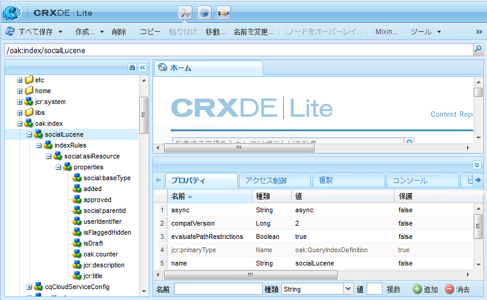

# 検索の基本事項 {#search-essentials}

## 概要 {#overview}

検索機能は AEM Communities の基本機能です。In addition to the [AEM platform search](../../help/sites-deploying/queries-and-indexing.md) capabilities, AEM Communities provides the [UGC search API](#ugc-search-api) for the purpose of searching user generated content (UGC). UGCには、他のAEMコンテンツやユーザーデータとは別に入力および保存されるので、固有のプロパティがあります。

Communitiesでは、一般に検索される2つの項目は次のとおりです。

* コミュニティメンバーが投稿したコンテンツ

   * AEM CommunitiesのUGC検索APIを使用します。

* ユーザーとユーザーグループ（ユーザーデータ）

   * AEMプラットフォーム検索機能を使用します。

ドキュメントのこの節は、UGC を作成または管理するためのカスタムコンポーネントの作成を担当する開発者を対象としています。

## セキュリティおよびシャドウノード {#security-and-shadow-nodes}

For a custom component, it is necessary to use the [SocialResourceUtilities](socialutils.md#socialresourceutilities-package) methods. The utility methods that create and search for UGC will establish the required [shadow nodes](srp.md#about-shadow-nodes-in-jcr) and ensure the member has the correct permissions for the request.

モデレート関連のプロパティについては、SRP ユーティリティでは管理しません。

See [SRP and UGC Essentials](srp-and-ugc.md) for information regarding utility methods used to access UGC and ACL shadow nodes.

## UGC Search API {#ugc-search-api}

[UGC 共通ストア](working-with-srp.md)は、それぞれ異なるネイティブクエリー言語を使用する様々なストレージリソースプロバイダー（SRP）の 1 社から提供されます。Therefore, regardless of the SRP chosen, custom code should use methods from the [UGC API package](https://helpx.adobe.com/experience-manager/6-5/sites/developing/using/reference-materials/javadoc/com/adobe/cq/social/ugc/api/package-summary.html) (*com.adobe.cq.social.ugc.api*) which will invoke the query language appropriate for the chosen SRP.

### ASRP 検索 {#asrp-searches}

For [ASRP](asrp.md), UGC is stored in the Adobe cloud. While UGC is not visible in CRX, [moderation](moderate-ugc.md) is available from both the author and publish environments. The use of the [UGC search API](#ugc-search-api) works for ASRP the same as for other SRPs.

ASRP 検索を管理するためのツールは現在存在しません。

When creating custom properties that are searchable, it is necessary to adhere to the [naming requirements](#naming-of-custom-properties).

### MSRP 検索 {#msrp-searches}

For [MSRP](msrp.md), UGC is stored in MongoDB configured to use Solr for searching. UGC will not be visible in CRX, but [moderation](moderate-ugc.md) is available from both the author and publish environments.

MSRP および Solr については、次の点に留意してください。

* AEMプラットフォーム用の埋め込みSolrは、MSRPには使用されません。
* AEMプラットフォームにリモートSolrを使用する場合、MSRPと共有できますが、異なるコレクションを使用する必要があります。
* Solrは、標準検索または多言語検索(MLS)用に設定できます。
* For configuration details, see [Solr Configuration](msrp.md#solr-configuration) for MSRP.

Custom search features should use the [UGC search API](#ugc-search-api).

When creating custom properties that are searchable, it is necessary to adhere to the [naming requirements](#naming-of-custom-properties).

### JSRP 検索 {#jsrp-searches}

For [JSRP](jsrp.md), UGC is stored in [Oak](../../help/sites-deploying/platform.md) and is visible only in the repository of the AEM author or publish instance on which it was entered.

UGC は一般にパブリッシュ環境で入力されるので、複数の公開者が存在する実稼動システムでは、パブリッシュファームではなく、[パブリッシュクラスター](topologies.md)の設定を通して、入力されたコンテンツがすべての公開者から表示できるようにする必要があります。

JSRP の場合、パブリッシュ環境で入力された UGC はオーサー環境には表示されません。Thus all [moderation](moderate-ugc.md) tasks take place in the publish environment.

Custom search features should use the [UGC search API](#ugc-search-api).

#### Oak インデックスの作成 {#oak-indexing}

AEM プラットフォーム検索用に Oak インデックスが自動的に作成されることはありませんが、AEM 6.2 以降では、AEM Communities のパフォーマンスを向上させ、UGC 検索結果を表示する際のページネーションに対応する目的で、インデックスが追加されています。

カスタムプロパティを使用していて、検索速度が遅い場合は、カスタムプロパティに対して追加のインデックスを作成し、パフォーマンスを向上させる必要があります。To maintain portability, adhere to the [naming requirements](#naming-of-custom-properties) when creating custom properties that are searchable.

To modify existing indices or create custom indices, refer to [Oak Queries and Indexing](../../help/sites-deploying/queries-and-indexing.md).

The [Oak Index Manager](https://adobe-consulting-services.github.io/acs-aem-commons/features/oak-index-manager.html) is available from ACS AEM Commons. 次の機能が提供されます。

* 既存のインデックスの表示。
* 再インデックスを開始する機能。

[CRXDE Lite](../../help/sites-developing/developing-with-crxde-lite.md) で既存の Oak インデックスを表示するには、次の場所に移動します。

* `/oak:index/socialLucene`



## インデックス付き検索のプロパティ {#indexed-search-properties}

### デフォルトの検索プロパティ {#default-search-properties}

様々なコミュニティ機能に使用される検索可能なプロパティの一部を次に示します。

| **プロパティ** | **データタイプ** |
|---|---|
| isFlagged | *Boolean* |
| isSpam | *Boolean* |
| read | *Boolean* |
| influence | *Boolean* |
| attachments | *Boolean* |
| sentiment | 長整数&#x200B;** |
| flagged | *Boolean* |
| added | *日付* |
| modifiedDate | *日付* |
| state | *String* |
| userIdentifier | *String* |
| replies | 長整数&#x200B;** |
| jcr:title | *String* |
| jcr:description | *String* |
| sling:resourceType | *String* |
| allowThreadedReply | *Boolean* |
| isDraft | *Boolean* |
| publishDate | *日付* |
| publishJobId | *String* |
| answered | *Boolean* |
| chosenanswered | *Boolean* |
| tag | *String* |
| cq:Tag | *String* |
| author_display_name | *String* |
| location_t | *String* |
| parentPath | *String* |
| parentTitle | 文字列&#x200B;** |

### カスタムプロパティの命名 {#naming-of-custom-properties}

When adding custom properties, in order for those properties to be visible to sorts and searches created with the [UGC search API](#ugc-search-api), it is *required* to add a suffix to the property name.

サフィックスは、スキーマを使用するクエリ言語用です。

* プロパティは検索可能であることを示します。
* データタイプを識別します。

Solr は、スキーマを使用するクエリー言語の一例です。

| **サフィックス** | **データタイプ** |
|---|---|
| _b | *Boolean* |
| _dt | カレンダー&#x200B;** |
| _d | 倍精度浮動小数点&#x200B;** |
| _tl | 長整数&#x200B;** |
| _s | *String* |
| _t | *テキスト* |

**備考:**

* *Text* はトークン化された文字列です。 *String* はトークン化されません。 Use *Text* for fuzzy (more like this) searches.

* 複数の値を持つタイプの場合、次のようにサフィックスに「s」を追加します。

   * `viewDate_dt`:単一の日付プロパティ
   * `viewDates_dts`:datesプロパティのリスト

## フィルター {#filters}

Components which include the [comment system](essentials-comments.md) support the filter parameter addition to their endpoints.

AND および OR ロジックのフィルター構文は次のようになります（URL エンコード処理前）。

* OR を指定するには、1 つのフィルターパラメーターを使用し、値をカンマで区切って指定します。

   * `filter=name eq 'Jennifer',name eq 'Jen'`

* AND を指定するには、複数のフィルターパラメーターを使用します。

   * `filter = name eq 'Jackson'&filter=message eq 'testing'`

[コミュニティコンポーネントガイド](components-guide.md)で「検索結果」ページを開く際に使用される URL に見られるように、[検索コンポーネント](search.md)のデフォルト実装ではこの構文が使用されます。To experiment, browse to [http://localhost:4503/content/community-components/en/search.html](http://localhost:4503/content/community-components/en/search.html).

フィルター演算子は次のとおりです。

| EQ | 次と等しい |
|---|---|
| NE | 次と等しくない |
| LT | 次よりも小さい |
| LTE | 次よりも小さいか等しい |
| GE | 次よりも大きい |
| GTE | 次よりも大きいか等しい |
| LIKE | ファジーマッチ |

コンポーネントが配置されるページではなく、コミュニティコンポーネント（リソース）を URL で参照することが重要です。

* 正しい構文：フォーラム要素
   * `/content/community-components/en/forum/jcr:content/content/forum.social.json`
* 誤った例：フォーラムページ
   * `/content/community-components/en/forum.social.json`

## SRP ツール {#srp-tools}

次のものをまとめた Adobe Marketing Cloud GitHub プロジェクトが公開されています。

[AEM CommunitiesSRPツール](https://github.com/Adobe-Marketing-Cloud/aem-communities-srp-tools)

このリポジトリには、SRP のデータを管理するためのツールが格納されています。

現在、任意の SRP からすべての UGC を削除できるサーブレットが 1 つ用意されています。

次に、ASRP からすべての UGC を削除する場合の例を示します。

```shell
curl -X POST http://localhost:4502/services/social/srp/cleanup?path=/content/usergenerated/asi/cloud -uadmin:admin
```

## トラブルシューティング {#troubleshooting}

### Solr クエリ {#solr-query}

Solrクエリの問題のトラブルシューティングに役立つには、

`com.adobe.cq.social.srp.impl.SocialSolrConnector`。

実際の Solr クエリが、デバッグログに URL エンコードされて表示されます。

solrへのクエリ: `sort=timestamp+desc&bl=en&pl=en&start=0&rows=10 &q=%2Btitle_t:(hello)+%2Bprovider_id:\/content/usergenerated/asi/mongo/content/+%2Bresource_type_s:&df=provider_id&trf=verbatim&fq={!cost%3D100}report_suite:mongo`

`q` パラメーターの値がクエリです。URLエンコーディングがデコードされると、クエリをSolr管理者クエリツールに渡して、さらに詳細なデバッグを行うことができます。

## 関連リソース {#related-resources}

* [コミュニティコンテンツストレージ](working-with-srp.md) - UGC共通ストアで使用できるSRPの選択肢について説明します。
* [ストレージリソースプロバイダの概要](srp.md) — 概要とリポジトリ使用の概要
* [SRP](accessing-ugc-with-srp.md) - Codingガイドラインを使用したUGCへのアクセス
* [SocialUtilsリファクタリング](socialutils.md) - SocialUtilsを置き換えるSRPのユーティリティメソッド。
* [検索および検索結果コンポーネント](search.md) — テンプレートへのUGC検索機能の追加

