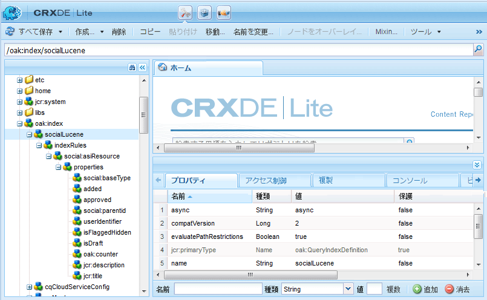

# 検索の基本事項 {#search-essentials}

## 概要 {#overview}

検索機能は、Adobe Experience Manager（AEM）コミュニティの重要な機能です。 [AEM プラットフォーム検索機能](../../help/sites-deploying/queries-and-indexing.md)に加えて、AEM Communitiesでは、ユーザー生成コンテンツ（UGC）を検索するための[UGC検索API](#ugc-search-api)を提供しています。 UGCは、AEMの他のコンテンツやユーザーデータとは別に入力および保存されるため、独自のプロパティを持ちます。

Communitiesでは、一般的に検索される2つの項目を次に示します。

* コミュニティメンバーが投稿したコンテンツ

   * AEM CommunitiesのUGC検索APIを使用しています。

* ユーザーとユーザーグループ（ユーザーデータ）

   * AEMのプラットフォーム検索機能を使用しています。

UGCを作成または管理するカスタムコンポーネントを作成する開発者は、この節のドキュメントを参照してください。

## セキュリティ ノードとシャドウ ノード {#security-and-shadow-nodes}

カスタムコンポーネントの場合は、[SocialResourceUtilities](socialutils.md#socialresourceutilities-package) メソッドを使用する必要があります。 UGCを作成および検索するユーティリティ メソッドは、必要な[ シャドウ ノード ](srp.md#about-shadow-nodes-in-jcr)を確立し、メンバーがリクエストに対する正しい権限を持っていることを確認します。

SRP ユーティリティを通じて管理されないものは、モデレーションに関連するプロパティです。

UGCおよびACL シャドウ ノードへのアクセスに使用されるユーティリティ メソッドについては、[SRPおよびUGC Essentials](srp-and-ugc.md)を参照してください。

## UGC検索API {#ugc-search-api}

[UGC共通ストア ](working-with-srp.md)は、様々なストレージリソースプロバイダー（SRP）のいずれかによって提供され、それぞれが異なるネイティブクエリ言語を持っている可能性があります。 したがって、選択したSRPに関係なく、カスタムコードでは、選択したSRPに適したクエリ言語を呼び出す[UGC API パッケージ ](https://developer.adobe.com/experience-manager/reference-materials/6-5/javadoc/com/adobe/cq/social/ugc/api/package-summary.html) （*com.adobe.cq.social.ugc.api*）のメソッドを使用する必要があります。

### ASRP Searches {#asrp-searches}

[ASRP](asrp.md)の場合、UGCはAdobe クラウドに保存されます。 UGCはCRXでは表示されませんが、[ モデレーション ](moderate-ugc.md)はオーサー環境とパブリッシュ環境の両方から利用できます。 [UGC検索API](#ugc-search-api)の使用は、他のSRPと同じようにASRPで機能します。

現在、ASRP検索を管理するためのツールは存在しません。

検索可能なカスタムプロパティを作成する場合は、[の命名要件](#naming-of-custom-properties)に準拠する必要があります。

### MSRP検索 {#msrp-searches}

[MSRP](msrp.md)の場合、UGCは検索にSolrを使用するように設定されたMongoDBに保存されます。 UGCはCRXでは表示されませんが、[ モデレーション ](moderate-ugc.md)はオーサー環境とパブリッシュ環境の両方から利用できます。

MSRPとSolrについて：

* AEM プラットフォーム用の埋め込みSolrは、MSRPには使用されません。
* AEM プラットフォームにリモート Solrを使用している場合は、MSRPと共有される可能性がありますが、異なるコレクションを使用する必要があります。
* Solrは、標準検索または多言語検索（MLS）用に設定できます。
* 設定の詳細については、[MSRPのSolr設定](msrp.md#solr-configuration)を参照してください。

カスタム検索機能では、[UGC検索API](#ugc-search-api)を使用する必要があります。

検索可能なカスタムプロパティを作成する場合は、[の命名要件](#naming-of-custom-properties)に準拠する必要があります。

### JSRP検索 {#jsrp-searches}

[JSRP](jsrp.md)の場合、UGCは[Oak](../../help/sites-deploying/platform.md)に保存され、入力されたAEM オーサーインスタンスまたはパブリッシュインスタンスのリポジトリでのみ表示されます。

UGCは通常、パブリッシュ環境で入力されるので、マルチパブリッシャーの実稼動システムの場合は、入力されたコンテンツがすべてのパブリッシャーから表示されるように、パブリッシュファームではなく[ パブリッシュクラスター](topologies.md)を設定する必要があります。

JSRPの場合、パブリッシュ環境で入力されたUGCは、オーサー環境では表示されません。 したがって、すべての[ モデレーション ](moderate-ugc.md) タスクはパブリッシュ環境で実行されます。

カスタム検索機能では、[UGC検索API](#ugc-search-api)を使用する必要があります。

#### Oak インデックス作成 {#oak-indexing}

Oak インデックスは、AEM プラットフォーム検索用に自動的に作成されるわけではありませんが、AEM 6.2以降では、AEM Communitiesに追加され、パフォーマンスが向上し、UGC検索結果を表示する際のページネーションのサポートが提供されています。

カスタムプロパティを使用しており、検索が遅い場合は、カスタムプロパティのパフォーマンスを高めるために、追加のインデックスを作成する必要があります。 ポータビリティを維持するには、検索可能なカスタムプロパティを作成する場合は、[の命名要件](#naming-of-custom-properties)に従ってください。

既存のインデックスを変更したり、カスタムインデックスを作成したりするには、[Oak クエリとインデックス作成](../../help/sites-deploying/queries-and-indexing.md)を参照してください。

[Oak Index Manager](https://adobe-consulting-services.github.io/acs-aem-commons/features/oak-index-manager.html)は、ACS AEM Commonsから入手できます。 これには次の機能があります。

* 既存のインデックスのビュー。
* インデックス再作成を開始する機能。

[CRXDE Lite](../../help/sites-developing/developing-with-crxde-lite.md)の既存のOak インデックスを表示するには、次の場所に移動します。

* `/oak:index/socialLucene`



## インデックス付き検索プロパティ {#indexed-search-properties}

### デフォルトの検索プロパティ {#default-search-properties}

次に、様々なコミュニティ機能に使用される検索可能なプロパティの一部を示します。

| **プロパティ** | **データタイプ** |
|---|---|
| isFlagged | *ブーリアン* |
| isSpam | *ブーリアン* |
| 読み取り | *ブーリアン* |
| 影響 | *ブーリアン* |
| 添付 | *ブーリアン* |
| センチメント | *長い* |
| フラグ設定 | *ブーリアン* |
| 追加済み | *日付* |
| modifiedDate | *日付* |
| state | *文字列* |
| userIdentifier | *文字列* |
| 返信 | *長い* |
| jcr:title | *文字列* |
| jcr:description | *文字列* |
| sling:resourceType | *文字列* |
| allowThreadedReply | *ブーリアン* |
| isDraft | *ブーリアン* |
| publishDate | *日付* |
| publishJobId | *文字列* |
| 回答済み | *ブーリアン* |
| chosenanswered | *ブーリアン* |
| タグ | *文字列* |
| cq:Tag | *文字列* |
| author_display_name | *文字列* |
| location_t | *文字列* |
| parentPath | *文字列* |
| parentTitle | *文字列* |

### カスタムプロパティの命名 {#naming-of-custom-properties}

カスタムプロパティを追加する場合、これらのプロパティを[UGC検索API](#ugc-search-api)で作成された並べ替えや検索に表示するには、*プロパティ名にサフィックスを追加する必要があります*。

接尾辞は、スキーマを使用するクエリ言語に対して使用されます。

* これは、プロパティを検索可能として識別します。
* データタイプを識別します。

Solrは、スキーマを使用するクエリ言語の例です。

| **接尾辞** | **データタイプ** |
|---|---|
| _b | *ブーリアン* |
| _dt | *カレンダー* |
| _d | *ダブル* |
| _tl | *長い* |
| _s | *文字列* |
| _t | *テキスト* |

**メモ：**

* *テキスト*&#x200B;はトークン化された文字列です。*文字列*&#x200B;はトークン化されていません。 *テキスト*&#x200B;を使用すると、あいまいな（このようなものが多い）検索を実行できます。

* 複数値の型の場合は、次のように接尾辞に「s」を追加します。

   * `viewDate_dt`：単一の日付プロパティ
   * `viewDates_dts`：日付プロパティのリスト

## フィルター {#filters}

[ コメントシステム ](essentials-comments.md)を含むコンポーネントは、エンドポイントに加えてフィルターパラメーターをサポートします。

ANDおよびOR ロジックのフィルター構文は、次のように表されます（URL エンコード前に示します）。

* ORを指定するには、コンマ区切りの値を持つ1つのフィルターパラメーターを使用します。

   * `filter=name eq 'Jennifer',name eq 'Jen'`

* 複数のフィルターパラメーターを指定して使用するには：

   * `filter = name eq 'Jackson'&filter=message eq 'testing'`

[検索コンポーネント ](search.md)のデフォルトの実装では、この構文が使用されます。この構文は、[ コミュニティコンポーネントガイド ](components-guide.md)の検索結果ページを開くURLに表示されます。 実験するには、[http://localhost:4503/content/community-components/en/search.html](http://localhost:4503/content/community-components/en/search.html)を参照してください。

フィルター演算子は次のとおりです。

| EQ | が次の値と等しい |
|---|---|
| NE | 次と等しくない |
| LT | 次より小さい |
| LTE | 次より小さい値 |
| GE | 次より大きい |
| GTE | 以上 |
| いいね！ | ファジーマッチ |

URLは、コンポーネントが配置されているページではなく、Communities コンポーネント（リソース）を参照することが重要です。

* 正解：フォーラムのコンポーネント
   * `/content/community-components/en/forum/jcr:content/content/forum.social.json`
* 不正：フォーラムページ
   * `/content/community-components/en/forum.social.json`

## SRP ツール {#srp-tools}

次の内容を含むAdobe Experience Cloud GitHub プロジェクトがあります。

[AEM Communities SRP Tools](https://github.com/Adobe-Marketing-Cloud/aem-communities-srp-tools)

このリポジトリには、SRPでデータを管理するためのツールが含まれています。

現在、任意のSRPからすべてのUGCを削除できるサーブレットが1つあります。

例えば、ASRPのすべてのUGCを削除するには、次の手順を実行します。

```shell
curl -X POST http://localhost:4502/services/social/srp/cleanup?path=/content/usergenerated/asi/cloud -uadmin:admin
```

## トラブルシューティング {#troubleshooting}

### Solr クエリ {#solr-query}

Solr クエリに関する問題のトラブルシューティングを支援するには、のDEBUG ログを有効にします

`com.adobe.cq.social.srp.impl.SocialSolrConnector`。

実際のSolr クエリは、デバッグログにエンコードされたURLで表示されます。

Solrへのクエリは`sort=timestamp+desc&bl=en&pl=en&start=0&rows=10 &q=%2Btitle_t:(hello)+%2Bprovider_id:\/content/usergenerated/asi/mongo/content/+%2Bresource_type_s:&df=provider_id&trf=verbatim&fq={!cost%3D100}report_suite:mongo`です

`q` パラメーターの値はクエリです。 URL エンコーディングがデコードされると、クエリをSolr管理者クエリツールに渡して、さらにデバッグを行うことができます。

## 関連リソース {#related-resources}

* [ コミュニティコンテンツストレージ ](working-with-srp.md) - UGC共通ストアで利用可能なSRPの選択肢について説明します。
* [ ストレージリソースプロバイダーの概要](srp.md) – 概要とリポジトリの使用状況の概要。
* [SRPを使用したUGCへのアクセス ](accessing-ugc-with-srp.md) - コーディング ガイドライン。
* [SocialUtils リファクタリング ](socialutils.md) - SocialUtilsを置き換えるSRPのユーティリティ メソッド。
* [検索および検索結果コンポーネント ](search.md) - UGC検索機能をテンプレートに追加します。
