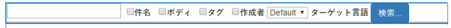
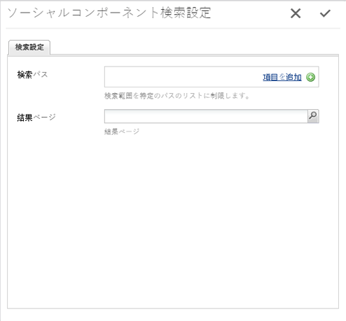
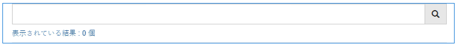
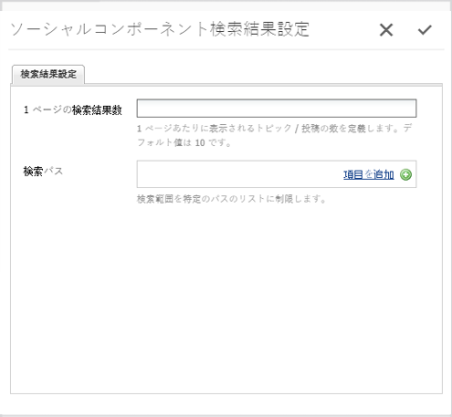

# 検索機能 {#search-feature}

検索機能は、フォーラムなど他の様々な機能と連携して、コンテンツを検索できるようにします。

コミュニティメンバーが入力した投稿（ユーザー生成コンテンツ（UGC））を検索する機能を追加するときは、[検索](#search)と[検索結果](#search-results)という 2 つのコンポーネントを使用します。

`Search Results`コンポーネントを含むページは、検索と結果の表示の両方をサポートしています。

`Search`コンポーネントを含むページは、`Search Results`ページに結果が表示される検索を開始する場所を提供します。

検索機能は、サイト訪問者やメンバーに向けてコンテンツを表示する他の機能と共に使用できます。

## 検索 {#search-features}

### 検索をページに追加 {#add-search-to-a-page}

作成者モードで`Search`コンポーネントをページに追加するには、コンポーネントブラウザーを使用して`Communities / Search`を探し、ページ上の配置にドラッグします。 `Search`を使用するには、`Search Results.`の2ページ目が必要です

必要な情報については、[Communities Components Basics](basics.md)を参照してください。

必要なクライアント側ライブラリ`cq.social.hbs.search`が含まれる場合、`Search`コンポーネントは次のように表示されます。

### 追加した検索を設定 {#configure-the-added-search}

アクセスする配置済みの`Search`コンポーネントを選択し、編集ダイアログを開く`Configure`アイコンを選択します。

「**[!UICONTROL 検索設定]**」タブで、訪問者がクエリを入力した場合の検索パスを指定します。

* **[!UICONTROL 検索パス]**「項目を追加」ボタンを使用して検索パスを追加すると、コンテンツの検索が限定されます。例えば、検索対象を特定のフォーラムに限定するには、ページ内に配置するフォーラムコンポーネントを選択します。

   * `/content/community-components/en/forum/jcr:content/content/forum`

* **[!UICONTROL 結果]**
ページ結果は、ブラウザーを使用して 
`Search Results` component.

## 検索結果 {#search-results}

### 検索結果をページに追加 {#add-search-results-to-a-page}

作成者モードで`Search Results`コンポーネントをページに追加するには、コンポーネントブラウザーを使用して

* `Communities / Search Results`

コンポーネントを探し、ページ上の位置にドラッグします。検索コンポーネントとは異なり、2番目のページは必要ありません。結果が同じページに表示されるためです。

Webサイト内の他の場所で検索を使用する場合、`Search Results`を含むこの1ページは、`Search`のインスタンスのいずれかまたはすべての`Result Page`に設定できます。

必要な情報については、[Communities Components Basics](basics.md)を参照してください。

必要なクライアント側ライブラリ`cq.social.hbs.search`が含まれる場合、`Search Result`コンポーネントは次のように表示されます。

### 追加した検索結果を設定 {#configure-the-added-search-result}

アクセスする配置済みの`Search Results`コンポーネントを選択し、編集ダイアログを開く`Configure`アイコンを選択します。

「**[!UICONTROL Search Result Settings]**」タブでは、訪問者がクエリを入力した場合に検索に含めるパスを指定できます。

* **[!UICONTROL 1 ページの検索結果数]**

   1ページに表示するトピック/投稿の数を定義します。 初期設定は 10 です。

* **[!UICONTROL 検索パス]**

   「追加アイテム」ボタンを使用して検索パスを追加すると、コンテンツ検索が制限されます。

## 追加情報 {#additional-information}

詳しくは、[Search Essentials](search-implementation.md)ページの開発者向けページを参照してください。
