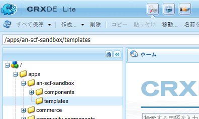
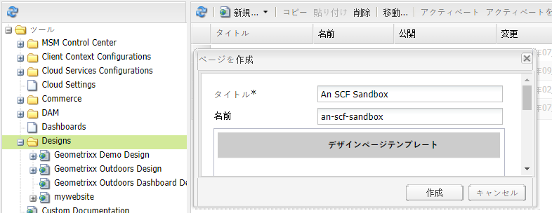
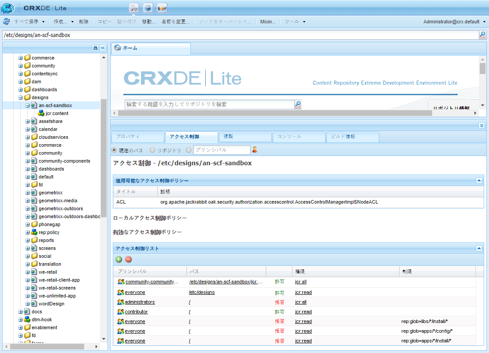

# Web サイト構造のセットアップ {#setup-website-structure}

Web サイトをセットアップするために、後述の手順では、次の場所に作成するフォルダーについて説明します。

* `/apps/an-scf-sandbox`

   ここにカスタムアプリケーションとテンプレートが存在します。

* `/etc/designs/an-scf-sandbox`

   これは、ダウンロード可能なデザイン要素が存在する場所です。

* `/content/an-scf-sandbox`

   ここは、ダウンロード可能なWebページがある場所です。

このチュートリアル内のコードは、アプリケーション、デザインおよびコンテンツについてメインフォルダー名が同じであるという前提に基づきます。If you choose some other name for your website, then always replace `an-scf-sandbox` with the name you have chosen.

>[!NOTE]
>
>名前について：
>
>* CRXDEに表示される名前は、アドレス指定可能なコンテンツへのパスを形成するノード名です。
>* ノード名にはスペースを含めることができますが、URIで使用する場合は、スペースを&#39;%20&#39;または&#39;+&#39;としてエンコードする必要があります。
>* ノード名にはハイフンやアンダースコアを含めることができますが、Javaファイル内でパッケージ名として参照する場合はエンコードする必要があります。 ハイフンとアンダースコアは共に、アンダースコアでエスケープされ、その後にUnicode値が続きます。

   >
   >   
   * ハイフンが「_002d」になる
   >   * アンダースコアは「_005f」になります。

## アプリケーションディレクトリ(/apps)の設定 {#setup-the-application-directory-apps}

リポジトリの /apps ディレクトリには、/content ディレクトリから提供されるページの動作やレンダリングを実装するコードが格納されます。

/apps ディレクトリは保護され、/content ディレクトリおよび /etc/designs ディレクトリとは異なり、外部からアクセスすることはできません。

1. Create `/apps/an-scf-sandbox` folder.

   **[!UICONTROL CRXDE Lite]** を使用して、エクスプローラーペインで次の手順を実行します。

   1. Select the `/apps` folder.
   1. Right-click **[!UICONTROL Create]**... or pull down the **[!UICONTROL Create...]** menu.
   1. Select **[!UICONTROL Create Folder...]**.
   1. In the **[!UICONTROL Create Folder]** dialog, enter `an-scf-sandbox`.
   1. 「**[!UICONTROL OK]**」をクリックします。

1. **[!UICONTROL components]** サブフォルダーを作成します。

   1. Select the `/apps/an-scf-sandbox` folder.
   1. Click **[!UICONTROL Create > Create Folder]**.
   1. In the **[!UICONTROL Create Folder]** dialog, enter **[!UICONTROL components]**.
   1. 「**[!UICONTROL OK]**」をクリックします。

1. **[!UICONTROL templates]** サブフォルダーを作成します。

   1. Select the `/apps/an-scf-sandbox` folder.
   1. Click **[!UICONTROL Create > Create Folder]**.
   1. In the **[!UICONTROL Create Folder]** dialog, enter **[!UICONTROL templates]**.
   1. 「**[!UICONTROL OK]**」をクリックします。
   1. 再選択し `/apps/an-scf-sandbox`ます。
   1. Select **[!UICONTROL Save All]**.

   他の編集プロセスと同様ですが、保存は頻繁におこなってください。データの入力に問題が発生した場合は、ログインがタイムアウトしたか、以前の編集内容を保存する必要があることが原因である可能性があります。

1. CRXDE Lite のエクスプローラーペインでの構造は、次のようになります。

   

## デザインディレクトリ(/etc/designs)の設定 {#setup-the-design-directory-etc-designs}

/etc/designs ディレクトリには、ページコンテンツと共にダウンロードされる画像、スクリプトおよびスタイルシートが格納されます。

1. To use the Designer tool in the Classic UI, browse to [https://&lt;server>:&lt;port>/miscadmin](http://localhost:4502/miscadmin).

   Note: If you use CRXDE Lite to create a Node of type `cq:Page`, the Access Control and Replication would not be set to default settings for a page.

1. In the explorer pane, select the **[!UICONTROL Designs]** folder and then click **[!UICONTROL New]** > **[!UICONTROL New Page]**.

   次のように入力します。

   * Title: **[!UICONTROL An SCF Sandbox]**
   * 名前：**[!UICONTROL an-scf-sandbox]**
   * Select **[!UICONTROL Design Page Template]**

   「**[!UICONTROL 作成]**」をクリックします。

   

1. An SCF Sandbox フォルダーが表示されない場合は、エクスプローラーペインを更新します。

1. CRXDE Lite（http://localhost:4502/crx/de）に戻り、/etc/designs を展開して、「an-scf-sandbox」という名前のノードを表示します。

   CRXDE の右下のペインで、「プロパティ」タブ、「アクセス制御」タブおよび「レプリケーション」タブを表示して、デザインページテンプレートを使用して定義された内容を確認できます。

   

## コンテンツディレクトリ(/content)の設定 {#setup-the-content-directory-content}

リポジトリの /content ディレクトリには、Web サイトコンテンツが格納されます。/contentの下のパスは、ブラウザーリクエストのURLのパスを構成します。

*初期アプリの一部として* ページテンプレートを作成した後  、そのテンプレートに基づいて初期ページコンテンツを作成することができる。. [**>**](initial-app.md)
