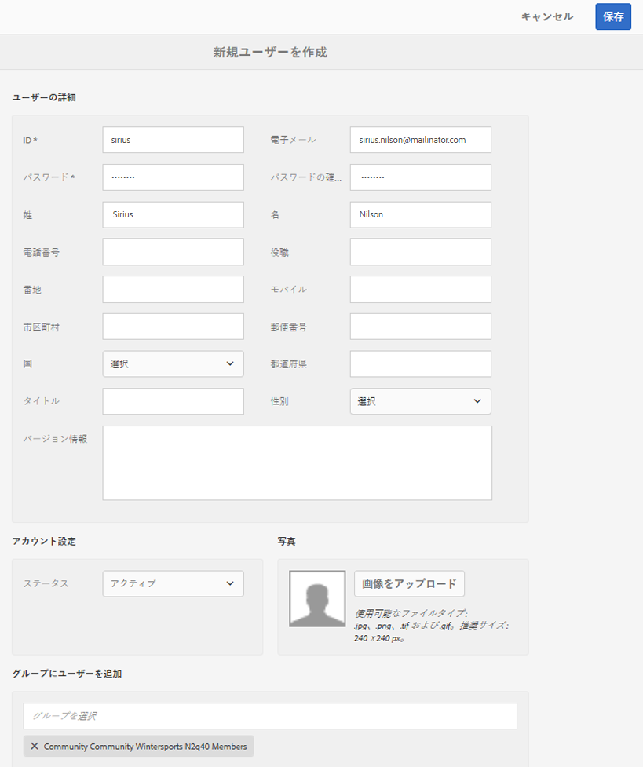
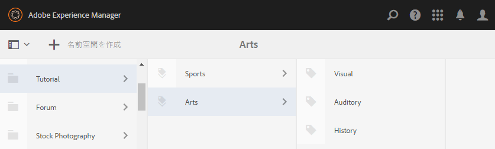

# 初期セットアップ {#initial-setup}

## オーサーインスタンスとパブリッシュインスタンスの開始 {#start-author-and-publish-instances}

開発およびデモの目的では、1つのオーサーインスタンスと1つのパブリッシュインスタンスを実行する必要があります。

これを行うには、基本的なAdobe Experience Manager（AEM） [はじめに](../../help/sites-deploying/deploy.md#getting-started)の手順に従います。その結果、次のようになります。

* [localhost:4502](http://localhost:4502/)のオーサー環境
* [localhost:4503](http://localhost:4503/)の環境を公開

AEM Communitiesの場合，

* オーサー環境は次の目的で使用されます。

   * サイト、テンプレート、コンポーネントの開発。
   * 管理タスクと設定タスク：

* パブリッシュ環境は次の目的で使用されます。

   * コンテンツの投稿とモデレーションを行うコミュニティ体験。
   * コミュニティグループ、メンバー、メンバーグループの作成。

>[!NOTE]
>
>AEMに詳しくない場合は、[基本処理](../../help/sites-authoring/basic-handling.md)に関するドキュメントと、[ ページのオーサリングに関するクイックガイド ](../../help/sites-authoring/qg-page-authoring.md)をご覧ください。

## 最新のCommunities リリースのインストール {#install-latest-communities-release}

このチュートリアルでは、AEM Communities 6.2機能パックバージョン 1.10をベースとする[ エンゲージメントコミュニティサイト ](overview.md#engagement-community)を作成します。

最新の機能パックがインストールされていることを確認するには、次のサイトにアクセスしてください。

* [最新リリース](deploy-communities.md#latest-releases)

## Analytics を設定 {#configure-analytics}

[Adobe Analyticsがコミュニティサイト用に設定されている場合](analytics.md)は、コミュニティメンバーの体験を向上させ、サイトの管理者にフィードバックを提供するコミュニティアクティビティに関する情報を利用できます。

Adobe Analyticsとの連携はオプションです。

## 通知用にメールを設定 {#configure-email-for-notifications}

`Communities Sites` コンソールを使用して作成されたすべてのサイトで、デフォルトで使用できる通知機能は、通知用の電子メールチャネルを提供します。

必要なのは、メールをサイトに適して設定することです。

[電子メールの設定](email.md)を参照してください。

## トンネルサービスを有効にする {#enable-the-tunnel-service}

オーサー環境でコミュニティサイトを作成する場合、トンネルサービスを使用すると、パブリッシュ環境に登録されている信頼できるコミュニティメンバーに役割を割り当てることができます。 トンネルサービスでは、オーサー環境の[ メンバーおよびグループコンソール ](members.md)からコミュニティメンバーにアクセスすることもできます。

この規則は、パブリッシュ環境で作成されたメンバーとメンバーグループをオーサー環境で&#x200B;*not*&#x200B;に再作成する場合に適用されます。 詳しくは、[ ユーザーとユーザーグループの管理](users.md)を参照してください。

**Author** インスタンスでトンネルサービスを有効にする簡単な手順については、[ トンネルサービス ](deploy-communities.md#tunnel-service-on-author)を参照してください。

## コミュニティ管理者の役割 {#community-administrator-role}

コミュニティ管理者グループのメンバーは、コミュニティサイトの作成、サイトの管理、メンバーの管理（コミュニティからのメンバーの禁止）、コンテンツの管理を行うことができます。

### ユーザーを作成 {#create-user}

コミュニティ管理者の役割が割り当てられている&#x200B;*author*&#x200B;にユーザーを作成します。

* オーサーインスタンスで

   * 例：[http://localhost:4502/](http://localhost:4503/)

* 管理者権限でログイン

   * 例えば、ユーザー名&#39;admin&#39; / パスワード &#39;admin&#39;などです

* メインコンソールから、**[!UICONTROL ツール]** > **[!UICONTROL 操作]** > **[!UICONTROL セキュリティ]** > **[!UICONTROL ユーザー]**&#x200B;に移動します。
* **編集** メニューから、**[!UICONTROL ユーザーを追加]**&#x200B;を選択します

* `Create New User` ダイアログで、次のように入力します。

   * **[!UICONTROL ID]**: sirius
   * **[!UICONTROL 電子メールアドレス]**: sirius.nilson@mailinator.com
   * **[!UICONTROL パスワード]**：password
   * **[!UICONTROL パスワードの確認（&amp;A）;]**: パスワード
   * **[!UICONTROL 名]**: シリウス
   * **[!UICONTROL 姓]**: Nilson

### コミュニティ管理者グループへのSiriusの割り当て {#assign-sirius-to-community-administrators-group}

`Add User to Groups`までスクロールします：

* 検索するには「C」と入力してください

   * `Community Administrators` を選択します。
   * `Community Enablement Managers` を選択します。

* 「**[!UICONTROL 保存]**」を選択します。

## ソーシャルログインを有効にする {#enable-social-login}

FacebookやTwitterでのソーシャルログインのデモ版を使用する前に、次のことが必要です

1. 修正パックまたは[最新の機能パック ](deploy-communities.md#latestfeaturepack)をインストールします（2017年3月のFacebook APIの変更点）。
1. [ パブリッシュ環境でOAuth プロバイダー](social-login.md#adobe-granite-oauth-authentication-handler)を有効にします。

本番サーバーの場合は、ソーシャルログインを提供するために必要なクラウドサービスを作成する必要があります。

[FacebookおよびTwitterでのソーシャルログイン ](social-login.md)を参照してください。

## チュートリアルタグの作成 {#create-tutorial-tags}

タグを作成して、`Tutorial`のタグ名前空間を使用して、エンゲージメントチュートリアルに使用できるようにします。

[ タグ付けコンソール ](../../help/sites-administering/tags.md#tagging-console)を使用して、次のタグを作成します。

* `Tutorial: Sports / Baseball`
* `Tutorial: Sports / Gymnastics`
* `Tutorial: Sports / Skiing`
* `Tutorial: Arts / Visual`
* `Tutorial: Arts / Auditory`
* `Tutorial: Arts / History`

次に、指示に従って次の操作を行います。

1. [ タグ権限を設定](../../help/sites-administering/tags.md#setting-tag-permissions)。
1. [ タグを公開](../../help/sites-administering/tags.md#publishing-tags)。

AEM Communities入門チュートリアル用に作成されたタグのサンプルパッケージ

[ファイルの取得](assets/tutorial_tags-v63.zip)

## MongoDB for UGC Common Store {#mongodb-for-ugc-common-store}

[MSRP](msrp.md) （MongoDB）を[共通ストア ](working-with-srp.md)として設定して、パブリッシュ環境とオーサー環境のいずれかからすべてのUGCを柔軟にモデレートできるようにすることをお勧めしますが、オプションで設定することをお勧めします。

手順については、[ デモ用MongoDBのセットアップ方法](demo-mongo.md)を参照してください。

デフォルトでは、オーサーインスタンスとパブリッシュインスタンスをインストールすると、ユーザー生成コンテンツ（UGC）が[JCR Tar ストレージ ](../../help/sites-deploying/platform.md)に保存され、[JSRP](jsrp.md)を使用してアクセスされます。 JSRPは一般的なストアではないため、UGCは入力されたインスタンスでのみ表示されます。 通常、UGCはパブリッシュインスタンスで入力され、オーサー環境では表示されないため、パブリッシュインスタンスを使用する必要があるすべてのモデレーションタスクが発生します。
