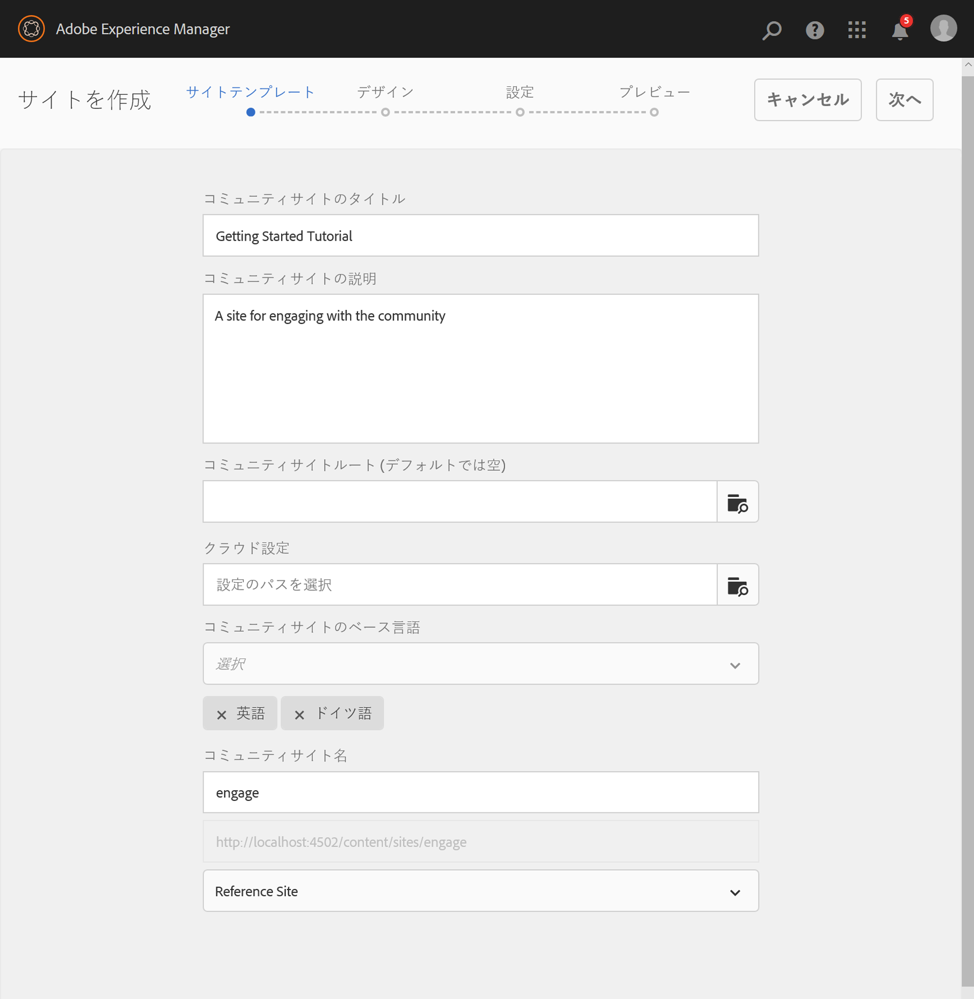
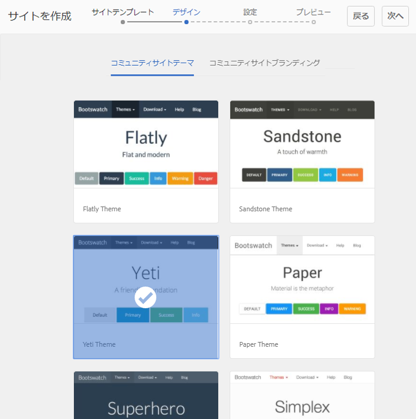
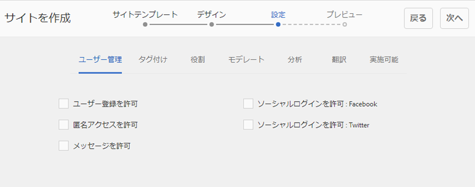

# コミュニティサイトコンソール {#communities-sites-console}

Communitiesのサイトコンソールから次の項目にアクセスできます。

* サイトの作成
* サイトの編集
* サイト管理
* [ネストされたグループ](/help/communities/groups.md) （サブコミュニティ）の作成と編集

オーサー環境で素早くコミュニティサイトを作成する方法や、オーサー環境とパブリッシュ環境からコミュニティグループを作成する方法については、[AEM Communities 使用の手引き](/help/communities/getting-started.md)を参照してください。

>[!NOTE]
>
>The main Communities menus for the creation of [community sites](/help/communities/sites-console.md), [community site templates](/help/communities/sites.md), [community group templates](/help/communities/tools-groups.md) and [community functions](/help/communities/functions.md) are for use only in the author environment.

## 前提条件 {#prerequisites}

Before creating a community site, it is *required* to:

* 1つ以上の発行インスタンスが実行中であることを確認します。
* Enable the [tunnel service](/help/communities/deploy-communities.md#tunnel-service-on-author) to manage members and member groups.
* Identify the [primary publisher](/help/communities/deploy-communities.md#primary-publisher).
* [プライマリパブリッシャー](/help/communities/deploy-communities.md#replication-agents-on-author) ・ポートがデフォルト(4503)でない場合は、レプリケーションを構成します。

サイトで様々な機能がサポートされるよう確実に準備するために、次の手順を実行することをお勧めします。

* Install the [latest feature pack](/help/communities/deploy-communities.md#latestfeaturepack).
* Enable [Adobe Analytics](/help/communities/analytics.md) for AEM Communities.
* Configure [email](/help/communities/email.md)
* Identify [Community Administrators](/help/communities/users.md#creating-community-members).
* [OAuthハンドラーを有効にして](/help/communities/social-login.md#adobe-granite-oauth-authentication-handler) 、ソーシャルログインを行います。

## コミュニティサイトコンソールへのアクセス {#accessing-communities-sites-console}

作成者環境で、Communities Sitesコンソールにアクセスするには：

* From global navigation: **[!UICONTROL Communities]** > **[!UICONTROL Sites]**

コミュニティサイトコンソールには、既存のコミュニティサイトが表示されます。このコンソールから、コミュニティサイトを作成、編集、管理、削除できます。

新しいコミュニティサイトを作成するには、**作成**&#x200B;アイコンを選択します。

ネストされたグループのオーサリング、変更、公開、書き出しまたは追加をおこなうために既存のコミュニティサイトにアクセスするには、サイトのフォルダーアイコンを選択します。

For example, the following image shows the main Communities Sites console displaying the folders for two community sites : [enable](/help/communities/getting-started-enablement.md) and [engage](/help/communities/getting-started.md):

## サイト作成 {#site-creation}

サイト作成コンソールでは、選択した[コミュニティサイトテンプレート](/help/communities/sites.md)と設定に基づき、サイトの機能を段階的に組み立てることができます。

作成されるサイトには、いずれもログイン機能が含まれます。これは、サイト訪問者がコンテンツの投稿、メッセージの送信またはグループへの参加をおこなう前に、サインインする必要があるからです。その他の機能には、ユーザプロファイル、メッセージング、通知、サイトメニュー、検索、テーマ設定、ブランドなどがあります。

The process is launched by selecting the `Create` button located at the top of the Communities Sites console.

作成プロセスでは、一連の手順がパネル形式で表示されます。パネルには、設定する機能セット（サブパネルとして表示）が含まれています。It is possible to move forward to the **Next** step or **Back** to the previous step before committing the site in the final step.

### Step 1 : Site Template {#step-site-template}

サイトテンプレートパネルでは、タイトル、説明、サイトのルート、ベース言語、名前およびサイトテンプレートを指定します。

* **コミュニティサイトのタイトル**

   サイトの表示タイトル。

   タイトルは、公開済みサイトとサイト管理UIに表示されます。

* **コミュニティサイトの説明**

   サイトの説明。

   説明は、公開されたサイトには表示されません。

* **コミュニティサイトのルート**

   サイトのルートパス。

   The default root is `/content/sites`, but the root may be moved to any location within the web site.

* **コミュニティサイトのベース言語**

   (Leave untouched for single language: English) Use the pull down menu to choose one *or more* base languages from the available languages- German, Italian, French, Japanese, Spanish, Portuguese (Brazil), Chinese (Traditional), and Chinese (Simplified). One community site will be created for each language added, and will exist within the same site folder following the best practice described in [Translating Content for Multilingual Sites](/help/sites-administering/translation.md). 各サイトのルートページには、選択したいずれかの言語の言語コード（例えば、英語では「en」、フランス語では「fr」）で名付けられた子ページが含まれます。

* **コミュニティサイト名**:

   URLに表示されるサイトのルートページの名前。

   * 重複 — サイトの作成後に名前が簡単に変更されないので、名前を確認します。
   * ベースURL( `https://server:port/site root/site name)``Community Site Name`が

   * 有効なURLの場合は、ベース言語コード+ &quot;.html&quot;を追加します。

      *例えば*、 `https://localhost:4502/content/sites/mysight/en.html`

* **コミュニティサイトテンプレート** メニュー

   プルダウンメニューを使用して、利用可能なコミュニティサイ [トテンプレートを選択しま](/help/communities/tools.md)す。

* 「**次へ**」を選択します。

### 手順 2：デザイン {#step-design}

デザインパネルには、テーマとブランドバナーを選択するための、以下の 2 つのサブパネルが含まれています。

#### コミュニティサイトテーマ {#community-site-theme}

このフレームワークでは、レスポンシブで柔軟なサイトデザインを実現できるよう、[Twitter Bootstrap](https://twitterbootstrap.org/) を使用しています。プリロードされた多数のブートストラップテーマの1つを選択して、選択したコミュニティサイトのテンプレートのスタイルを設定したり、ブートストラップテーマをアップロードしたりできます。

選択すると、テーマの上に不透明な青色のチェックマークのオーバーレイが表示されます。

コミュニティサイトの公開後は、[プロパティを編集](#modifying-site-properties)し、別のテーマを選択できます。

#### コミュニティサイトブランディング {#community-site-branding}

コミュニティサイトブランディングとは、各ページ上部にヘッダーとして表示される画像のことです。

画像の幅は、予想されるブラウザー内でのページの表示に合わせます。画像の高さは 120 ピクセルにします。

画像を選択するときは、次の点に注意してください。

* 画像の高さは、画像の上端から120ピクセルにトリミングされます。
* 画像は、ブラウザーウィンドウの左端に固定されます。
* 画像の幅が次のような場合、画像のサイズは変更されません。

   * ブラウザーの幅より小さい場合、画像は水平方向に繰り返されます。
   * ブラウザーの幅より大きい場合、画像は切り抜かれたように見えます。

* 「**次へ**」を選択します。

### 手順 3：設定 {#step-settings}

設定パネルには複数のサブパネルが含まれています。各サブパネルに表示される機能を設定した後に、サイト作成の最後の手順に進みます。

* [ユーザー管理](#user-management)
* [タグ付け](#tagging)
* [役割](#roles)
* [モデレート](#moderation)
* [Analytics](#analytics)
* [翻訳](#translation)
* [イネーブルメント](#enablement)

>[!NOTE]
>
>**トンネルサービスの有効化**
>
>いくつかの設定サブパネルでは、信頼されているメンバーを、UGC のモデレーター、グループの管理者またはパブリッシュ環境でのイネーブルメントリソースの連絡先に割り当てることができます。
>
>The convention is for publish-side [users and user groups](/help/communities/users.md) (members and member groups) to not be duplicated in the author environment.
>
>したがって、オーサー環境でコミュニティサイトを作成し、信頼されているメンバーを様々な役割に割り当てる場合は、パブリッシュ環境からメンバーのデータを取得する必要があります。
>
>これは、作成者のを有効にするこ ` [AEM Communities Publish Tunnel Service](/help/communities/deploy-communities.md#tunnel-service-on-author)` とで達成されます。

#### ユーザー管理 {#user-management}

>[!NOTE]
>
>It is recommended that [enablement community sites](/help/communities/overview.md#enablement-community) be private (contact your account representative for more information).
>
>コミュニティサイトを非公開にするとは、匿名のサイト訪問者に対してアクセスを拒否し、自己登録やソーシャルログインを使用禁止にすることです。

* **ユーザー登録を許可**

   オンにすると、サイト訪問者は自己登録によってコミュニティのメンバーになる場合があります。
If unchecked, the community site is *restricted* and site visitors must be assigned to the community site&#39;s members group, make a request or be sent an invitation by email. 選択しない場合、匿名アクセスは許可されません。
非公開のコミュニティサイトの場合はオフにします。**&#x200B;初期設定はオンです。

* **匿名アクセスを許可**

   このオプションを選択すると、コミュニティサイトは*open *開かれ、サイト訪問者はサイトにアクセスできます。
オフにすると、サインイン済みのメンバーのみがサイトにアクセスできます。*private *コミュニティサイトのチェックを外します。 初期設定はオンです。

* **メッセージを許可**

   このオプションを選択すると、メンバーは互いにメッセージを送信し、コミュニティサイト内のグループにメッセージを送信できます。
オフにすると、コミュニティのメッセージング機能は設定されません。初期設定はオフです。

* **ソーシャルログインを許可 : Facebook**

   オンにした場合、サイト訪問者はFacebookアカウントの資格情報を使用してサインインできます。 The selected [Facebook cloud configuration](/help/communities/social-login.md#create-a-facebook-connect-cloud-service) should be configured to add users to the community site&#39;s members group once the community site is created.
オフにすると、Facebook ログインは表示されません。非公開のコミュニティサイトの場合はオフのままにします。**&#x200B;初期設定はオフです。

* **ソーシャルログインを許可 : Twitter**

   オンにした場合、サイト訪問者はTwitterアカウントの資格情報を使用してサインインできます。 The selected [Twitter cloud configuration](/help/communities/social-login.md#create-a-twitter-connect-cloud-service) should be configured to add users to the community site&#39;s members group once the community site is created.
オフにすると、Twitter ログインは表示されません。非公開のコミュニティサイトの場合はオフのままにします。**&#x200B;初期設定はオフです。

>[!NOTE]
>
>**ソーシャルログインの許可**
>
>Facebook と Twitter のサンプル設定が存在し、選択可能な場合がありますが、[実稼動環境](/help/sites-administering/production-ready.md)では、カスタム Facebook アプリケーションとカスタム Twitter アプリケーションを作成する必要があります。[Facebook と Twitter を使用したソーシャルログイン](/help/communities/social-login.md)を参照してください。

#### タグ付け {#tagging}

コミュニティコンテンツに適用できるタグを制御するには、以前に[タグ付けコンソール](/help/sites-administering/tags.md#tagging-console)で定義したタグ名前空間を選択します。

また、コミュニティサイトに対してタグ名前空間を選択すると、カタログとリソースを定義するときに表示される選択肢が制限されます。See [Tagging Enablement Resources](/help/communities/tag-resources.md) for important information.

* テキスト検索ボックス：開始タイプを使用して、サイトで使用できるタグを識別します。

#### 役割 {#roles}

[コミュニティメンバーの役割](/help/communities/users.md)は、これらの設定で割り当てます。

コミュニティメンバーは先行入力検索で簡単に検索できます。

* **コミュニティマネージャー**

   開始の入力を使用して、コミュニティメンバーおよびメンバーグループを管理できる1つ以上のコミュニティメンバーまたはメンバーグループを選択します。

* **コミュニティのモデレーター**

   開始生成コンテンツのモデレーターとして信頼される1つ以上のコミュニティメンバーまたはメンバーグループを選択するための入力。

* **コミュニティ権限を持つメンバー**

   Start typing to select one or more community members or member groups to be given the ability to create new content when `Allow Privileged Member` has been selected for a [community function](/help/communities/functions.md).

* **コミュニティ管理者**

   開始入力を使用して、他のサイト管理者やデフォルトのコミュニティ管理者とは無関係にサイト構造を処理できる1人または複数のサイト管理者を選択します。 階層の任意のレベルでグループを作成し、ネストされたグループのデフォルトの管理者になることができます（ただし、後でネストされたグループの管理者の役割から削除することもできます）。

#### モデレート {#moderation}

ユーザー生成コンテンツ（UGC）のモデレートのグローバル設定は、ここで制御します。個々のコンポーネントには、モデレートを制御するための追加設定があります。

* **コンテンツを事前にモデレート**

   オンにすると、投稿されたコミュニティのコンテンツはモデレーターによって承認されるまで表示されません。 初期設定はオフです。For more information, see [Moderating Community Content](/help/communities/moderate-ugc.md#premoderation).

* **コンテンツが非表示になるまでのフラグ設定しきい値**

   0より大きい場合は、トピックまたは投稿が公開表示に表示されないようにする前にフラグを付ける必要がある回数です。 -1に設定すると、フラグ付けされたトピックまたは投稿が公開表示に表示されません。 初期設定は 5 です。

#### Analytics {#analytics}

* **Analytics を有効にする**

   Only available when Adobe Analytics has been [configured](/help/communities/analytics.md) for Communities features.
初期設定はオフです。オンにすると、以下の追加選択メニューが表示されます。

* **クラウド設定フレームワークの参照**

   プルダウンメニューから、このコミュニティサイト用に設定した Analytics クラウドサービスフレームワークを選択します。
   `Communities` は、 [Analytics Configuration for Communities Featuresドキュメントのフレームワークの例](/help/communities/analytics.md#aem-analytics-framework-configuration) です。

#### TRANSLATION {#translation}

* **機械翻訳を許可**

   オンにすると（デフォルトではオフ）、サイト内のUGCに対して機械翻訳が有効になります。 これは、サイトが多言語サイトとして設定されている場合でも、ページコンテンツなどの他のコンテンツには影響しません。 See [Translating User Generated Content](/help/communities/translate-ugc.md) for information on configuring a licensed translation service for AEM Communities. See [Translating Content for Multilingual Sites](/help/sites-administering/translation.md) for a complete overview.

* **選択した言語の機械翻訳を有効にする**

   機械翻訳が有効になっている言語は、翻訳統合設定で指定されたシステム設定に [デフォルトで設定されま](/help/communities/translate-ugc.md#translation-integration-configuration)す。 これらのデフォルト設定は、デフォルトを削除したり、プルダウンメニューから他の言語を選択したりすることで、このサイトで上書きされる場合があります。

* **変換プロバイダーを選択**

   By default, the service provider is a trial service using `microsoft` for demonstration only. If no translation service provider is licensed, **Allow Machine Translation** should be unchecked.

* **グローバル共有ストアを選択**

   複数の言語コピーがあるWebサイトの場合、グローバル共有ストアでは、各言語コピーから見える単一の会話スレッドを提供します。 これを実現するには、言語コピーとして含まれているいずれかの言語を選択します。Default is *No Global Shared Store*.

* **変換プロバイダー設定を選択**

   ライセンスされた [翻訳プロバイダー用に](/help/sites-administering/tc-tic.md) 、作成された翻訳統合フレームワークを選択します。

* **コミュニティサイトの翻訳オプションを選択**

   * **ページ全体を翻訳**

      選択すると、ページ上のすべてのUGCがページの基本言語に翻訳されます。

      初期設定では選択されていません。**

   * **選択項目のみ翻訳**

      選択すると、各投稿の横に翻訳オプションが表示され、個々の投稿をページの基本言語に翻訳できます。
初期設定では選択されています。**

* **保持オプションを選択**

   * **ユーザーのリクエストにより貢献度を翻訳し、その後保持する**&#x200B;選択すると、リクエストがあるまでコンテンツは翻訳されません。翻訳後、翻訳はリポジトリに保存されます。

      初期設定では選択されていません。**

   * **翻訳を保持しない**

      選択した場合、翻訳はリポジトリに保存されません。

      選択されていないと、翻訳は保持されます。

      初期設定では選択されていません。**

* **スマートレンダリング**

   次のいずれかを選択します。

   * `Always show contributions in the original language` (デフォルト値)
   * `Always show contributions in user preferred language`
   * `Show contributions in user preferred language for only logged-in users`

#### イネーブルメント {#enablement}

The `ENABLEMENT`settings are applicable when the chosen community site template includes the [assignments function](/help/communities/functions.md#assignments-function), which is available when the enablement features are licensed and [configured](/help/communities/enablement.md). 割り当て機能を含むリファレンスサイトのテンプレートは、 `Reference Structured Learning Site Template.`

* **イネーブルメントマネージャ**（必須）このイネーブルメントコミュニティを管理す `Community Enablementmanagers` るには、グループのメンバーのみが選択できます。 イネーブルメントマネージャは、メンバをリソースに割り当てる必要があります。 See also [Managing Users and User Groups](/help/communities/users.md).

* **Marketing Cloud 組織 ID**

   （オプション）ビデオハートビート分析 [ライセンスのID](/help/communities/analytics.md#video-heartbeat-analytics) 。

* 「**次へ**」を選択します。

### 手順 4：コミュニティサイトの作成 {#step-create-communities-site}

If any adjustments are needed, use the **Back** button to make them.

Once **Create** is selected and started, the process of creating the site cannot be interrupted.

サイト作成後は、以下のようになります。

* URL（ノード名）の変更はサポートされていません。
* 今後、コミュニティサイトテンプレートを変更しても、作成したコミュニティサイトには影響しません。
* コミュニティサイトテンプレートを無効にしても、作成したコミュニティサイトには影響しません。
* It is possible to edit the [STRUCTURE](#modify-structure) of a community site by modifying its properties.

プロセスが完了すると、新しいサイトのフォルダーがコミュニティサイトコンソールに表示されます。このコンソールで、作成者がページコンテンツを追加したり、管理者がサイトのプロパティを変更したりできます。

コミュニティサイトを変更するには、そのプロジェクトフォルダーを選択して開きます。

When hovering over a site with a mouse, or touching a site card, icons appear which allow for [editing the site in author mode](#authoring-site-content), [opening the site properties for modification](#modifying-site-properties), [publishing the site](#publishing-the-site), [exporting the site](#exporting-the-site), and [deleting the site](#deleting-the-site).

## サイトコンテンツのオーサリング {#authoring-site-content}

サイトのコンテンツは、他の AEM Web サイトと同じツールを使用してオーサリングできます。To open the site for authoring, select the `Open Site` icon that appears on hovering the site with mouse. サイトが新しいタブで開き、Communitiesのサイトコンソールにアクセスできるようになります。

>[!NOTE]
>
>AEM に馴染みがない場合は、[基本操作](/help/sites-authoring/basic-handling.md)に関するドキュメントおよび[ページのオーサリングのクイックガイド](/help/sites-authoring/qg-page-authoring.md)を参照してください。

## サイトプロパティの変更 {#modifying-site-properties}

The properties of an exisitng site, specified during the site creation process, can be modified by selecting the `Edit Site`icon that appears on hovering the site with mouse.

`Details of the following properties match the descriptions provided in the` 「サイト [の作成](#site-creation) 」セクション。

### 基本事項の変更 {#modify-basic}

BASICパネルでは、次の変更が可能です。

* コミュニティサイトのタイトル
* コミュニティサイトの説明

コミュニティサイト名は変更できません。

別のコミュニティサイトテンプレートを選択しても、テンプレートとサイトの間に関係は残っていないので、既存のコミュニティサイトに影響が及ぶことはありません。

その一方で、コミュニティサイトの[構造](#modify-structure)は変更できます。

### 構造の変更 {#modify-structure}

構造パネルでは、最初にコミュニティサイトテンプレートから作成された構造を変更できます。パネルから、次の操作を行うことができます。

* Drag-and-drop additional [community functions](/help/communities/functions.md) into the site structure.
* サイト構造内のコミュニティ関数のインスタンスで、次の操作を行います。

   * **`gear icon`**

      Edit settings, including the display title and URL name* as well as [privileged members groups](/help/communities/users.md#privilegedmembersgroups).

   * **`trashcan icon`**

      サイト構造から関数を削除（削除）します。

   * **`grid icon`**

      サイトのトップレベルナビゲーションバーに表示される関数の順序を変更します。

>[!NOTE]
>
>トップにある機能を除き、サイト構造のすべての機能の順序を変更できます。したがって、コミュニティのホームページは変更できない。

>[!CAUTION]
>
>* 表示タイトルは副作用なしに変更できますが、コミュニティサイトに属するコミュニティ機能のURL名を編集することはお勧めしません。
>
>
例えば、URL の名前を変更しても、既存の UGC は移動されません。そのため、UGC が「失われる」ことになります。

>[!CAUTION]
>
>The groups function must *not* be the *first nor the only* function in the site structure.
>
>他の機能（[ページ機能](/help/communities/functions.md#page-function)など）を含め、その機能を 1 番目にリストする必要があります。

#### 例：コミュニティのサイト構造へのカタログ機能の追加 {#example-adding-a-catalog-function-to-a-community-site-structure}

### デザインの変更 {#modify-design}

デザインパネルでは、適用する新しいテーマを選択できます。

* [コミュニティサイトテーマ](#community-site-theme)
* [コミュニティサイトブランディング](#community-site-branding)

   * パネルの下部までスクロールして、ブランド画像を変更します。

### 設定の変更 {#modify-settings}

設定パネルでは、コミュニティサイト作成の手順 3 のサブパネルにあるほとんどの設定にアクセスできます。

* [ユーザー管理](#user-management)
* [タグ](#tagging)
* [モデレート](#moderation)
* [メンバーの役割](#roles)
* [分析](#analytics)
* [翻訳](#translation)

### サムネイルの変更 {#modify-thumbnail}

サムネイルパネルでは、コミュニティサイトコンソールでサイトを表現する画像をアップロードできます。

### イネーブルメントの変更 {#modify-enablement}

イネーブルメントパネルでは、コミュニティサイトの作成中に表示された設定にアクセスできます。

See the [ENABLEMENT](#enablement) description.

## サイトの公開 {#publishing-the-site}

After a community site has been newly created or modified, it is possible to publish (activate) the site by selecting the `Publish Site` icon, that appears on mouse hover over the site.

サイトが正常に公開されると、次のようなメッセージが表示されます。

### ネストされたグループでの公開 {#publishing-with-nested-groups}

コミュニティサイトを公開した後、[グループコンソール](/help/communities/groups.md)を使用して作成された各サブコミュニティ（ネストされたグループ）を個別に公開する必要があります。

## サイトの書き出し {#exporting-the-site}

サイトにマウスポインターを置くと表示される書き出しアイコンを選択して、コミュニティサイトのパッケージを作成します。このパッケージは、[パッケージマネージャー](/help/sites-administering/package-manager.md)に格納され、ダウンロード可能になります。

UGC はサイトパッケージに含まれていません。

## サイトの削除 {#deleting-the-site}

コミュニティサイトを削除するには、サイトを削除アイコンを選択します。このアイコンは、コミュニティサイトコンソール内でサイトにマウスポインターを置くと表示されます。サイトを削除すると、UGC やユーザーグループ、アセット、データベースレコードなど、そのサイトに関連付けられているアイテムがすべて削除されます。

## 作成されたコミュニティユーザーグループ {#created-community-user-groups}

新しいコミュニティサイトが公開されると、新しいメンバーグループが作成されます（ユーザーグループはパブリッシュ環境で作成されます）。各グループには、様々な管理の役割およびメンバーの役割に応じて適切な権限が設定されます。

The name created for the member groups includes the *site-name* given the site in [Step 1](#step13asitetemplate) (the name which appears in the URL) as well as an unique ID to avoid conflicts with community sites and groups having the same site-name for different community site roots.

例えば、「Getting Started Tutorial」というタイトルを持つサイトのサイト名が「engage」の場合、モデレーターのユーザーグループは次のようになります。

* タイトル：コミュニティ Engage モデレーター
* 名前：community-*engage-uid*-moderators

サイト作成中にモデレーターまたはグループ管理者の役割を割り当てられたメンバーは、適切なグループとメンバーグループに割り当てられます。これらのグループとメンバーの割り当ては、新しいサイトが公開されたときに発行時に作成されます。

For details, see [Managing Users and User Groups](/help/communities/users.md).

>[!NOTE]
>
>[ソーシャルログインを許可：Facebook](#user-management) が有効な場合は、以下に示すユーザーグループが作成された後に、
>
>* `community-<site-name>-<uid>-members`
>
>
is created, the applied [Facebook cloud service](/help/communities/social-login.md#createafacebookcloudservice) should be configured to add users to this group.

## 認証エラーの設定 {#configure-for-authentication-error}

ユーザーが誤った資格情報を入力してログインに失敗した場合、コミュニティサイトはデフォルトでサンプルのログインページにリダイレクトします。This sample login will not be present on a [production server](/help/sites-administering/production-ready.md).

正しくリダイレクトするには、サイトを設定してパブリッシュ環境にプッシュした後、以下の手順を実行し、認証失敗時にコミュニティサイトにリダイレクトされるようにします。

* 各AEM発行インスタンスで使用します。
* 管理者権限でサインインします。
* Access the [Web Console](/help/sites-deploying/configuring-osgi.md).

   * For example, [https://localhost:4503/system/console/configMgr](https://localhost:4503/system/console/configMgr).

* Locate `Adobe Granite Login Selector Authentication Handler`.
* Select the `pencil` icon to open the configuration for edit.
* 次の手順に従っ **て、ログインページのマッピング** を入力します。

   `/content/sites/<site-name>/path/to/login/page:/content/sites/<site-name>`

   次に例を示します。
   `/content/sites/engage/en/signin:/content/sites/engage/en`

* 「**保存**」を選択します。

### 認証リダイレクトのテスト {#test-authentication-redirection}

ログインページマッピングをコミュニティサイト用に設定した前述の AEM パブリッシュインスタンス上で、次の操作をおこないます。

* コミュニティサイトのホームページ。

   * For example, [https://localhost:4503/content/sites/engage/en.html](https://localhost:4503/content/sites/engage/en.html)

* 「ログアウト」を選択します。
* 「ログイン」を選択します。
* ユーザー名「x」やパスワード「x」など、明らかに正しくない資格情報を入力します。
* ログインページに「ログインが無効です」というエラーが表示されます。

## 主なサイトのコンソールからコミュニティサイトへのアクセス {#accessing-community-sites-from-main-sites-console}

From the global navigation Sites console, community sites are located in the `Community Sites` folder.

コミュニティサイトにはこの方法でアクセスできますが、管理タスクをおこなう場合は、コミュニティサイトコンソールからコミュニティサイトにアクセスする必要があります。

