# コミュニティサイトコンソール {#communities-sites-console}

コミュニティサイトコンソールでは、以下の操作ができます。：

* サイトの作成
* サイト編集
* サイト管理
* [ネストされたグループの作成と編集](/help/communities/groups.md) （サブコミュニティ）

オーサー環境で素早くコミュニティサイトを作成する方法や、オーサー環境とパブリッシュ環境からコミュニティグループを作成する方法については、[AEM Communities 使用の手引き](/help/communities/getting-started.md)を参照してください。

>[!NOTE]
>
>作成用のメインのコミュニティメニュー [コミュニティサイト](/help/communities/sites-console.md), [コミュニティサイトテンプレート](/help/communities/sites.md), [コミュニティグループテンプレート](/help/communities/tools-groups.md) および [コミュニティ機能](/help/communities/functions.md) は、オーサー環境でのみ使用されます。

## 前提条件 {#prerequisites}

コミュニティサイトを作成する前に、以下の手順をおこなう必要があります。**：

* 1 つ以上のパブリッシュインスタンスが実行中であることを確認します。
* を有効にします。 [トンネルサービス](/help/communities/deploy-communities.md#tunnel-service-on-author) をクリックして、メンバーとメンバーグループを管理します。
* 次を識別： [主発行者](/help/communities/deploy-communities.md#primary-publisher).
* [レプリケーションの設定](/help/communities/deploy-communities.md#replication-agents-on-author) プライマリパブリッシャーポートがデフォルト (4503) でない場合。

サイトで様々な機能がサポートされるよう確実に準備するために、次の手順を実行することをお勧めします。

* のインストール [最新の機能パック](/help/communities/deploy-communities.md#latestfeaturepack).
* 有効にする [Adobe Analytics](/help/communities/analytics.md) AEM Communities
* 設定 [電子メール](/help/communities/email.md)
* 特定 [コミュニティ管理者](/help/communities/users.md#creating-community-members).
* [OAuth ハンドラーを有効にする](/help/communities/social-login.md#adobe-granite-oauth-authentication-handler) ソーシャルログイン用。

## コミュニティサイトコンソールへのアクセス {#accessing-communities-sites-console}

オーサー環境でコミュニティサイトコンソールに移動するには、：

* グローバルナビゲーションから： **[!UICONTROL コミュニティ]** > **[!UICONTROL サイト]**

コミュニティサイトコンソールには、既存のコミュニティサイトが表示されます。このコンソールから、コミュニティサイトを作成、編集、管理および削除できます。

新しいコミュニティサイトを作成するには、**作成**&#x200B;アイコンを選択します。

ネストされたグループのオーサリング、変更、公開、書き出しまたは追加をおこなうために既存のコミュニティサイトにアクセスするには、サイトのフォルダーアイコンを選択します。

例えば、次の画像は、2 つのコミュニティサイト用のフォルダーを表示するメインのコミュニティサイトコンソールを示しています。 [有効](/help/communities/getting-started-enablement.md) および [エンゲージ](/help/communities/getting-started.md):

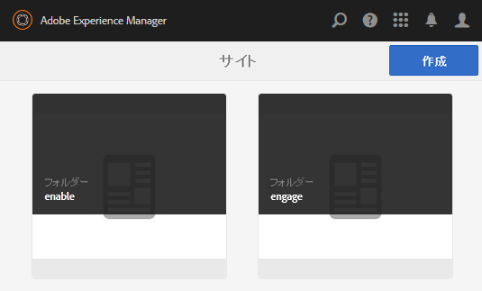

## サイト作成 {#site-creation}

サイト作成コンソールでは、選択した[コミュニティサイトテンプレート](/help/communities/sites.md)と設定に基づき、サイトの機能を段階的に組み立てることができます。

作成されるサイトには、いずれもログイン機能が含まれます。これは、サイト訪問者がコンテンツの投稿、メッセージの送信またはグループへの参加をおこなう前に、サインインする必要があるからです。その他の機能には、ユーザープロファイル、メッセージング、通知、サイトメニュー、検索、テーマ設定、ブランディングが含まれます。

プロセスは、 `Create` コミュニティサイトコンソールの上部にあるボタン。

作成プロセスでは、一連の手順がパネル形式で表示されます。パネルには、設定する機能セット（サブパネルとして表示）が含まれています。を **次へ** 手順または **戻る** を前の手順に戻してから、最後の手順でサイトをコミットします。

### 手順 1：サイトテンプレート {#step-site-template}

サイトテンプレートパネルでは、タイトル、説明、サイトのルート、ベース言語、名前およびサイトテンプレートを指定します。

* **コミュニティサイトのタイトル**

   サイトの表示タイトル。

   タイトルは、公開されたサイトおよびサイトの管理 UI に表示されます。

* **コミュニティサイトの説明**

   サイトの説明。

   公開されたサイトに説明は表示されません。

* **コミュニティサイトのルート**

   サイトへのルートパス。

   デフォルトのルートはです。 `/content/sites`を参照してください。ただし、ルートは Web サイト内の任意の場所に移動できます。

* **コミュニティサイトのベース言語**

   ( 単一言語の場合は手を付けないでください。英語 ) プルダウンメニューを使用して 1 つを選択します *以上* 使用可能な言語 ( ドイツ語、イタリア語、フランス語、日本語、スペイン語、ポルトガル語（ブラジル）、中国語（繁体字）、中国語（簡体字）)) のベース言語。 追加された言語ごとに 1 つのコミュニティサイトが作成され、 [多言語サイトのコンテンツの翻訳](/help/sites-administering/translation.md). 各サイトのルートページには、選択したいずれかの言語の言語コード（例えば、英語では「en」、フランス語では「fr」）で名付けられた子ページが含まれます。

* **コミュニティサイト名**:

   URL に表示されるサイトのルートページの名前。

   * サイトの作成後に名前が簡単に変更されないので、名前を再度確認します。
   * ベース URL ( `https://server:port/site root/site name)` が `Community Site Name`.

   * 有効な URL に、ベース言語コード+ &quot;.html&quot;を追加します。

      *例：*, `https://localhost:4502/content/sites/mysight/en.html`

* **コミュニティサイトテンプレート** メニュー

   プルダウンメニューを使用して、使用可能な [コミュニティサイトテンプレート](/help/communities/tools.md).

* 「**次へ**」を選択します。

### 手順 2：デザイン {#step-design}

デザインパネルには、テーマとブランドバナーを選択するための、以下の 2 つのサブパネルが含まれています。

#### コミュニティサイトテーマ {#community-site-theme}

このフレームワークでは、レスポンシブで柔軟なサイトデザインを実現できるよう、`Twitter Bootstrap` を使用しています。プリロードされた多数のBootstrapテーマの 1 つを選択して、選択したコミュニティサイトテンプレートのスタイルを設定したり、Bootstrapテーマをアップロードしたりできます。

選択すると、テーマの上に不透明な青色のチェックマークのオーバーレイが表示されます。

コミュニティサイトの公開後は、[プロパティを編集](#modifying-site-properties)し、別のテーマを選択できます。

#### コミュニティサイトブランディング {#community-site-branding}

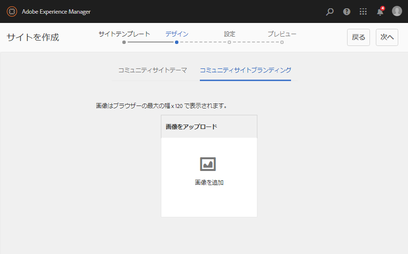

コミュニティサイトブランディングとは、各ページ上部にヘッダーとして表示される画像のことです。

画像の幅は、予想されるブラウザー内でのページの表示に合わせます。画像の高さは 120 ピクセルにします。

画像を選択するときは、次の点に注意してください。

* 画像の高さは、画像の上端から 120 ピクセルの位置に切り抜かれます。
* 画像はブラウザーウィンドウの左端に固定されます。
* 画像のサイズは変更されず、画像の幅が次のようになる。

   * ブラウザーの幅より小さい場合、画像は水平方向に繰り返されます。
   * ブラウザーの幅より大きい場合は、画像が切り抜かれて表示されます。

* 「**次へ**」を選択します。

### 手順 3：設定 {#step-settings}

設定パネルには複数のサブパネルが含まれています。各サブパネルに表示される機能を設定した後に、サイト作成の最後の手順に進みます。

* [ユーザー管理](#user-management)
* [タグ付け](#tagging)
* [役割](#roles)
* [モデレート](#moderation)
* [Analytics ](#analytics)
* [翻訳](#translation)
* [イネーブルメント](#enablement)

>[!NOTE]
>
>**トンネルサービスの有効化**
>
>いくつかの設定サブパネルでは、信頼されているメンバーを、UGC のモデレーター、グループの管理者またはパブリッシュ環境でのイネーブルメントリソースの連絡先に割り当てることができます。
>
>この規則は、パブリッシュ側で使用されます。 [ユーザーとユーザーグループ](/help/communities/users.md) （メンバーとメンバーグループ）をオーサー環境で複製しないようにする必要があります。
>
>したがって、オーサー環境でコミュニティサイトを作成し、信頼されているメンバーを様々な役割に割り当てる場合は、パブリッシュ環境からメンバーのデータを取得する必要があります。
>
>これを行うには、 ` [AEM Communities Publish Tunnel Service](/help/communities/deploy-communities.md#tunnel-service-on-author)` オーサー環境用。

#### ユーザー管理 {#user-management}

>[!NOTE]
>
>を推奨します。 [イネーブルメントコミュニティサイト](/help/communities/overview.md#enablement-community) 非公開にする（詳しくは、アカウント担当者にお問い合わせください）。
>
>コミュニティサイトを非公開にするとは、匿名のサイト訪問者に対してアクセスを拒否し、自己登録やソーシャルログインを使用禁止にすることです。

* **ユーザー登録を許可**

   オンにすると、サイト訪問者は自己登録によってコミュニティメンバーになる場合があります。
オフにした場合、コミュニティサイトは *制限* サイト訪問者は、コミュニティサイトのメンバーグループに割り当てられ、リクエストを行うか、電子メールで招待状を送信する必要があります。 オフにした場合、匿名アクセスは許可されません。
非公開のコミュニティサイトの場合はオフにします。**&#x200B;初期設定はオンです。

* **匿名アクセスを許可**

   オンにすると、コミュニティサイトが「オープン」になり、サイト訪問者は誰でもサイトにアクセスできます。
オフにすると、サインイン済みのメンバーのみがサイトにアクセスできます。非公開のコミュニティサイトの場合はオフにします。 初期設定はオンです。

* **メッセージを許可**

   オンにすると、メンバーは互いにメッセージを送信し、コミュニティサイト内のグループにメッセージを送信できます。
オフにすると、コミュニティのメッセージング機能は設定されません。初期設定はオフです。

* **ソーシャルログインを許可 : Facebook**

   オンにすると、サイト訪問者はFacebookアカウントの資格情報を使用してログインできます。 選択した [Facebookクラウド設定](/help/communities/social-login.md#create-a-facebook-connect-cloud-service) コミュニティサイトを作成した後、コミュニティサイトのメンバーグループにユーザーを追加するように設定する必要があります。
オフにすると、Facebook ログインは表示されません。非公開のコミュニティサイトの場合はオフのままにします。**&#x200B;初期設定はオフです。

* **ソーシャルログインを許可 : Twitter**

   オンにすると、サイト訪問者はTwitterアカウントの資格情報を使用してログインできます。 選択した [Twitterクラウド設定](/help/communities/social-login.md#create-a-twitter-connect-cloud-service) コミュニティサイトを作成した後、コミュニティサイトのメンバーグループにユーザーを追加するように設定する必要があります。
オフにすると、Twitter ログインは表示されません。非公開のコミュニティサイトの場合はオフのままにします。**&#x200B;初期設定はオフです。

>[!NOTE]
>
>**ソーシャルログインの許可**
>
>Facebook と Twitter のサンプル設定が存在し、選択可能な場合がありますが、[実稼動環境](/help/sites-administering/production-ready.md)では、カスタム Facebook アプリケーションとカスタム Twitter アプリケーションを作成する必要があります。[Facebook と Twitter を使用したソーシャルログイン](/help/communities/social-login.md)を参照してください。

#### タグ付け {#tagging}

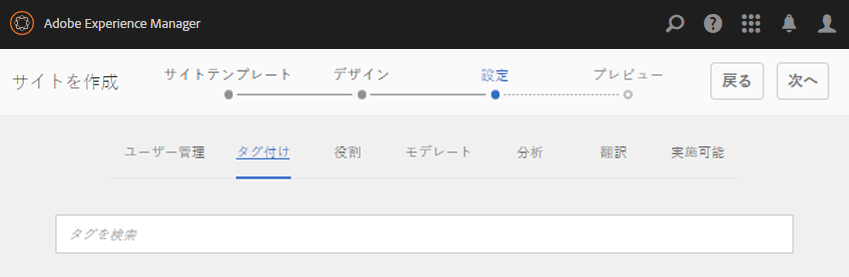

コミュニティコンテンツに適用できるタグを制御するには、以前に[タグ付けコンソール](/help/sites-administering/tags.md#tagging-console)で定義したタグ名前空間を選択します。

また、コミュニティサイトに対してタグ名前空間を選択すると、カタログとリソースを定義するときに表示される選択肢が制限されます。詳しくは、 [イネーブルメントリソースのタグ付け](/help/communities/tag-resources.md) 重要な情報を参照してください。

* テキスト検索ボックス：サイトで使用できるタグを識別するには、入力を開始します。

#### 役割 {#roles}

[コミュニティメンバーの役割](/help/communities/users.md)は、これらの設定で割り当てます。

コミュニティメンバーは先行入力検索で簡単に検索できます。

* **コミュニティマネージャー**

   入力を開始して、コミュニティメンバーとメンバーグループを管理できる 1 つ以上のコミュニティメンバーまたはメンバーグループを選択します。

* **コミュニティのモデレーター**

   入力を開始して、ユーザー生成コンテンツのモデレーターとして信頼される 1 つ以上のコミュニティメンバーまたはメンバーグループを選択します。

* **コミュニティ権限を持つメンバー**

   入力を開始して、1 つ以上のコミュニティメンバーまたはメンバーグループを選択し、新しいコンテンツを作成するには、 `Allow Privileged Member` が [コミュニティ機能](/help/communities/functions.md).

* **コミュニティ管理者**

   入力を開始して、他のサイト管理者やデフォルトのコミュニティ管理者とは無関係にサイト構造を処理できる 1 人または複数のサイト管理者を選択します。 階層の任意のレベルでグループを作成し、ネストされたグループのデフォルト管理者になることができます（ただし、後でネストされたグループの管理者の役割から削除することもできます）。

#### モデレート {#moderation}

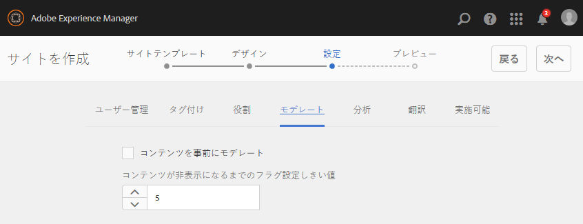

ユーザー生成コンテンツ（UGC）のモデレートのグローバル設定は、ここで制御します。個々のコンポーネントには、モデレートを制御するための追加設定があります。

* **コンテンツを事前にモデレート**

   オンにすると、投稿されたコミュニティコンテンツは、モデレーターが承認するまで表示されません。 初期設定はオフです。詳しくは、 [コミュニティコンテンツのモデレート](/help/communities/moderate-ugc.md#premoderation).

* **コンテンツが非表示になるまでのフラグ設定しきい値**

   0 より大きい場合は、トピックまたは投稿に何回フラグが設定された後に、その投稿が公開ビューで非表示になるかを指定する必要があります。 -1 に設定した場合、フラグ付きのトピックまたは投稿が公開表示から非表示になることはありません。 デフォルトは 5 です。

#### Analytics  {#analytics}

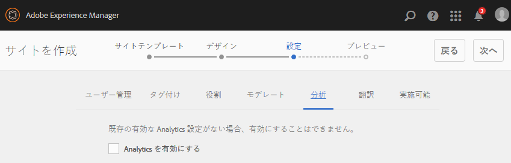

* **Analytics を有効にする**

   Adobe Analyticsが [設定済み](/help/communities/analytics.md) コミュニティ機能の場合
初期設定はオフです。オンにすると、以下の追加選択メニューが表示されます。

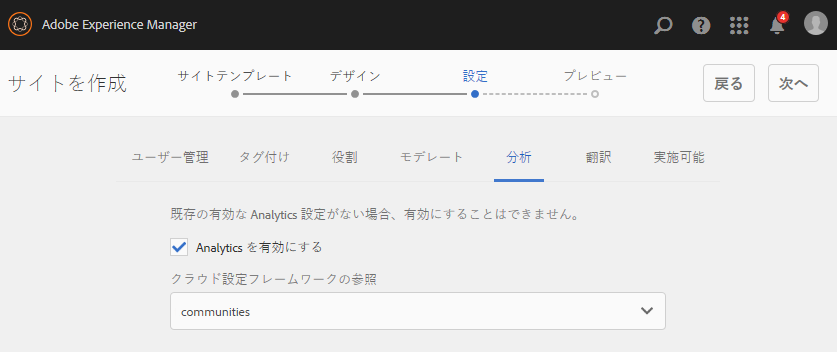

* **クラウド設定フレームワークの参照**

   プルダウンメニューから、このコミュニティサイト用に設定した Analytics クラウドサービスフレームワークを選択します。
   `Communities` は、次のフレームワークの例です： [コミュニティ機能用の Analytics 設定](/help/communities/analytics.md#aem-analytics-framework-configuration) ドキュメント。

#### 翻訳 {#translation}

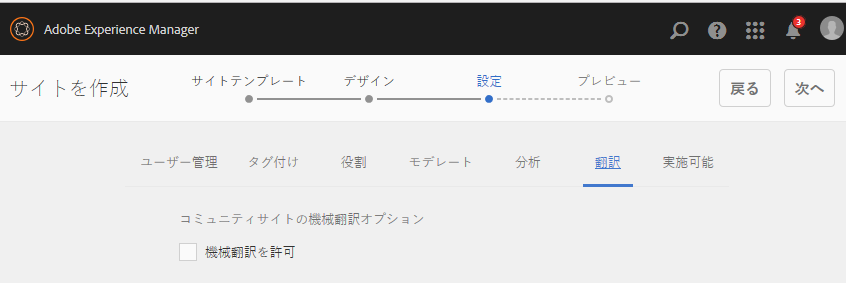

* **機械翻訳を許可**

   オン（デフォルトはオフ）にすると、サイト内の UGC に対して機械翻訳が有効になります。 この変更は、サイトが多言語サイトとして設定されている場合でも、ページコンテンツなどの他のコンテンツには影響しません。 詳しくは、 [ユーザー生成コンテンツの翻訳](/help/communities/translate-ugc.md) を参照してください。 詳しくは、 [多言語サイトのコンテンツの翻訳](/help/sites-administering/translation.md) を参照してください。

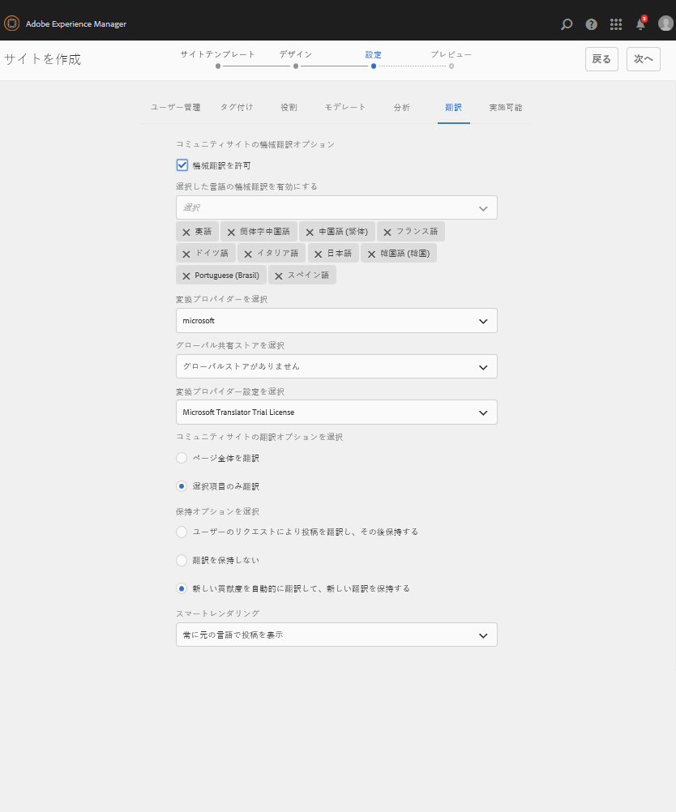

* **選択した言語の機械翻訳を有効にする**

   機械翻訳が有効な言語は、 [翻訳統合の設定](/help/communities/translate-ugc.md#translation-integration-configuration). これらのデフォルト設定は、デフォルトを削除するか、プルダウンメニューから他の言語を選択することで、このサイトに対して上書きできます。

* **変換プロバイダーを選択**

   デフォルトでは、サービスプロバイダーは、 `microsoft` デモのみ。 翻訳サービスプロバイダーがライセンスされていない場合、 **機械翻訳を許可** をオフにする必要があります。

* **グローバル共有ストアを選択**

   複数の言語コピーがある Web サイトの場合、グローバル共有ストアは会話のスレッドを 1 つ提供し、各言語コピーから表示できます。 これを実現するには、言語コピーとして含まれているいずれかの言語を選択します。デフォルトはです。 *グローバル共有ストアがありません*.

* **変換プロバイダー設定を選択**

   を選択します。 [翻訳統合フレームワーク](/help/sites-administering/tc-tic.md) ライセンスされた翻訳プロバイダー用に作成されました。

* **コミュニティサイトの翻訳オプションを選択**

   * **ページ全体を翻訳**

      選択すると、ページ上のすべての UGC がページのベース言語に翻訳されます。

      初期設定では選択されていません。**

   * **選択項目のみ翻訳**

      選択すると、各投稿の横に翻訳オプションが表示され、個々の投稿をページのベース言語に翻訳できます。
初期設定では選択されています。**

* **保持オプションを選択**

   * **ユーザーのリクエストにより貢献度を翻訳し、その後保持する**&#x200B;選択すると、リクエストがあるまでコンテンツは翻訳されません。翻訳後、翻訳はリポジトリに保存されます。

      初期設定では選択されていません。**

   * **翻訳を保持しない**

      選択した場合、翻訳はリポジトリに保存されません。

      選択されていないと、翻訳は保持されます。

      初期設定では選択されていません。**

* **スマートレンダリング**

   次のいずれかを選択します。

   * `Always show contributions in the original language`（デフォルト）
   * `Always show contributions in user preferred language`
   * `Show contributions in user preferred language for only logged-in users`

#### イネーブルメント {#enablement}

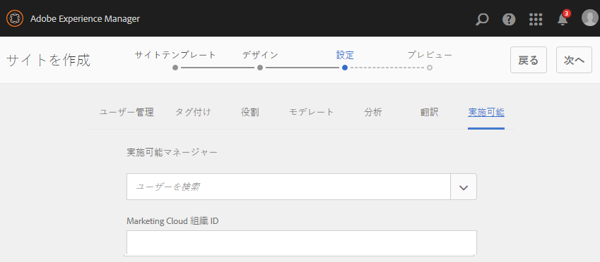

この `ENABLEMENT`設定は、選択したコミュニティサイトテンプレートに [割り当て機能](/help/communities/functions.md#assignments-function)：イネーブルメント機能がライセンスを受け、 [設定済み](/help/communities/enablement.md). 割り当て機能を含む参照サイトテンプレートは次のとおりです。 `Reference Structured Learning Site Template.`

* **実施可能マネージャー**
（必須） `Community Enablementmanagers` このイネーブルメントコミュニティを管理するために、グループを選択できます。 イネーブルメントマネージャーは、メンバーをリソースに割り当てます。 関連トピック [ユーザーとユーザーグループの管理](/help/communities/users.md).

* **Marketing Cloud 組織 ID**

   （オプション） [ビデオハートビート分析](/help/communities/analytics.md#video-heartbeat-analytics) ライセンス。

* 「**次へ**」を選択します。

### 手順 4：コミュニティサイトの作成 {#step-create-communities-site}

調整が必要な場合は、 **戻る** ボタンを使用して作成します。

1 回 **作成** を選択して開始すると、サイトの作成プロセスは中断できません。

サイト作成後は、以下のようになります。

* URL（ノード名）の変更はサポートされていません。
* 今後、コミュニティサイトテンプレートを変更しても、作成したコミュニティサイトには影響しません。
* コミュニティサイトテンプレートを無効にしても、作成したコミュニティサイトには影響しません。
* 次の項目を編集できます。 [構造](#modify-structure) コミュニティサイトのプロパティを変更します。

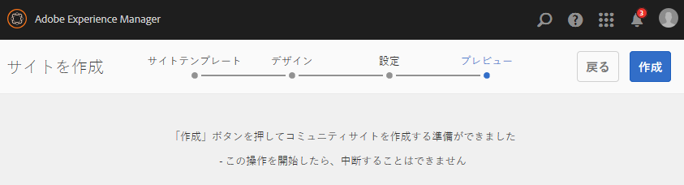

プロセスが完了すると、新しいサイトのフォルダーがコミュニティサイトコンソールに表示されます。このコンソールで、作成者がページコンテンツを追加したり、管理者がサイトのプロパティを変更したりできます。

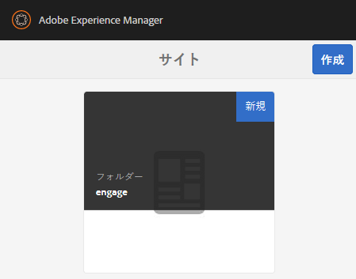

コミュニティサイトを変更するには、そのプロジェクトフォルダーを選択して開きます。

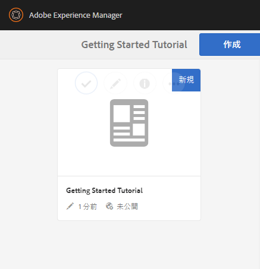

サイト上にマウスカーソルを置いたとき、またはサイトカードにマウスを合わせたときに、 [オーサーモードでのサイトの編集](#authoring-site-content), [変更用にサイトのプロパティを開く](#modifying-site-properties), [サイトのパブリッシュ](#publishing-the-site), [サイトのエクスポート](#exporting-the-site)、および [サイトの削除](#deleting-the-site).

## サイトコンテンツのオーサリング {#authoring-site-content}

サイトのコンテンツは、他の AEM Web サイトと同じツールを使用してオーサリングできます。オーサリング用にサイトを開くには、 `Open Site` サイトにマウスポインターを置くと表示されるアイコン。 サイトが新しいタブで開き、コミュニティサイトコンソールにアクセスできるようになります。

>[!NOTE]
>
>AEM に馴染みがない場合は、[基本操作](/help/sites-authoring/basic-handling.md)に関するドキュメントおよび[ページのオーサリングのクイックガイド](/help/sites-authoring/qg-page-authoring.md)を参照してください。

## サイトプロパティの変更 {#modifying-site-properties}

サイト作成プロセス中に指定された既存のサイトのプロパティは、 `Edit Site`サイトにマウスポインターを置くと表示されるアイコン。

`Details of the following properties match the descriptions provided in the` [サイトの作成](#site-creation) 」セクションに入力します。

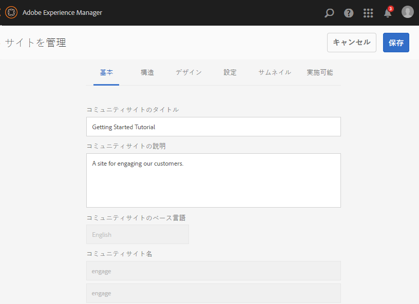

### 基本事項の変更 {#modify-basic}

基本パネルでは、次のものを変更できます。：

* コミュニティサイトのタイトル
* コミュニティサイトの説明

コミュニティサイト名は変更できません。

別のコミュニティサイトテンプレートを選択しても、テンプレートとサイトの間に関係は残っていないので、既存のコミュニティサイトに影響が及ぶことはありません。

その一方で、コミュニティサイトの[構造](#modify-structure)は変更できます。

### 構造の変更 {#modify-structure}

構造パネルでは、最初にコミュニティサイトテンプレートから作成された構造を変更できます。パネルから、次の操作を実行できます。

* 追加の [コミュニティ機能](/help/communities/functions.md) をサイト構造に追加します。
* サイト構造内のコミュニティ機能のインスタンスで、次の操作を実行します。

   * **`gear icon`**

      表示タイトルや URL 名*、 [権限を持つメンバーグループ](/help/communities/users.md#privilegedmembersgroups).

   * **`trashcan icon`**

      サイト構造から関数を削除（削除）します。

   * **`grid icon`**

      サイトのトップレベルナビゲーションバーに表示される関数の順序を変更します。

>[!NOTE]
>
>トップにある機能を除き、サイト構造のすべての機能の順序を変更できます。したがって、コミュニティサイトのホームページを変更することはできません。

>[!CAUTION]
>
>* 表示タイトルは副作用なしに変更できますが、コミュニティサイトに属するコミュニティ機能の URL 名を編集することはお勧めしません。
>
>例えば、URL の名前を変更しても、既存の UGC は移動されません。そのため、UGC が「失われる」ことになります。

>[!CAUTION]
>
>グループ機能は、 *not* は *最初でも唯一でも* 関数を使用して、サイト構造内で使用できます。
>
>他の機能（[ページ機能](/help/communities/functions.md#page-function)など）を含め、その機能を 1 番目にリストする必要があります。

#### 例：コミュニティのサイト構造へのカタログ機能の追加 {#example-adding-a-catalog-function-to-a-community-site-structure}

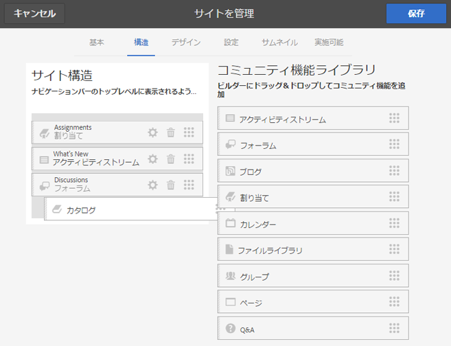

### デザインの変更 {#modify-design}

デザインパネルでは、適用する新しいテーマを選択できます。

* [コミュニティサイトテーマ](#community-site-theme)
* [コミュニティサイトブランディング](#community-site-branding)

   * パネルの下部までスクロールして、ブランド画像を変更します。

### 設定の変更 {#modify-settings}

設定パネルでは、コミュニティサイト作成の手順 3 のサブパネルにあるほとんどの設定にアクセスできます。

* [ユーザー管理](#user-management)
* [タグ](#tagging)
* [モデレート](#moderation)
* [メンバーの役割](#roles)
* [Analytics](#analytics)
* [翻訳](#translation)

### サムネイルの変更 {#modify-thumbnail}

サムネイルパネルでは、コミュニティサイトコンソールでサイトを表現する画像をアップロードできます。

### イネーブルメントの変更 {#modify-enablement}

イネーブルメントパネルでは、コミュニティサイトの作成中に表示された設定にアクセスできます。

詳しくは、 [有効化](#enablement) 説明。

## サイトの公開 {#publishing-the-site}

コミュニティサイトを新しく作成または変更した後、 `Publish Site` アイコンをクリックします。

サイトが正常に公開されると、次のようなメッセージが表示されます。

### ネストされたグループでの公開 {#publishing-with-nested-groups}

コミュニティサイトを公開した後、[グループコンソール](/help/communities/groups.md)を使用して作成された各サブコミュニティ（ネストされたグループ）を個別に公開する必要があります。

## サイトの書き出し {#exporting-the-site}

サイトにマウスポインターを置くと表示される書き出しアイコンを選択して、コミュニティサイトのパッケージを作成します。このパッケージは、[パッケージマネージャー](/help/sites-administering/package-manager.md)に格納され、ダウンロード可能になります。

UGC はサイトパッケージに含まれていません。

## サイトの削除 {#deleting-the-site}

コミュニティサイトを削除するには、サイトを削除アイコンを選択します。このアイコンは、コミュニティサイトコンソール内でサイトにマウスポインターを置くと表示されます。サイトを削除すると、UGC やユーザーグループ、アセット、データベースレコードなど、そのサイトに関連付けられているアイテムがすべて削除されます。

## 作成されたコミュニティユーザーグループ {#created-community-user-groups}

新しいコミュニティサイトが公開されると、新しいメンバーグループが作成されます（ユーザーグループはパブリッシュ環境で作成されます）。各グループには、様々な管理の役割およびメンバーの役割に応じて適切な権限が設定されます。

メンバーグループ用に作成された名前には、 *site-name* ～のサイトを考えると [手順 1](#step13asitetemplate) （URL に表示される名前）および一意の ID。コミュニティサイトや、異なるコミュニティサイトのルートに同じサイト名を持つグループとの競合を避けるために使用されます。

例えば、「Getting Started Tutorial」というタイトルを持つサイトのサイト名が「engage」の場合、モデレーターのユーザーグループは次のようになります。

* タイトル：コミュニティ Engage モデレーター
* 名前：community-*engage-uid*-moderators

サイト作成中にモデレーターまたはグループ管理者の役割を割り当てられたメンバーは、適切なグループとメンバーグループに割り当てられます。これらのグループとメンバーの割り当ては、新しいサイトが公開されると、公開時に作成されます。

詳しくは、 [ユーザーとユーザーグループの管理](/help/communities/users.md).

>[!NOTE]
>
>[ソーシャルログインを許可：Facebook](#user-management) が有効な場合は、以下に示すユーザーグループが作成された後に、
>
>* `community-<site-name>-<uid>-members`
>
>が作成され、適用される [Facebook cloud service](/help/communities/social-login.md#createafacebookcloudservice) は、このグループにユーザーを追加するように設定する必要があります。

## 認証エラーの設定 {#configure-for-authentication-error}

ユーザーが誤った資格情報を入力してログインに失敗した場合、コミュニティサイトはデフォルトでサンプルのログインページにリダイレクトします。このサンプルログインは、 [本番サーバ](/help/sites-administering/production-ready.md).

正しくリダイレクトするには、サイトを設定してパブリッシュ環境にプッシュした後、以下の手順を実行し、認証失敗時にコミュニティサイトにリダイレクトされるようにします。

* 各AEMパブリッシュインスタンスで。
* 管理者権限でサインインします。
* 次にアクセス： [Web コンソール](/help/sites-deploying/configuring-osgi.md).

   * 例： [https://localhost:4503/system/console/configMgr](https://localhost:4503/system/console/configMgr).

* 場所 `Adobe Granite Login Selector Authentication Handler`.
* を選択します。 `pencil` アイコンをクリックし、設定を開いて編集します。
* を入力します。 **ログインページのマッピング** 次のように指定します。

   `/content/sites/<site-name>/path/to/login/page:/content/sites/<site-name>`

   次に例を示します。
   `/content/sites/engage/en/signin:/content/sites/engage/en`

* 「**保存**」を選択します。

### 認証リダイレクトのテスト {#test-authentication-redirection}

ログインページマッピングをコミュニティサイト用に設定した前述の AEM パブリッシュインスタンス上で、次の操作をおこないます。

* コミュニティサイトのホームページを参照します。

   * 例： [https://localhost:4503/content/sites/engage/en.html](https://localhost:4503/content/sites/engage/en.html)

* 「ログアウト」を選択します。
* 「ログイン」を選択します。
* ユーザー名「x」やパスワード「x」など、明らかに間違った資格情報を入力します。
* ログインページには「無効なログイン」エラーが表示されます。

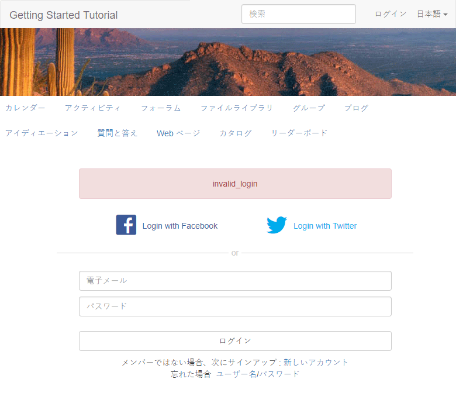

## 主なサイトのコンソールからコミュニティサイトへのアクセス {#accessing-community-sites-from-main-sites-console}

グローバルナビゲーションサイトコンソールから、コミュニティサイトは `Community Sites` フォルダー。

コミュニティサイトにはこの方法でアクセスできますが、管理タスクをおこなう場合は、コミュニティサイトコンソールからコミュニティサイトにアクセスする必要があります。

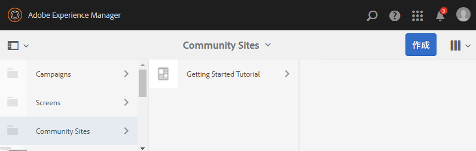
