# コミュニティサイトコンソール {#communities-sites-console}

Communities Sites コンソールでは、次のアクセス権を使用できます。

* サイトの構築
* サイト編集
* サイト管理
* [ ネストされたグループの作成と編集](/help/communities/groups.md) （サブコミュニティ）

オーサー環境でコミュニティサイトをすばやく作成する方法、オーサー環境とパブリッシュ環境からコミュニティグループを作成する方法については、[AEM Communitiesの概要](/help/communities/getting-started.md)を参照してください。

>[!NOTE]
>
>[ コミュニティサイト ](/help/communities/sites-console.md)、[ コミュニティサイトテンプレート ](/help/communities/sites.md)、[ コミュニティグループテンプレート ](/help/communities/tools-groups.md)および[ コミュニティ関数](/help/communities/functions.md)の作成に使用される主なコミュニティメニューは、オーサー環境でのみ使用できます。

## 前提条件 {#prerequisites}

コミュニティサイトを作成する前に、*次の操作が必要です*。

* 1つ以上のパブリッシュインスタンスが実行されていることを確認します。
* [ トンネルサービス ](/help/communities/deploy-communities.md#tunnel-service-on-author)を有効にして、メンバーとメンバーグループを管理します。
* [ プライマリパブリッシャー](/help/communities/deploy-communities.md#primary-publisher)を特定します。
* [ プライマリパブリッシャーポートがデフォルト（4503）でない場合は、レプリケーション ](/help/communities/deploy-communities.md#replication-agents-on-author)を設定します。

サイトが多くの機能をサポートする準備ができていることを確認するためのベストプラクティスは、次の手順を実行することです。

* [最新の機能パック ](/help/communities/deploy-communities.md#latestfeaturepack)をインストールします。
* AEM Communitiesの[Adobe Analytics](/help/communities/analytics.md)を有効にします。
* [email](/help/communities/email.md)を設定
* [ コミュニティ管理者](/help/communities/users.md#creating-community-members)を特定します。
* [ ソーシャルログイン用にOAuth ハンドラー](/help/communities/social-login.md#adobe-granite-oauth-authentication-handler)を有効にします。

## Communities Sites コンソールへのアクセス {#accessing-communities-sites-console}

オーサー環境で、Communities Sites コンソールにアクセスするには、次の手順を実行します。

* グローバルナビゲーションから：**[!UICONTROL Communities]** > **[!UICONTROL Sites]**

コミュニティサイトコンソールには、既存のコミュニティサイトが表示されます。 このコンソールから、コミュニティサイトを作成、編集、管理、削除できます。

コミュニティサイトを作成するには、**作成** アイコンを選択します。

既存のコミュニティサイトにアクセスして、オーサリング、変更、公開、書き出しまたはネストされたグループの追加を行うには、サイトのフォルダーアイコンを選択します。

## サイト作成 {#site-creation}

サイト作成コンソールでは、選択した[ コミュニティサイトテンプレート ](/help/communities/sites.md)と設定に基づいてサイトの機能を組み立てるステップバイステップのアプローチを提供します。

サイト訪問者は、コンテンツの投稿、メッセージの送信、グループへの参加などをおこなう前にログインする必要があるため、すべてのサイトにログイン機能が搭載されています。 その他の機能には、ユーザープロファイル、メッセージ、通知、サイトメニュー、検索、テーマ、ブランディングなどがあります。

このプロセスは、Communities Sites コンソールの上部にある「`Create`」ボタンを選択して開始されます。

作成プロセスは、設定する一連の機能（サブパネルとして表示）を含むパネルとして表示される一連の手順です。 最後の手順でサイトを確定する前に、**次** ステップまたは&#x200B;**戻る**&#x200B;前の手順に進むことができます。

### 手順1：サイトテンプレート {#step-site-template}

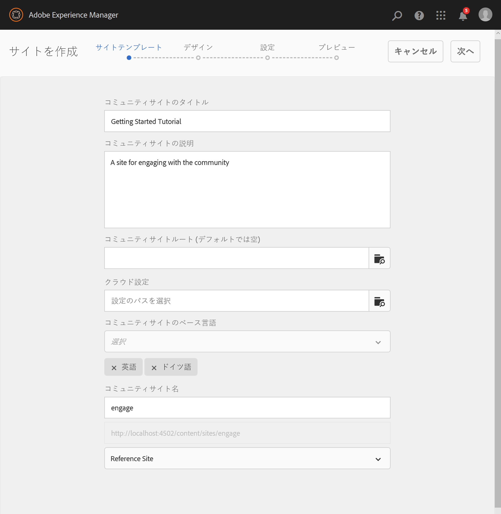

サイトテンプレートパネルでは、タイトル、説明、サイトルート、ベース言語、名前、サイトテンプレートが指定されます。

* **コミュニティサイトタイトル**

  サイトの表示タイトル。

  タイトルは、公開済みサイトとサイト管理UIに表示されます。

* **コミュニティサイトの説明**

  サイトの説明。

  説明は公開されたサイトには表示されません。

* **コミュニティサイトルート**

  サイトへのルートパス。

  デフォルトのルートは`/content/sites`ですが、ルートはweb サイト内の任意の場所に移動できます。

* **コミュニティサイトベース言語**

  （単一言語：英語）プルダウンメニューを使用して、使用可能な言語（ドイツ語、イタリア語、フランス語、日本語、スペイン語、ポルトガル語（ブラジル）、中国語（繁体字）、中国語（簡体字）から1つの&#x200B;*以上*&#x200B;の基本言語を選択します。 言語ごとに1つのコミュニティサイトが作成され、[多言語サイトのコンテンツの翻訳](/help/sites-administering/translation.md)で説明されているベストプラクティスに従って、同じサイトフォルダー内に存在します。 各サイトのルートページには、英語の「en」、フランス語の「fr」など、選択した言語の言語コードで名前が付けられた子ページが含まれています。

* **コミュニティサイト名**:

  URLに表示されるサイトのルートページの名前。

   * サイトの作成後は簡単に変更できないため、名前を再確認します。
   * ベース URL （`https://server:port/site root/site name)`）は、`Community Site Name`の下に表示されます。

   * 有効なURLの場合は、ベース言語コード + 「.html」を追加します

     *例：*、`https://localhost:4502/content/sites/mysight/en.html`

* **コミュニティサイトテンプレート** メニュー

  プルダウンメニューを使用して、使用可能な[ コミュニティサイトテンプレート ](/help/communities/tools.md)を選択します。

* 「**次へ**」を選択します。

### ステップ 2：デザイン {#step-design}

デザインパネルには、テーマとブランディングバナーを選択するための2つのサブパネルが含まれています。

#### コミュニティサイトのテーマ {#community-site-theme}

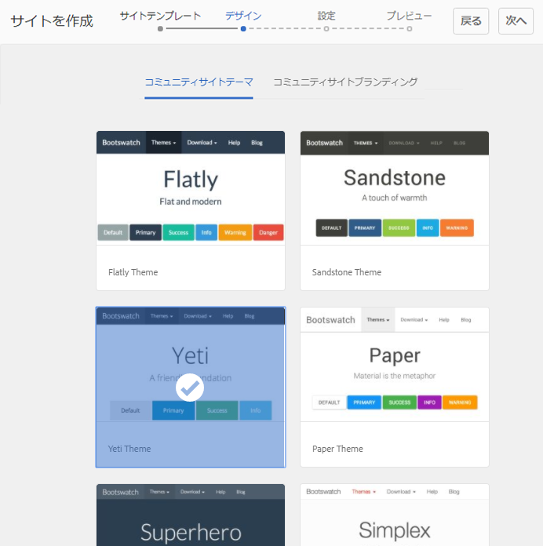

このフレームワークでは、`Twitter Bootstrap`を使用して、レスポンシブで柔軟なデザインをサイトに取り入れています。 選択したコミュニティサイトテンプレートのスタイルを設定するために、多数のプリロードされたBootstrap テーマの1つが選択されるか、Bootstrap テーマがアップロードされます。

選択すると、テーマは不透明な青いチェックマークでオーバーレイされます。

コミュニティサイトが公開されたら、[ プロパティを編集して](#modifying-site-properties)別のテーマを選択できます。

#### コミュニティサイトブランディング {#community-site-branding}

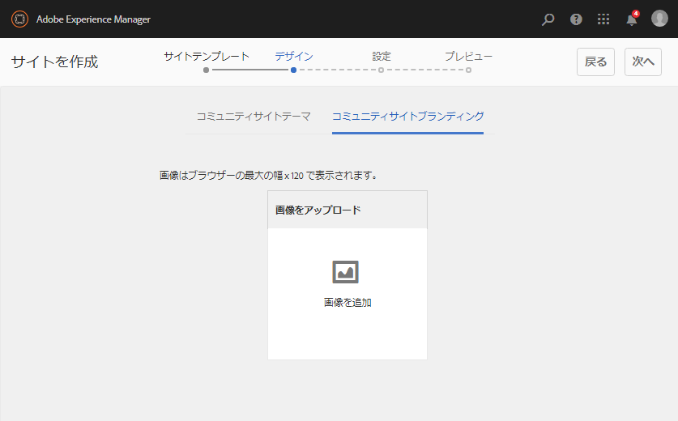

コミュニティサイトのブランディングとは、各ページの上部にヘッダーとして表示される画像です。

画像のサイズは、ブラウザーでのページの予想される表示幅と高さ120 ピクセルになるように調整する必要があります。

画像を作成または選択する際は、次の点に注意してください。

* 画像の高さは、画像の上端から測定された120 ピクセルに切り抜かれます。
* 画像はブラウザーウィンドウの左端にピン留めされます。
* 画像のサイズ変更はありません。画像の幅が…

   * ブラウザーの幅よりも小さい場合、画像は水平方向に繰り返されます。
   * ブラウザーの幅よりも大きい画像は切り抜かれているように見えます。

* 「**次へ**」を選択します。

### 手順3：設定 {#step-settings}

設定パネルには、サイトを作成する最後の手順に移動する前に設定する機能を示す複数のサブパネルが含まれています。

* [ユーザー管理](#user-management)
* [タグ付け](#tagging)
* [役割](#roles)
* [モデレーション](#moderation)
* [分析](#analytics)
* [翻訳](#translation)

>[!NOTE]
>
>**トンネル サービスを有効にする**
>
>いくつかの設定サブパネルでは、信頼できるメンバーを割り当てて、UGCを管理したり、グループを管理したり、パブリッシュ環境のイネーブルメントリソースの連絡先にしたりできます。
>
>この規則は、パブリッシュ側の[ ユーザーとユーザーグループ ](/help/communities/users.md) （メンバーとメンバーグループ）がオーサー環境で重複しないように設定されています。
>
>したがって、オーサー環境でコミュニティサイトを作成し、信頼できるメンバーを様々な役割に割り当てる場合は、パブリッシュ環境からメンバーデータを取得する必要があります。
>
>これは、オーサー環境の` [AEM Communities Publish Tunnel Service](/help/communities/deploy-communities.md#tunnel-service-on-author)`を有効にすることで実現します。

#### ユーザー管理 {#user-management}

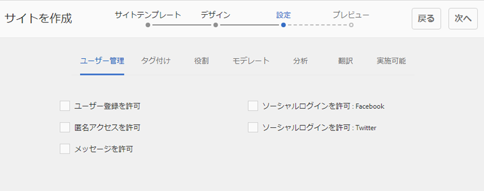

* **ユーザー登録を許可**

  チェックを入れた場合、サイト訪問者は自己登録によってコミュニティメンバーになる可能性があります。
オフにすると、コミュニティサイトは*制限*され、サイト訪問者はコミュニティサイトのメンバーグループに割り当てられるか、リクエストを行うか、招待メールを送信する必要があります。オフにした場合、匿名アクセスは許可されません。
*private* コミュニティサイトのチェックを外します。デフォルトはオンです。

* **匿名アクセスを許可**

  オンにすると、コミュニティサイトは&#x200B;*オープン*になり、サイト訪問者はサイトにアクセスできます。
オフにすると、サインインしたメンバーのみがサイトにアクセスできます。
*private* コミュニティサイトのチェックを外します。デフォルトはオンです。

* **メッセージを許可**

  オンにすると、メンバーはコミュニティサイト内のグループに対して、互いにメッセージを送信できます。
チェックを外すと、メッセージがコミュニティに設定されません。
デフォルトはオフです。

* **ソーシャルログインを許可：Facebook**

  オンにした場合、サイト訪問者がFacebook アカウントの資格情報でログインできるようにします。選択した[Facebook クラウド設定](/help/communities/social-login.md#create-a-facebook-connect-cloud-service)は、コミュニティサイトの作成後にユーザーをコミュニティサイトのメンバーグループに追加するように設定する必要があります。
オフにすると、Facebook ログインは表示されません。
*private* コミュニティサイトの場合はオフのままにします。デフォルトはオフです。

* **ソーシャルログインを許可：Twitter**

  オンにした場合、サイト訪問者がTwitter アカウントの資格情報でログインできるようにします。選択した[Twitter クラウド設定](/help/communities/social-login.md#create-a-twitter-connect-cloud-service)は、コミュニティサイトの作成後にユーザーをコミュニティサイトのメンバーグループに追加するように設定する必要があります。
チェックを外すと、Twitter ログインは表示されません。
*private* コミュニティサイトの場合はオフのままにします。デフォルトはオフです。

>[!NOTE]
>
>**ソーシャルログインの許可**
>
>サンプルのFacebookおよびTwitter設定が存在し、[本番環境](/help/sites-administering/production-ready.md)で選択可能な場合がありますが、カスタムのFacebookおよびTwitter アプリケーションを作成する必要があります。 [FacebookおよびTwitterでのソーシャルログイン ](/help/communities/social-login.md)を参照してください。

#### タグ付け {#tagging}

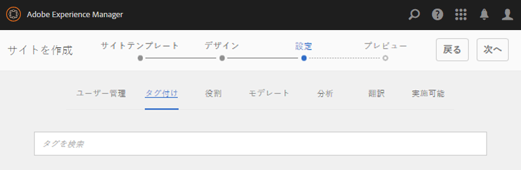

コミュニティコンテンツに適用できるタグは、[ タグコンソール ](/help/sites-administering/tags.md#tagging-console)で事前に定義したタグ名前空間を選択することで制御できます。

さらに、コミュニティサイトのタグ名前空間を選択すると、カタログとリソースを定義する際に表示される選択が制限されます。

* テキスト検索ボックス：サイトで使用できるタグを識別するために入力を開始します。

#### 役割 {#roles}

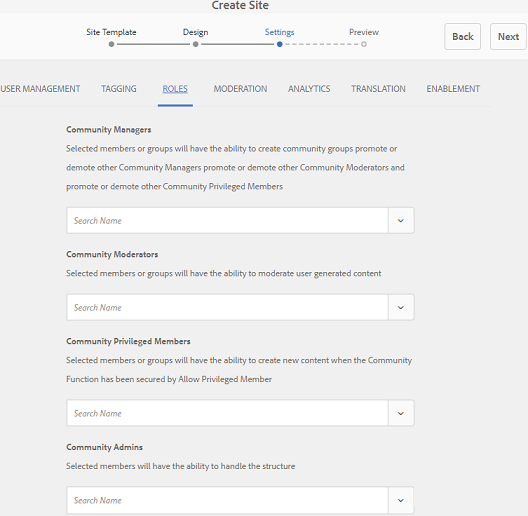

コミュニティメンバー](/help/communities/users.md)の[の役割は、これらの設定に割り当てられます。

コミュニティのメンバーを見つけるのは、先行検索を使用すると簡単です。

* **コミュニティマネージャー**

  入力を開始して、コミュニティメンバーやメンバーグループを管理できる1人以上のコミュニティメンバーまたはメンバーグループを選択します。

* **コミュニティモデレーター**

  入力を開始して、ユーザー生成コンテンツのモデレーターとして信頼される1人以上のコミュニティメンバーまたはメンバーグループを選択します。

* **コミュニティ特権メンバー**

  `Allow Privileged Member`が[ コミュニティ関数](/help/communities/functions.md)に対して選択されたときにコンテンツを作成する機能が与えられる1つ以上のコミュニティメンバーまたはメンバーグループを選択するには、入力を開始します。

* **コミュニティ管理者**

  入力を開始して、他のサイト管理者やデフォルトのコミュニティ管理者に依存せずにサイト構造を処理できる1人以上のサイト管理者を選択します。 階層の任意のレベルでグループを作成し、ネストされたグループのデフォルトの管理者にすることができます（ただし、後でネストされたグループの管理者役割から削除できます）。

#### モデレーション {#moderation}

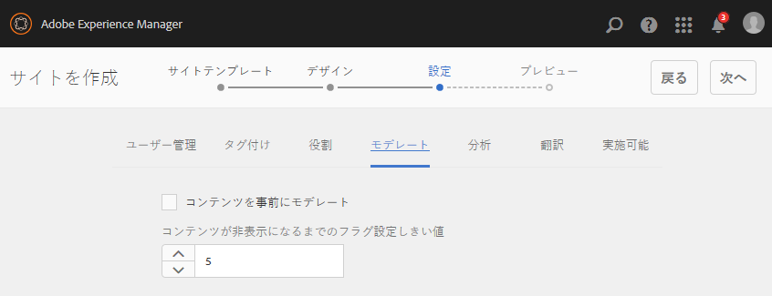

ユーザー生成コンテンツ（UGC）をモデレートするためのグローバル設定は、これらの設定によって制御されます。 個々のコンポーネントには、モデレーションを制御するための追加の設定があります。

* **コンテンツは事前定義済みです**

  チェックを入れると、投稿されたコミュニティコンテンツは、モデレーターによって承認されるまで表示されません。 デフォルトはオフです。 詳しくは、「[ コミュニティコンテンツの管理](/help/communities/moderate-ugc.md#premoderation)」を参照してください。

* **コンテンツが非表示になる前にしきい値をフラグしています**

  0より大きい場合は、トピックまたは投稿が公開ビューから隠される前にフラグを立てる必要がある回数です。 -1に設定した場合、フラグ付きのトピックまたは投稿が公開ビューから非表示になることはありません。 デフォルトは5です。

#### 分析 {#analytics}

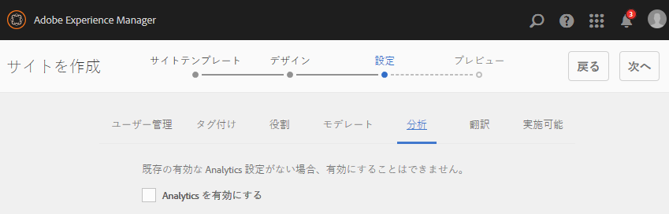

* **Analyticsを有効にする**

  Adobe AnalyticsがCommunities機能に[設定](/help/communities/analytics.md)されている場合にのみ使用できます。
デフォルトはオフです。オンにすると、追加の選択メニューが表示されます。

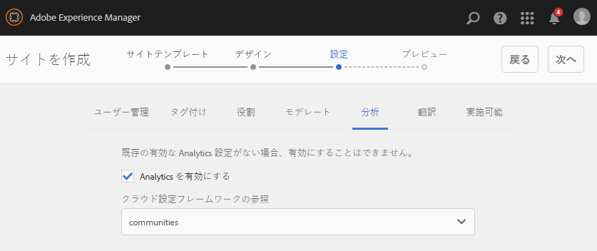

* **クラウド設定フレームワーク参照**

  プルダウンメニューから、このコミュニティサイト用に設定されたAnalytics Cloud サービスフレームワークを選択します。
  `Communities`は、[Analytics Configuration for Communities Features](/help/communities/analytics.md#aem-analytics-framework-configuration)のドキュメントのフレームワークの例です。

#### 翻訳 {#translation}

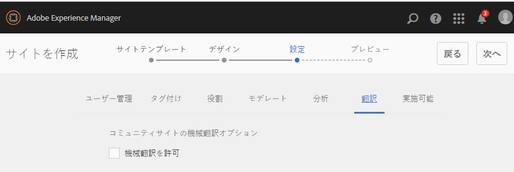

* **機械翻訳を許可**

  オンにすると（デフォルトはオフになっています）、サイト内でUGCの機械翻訳が有効になります。 多言語サイトとして設定されている場合でも、ページコンテンツなどの他のコンテンツには影響しません。 AEM Communitiesのライセンス済み翻訳サービスの設定について詳しくは、[ ユーザー生成コンテンツの翻訳](/help/communities/translate-ugc.md)を参照してください。 完全な概要については、[多言語サイト向けコンテンツの翻訳](/help/sites-administering/translation.md)を参照してください。

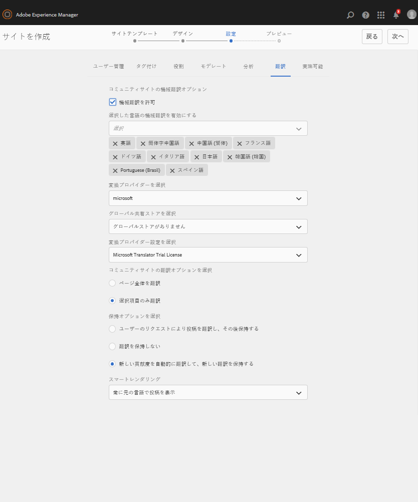

* **選択した言語の機械翻訳を有効にする**

  機械翻訳で有効になっている言語は、[翻訳統合設定](/help/communities/translate-ugc.md#translation-integration-configuration)で指定されたシステム設定にデフォルトで設定されます。 これらのデフォルト設定は、このサイトのデフォルト設定を削除したり、プルダウンメニューから他の言語を選択したりすることで上書きできます。

* **翻訳プロバイダーを選択**

  デフォルトでは、サービスプロバイダーはデモ専用の`microsoft`を使用した体験版サービスです。 翻訳サービスプロバイダーがライセンスされていない場合は、**機械翻訳を許可**&#x200B;のチェックを外す必要があります。

* **グローバル共有ストアを選択**

  複数の言語コピーを持つweb サイトの場合、グローバル共有ストアは、各言語コピーから表示される会話の単一スレッドを提供します。 これは、言語コピーとして含まれる言語のいずれかを選択することによって実現されます。 デフォルトは&#x200B;*グローバル共有ストアはありません*。

* **翻訳プロバイダー設定の選択**

  ライセンス取得済みの翻訳プロバイダー用に作成された[翻訳統合フレームワーク ](/help/sites-administering/tc-tic.md)を選択します。

* **コミュニティサイトの翻訳オプションを選択**

   * **ページ全体を翻訳**

     選択すると、ページ上のすべてのUGCが、ページのベース言語に翻訳されます。

     デフォルトは&#x200B;*選択されていません*。

   * **選択範囲のみを翻訳**

     選択すると、各投稿の横に「翻訳」オプションが表示され、個々の投稿をページのベース言語に翻訳できます。
デフォルトは*選択*&#x200B;です。

* **永続性オプションを選択**

   * **ユーザーのリクエストに対してコントリビューションを翻訳し、後で永続化します**
選択した場合、コンテンツはリクエストが行われるまで翻訳されません。 翻訳が完了すると、翻訳はリポジトリに保存されます。

     デフォルトは&#x200B;*選択されていません*。

   * **翻訳を保持しない**

     選択した場合、翻訳はリポジトリに保存されません。

     選択しない場合、翻訳は保持されます。

     デフォルトは&#x200B;*選択されていません*。

* **スマートレンダリング**

  次のいずれかを選択します。

   * `Always show contributions in the original language`（デフォルト）
   * `Always show contributions in user preferred language`
   * `Show contributions in user preferred language for only logged-in users`

### 手順4：コミュニティサイトの作成 {#step-create-communities-site}

調整が必要な場合は、**戻る** ボタンを使用して調整します。

**Create**&#x200B;を選択して開始すると、サイトの作成プロセスを中断できません。

サイトを作成したら：

* URL （ノード名）の変更はサポートされていません。
* コミュニティサイトテンプレートに対する今後の変更は、作成されたコミュニティサイトには影響しません。
* コミュニティサイトテンプレートを無効にしても、作成したコミュニティサイトには影響しません。
* プロパティを変更することで、コミュニティサイトの[STRUCTURE](#modify-structure)を編集できます。

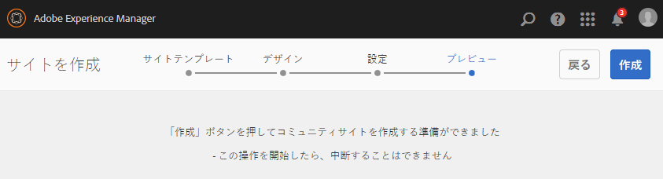

プロセスが完了すると、新しいサイトのフォルダーがCommunities Sites コンソールに表示され、作成者がページコンテンツを追加したり、管理者がサイトのプロパティを変更したりできます。

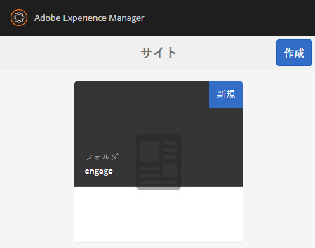

コミュニティサイトを編集するには、そのプロジェクトフォルダーを選択して開きます。

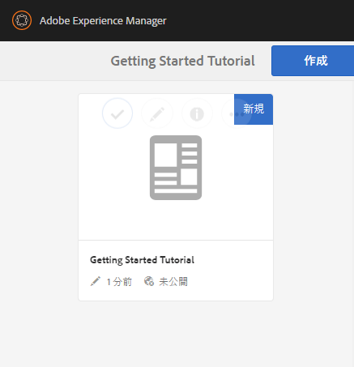

マウスを使用してサイトの上にマウスポインターを置いたり、サイトカードに触れたりすると、次の操作を可能にするアイコンが表示されます。

* [オーサーモードでのサイトの編集](#authoring-site-content)
* [修正のためにサイトのプロパティを開く](#modifying-site-properties)
* [サイトの公開](#publishing-the-site)
* [サイトのエクスポート](#exporting-the-site)
* [サイトの削除](#deleting-the-site)

## サイトコンテンツのオーサリング {#authoring-site-content}

サイトのコンテンツは、他のAEM web サイトと同じツールで作成できます。 オーサリング用にサイトを開くには、サイトにマウスを置いたときに表示される`Open Site` アイコンを選択します。 Communities Sites コンソールに引き続きアクセスできるように、新しいタブでサイトが開きます。

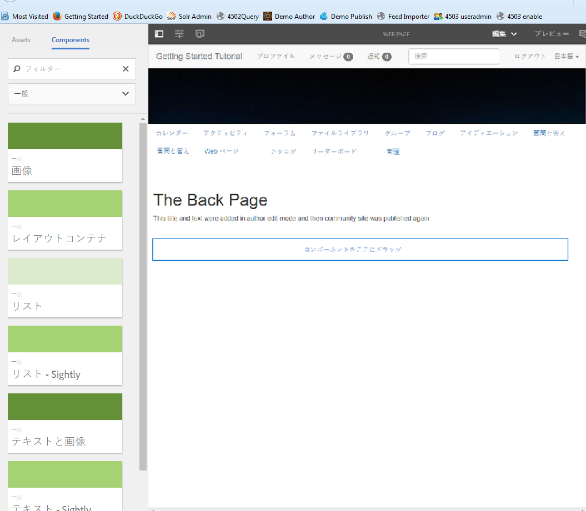

>[!NOTE]
>
>AEMに詳しくない場合は、[基本処理](/help/sites-authoring/basic-handling.md)に関するドキュメントと、[ ページのオーサリングに関するクイックガイド ](/help/sites-authoring/qg-page-authoring.md)をご覧ください。

## サイトプロパティの変更 {#modifying-site-properties}

サイト作成プロセス中に指定された既存のサイトのプロパティは、サイトにマウスを合わせると表示される`Edit Site` アイコンを選択して変更できます。

`Details of the following properties match the descriptions provided in the` [ サイト作成](#site-creation) セクション。

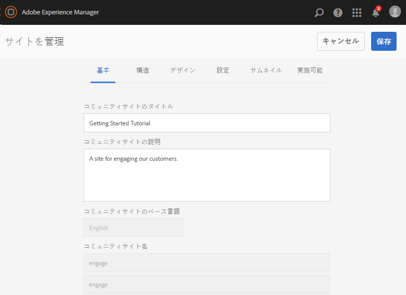

### 基本を変更 {#modify-basic}

「基本」パネルでは、次の変更を行うことができます。

* コミュニティサイトのタイトル
* コミュニティサイトの説明

コミュニティサイト名は変更できません。

別のコミュニティサイトテンプレートを選択しても、テンプレートとサイト間に接続が残らないため、既存のコミュニティサイトには影響しません。

代わりに、コミュニティサイトの[STRUCTURE](#modify-structure)が変更される場合があります。

### 構造を変更 {#modify-structure}

構造パネルでは、選択したコミュニティサイトテンプレートから最初に作成した構造を変更できます。 パネルから、次のことが可能です。

* 追加の[ コミュニティ関数](/help/communities/functions.md)をサイト構造にドラッグ&amp;ドロップします。
* サイト構造内のコミュニティ関数のインスタンス：

   * **`gear icon`**

     表示タイトルとURL名、および[特権メンバーグループ ](/help/communities/users.md#privilegedmembersgroups)を含む設定を編集します。

   * **`trashcan icon`**

     サイト構造から関数を削除（削除）します。

   * **`grid icon`**

     サイトの最上位ナビゲーションバーに表示される関数の順序を変更します。

>[!NOTE]
>
>サイト構造内のすべての関数の順序は、上部の関数を除いて変更できます。 したがって、コミュニティサイトのホームページは変更できません。

>[!CAUTION]
>
>* 表示タイトルは副作用なしで変更される場合がありますが、コミュニティサイトに属するコミュニティ関数のURL名を編集することはお勧めしません。
>
>例えば、URLの名前を変更しても、既存のUGCは移動されないため、「失われる」 UGCになります。

>[!CAUTION]
>
>グループ関数&#x200B;*not*&#x200B;は、サイト構造内の&#x200B;*firstまたはonly*&#x200B;関数である必要があります。
>
>[ ページ関数](/help/communities/functions.md#page-function)などの他の関数を最初に含めてリストする必要があります。

#### 例：コミュニティサイト構造へのカタログ関数の追加 {#example-adding-a-catalog-function-to-a-community-site-structure}

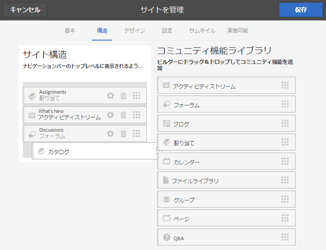

### デザインを修正 {#modify-design}

デザインパネルでは、新しいテーマを適用できます。

* [コミュニティサイトテーマ](#community-site-theme)
* [コミュニティサイトブランディング](#community-site-branding)

   * パネルの一番下までスクロールして、ブランド画像を変更できます。

### 設定を変更 {#modify-settings}

設定パネルでは、コミュニティサイト作成の手順3のサブパネルの下にあるほとんどの設定にアクセスできます。

* [User Management](#user-management)
* [タグ](#tagging)
* [モデレート](#moderation)
* [メンバーの役割](#roles)
* [Analytics](#analytics)
* [翻訳](#translation)

### サムネールを変更 {#modify-thumbnail}

サムネールパネルを使用すると、Communities Sites コンソールでサイトを表す画像をアップロードできます。

## サイトの公開 {#publishing-the-site}

コミュニティサイトを新たに作成または変更した後、サイトの上にマウスポインターを置くと表示される`Publish Site` アイコンを選択して、サイトを公開（アクティベート）できます。

サイトが正常に公開された後に表示されます。

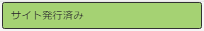

### ネストされたグループを使用した公開 {#publishing-with-nested-groups}

コミュニティサイトを公開したら、[ グループコンソール ](/help/communities/groups.md)を使用して作成した各サブコミュニティ（ネストされたグループ）を個別に公開する必要があります。

## サイトのエクスポート {#exporting-the-site}

書き出しアイコンを選択し、サイトにマウスカーソルを合わせると、[ パッケージマネージャー](/help/sites-administering/package-manager.md)に保存され、ダウンロードされたコミュニティサイトのパッケージを作成できます。

UGCはサイトパッケージに含まれていません。

## サイトの削除 {#deleting-the-site}

コミュニティサイトを削除するには、コミュニティサイトコンソールのサイトにマウスポインターを置いたときに表示される「サイトを削除」アイコンを選択します。 このアクションは、UGC、ユーザーグループ、アセット、データベースレコードなど、サイトに関連付けられたすべての項目を削除します。

## コミュニティユーザーグループを作成しました {#created-community-user-groups}

新しいコミュニティサイトが公開されると、様々な管理およびメンバーの役割に対して適切な権限が設定された新しいメンバーグループ（パブリッシュ環境でユーザーグループが作成されます）が作成されます。

メンバーグループ用に作成された名前には、[手順1](#step13asitetemplate)で指定した&#x200B;*site-name* （URLに表示される名前）が含まれます。 また、異なるコミュニティサイトのルートに対して同じサイト名を持つコミュニティサイトやグループとの競合を避けるための一意のIDも含まれています。

例えば、「はじめに」というタイトルのサイトの名前が「engage」の場合、モデレーターのユーザーグループは次のようになります。

* タイトル：Community Engage Moderators
* 名前：community-*engage-uid*-moderators

サイトの作成時にモデレータまたはグループ管理者として役割を割り当てられたメンバーは、適切なグループに割り当てられ、メンバーグループに割り当てられます。 これらのグループとメンバーの割り当ては、新しいサイトの公開時に公開時に作成されます。

詳しくは、[ ユーザーとユーザーグループの管理](/help/communities/users.md)を参照してください。

>[!NOTE]
>
>[ ソーシャル ログインを許可：Facebook](#user-management)が有効になっている場合、ユーザーグループ `community-<site-name>-<uid>-members`が有効になります
>が作成されました。適用された[Facebook クラウドサービス ](/help/communities/social-login.md#createafacebookcloudservice)は、このグループにユーザーを追加するように設定する必要があります。

## 認証エラー用に設定 {#configure-for-authentication-error}

デフォルトでは、ユーザーが間違った資格情報を入力し、ログインに失敗すると、コミュニティサイトはサンプルログインページにリダイレクトされます。 このサンプルログインは、[実稼動サーバー](/help/sites-administering/production-ready.md)には存在しません。

正しくリダイレクトするには、サイトを設定して公開にプッシュしたら、次の手順を実行して認証エラーを取得し、コミュニティサイトにリダイレクトします。

* AEMの各インスタンスで更新されます。
* 管理者権限でログインします。
* [Web コンソール ](/help/sites-deploying/configuring-osgi.md)にアクセスします。

   * 例：[https://localhost:4503/system/console/configMgr](https://localhost:4503/system/console/configMgr)

* `Adobe Granite Login Selector Authentication Handler` を見つけます。
* `pencil` アイコンを選択して、編集用の設定を開きます。
* 次のように、**ログインページマッピング**&#x200B;を入力します。

  `/content/sites/<site-name>/path/to/login/page:/content/sites/<site-name>`

  例：
  `/content/sites/engage/en/signin:/content/sites/engage/en`

* 「**保存**」を選択します。

### 認証リダイレクトのテスト {#test-authentication-redirection}

同じAEM パブリッシュインスタンスで、コミュニティサイトのログインページマッピングが設定されている場合：

* コミュニティサイトのホームページを参照する

   * 例：[https://localhost:4503/content/sites/engage/en.html](https://localhost:4503/content/sites/engage/en.html)

* 「ログアウト」を選択します。
* 「ログイン」を選択します。
* ユーザー名「x」やパスワード「x」など、誤った資格情報を入力します。
* ログインページに「無効なログイン」エラーが表示されます。

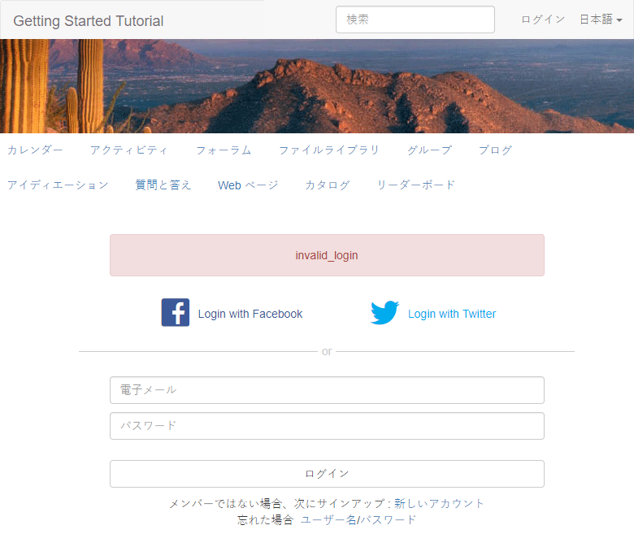

## メインサイトコンソールからのコミュニティサイトへのアクセス {#accessing-community-sites-from-main-sites-console}

グローバルナビゲーションサイトコンソールから、コミュニティサイトは`Community Sites` フォルダーにあります。

この方法でコミュニティサイトにアクセスすることは可能ですが、管理タスクの場合は、コミュニティサイトコンソールからコミュニティサイトにアクセスする必要があります。

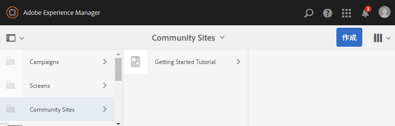
