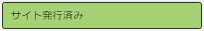

# コミュニティサイトコンソール {#communities-sites-console}

コミュニティサイトコンソールでは、次の項目にアクセスできます。

* サイトの作成
* サイト編集
* サイト管理
* [ネストされたグループの作成と編集](/help/communities/groups.md) （サブコミュニティ）

詳しくは、 [AEM Communitiesの概要](/help/communities/getting-started.md) オーサー環境でコミュニティサイトをどれだけすばやく作成できるか、およびオーサー環境とパブリッシュ環境からコミュニティグループを作成する方法を体験できます。

>[!NOTE]
>
>作成用のメインのコミュニティメニュー [コミュニティサイト](/help/communities/sites-console.md), [コミュニティサイトテンプレート](/help/communities/sites.md), [コミュニティグループテンプレート](/help/communities/tools-groups.md) および [コミュニティ機能](/help/communities/functions.md) は、オーサー環境でのみ使用されます。

## 前提条件 {#prerequisites}

コミュニティサイトを作成する前に、次の手順を実行します。 *必須* 移動先：

* 1 つ以上のパブリッシュインスタンスが実行中であることを確認します。
* を有効にします。 [トンネルサービス](/help/communities/deploy-communities.md#tunnel-service-on-author) をクリックして、メンバーとメンバーグループを管理します。
* 次を識別： [主発行者](/help/communities/deploy-communities.md#primary-publisher).
* [レプリケーションの設定](/help/communities/deploy-communities.md#replication-agents-on-author) プライマリパブリッシャーポートがデフォルト (4503) でない場合。

サイトで多くの機能をサポートできるように準備するためのベストプラクティスは、次の手順に従うことです。

* のインストール [最新の機能パック](/help/communities/deploy-communities.md#latestfeaturepack).
* 有効にする [Adobe Analytics](/help/communities/analytics.md) AEM Communities
* 設定 [電子メール](/help/communities/email.md)
* 特定 [コミュニティ管理者](/help/communities/users.md#creating-community-members).
* [OAuth ハンドラーを有効にする](/help/communities/social-login.md#adobe-granite-oauth-authentication-handler) ソーシャルログイン用。

## コミュニティサイトコンソールへのアクセス {#accessing-communities-sites-console}

オーサー環境でコミュニティサイトコンソールにアクセスするには、次の手順を実行します。

* グローバルナビゲーションから： **[!UICONTROL コミュニティ]** > **[!UICONTROL サイト]**

コミュニティサイトコンソールには、既存のコミュニティサイトが表示されます。 このコンソールから、コミュニティサイトを作成、編集、管理および削除できます。

新しいコミュニティサイトを作成するには、 **作成** アイコン

既存のコミュニティサイトにアクセスするには、ネストされたグループのオーサリング、変更、公開、書き出し、追加を目的として、サイトのフォルダーアイコンを選択します。

## サイト作成 {#site-creation}

サイト作成コンソールでは、選択した [コミュニティサイトテンプレート](/help/communities/sites.md) および設定。

作成されるすべてのサイトにはログイン機能が含まれています。サイトの訪問者は、コンテンツの投稿、メッセージの送信、グループへの参加をおこなう前にログインする必要があるからです。 その他の機能には、ユーザープロファイル、メッセージング、通知、サイトメニュー、検索、テーマ設定、ブランディングが含まれます。

プロセスは、 `Create` コミュニティサイトコンソールの上部にあるボタン。

作成プロセスは、設定する一連の機能（サブパネルとして表示）を含むパネルとして表示される一連の手順です。 を **次へ** 手順または **戻る** を前の手順に戻してから、最後の手順でサイトをコミットします。

### 手順 1 :サイトテンプレート {#step-site-template}

[ サイトテンプレート ] パネルで、[ タイトル ]、[ 説明 ]、[ サイトルート ]、[ ベース言語 ]、[ 名前 ]、[ サイトテンプレート ] を指定します。

* **コミュニティサイトのタイトル**

   サイトの表示タイトル。

   タイトルは、公開されたサイトおよびサイトの管理 UI に表示されます。

* **コミュニティサイトの説明**

   サイトの説明。

   公開されたサイトに説明は表示されません。

* **コミュニティサイトのルート**

   サイトへのルートパス。

   デフォルトのルートはです。 `/content/sites`を参照してください。ただし、ルートは Web サイト内の任意の場所に移動できます。

* **コミュニティサイトのベース言語**

   ( 単一言語の場合は手を付けないでください。英語 ) プルダウンメニューを使用して 1 つを選択します *以上* 使用可能な言語 ( ドイツ語、イタリア語、フランス語、日本語、スペイン語、ポルトガル語（ブラジル）、中国語（繁体字）、中国語（簡体字）)) のベース言語。 追加された言語ごとに 1 つのコミュニティサイトが作成され、 [多言語サイトのコンテンツの翻訳](/help/sites-administering/translation.md). 各サイトのルートページには、選択した言語の 1 つの言語コード（英語の場合は「en」、フランス語の場合は「fr」など）で名前が付けられた子ページが含まれます。

* **コミュニティサイト名**:

   URL に表示されるサイトのルートページの名前。

   * サイトの作成後に名前が簡単に変更されないので、名前を再度確認します。
   * ベース URL ( `https://server:port/site root/site name)` が `Community Site Name`.

   * 有効な URL に、ベース言語コード+ &quot;.html&quot;を追加します。

      *例：*, `https://localhost:4502/content/sites/mysight/en.html`

* **コミュニティサイトテンプレート** メニュー

   プルダウンメニューを使用して、使用可能な [コミュニティサイトテンプレート](/help/communities/tools.md).

* 「**次へ**」を選択します。

### 手順 2 :デザイン {#step-design}

デザインパネルには、テーマとブランディングバナーを選択するための 2 つのサブパネルが含まれています。

#### コミュニティサイトのテーマ {#community-site-theme}

フレームワークでは `Twitter Bootstrap` レスポンシブで柔軟なデザインをサイトに取り込む。 プリロードされた多数のBootstrapテーマの 1 つを選択して、選択したコミュニティサイトテンプレートのスタイルを設定したり、Bootstrapテーマをアップロードしたりできます。

選択すると、テーマの上に不透明な青いチェックマークが表示されます。

コミュニティサイトが公開されると、次の操作が可能になります。 [プロパティの編集](#modifying-site-properties) 別のテーマを選択します。

#### コミュニティサイトのブランディング {#community-site-branding}

コミュニティサイトのブランディングは、各ページの上部にヘッダーとして表示される画像です。

画像のサイズは、ブラウザーでのページの予想される表示幅と高さ 120 ピクセルに合わせて調整する必要があります。

画像を作成または選択する場合は、次の点に注意してください。

* 画像の高さは、画像の上端から 120 ピクセルの位置に切り抜かれます。
* 画像はブラウザーウィンドウの左端に固定されます。
* 画像のサイズは変更されず、画像の幅が次のようになる。

   * ブラウザーの幅より小さい場合、画像は水平方向に繰り返されます。
   * ブラウザーの幅より大きい場合は、画像が切り抜かれて表示されます。

* 「**次へ**」を選択します。

### 手順 3 :設定 {#step-settings}

設定パネルには、サイトを作成する前の手順に進む前に設定する必要のあるサブパネルの表示機能がいくつか含まれています。

* [ユーザー管理](#user-management)
* [タグ付け](#tagging)
* [役割](#roles)
* [モデレート](#moderation)
* [分析](#analytics)
* [翻訳](#translation)

>[!NOTE]
>
>**トンネルサービスの有効化**
>
>「設定」サブパネルの一部では、UGC のモデレート、グループの管理、パブリッシュ環境でのイネーブルメントリソースの連絡先など、信頼できるメンバーの割り当てが可能です。
>
>この規則は、パブリッシュ側で使用されます。 [ユーザーとユーザーグループ](/help/communities/users.md) （メンバーとメンバーグループ）をオーサー環境で複製しないようにする必要があります。
>
>したがって、オーサー環境でコミュニティサイトを作成し、信頼されたメンバーを様々な役割に割り当てる場合は、パブリッシュ環境からメンバーデータを取得する必要があります。
>
>これを行うには、 ` [AEM Communities Publish Tunnel Service](/help/communities/deploy-communities.md#tunnel-service-on-author)` オーサー環境用。

#### ユーザー管理 {#user-management}

* **ユーザー登録を許可**

   オンにすると、サイト訪問者は自己登録によってコミュニティメンバーになる場合があります。
オフにした場合、コミュニティサイトは *制限* サイト訪問者は、コミュニティサイトのメンバーグループに割り当てられ、リクエストを行うか、電子メールで招待状を送信する必要があります。 オフにした場合、匿名アクセスは許可されません。
次の場合はオフにします。 *プライベート* コミュニティサイト。 初期設定はオンです。

* **匿名アクセスを許可**

   オンにすると、コミュニティサイトが「オープン」になり、サイト訪問者は誰でもサイトにアクセスできます。
オフにすると、サインインしたメンバーのみがサイトにアクセスできます。
非公開のコミュニティサイトの場合はオフにします。 初期設定はオンです。

* **メッセージを許可**

   オンにすると、メンバーは互いにメッセージを送信し、コミュニティサイト内のグループにメッセージを送信できます。
オフにした場合、コミュニティのメッセージは設定されません。
初期設定はオフです。

* **ソーシャルログインを許可 : Facebook**

   オンにすると、サイト訪問者はFacebookアカウントの資格情報を使用してログインできます。 選択した [Facebookクラウド設定](/help/communities/social-login.md#create-a-facebook-connect-cloud-service) コミュニティサイトを作成した後、コミュニティサイトのメンバーグループにユーザーを追加するように設定する必要があります。
オフにした場合、Facebookログインは表示されません。
チェックを外したままにすると、 *プライベート* コミュニティサイト。 初期設定はオフです。

* **ソーシャルログインを許可 : Twitter**

   オンにすると、サイト訪問者はTwitterアカウントの資格情報を使用してログインできます。 選択した [Twitterクラウド設定](/help/communities/social-login.md#create-a-twitter-connect-cloud-service) コミュニティサイトを作成した後、コミュニティサイトのメンバーグループにユーザーを追加するように設定する必要があります。
オフにした場合、Twitterログインは表示されません。
チェックを外したままにすると、 *プライベート* コミュニティサイト。 初期設定はオフです。

>[!NOTE]
>
>**ソーシャルログインの許可**
>
>サンプルのFacebook設定とTwitter設定が存在し、選択可能な場合がありますが、 [実稼動環境](/help/sites-administering/production-ready.md)の場合は、カスタムのFacebookおよびTwitterアプリケーションを作成する必要があります。 詳しくは、 [facebookとTwitterを使用したソーシャルログイン](/help/communities/social-login.md).

#### タグ付け {#tagging}

コミュニティコンテンツに適用できるタグを制御するには、 [タグ付けコンソール](/help/sites-administering/tags.md#tagging-console).

また、コミュニティサイトのタグ名前空間を選択すると、カタログとリソースを定義する際に表示される選択が制限されます。

* テキスト検索ボックス：サイトで使用できるタグを識別するには、入力を開始します。

#### 役割 {#roles}

この [コミュニティメンバーの役割](/help/communities/users.md) はこれらの設定で割り当てられます。

先行入力検索を使用すると、コミュニティメンバーを簡単に検索できます。

* **コミュニティマネージャー**

   入力を開始して、コミュニティメンバーとメンバーグループを管理できる 1 つ以上のコミュニティメンバーまたはメンバーグループを選択します。

* **コミュニティのモデレーター**

   入力を開始して、ユーザー生成コンテンツのモデレーターとして信頼される 1 つ以上のコミュニティメンバーまたはメンバーグループを選択します。

* **コミュニティ権限を持つメンバー**

   入力を開始して、1 つ以上のコミュニティメンバーまたはメンバーグループを選択し、新しいコンテンツを作成するには、 `Allow Privileged Member` が [コミュニティ機能](/help/communities/functions.md).

* **コミュニティ管理者**

   入力を開始して、他のサイト管理者やデフォルトのコミュニティ管理者とは無関係にサイト構造を処理できる 1 人または複数のサイト管理者を選択します。 階層の任意のレベルでグループを作成し、ネストされたグループのデフォルト管理者になることができます（ただし、後でネストされたグループの管理者の役割から削除することもできます）。

#### モデレート {#moderation}

ユーザー生成コンテンツ (UGC) をモデレートする際のグローバル設定は、次の設定で制御します。 個々のコンポーネントには、モデレートを制御するための追加の設定があります。

* **コンテンツを事前にモデレート**

   オンにすると、投稿されたコミュニティコンテンツは、モデレーターが承認するまで表示されません。 初期設定はオフです。 詳しくは、 [コミュニティコンテンツのモデレート](/help/communities/moderate-ugc.md#premoderation).

* **コンテンツが非表示になるまでのフラグ設定しきい値**

   0 より大きい場合は、トピックまたは投稿に何回フラグが設定された後に、その投稿が公開ビューで非表示になるかを指定する必要があります。 -1 に設定した場合、フラグ付きのトピックまたは投稿が公開表示から非表示になることはありません。 デフォルトは 5 です。

#### 分析 {#analytics}

* **Analytics を有効にする**

   Adobe Analyticsが [設定済み](/help/communities/analytics.md) コミュニティ機能の場合
初期設定はオフです。 オンにすると、次の追加の選択メニューが表示されます。

* **クラウド設定フレームワークの参照**

   プルダウンメニューから、このコミュニティサイト用に設定された Analytics クラウドサービスフレームワークを選択します。
   `Communities` は、次のフレームワークの例です： [コミュニティ機能用の Analytics 設定](/help/communities/analytics.md#aem-analytics-framework-configuration) ドキュメント。

#### 翻訳 {#translation}

* **機械翻訳を許可**

   オン（デフォルトはオフ）にすると、サイト内の UGC に対して機械翻訳が有効になります。 この変更は、サイトが多言語サイトとして設定されている場合でも、ページコンテンツなどの他のコンテンツには影響しません。 詳しくは、 [ユーザー生成コンテンツの翻訳](/help/communities/translate-ugc.md) を参照してください。 詳しくは、 [多言語サイトのコンテンツの翻訳](/help/sites-administering/translation.md) を参照してください。

* **選択した言語の機械翻訳を有効にする**

   機械翻訳が有効な言語は、 [翻訳統合の設定](/help/communities/translate-ugc.md#translation-integration-configuration). これらのデフォルト設定は、デフォルトを削除するか、プルダウンメニューから他の言語を選択することで、このサイトに対して上書きできます。

* **変換プロバイダーを選択**

   デフォルトでは、サービスプロバイダーは、 `microsoft` デモのみ。 翻訳サービスプロバイダーがライセンスされていない場合、 **機械翻訳を許可** をオフにする必要があります。

* **グローバル共有ストアを選択**

   複数の言語コピーがある Web サイトの場合、グローバル共有ストアは会話のスレッドを 1 つ提供し、各言語コピーから表示できます。 これは、言語コピーとして含まれる言語の 1 つを選択することで実現されます。 デフォルトはです。 *グローバル共有ストアがありません*.

* **変換プロバイダー設定を選択**

   を選択します。 [翻訳統合フレームワーク](/help/sites-administering/tc-tic.md) ライセンスされた翻訳プロバイダー用に作成されました。

* **コミュニティサイトの翻訳オプションを選択**

   * **ページ全体を翻訳**

      選択すると、ページ上のすべての UGC がページのベース言語に翻訳されます。

      デフォルトはです。 *未選択*.

   * **選択項目のみ翻訳**

      選択すると、各投稿の横に翻訳オプションが表示され、個々の投稿をページのベース言語に翻訳できます。
デフォルトはです。 *選択済み*.

* **保持オプションを選択**

   * **ユーザーのリクエストに応じて貢献度を翻訳し、その後保持する**
選択した場合、リクエストがおこなわれるまでコンテンツは翻訳されません。 翻訳が完了すると、翻訳はリポジトリに保存されます。

      デフォルトはです。 *未選択*.

   * **翻訳を保持しない**

      選択した場合、翻訳はリポジトリに保存されません。

      選択しなかった場合、翻訳は保持されます。

      デフォルトはです。 *未選択*.

* **スマートレンダリング**

   次のいずれかを選択します。

   * `Always show contributions in the original language`（デフォルト）
   * `Always show contributions in user preferred language`
   * `Show contributions in user preferred language for only logged-in users`

### 手順 4 :コミュニティサイトを作成 {#step-create-communities-site}

調整が必要な場合は、 **戻る** ボタンを使用して作成します。

1 回 **作成** を選択して開始すると、サイトの作成プロセスは中断できません。

サイトが作成されたら、次の手順を実行します。

* URL（ノード名）の変更はサポートされていません。
* 今後、コミュニティサイトテンプレートを変更しても、作成したコミュニティサイトには影響しません。
* コミュニティサイトテンプレートを無効にしても、作成したコミュニティサイトには影響しません。
* 次の項目を編集できます。 [構造](#modify-structure) コミュニティサイトのプロパティを変更します。

処理が完了すると、新しいサイトのフォルダーがコミュニティサイトコンソールに表示されます。このコンソールから、作成者がページの内容を追加したり、管理者がサイトのプロパティを変更したりできます。

コミュニティサイトを変更するには、プロジェクトフォルダを選択して開きます。

サイト上にマウスカーソルを置いたとき、またはサイトカードにマウスを合わせたときに、 [オーサーモードでのサイトの編集](#authoring-site-content), [変更用にサイトのプロパティを開く](#modifying-site-properties), [サイトのパブリッシュ](#publishing-the-site), [サイトのエクスポート](#exporting-the-site)、および [サイトの削除](#deleting-the-site).

## サイトコンテンツのオーサリング {#authoring-site-content}

サイトのコンテンツは、他のAEM Web サイトと同じツールを使用してオーサリングできます。 オーサリング用にサイトを開くには、 `Open Site` サイトにマウスポインターを置くと表示されるアイコン。 サイトが新しいタブで開き、コミュニティサイトコンソールにアクセスできるようになります。

>[!NOTE]
>
>AEMに詳しくない場合は、 [基本操作](/help/sites-authoring/basic-handling.md) および [ページのオーサリングのクイックガイド](/help/sites-authoring/qg-page-authoring.md).

## サイトのプロパティを変更する {#modifying-site-properties}

サイト作成プロセス中に指定された既存のサイトのプロパティは、 `Edit Site`サイトにマウスポインターを置くと表示されるアイコン。

`Details of the following properties match the descriptions provided in the` [サイトの作成](#site-creation) 」セクションに入力します。

### 基本を変更 {#modify-basic}

基本パネルでは、以下の変更が可能です。

* コミュニティサイトのタイトル
* コミュニティサイトの説明

コミュニティサイト名は変更できません。

別のコミュニティサイトテンプレートを選択しても、テンプレートとサイト間の接続が残らないので、既存のコミュニティサイトには影響しません。

代わりに、 [構造](#modify-structure) コミュニティサイトの変更が可能です。

### 構造を修正 {#modify-structure}

構造パネルでは、選択したコミュニティサイトテンプレートから最初に作成された構造を変更できます。 パネルから、次の操作を実行できます。

* 追加の [コミュニティ機能](/help/communities/functions.md) をサイト構造に追加します。
* サイト構造内のコミュニティ機能のインスタンスで、次の操作を実行します。

   * **`gear icon`**

      表示タイトルや URL 名*、 [権限を持つメンバーグループ](/help/communities/users.md#privilegedmembersgroups).

   * **`trashcan icon`**

      サイト構造から関数を削除（削除）します。

   * **`grid icon`**

      サイトのトップレベルナビゲーションバーに表示される関数の順序を変更します。

>[!NOTE]
>
>上部の関数を除く、サイト構造内のすべての関数の順序を変更できます。 したがって、コミュニティサイトのホームページを変更することはできません。

>[!CAUTION]
>
>* 表示タイトルは副作用なしに変更できますが、コミュニティサイトに属するコミュニティ機能の URL 名を編集することはお勧めしません。
>
>例えば、URL の名前を変更しても既存の UGC は移動されず、UGC が「失われる」結果になります。

>[!CAUTION]
>
>グループ機能は、 *not* は *最初でも唯一でも* 関数を使用して、サイト構造内で使用できます。
>
>その他の関数 ( [ページ関数](/help/communities/functions.md#page-function)、を含め、最初にリストする必要があります。

#### 例：コミュニティサイト構造へのカタログ機能の追加 {#example-adding-a-catalog-function-to-a-community-site-structure}

### デザインを修正 {#modify-design}

デザインパネルを使用すると、新しいテーマを適用できます。

* [コミュニティサイトテーマ](#community-site-theme)
* [コミュニティサイトブランディング](#community-site-branding)

   * パネルの下部までスクロールして、ブランド画像を変更します。

### 設定を変更 {#modify-settings}

設定パネルを使用すると、コミュニティサイト作成の手順 3 のサブパネルにあるほとんどの設定にアクセスできます。

* [ユーザー管理](#user-management)
* [タグ](#tagging)
* [モデレート](#moderation)
* [メンバーの役割](#roles)
* [Analytics](#analytics)
* [翻訳](#translation)

### サムネールを変更 {#modify-thumbnail}

サムネールパネルを使用すると、コミュニティサイトコンソールでサイトを表す画像をアップロードできます。

## サイトのパブリッシュ {#publishing-the-site}

コミュニティサイトを新しく作成または変更した後、 `Publish Site` アイコンをクリックします。

サイトが正常に公開された後に、というメッセージが表示されます。

### ネストされたグループを使用した公開 {#publishing-with-nested-groups}

コミュニティサイトを公開した後、 [グループコンソール](/help/communities/groups.md).

## サイトのエクスポート {#exporting-the-site}

書き出しアイコンを選択し、サイトの上にマウスポインターを置くと、コミュニティサイトのパッケージが作成され、そのパッケージが [パッケージマネージャー](/help/sites-administering/package-manager.md) とダウンロードされました。

UGC はサイトパッケージに含まれていません。

## サイトの削除 {#deleting-the-site}

コミュニティサイトを削除するには、コミュニティサイトコンソールでサイトにマウスを合わせたときに表示される「サイトを削除」アイコンを選択します。 この操作により、UGC、ユーザーグループ、アセット、データベースレコードなど、サイトに関連するすべての項目が削除されます。

## コミュニティユーザーグループを作成しました {#created-community-user-groups}

新しいコミュニティサイトが公開されると、様々な管理者ロールとメンバーロールに対して適切な権限が設定された新しいメンバーグループ（ユーザーグループはパブリッシュ環境で作成されます）が作成されます。

メンバーグループ用に作成された名前には、 *site-name* ～のサイトを考えると [手順 1](#step13asitetemplate) （URL に表示される名前）および一意の ID。コミュニティサイトや、異なるコミュニティサイトのルートに同じサイト名を持つグループとの競合を避けるために使用されます。

例えば、「Getting Started Tutorial」というタイトルのサイトに対して名前が「engage」の場合、モデレーターのユーザーグループは次のようになります。

* タイトル：コミュニティエンゲージモデレーター
* 名前：コミュニティ —*engage-uid* — モデレーター

サイトの作成時にモデレーターまたはグループ管理者として役割を割り当てられたメンバーは、適切なグループに割り当てられ、メンバーグループに割り当てられます。 これらのグループとメンバーの割り当ては、新しいサイトが公開されると、公開時に作成されます。

詳しくは、 [ユーザーとユーザーグループの管理](/help/communities/users.md).

>[!NOTE]
>
>If [ソーシャルログインを許可：Facebook](#user-management) を有効にした場合、ユーザーグループが
>
>* `community-<site-name>-<uid>-members`
>
>が作成され、適用される [Facebook cloud service](/help/communities/social-login.md#createafacebookcloudservice) は、このグループにユーザーを追加するように設定する必要があります。

## 認証エラー用の設定 {#configure-for-authentication-error}

デフォルトでは、ユーザーが誤った資格情報を入力してログインに失敗した場合、コミュニティサイトはサンプルのログインページにリダイレクトされます。 このサンプルログインは、 [本番サーバ](/help/sites-administering/production-ready.md).

正しくリダイレクトするには、サイトを設定して公開にプッシュした後、次の手順を実行して、認証失敗をコミュニティサイトにリダイレクトする必要があります。

* 各AEMパブリッシュインスタンスで。
* 管理者権限でログインします。
* 次にアクセス： [Web コンソール](/help/sites-deploying/configuring-osgi.md).

   * 例： [https://localhost:4503/system/console/configMgr](https://localhost:4503/system/console/configMgr).

* 場所 `Adobe Granite Login Selector Authentication Handler`.
* を選択します。 `pencil` アイコンをクリックし、設定を開いて編集します。
* を入力します。 **ログインページのマッピング** 次のように指定します。

   `/content/sites/<site-name>/path/to/login/page:/content/sites/<site-name>`

   次に例を示します。
   `/content/sites/engage/en/signin:/content/sites/engage/en`

* 「**保存**」を選択します。

### 認証リダイレクトをテスト {#test-authentication-redirection}

コミュニティサイトのログインページマッピングを使用して設定されたのと同じAEMパブリッシュインスタンス上で、次の操作を実行します。

* コミュニティサイトのホームページを参照します。

   * 例： [https://localhost:4503/content/sites/engage/en.html](https://localhost:4503/content/sites/engage/en.html)

* 「ログアウト」を選択します。
* 「ログイン」を選択します。
* ユーザー名「x」やパスワード「x」など、明らかに間違った資格情報を入力します。
* ログインページには「無効なログイン」エラーが表示されます。

## メインサイトコンソールからコミュニティサイトにアクセスする {#accessing-community-sites-from-main-sites-console}

グローバルナビゲーションサイトコンソールから、コミュニティサイトは `Community Sites` フォルダー。

この方法でコミュニティサイトにアクセスできますが、管理タスクの場合は、コミュニティサイトコンソールからコミュニティサイトにアクセスする必要があります。

