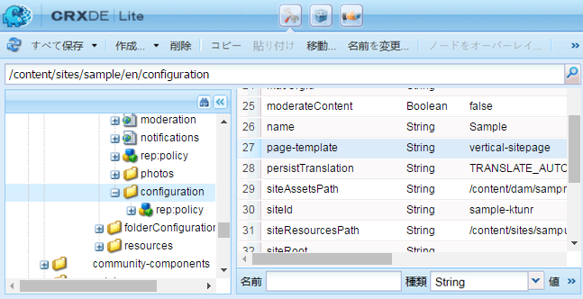

# コミュニティサイトの基本事項 {#community-site-essentials}

## カスタムサイトテンプレート {#custom-site-template}

カスタムサイトテンプレートは、コミュニティサイトの言語コピーごとに個別に指定できます。

この作業を行うには：

* カスタムテンプレートを作成します。
* デフォルトのサイトテンプレートパスをオーバーレイします。
* オーバーレイ追加パスのカスタムテンプレート。
* Specify the custom template by adding a `page-template` property to the `configuration` node.

**デフォルトのテンプレート**：

`/libs/social/console/components/hbs/sitepage/sitepage.hbs`

**オーバーレイのパスのカスタムテンプレート**：

`/apps/social/console/components/hbs/sitepage/template-name.hbs`

**プロパティ**:page-template

**種類**：string

**値**: `template-name` （拡張子なし）

**設定ノード**：

`/content/community site path/lang/configuration`

例：`/content/sites/engage/en/configuration`

>[!NOTE]
>
>オーバーレイされたパスのすべてのノードのタイプは、`Folder` である必要があります。

>[!CAUTION]
>
>If the custom template is given the name *sitepage.hbs*, then all community sites will be customized.

### カスタムサイトテンプレートの例 {#custom-site-template-example}

As an example, `vertical-sitepage.hbs` is a site template that results in the placement of menu links vertically down the left side of the page, instead of horizontally below the banner.

[ファイルの取得](assets/vertical-sitepage.hbs)カスタムサイトテンプレートをオーバーレイフォルダーに配置します。

`/apps/social/console/components/hbs/sitepage/vertical-sitepage.hbs`

Identify the custom template by adding a `page-template` property to the configuration node:

`/content/sites/sample/en/configuration`

「**すべて保存**」を選択してカスタムコードをすべての AEM インスタンスにレプリケートしてください（コミュニティサイトコンテンツがコンソールから公開された時点ではカスタムコードは含まれていません）。

カスタムコードをレプリケートするには、[パッケージを作成](../../help/sites-administering/package-manager.md#creating-a-new-package)し、すべてのインスタンスにデプロイすることをお勧めします。

## コミュニティサイトの書き出し {#exporting-a-community-site}

コミュニティサイトが作成されたら、パッケージマネージャーに保存され、ダウンロードおよびアップロードできる AEM パッケージとしてそのサイトを書き出すことができます。

書き出しは、[コミュニティサイトコンソール](sites-console.md#exporting-the-site)からおこなうことができます。

UGC とカスタムコードはコミュニティサイトパッケージに含まれていないことに注意してください。

To export UGC, use the [AEM Communities UGC Migration Tool](https://github.com/Adobe-Marketing-Cloud/communities-ugc-migration), an open source migration tool available on GitHub.

## コミュニティサイトの削除 {#deleting-a-community-site}

As of AEM Communities 6.3 Service Pack 1, Delete Site icon appears on hovering over the community site from **[!UICONTROL Communities]** > **[!UICONTROL Sites]** console. 開発中に、コミュニティサイトと開始を新規に削除したい場合は、この機能を使用できます。 コミュニティサイトを削除すると、そのサイトに関連付けられている次のアイテムが削除されます。

* [UGC](#user-generated-content)
* [ユーザーグループ](#community-user-groups)
* [Assets](#enablement-assets)
* [データベースレコード](#database-records)

### Community Unique Site ID {#community-unique-site-id}

CRXDE を使用して、コミュニティに関連付けられている一意のサイト ID を識別するには、次の手順に従います。

* Navigate to the language root of the site, such as `/content/sites/*<site name>*/en/rep:policy`.

* Find the `allow<#>` node with a `rep:principalName` in this format `rep:principalName = *community-enable-nrh9h-members*`.

* サイトIDは、 `rep:principalName`

   例えば、`rep:principalName = community-enable-nrh9h-members`

   * **サイト名** = *enable*
   * **サイトID** = *nrh9h*
   * **一意のサイト ID** = *enable-nrh9h*

### ユーザー生成コンテンツ {#user-generated-content}

Github から communities-srp-tools プロジェクトを取得します。

* [https://github.com/Adobe-Marketing-Cloud/communities-srp-tools](https://github.com/Adobe-Marketing-Cloud/communities-srp-tools)

これには、任意の SRP からすべての UGC を削除できるサーブレットが含まれています。

次の例に示すように、特定のサイトを対象としてすべての UGC を削除できます。

* `path=/content/usergenerated/asi/mongo/content/sites/engage`

この場合、（パブリッシュインスタンスで入力された）ユーザー生成コンテンツのみが削除され、（オーサーインスタンスで入力された）作成コンテンツは削除されません。Therefore, [shadow nodes](srp.md#shadownodes) are not affected.

### コミュニティユーザーグループ {#community-user-groups}

すべてのオーサーインスタンスおよびパブリッシュインスタンスで、[セキュリティコンソール](../../help/sites-administering/security.md)から、以下に該当する[ユーザーグループ](users.md)を検索して削除します。

* 先頭に `community`
* Followed by [unique site id](#community-unique-site-id)

例： `community-engage-x0e11-members`

### イネーブルメントアセット {#enablement-assets}

メインコンソールから、次の手順に従います。

* Select **[!UICONTROL Assets]**.
* **[!UICONTROL 選択]** モードに入ります。
* [一意のサイトIDを使用して名前が付けられたフォルダーを選択します](#community-unique-site-id)。
* Select **[!UICONTROL Delete]** (may need to select from **[!UICONTROL More...]**).

### データベースレコード {#database-records}

特定のイネーブルメントコミュニティサイトの 1 つを対象として、データベースエントリを選択的に削除するためのツールはありません。

すべてのコミュニティサイトを削除する場合は、MySQL Workbench を使用して enablementdb および scormenginedb を削除します。
