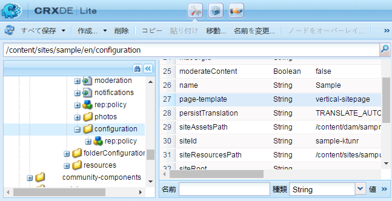

# コミュニティサイトの基本事項 {#community-site-essentials}

## カスタムサイトテンプレート {#custom-site-template}

カスタムサイトテンプレートは、コミュニティサイトの言語コピーごとに個別に指定できます。

この作業を行うには、以下の手順を実行します。

* カスタムテンプレートの作成。
* デフォルトのサイトテンプレートパスをオーバーレイします。
* カスタムテンプレートをオーバーレイパスに追加します。
* `page-template` プロパティを`configuration` ノードに追加して、カスタムテンプレートを指定します。

**既定のテンプレート**:

`/libs/social/console/components/hbs/sitepage/sitepage.hbs`

**オーバーレイパスのカスタムテンプレート**:

`/apps/social/console/components/hbs/sitepage/template-name.hbs`

**プロパティ**: page-template

**タイプ**：文字列

**値**: `template-name` （拡張なし）

**設定ノード**:

`/content/community site path/lang/configuration`

例：`/content/sites/engage/en/configuration`

>[!NOTE]
>
>オーバーレイされたパス内のすべてのノードは、タイプ `Folder`のみである必要があります。

>[!CAUTION]
>
>カスタムテンプレートに&#x200B;*sitepage.hbs*&#x200B;という名前が付けられている場合、すべてのコミュニティサイトがカスタマイズされます。

### カスタムサイトテンプレート例 {#custom-site-template-example}

例えば、`vertical-sitepage.hbs`は、バナーの下ではなく、ページの左側の垂直方向にメニューリンクを配置するサイトテンプレートです。

[ ファイルを取得](assets/vertical-sitepage.hbs)
カスタムサイトテンプレートをオーバーレイフォルダーに配置します。

`/apps/social/console/components/hbs/sitepage/vertical-sitepage.hbs`

設定ノードに`page-template` プロパティを追加して、カスタムテンプレートを特定します。

`/content/sites/sample/en/configuration`

**すべて保存**&#x200B;し、すべてのAdobe Experience Manager（AEM）インスタンスにカスタムコードをレプリケートしてください（コミュニティサイトコンテンツがコンソールから公開される場合、カスタムコードは含まれません）。

カスタムコードをレプリケートするための推奨される方法は、[ パッケージを作成し](../../help/sites-administering/package-manager.md#creating-a-new-package)すべてのインスタンスにデプロイすることです。

## コミュニティサイトのエクスポート {#exporting-a-community-site}

コミュニティサイトを作成したら、そのサイトをPackage Managerに保存され、ダウンロードおよびアップロード可能なAEM パッケージとして書き出すことができます。

これは、[Communities Sites コンソール ](sites-console.md#exporting-the-site)から利用できます。

UGCとカスタムコードは、コミュニティサイトパッケージには含まれません。

UGCをエクスポートするには、GitHubで利用可能なオープンソース移行ツールである[AEM Communities UGC Migration Tool](https://github.com/Adobe-Marketing-Cloud/aem-communities-ugc-migration)を使用します。

## コミュニティサイトの削除 {#deleting-a-community-site}

AEM Communities 6.3 サービスパック 1の時点では、**[!UICONTROL Communities]** > **[!UICONTROL Sites]** コンソールからコミュニティサイトにカーソルを合わせると、「サイトを削除」アイコンが表示されます。 開発中に、コミュニティサイトを削除して新しく開始することが必要な場合は、この機能を使用できます。 コミュニティサイトを削除すると、そのサイトに関連付けられている次の項目が削除されます。

* [UGC](#user-generated-content)
* [ユーザーグループ](#community-user-groups)
* [データベースレコード](#database-records)

### コミュニティ固有のサイト ID {#community-unique-site-id}

CRXDEを使用して、コミュニティサイトに関連付けられている一意のサイト IDを識別するには：

* サイトの言語ルート （`/content/sites/*<site name>*/en/rep:policy`など）に移動します。

* `rep:principalName`を持つ`allow<#>` ノードをこの形式`rep:principalName = *community-enable-nrh9h-members*`で検索します。

* サイト IDは`rep:principalName`の3番目のコンポーネントです

  例：`rep:principalName = community-enable-nrh9h-members`

  * **サイト名** = *有効*
  * **サイト ID** = *nrh9h*
  * **一意のサイト ID** = *enable-nrh9h*

### ユーザー生成コンテンツ {#user-generated-content}

GitHubからcommunities-srp-tools プロジェクトを取得します。

* [https://github.com/Adobe-Marketing-Cloud/aem-communities-srp-tools](https://github.com/Adobe-Marketing-Cloud/aem-communities-srp-tools)

これには、任意のSRPからすべてのUGCを削除するサーブレットが含まれます。

すべてのUGCは、次のように削除するか、特定のサイトに対して削除できます。

* `path=/content/usergenerated/asi/mongo/content/sites/engage`

これにより、ユーザーが生成したコンテンツ（パブリッシュに入力）と未作成のコンテンツ（オーサーに入力）のみが削除されます。 したがって、[ シャドウ ノード ](srp.md#shadownodes)は影響を受けません。

### コミュニティユーザーグループ {#community-user-groups}

すべてのオーサーインスタンスとパブリッシュインスタンスで、[ セキュリティコンソール ](../../help/sites-administering/security.md)から、次の[ ユーザーグループ ](users.md)を見つけて削除します。

* 接頭辞が`community`
* 次に、[一意のサイト ID](#community-unique-site-id)が続きます

例えば、`community-engage-x0e11-members` のように指定します。
