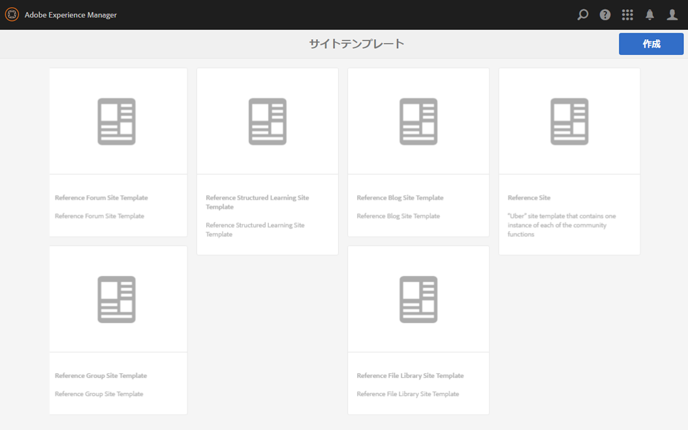
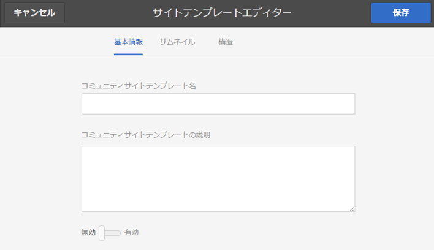
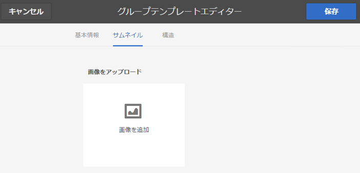
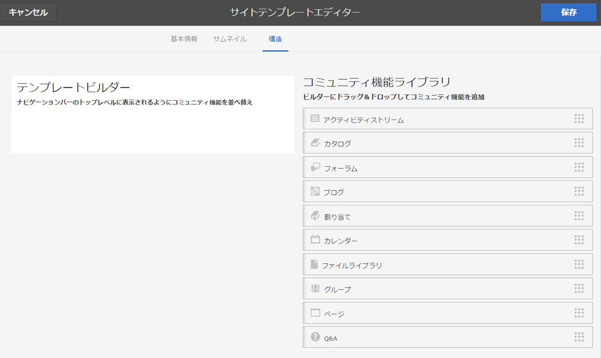
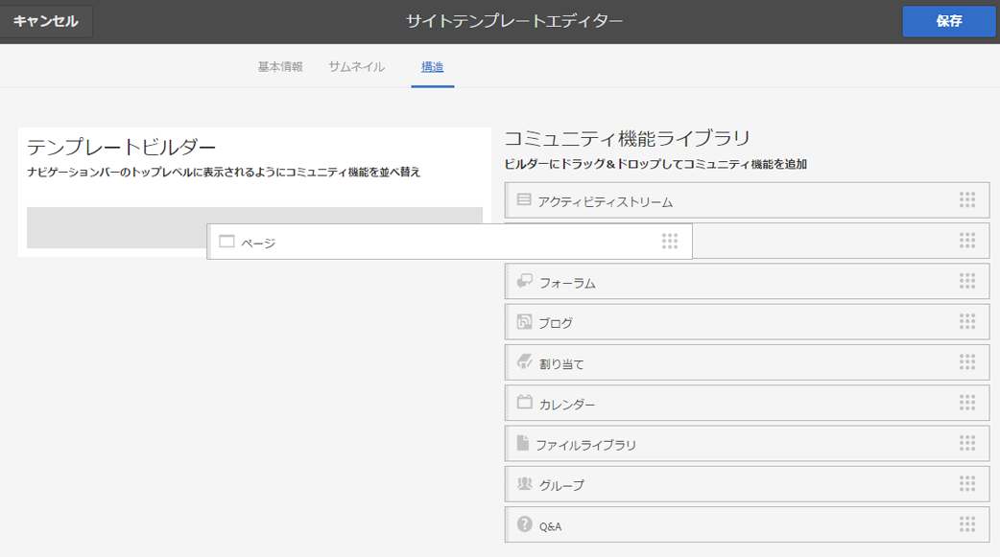
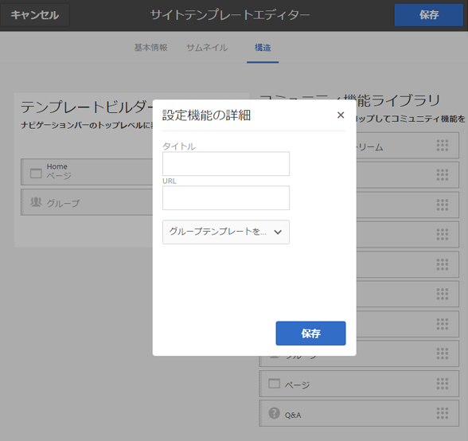
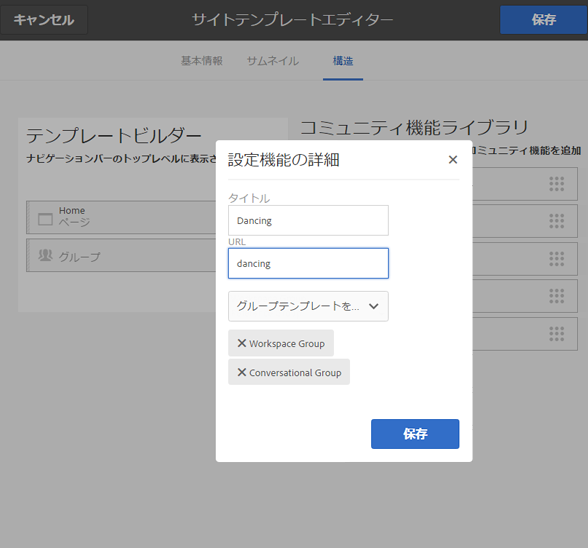

# サイトテンプレート  {#site-templates}

サイトテンプレートコンソールは、コミュニティグループに対して関心のある機能に重点を置いた[グループテンプレート](tools-groups.md)コンソールに非常に似ています。

>[!NOTE]
>
>[コミュニティサイト](sites-console.md)、[コミュニティサイトテンプレート](sites.md)、[コミュニティグループテンプレート](tools-groups.md)、[コミュニティ機能](functions.md)の作成用コンソールは、作成者環境でのみ使用できます。

## Site Templates Console {#site-templates-console}

作成者環境でコミュニティサイトコンソールにアクセスするには：

* グローバルナビゲーションから：**[!UICONTROL ツール/コミュニティ/サイトテンプレート]**

このコンソールでは、[コミュニティサイト](sites-console.md)を作成できるテンプレートが表示されます。また、新しいサイトテンプレートを作成できます。

## Create Site Template {#create-site-template}

新しいサイトテンプレートの作成を開始するには、`Create`を選択します。

するとサイトエディターパネルに移動します。パネルには以下の 3 つのサブパネルがあります。

### 基本情報{#basic-info}

基本情報パネルでは、名前、説明およびテンプレートを有効にするか無効にするかを設定します。

* **[!UICONTROL コミュニティサイトテンプレート名]**

   テンプレート名ID。

* **[!UICONTROL コミュニティサイトテンプレートの説明]**

   テンプレートの説明。

* **[!UICONTROL 無効/有効]**

   テンプレートが参照可能かどうかを制御するトグルスイッチ。

### サムネール  {#thumbnail}

（オプション）コミュニティサイトの作成者に対し、名前と説明に加えてサムネイルを表示するには、画像をアップロードアイコンを選択します。

### 構造 {#structure}

コミュニティ機能を追加するには、右側から左側にドラッグします。サイトメニューのリンクは追加した順番で表示されます。スタイルは、サイトの作成時にテンプレートに適用されます。

例えば、ホームページが必要な場合は、ページ機能をライブラリからテンプレートビルダーにドラッグ＆ドロップします。これにより、ページ設定ダイアログが開きます。 設定ダイアログの詳細については、[関数コンソール](functions.md)を参照してください。

このテンプレートをベースとするコミュニティサイトに必要な、他のコミュニティ機能を続けてドラッグ＆ドロップします。

ページ機能では空のページが作成されます。グループ機能は、コミュニティサイト内にグループサイト（サブコミュニティ）を作成する機能を提供します。

>[!CAUTION]
>
>グループ関数は、**&#x200B;を&#x200B;*最初の関数ではなく、サイト構造内の唯一の*&#x200B;関数でなければなりません。
>
>他の機能（[ページ機能](functions.md#page-function)など）を含め、その機能を 1 番目にリストする必要があります。

### グループ機能のためのグループテンプレート {#group-templates-for-groups-function}

サイトテンプレートにグループ機能を含める場合、パブリッシュ環境で新しいグループを作成するときに、グループテンプレート選択の仕様が設定により許可されている必要があります。

>[!CAUTION]
>
>Groups関数は、**&#x200B;を&#x200B;*最初の関数ではなく、サイト構造内の唯一の*&#x200B;関数でなければなりません。

2 つ以上のグループテンプレートを選択することにより、グループ管理者が実際にコミュニティで新しいグループを作成するときに、テンプレートを選択できるようになります。

## サイトテンプレートを編集 {#edit-site-template}

メインの[サイトテンプレートコンソール](#site-templates-console)でサイトテンプレートを表示しているときに、既存のサイトテンプレートを選択して編集できます。

このプロセスでは、[サイトテンプレートの作成](#create-site-template)と同じパネルを使用します。
