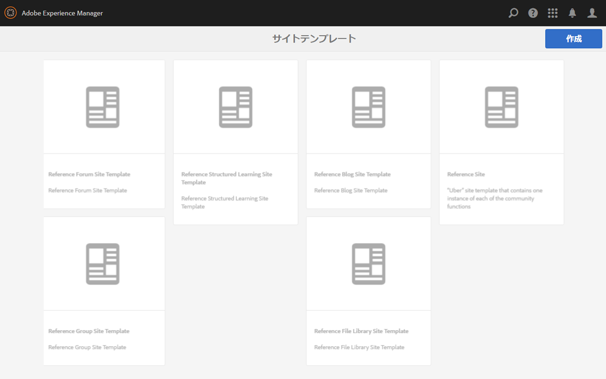
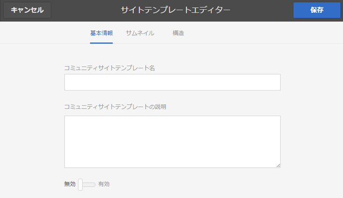
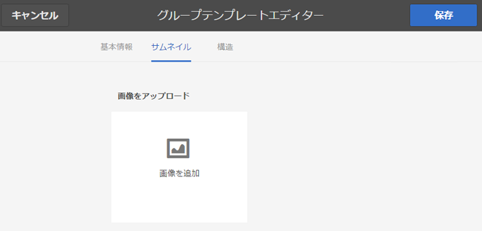
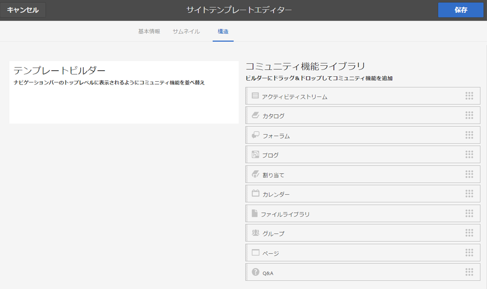
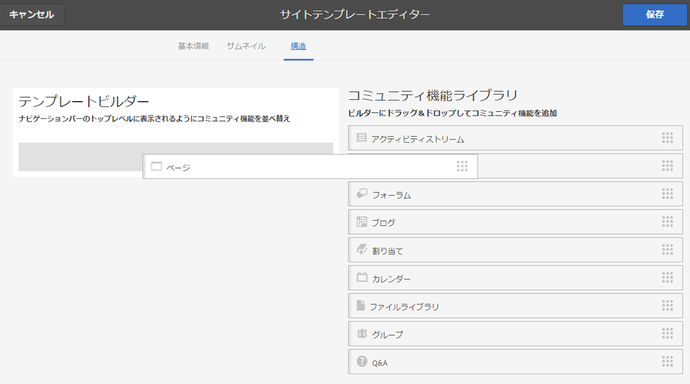
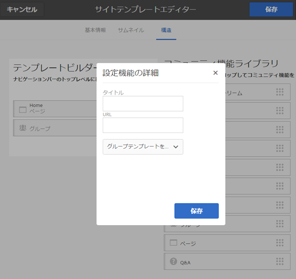
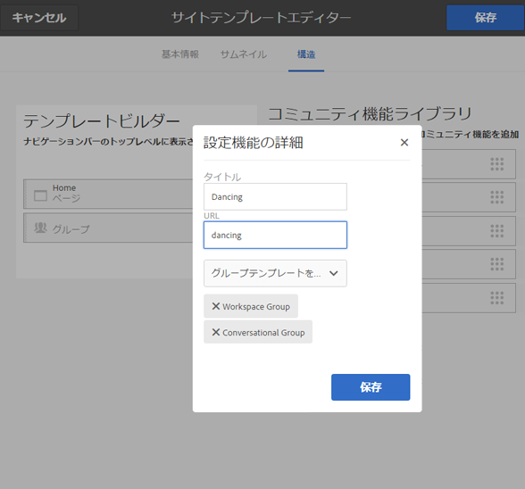

# サイトテンプレート {#site-templates}

サイトテンプレートコンソールは、[&#x200B; グループテンプレート &#x200B;](tools-groups.md) コンソールと似ています。このコンソールは、コミュニティグループにとって関心のある機能に焦点を当てています。

>[!NOTE]
>
>[&#x200B; コミュニティサイト &#x200B;](sites-console.md)、[&#x200B; コミュニティサイトテンプレート &#x200B;](sites.md)、[&#x200B; コミュニティグループテンプレート &#x200B;](tools-groups.md)、[&#x200B; コミュニティ関数](functions.md)の作成用コンソールは、オーサー環境でのみ使用できます。

## サイトテンプレートコンソール {#site-templates-console}

オーサー環境で、コミュニティサイトコンソールにアクセスするには：

* グローバルナビゲーションから：**[!UICONTROL ツール/コミュニティ/サイトテンプレート]**

このコンソールには、[&#x200B; コミュニティサイト &#x200B;](sites-console.md)を作成できるテンプレートが表示され、新しいサイトテンプレートを作成できます。

## サイトテンプレートを作成 {#create-site-template}

サイトテンプレートの作成を開始するには、`Create`を選択します。

次の3つのサブパネルを含むサイトエディターパネルが開きます。

### 基本情報 {#basic-info}

基本情報パネルでは、名前、説明、およびテンプレートが有効か無効かを設定します。

* **[!UICONTROL コミュニティサイトテンプレート名]**

  テンプレート名ID。

* **[!UICONTROL コミュニティサイトテンプレートの説明]**

  テンプレートの説明。

* **[!UICONTROL 無効/有効]**

  テンプレートが参照可能かどうかを制御するトグルスイッチ。

### サムネイル {#thumbnail}

（オプション）画像をアップロードアイコンを選択して、コミュニティサイトの作成者に名前と説明とともにサムネールを表示します。

### 構造 {#structure}

コミュニティ機能を追加するには、サイトメニューリンクが表示される順序で、右側から左側にドラッグします。 スタイルは、サイトの作成中にテンプレートに適用されます。

例えば、ホームページが必要な場合は、ライブラリからページ関数をドラッグし、テンプレートビルダーの下にドロップします。 これにより、ページ設定ダイアログが開きます。 設定ダイアログについて詳しくは、[関数コンソール &#x200B;](functions.md)を参照してください。

このテンプレートに基づいて、コミュニティサイトに必要なその他のコミュニティ機能を引き続きドラッグ&amp;ドロップします。

page関数は空のページを提供します。 グループ機能を使用すると、コミュニティサイト内にグループサイト（サブコミュニティ）を作成できます。

>[!CAUTION]
>
>グループ関数は、サイト構造内の最初の関数でも唯一の関数でもない&#x200B;*必要があります。*
>
>[&#x200B; ページ関数](functions.md#page-function)などの他の関数を最初に含めてリストする必要があります。

### グループ機能のグループテンプレート {#group-templates-for-groups-function}

サイトテンプレートにグループ関数を含める場合、設定では、パブリッシュ環境で新しいグループを作成するときに許可されるグループテンプレートの選択肢の指定が必要です。

>[!CAUTION]
>
>グループ関数は、サイト構造内の最初の関数でも唯一の関数でもない&#x200B;*必要があります。*

2つ以上のコミュニティグループテンプレートを選択すると、実際にコミュニティでグループを作成する際に、グループ管理者に選択肢が提供されます。

## サイトテンプレートを編集 {#edit-site-template}

メインの[&#x200B; サイトテンプレートコンソール &#x200B;](#site-templates-console)でサイトテンプレートを表示する場合、既存のサイトテンプレートを編集用に選択できます。

このプロセスは、[&#x200B; サイトテンプレートの作成](#create-site-template)と同じパネルを提供します。
