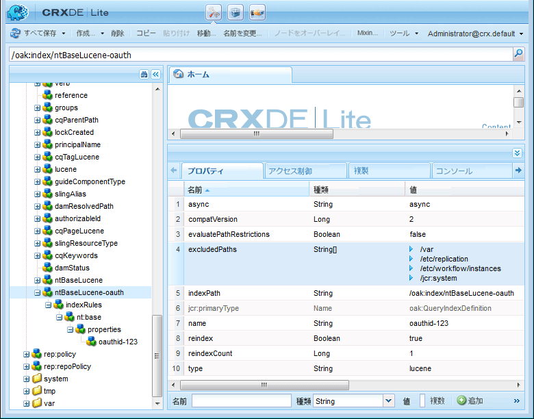

# Facebook と Twitter を使用したソーシャルログイン {#social-login-with-facebook-and-twitter}

ソーシャルログインは、サイト訪問者にFacebookまたはTwitterアカウントでログインするオプションを提示する機能です。 したがって、許可されたFacebookまたはTwitterのデータがAEMメンバープロファイルに含まれます。

## ソーシャルログインの概要 {#social-login-overview}

ソーシャルログイン機能を含めるには、カスタムの Facebook アプリケーションや Twitter アプリケーションを作成する必要があります。**

we-retailサンプルは、FacebookおよびTwitterのサンプルアプリとクラウドサービスを提供していますが、[実稼動Webサイト](../../help/sites-administering/production-ready.md)では使用できません。

必要な手順は以下のとおりです。

1. すべての AEM パブリッシュインスタンスで [OAuth 認証を有効](#adobe-granite-oauth-authentication-handler)にします。

   OAuthが有効になっていない場合、はログインに失敗します。

1. **** ソーシャルアプリとクラウドサービスを作成します。

   * facebookでのログインをサポートするには：

      * [Facebookアプリ](#create-a-facebook-app)を作成します。
      * [Facebook Connectクラウドサービス](#create-a-facebook-connect-cloud-service)を作成して公開します。
   * twitterでのログインをサポートするには：

      * [Twitterアプリ](#create-a-twitter-app)を作成します。
      * [Twitter Connectクラウドサービス](#create-a-twitter-connect-cloud-service)を作成して公開します。

1. コミュニティサイトに対して&#x200B;[**ソーシャルログインを有効**](#enable-social-login)にします。

以下に示す 2 つの基本的な概念があります。

1. **範囲** （権限）は、アプリがリクエストできるデータを指定します。

   * facebookとTwitterの[AdobeGranite OAuth Application and Provider](#adobe-granite-oauth-application-and-provider)インスタンスには、デフォルトで、その範囲内に基本的なアプリ権限が含まれています。

1. **フィールド** (params)は、URLパラメーターを使用してリクエストされた実際のデータを指定します。

   * これらのフィールドは、[AEM Communities Facebook OAuth Provider](#aem-communities-facebook-oauth-provider)および[AEM Communities Twitter OAuth Provider](#aem-communities-twitter-oauth-provider)で指定します。
   * デフォルトのフィールドはほとんどの使用例で十分ですが、変更できます。

## 「Facebook ログイン」{#facebook-login}を選択します。

### Facebook API バージョン {#facebook-api-version}

ソーシャルログインとwe-retail Facebookのサンプルは、Facebook Graph APIがバージョン1.0のときに開発されました。
AEM 6.4 GAおよびAEM 6.3 SP1のソーシャルログインが更新され、新しいFacebook Graph API 2.5バージョンと連携するようになりました。

>[!NOTE]
>
>古いAEMバージョンでは、ログ&#x200B;**からトークンを抽出できない場合、そのAEMリリースの最新のCFPにアップグレードします。**

facebook Graph APIのバージョン情報については、[Facebook API変更ログ](https://developers.facebook.com/docs/apps/changelog)を参照してください。

### Create a Facebook App {#create-a-facebook-app}

facebookのソーシャルログインを有効にするには、適切に設定されたFacebookアプリケーションが必要です。

facebookアプリケーションを作成するには、 Facebookの[https://developers.facebook.com/apps/](https://developers.facebook.com/apps/)の手順に従ってください。 手順の変更は、次の情報には反映されません。

一般的な手順（Facebook API v2.7 の時点）：

* 新しい Facebook アプリを追加します。**
   * *プラットフォーム*&#x200B;の場合は、「Webサイト」を選択します。
      * *サイトURL*&#x200B;に、`  https://<server>:<port>.`と入力します。
      * 「*表示名*」に、Facebook接続サービスのタイトルとして使用するタイトルを入力します。
      * *カテゴリ*&#x200B;の場合は、*ページ用のアプリ*&#x200B;を選択することをお勧めしますが、任意のものを選択できます。
      * 「製品を追加」で、「Facebook ログイン」を選択します。**
      * *有効なOAuthリダイレクトURI*&#x200B;に、`  https://<server>:<port>.`と入力します。

>[!NOTE]
>
>開発の場合は、http://localhost:4503が機能します。

アプリケーションを作成したら、**[!UICONTROL App ID]**&#x200B;と&#x200B;**[!UICONTROL App Secret]**&#x200B;の設定を探します。 この情報は、[Facebook Cloud Service](#createafacebookcloudservice)を設定するために必要です。

### Facebook Connect クラウドサービス {#create-a-facebook-connect-cloud-service}

クラウドサービス設定を作成することで、[Adobe Granite OAuth Application and Provider](#adobe-granite-oauth-application-and-provider) インスタンスが作成されます。このインスタンスが、Facebook アプリケーションと新しいユーザーの追加先のメンバーグループを識別します。

1. AEM オーサーインスタンスで、管理者権限でサインインします。
1. グローバルナビゲーションから、**[!UICONTROL ツール]** / **[!UICONTROL Cloud Services]** / **[!UICONTROL Facebook Socialログイン設定]**&#x200B;を選択します。
1. **[!UICONTROL コンテキストパス]**&#x200B;設定を選択します。

   **[!UICONTROL コンテ]** キストパスは、コミュニティサイトの作成/編集時に選択したクラウド設定パスと同じである必要があります。

1. コンテキストパスの下にクラウドサービスを作成できる設定になっているかを確認します。
1. **[!UICONTROL ツール]** > **[!UICONTROL 一般]** > **[!UICONTROL 設定ブラウザー]**&#x200B;に移動します。 コンテキストを選択し、プロパティを編集します。 まだ有効になっていなければ、クラウド設定を有効にします。

   

   * 詳しくは、[設定ブラウザー](/help/sites-administering/configurations.md)のドキュメントを参照してください。

1. **Facebook クラウドサービス設定を作成または編集します。**

   

   * **[!UICONTROL タイトル]** (*必須*)Facebookアプリを識別する表示タイトルを入力します。facebookアプリの&#x200B;*表示名*&#x200B;と同じ名前を使用することをお勧めします。
   * **[!UICONTROL アプリID/APIキー]** (*必須*)Facebookアプリ ***のア*** プリIDを入力します。これは、ダイアログから作成された[AdobeGranite OAuth Application and Provider](https://helpx.adobe.com/jp/experience-manager/6-3/communities/using/social-login.html#AdobeGraniteOAuthApplicationandProvider)インスタンスを識別します。
   * **[!UICONTROL App Secret]** (*必須*)Facebook Appの ***App Secret*** を入力します。
   * **[!UICONTROL ユーザーを作成]**&#x200B;オンにすると、Facebook アカウントでログインしたときに AEM ユーザーエントリが作成され、選択されたユーザーグループのメンバーとして追加されます。デフォルトはオンです（強く推奨します）。
   * **[!UICONTROL ユーザーIDをマスク]**:選択を解除したままにします。
   * **[!UICONTROL 電子メールの範囲]**:ユーザーの電子メールidは、Facebookから取得する必要があります。
   * **[!UICONTROL ユーザーグループに追]** 加ユーザーグループを追加を選択し、ユーザーを追加す [るコミュニティ](https://helpx.adobe.com/jp/experience-manager/6-3/communities/using/users.html) サイトの1つ以上のメンバーグループを選択します。

   >[!NOTE]
   >
   >グループはいつでも追加または削除できます。しかし、既存ユーザーのメンバーシップに影響はありません。自動メンバーシップは、このフィールド更新後に作成された新規ユーザーにのみ適用されます。匿名ユーザーが無効になっているサイトの場合は、そのクローズドコミュニティサイト専用の対応するコミュニティメンバーグループにユーザーを追加します。

   * 「**[!UICONTROL 保存]**」を選択します。
   * **[!UICONTROL 公開]**.

その結果、[AdobeのGranite OAuth Application and Provider](https://helpx.adobe.com/experience-manager/6-3/communities/using/social-login.html#adobe-granite-oauth-application-and-provider)インスタンスが生成され、追加の範囲（権限）を追加しない限り、追加の変更は必要ありません。 デフォルトの範囲は、Facebookログインの標準の権限です。 追加の範囲が必要な場合は、OSGi設定を直接編集する必要があります。 システムまたはコンソールから直接変更がおこなわれている場合は、上書きしないよう、タッチ UI からクラウドサービス設定を編集しないでください。

### AEM Communities Facebook OAuth Provider  {#aem-communities-facebook-oauth-provider}

AEM Communitiesプロバイダーは、[AdobeGranite OAuth Application and Provider](#adobe-granite-oauth-application-and-provider)インスタンスを拡張します。

以下をおこなうには、このプロバイダーを編集する必要があります。

* ユーザーの更新を許可する
* スコープ](#adobe-granite-oauth-application-and-provider)内に[フィールドを追加します。

   * デフォルトで許可されるすべてのフィールドがデフォルトで含まれるわけではありません。

編集が必要な場合は、それぞれの AEM パブリッシュインスタンスで次の設定をします。

1. 管理者権限でサインインします。
1. [Webコンソール](../../help/sites-deploying/configuring-osgi.md)に移動します。例：http://localhost:4503/system/console/configMgr
1. AEM Communities Facebook OAuth Providerを見つけます。
1. 鉛筆アイコンを選択して編集用に開きます。

   

   * **[!UICONTROL OAuth Provider ID]**

      （*必須*）デフォルト値は&#x200B;*soco -facebook*&#x200B;です。 編集しないでください。

   * **[!UICONTROL Cloud Service設定]**

      デフォルト値は `/etc/  cloudservices /  facebookconnect` です。編集しないでください。

   * **[!UICONTROL OAuth Provider Service Config]**

      デフォルト値は `/apps/social/facebookprovider/config/` です。編集しないでください。

   * **[!UICONTROL タグを有効にする]**

      編集しない。

   * **[!UICONTROL ユーザーパス]**

      リポジトリ内のユーザーデータの格納場所。 コミュニティサイトでは、メンバーがお互いのプロファイルを閲覧できる権限を確保するために、パスをデフォルトの */home/users/community* にする必要があります。

   * **[!UICONTROL フィールドの有効化]**

      オンにすると、その下にリストされているフィールドが、ユーザー認証およびユーザー情報を求める Facebook へのリクエストに指定されます。デフォルト値はオフです。

   * **[!UICONTROL フィールド]**

      「Enable fields」をオンにした場合は、Facebook Graph API の呼び出し時に以下のフィールドが含まれます。これらのフィールドは、クラウドサービス設定で定義された範囲内で許可されている必要があります。追加のフィールドを使用するには、Facebook の承認が必要な場合があります。Facebook ドキュメントの Facebook ログイン権限の節を参照してください。パラメーターとして追加されるデフォルトのフィールドは次のとおりです。

      * id
      * name
      * first_name
      * last_name
      * link
      * locale
      * picture
      * timezone
      * updated_time
      * verified
      * email

   いずれかのフィールドを追加または変更した場合は、対応する Default Sync ハンドラー設定を更新してマッピングを修正してください。

   * **[!UICONTROL ユーザーを更新]**

      オンにすると、ログインするたびにリポジトリ内のユーザーデータが更新され、プロファイルの変更やリクエストされた追加データが反映されます。デフォルト値はオフです。

#### 次の手順 {#next-steps}

続いて以下の手順をおこないますが、この手順は Facebook でも Twitter でも共通です。

* [クラウドサービス設定の公開](#publishcloudservices)
* [コミュニティサイトに対する有効化](#enable-social-login)

## Twitter ログイン {#twitter-login}

### Create a Twitter App {#create-a-twitter-app}

Twitter ソーシャルログインを有効にするには、設定された Twitter アプリが必要です。

[https://apps.twitter.com](https://apps.twitter.com/)で新しいTwitterアプリケーションを作成するには、最新の手順に従います。

一般的な手順は次のとおりです。

1. Webサイトのユーザーに対してTwitterアプリケーションを識別する&#x200B;*名前*&#x200B;を入力します。
1. 「*説明*」を入力します。
1. *webサイト*&#x200B;の場合は、`https://<server>`と入力します。
1. *Callback URL*&#x200B;には、`https://server`と入力します。

   >[!NOTE]
   >
   >ポートを指定する必要はありません。
   >
   >開発の場合は、https://127.0.0.1/が機能します。

1. アプリケーションが作成されたら、**[!UICONTROL Consumer (API) Key]**&#x200B;と&#x200B;**[!UICONTROL Consumer (API) Secret]**&#x200B;を探します。 この情報は、[Twitter Cloud Service](#createatwittercloudservice)を設定するために必要です。

#### 権限 {#permissions}

Twitter アプリケーション管理の権限のセクションで、次の設定をします。

* **[!UICONTROL アクセス]**:を選択しま `Read only`す。

   * その他のオプションはサポートされません。

* **[!UICONTROL 追加の権限]**:必要に応じて、「 」を選 `Request email addresses from users`択します。

   * 選択しなかった場合は、ユーザーの AEM のプロファイルに電子メールアドレスが含まれなくなります。
   * Twitter の説明に、追加でおこなう手順が示されています。

ソーシャルログインに対して行われるRESTリクエストは、*[GETアカウント/検証資格情報](https://dev.twitter.com/rest/reference/get/account/verify_credentials)*&#x200B;のみです。

### Twitter Connect クラウドサービスの作成 {#create-a-twitter-connect-cloud-service}

クラウドサービス設定を作成することで、[Adobe Granite OAuth Application and Provider](#adobe-granite-oauth-application-and-provider) インスタンスが作成されます。このインスタンスが、Twitter アプリケーションと新しいユーザーの追加先のメンバーグループを識別します。

1. オーサーインスタンスで、管理者権限でサインインします。
1. グローバルナビゲーションから、**[!UICONTROL ツール]** / **[!UICONTROL Cloud Services]** / **[!UICONTROL Twitter Socialログイン設定]**&#x200B;を選択します。
1. **[!UICONTROL コンテキストパス]**&#x200B;設定を選択します。

   コンテキストパスは、コミュニティサイトの作成または編集時に選択したクラウド設定パスと同じでなければなりません。

1. コンテキストパスの下にクラウドサービスを作成できる設定になっているかを確認します。
1. **[!UICONTROL ツール]** > **[!UICONTROL 一般]** > **[!UICONTROL 設定ブラウザー]**&#x200B;に移動します。 コンテキストを選択し、プロパティを編集します。 まだ有効になっていなければ、クラウド設定を有効にします。

   

   * 詳しくは、[設定ブラウザー](/help/sites-administering/configurations.md)のドキュメントを参照してください。

1. Twitter クラウドサービス設定を作成または編集します。

   

   * **[!UICONTROL タイトル]**

      （*必須*） Twitterアプリを識別する表示タイトルを入力します。 twitterアプリの&#x200B;*表示名*&#x200B;と同じ名前を使用することをお勧めします。

   * **[!UICONTROL 消費者キー]**

      （*必須*） Twitterアプリの&#x200B;**Consumer(API)Key**&#x200B;を入力します。 これは、ダイアログから作成された[AdobeGranite OAuth Application and Provider](https://helpx.adobe.com/experience-manager/6-3/communities/using/social-login.html#AdobeGraniteOAuthApplicationandProvider)インスタンスを識別します。

   * **[!UICONTROL 消費者の秘密鍵]**

      （*必須*） Twitterアプリの&#x200B;***Consumer(API) Secret***&#x200B;を入力します。

   * **[!UICONTROL ユーザーを作成]**

      オンにすると、TwitterアカウントでログインしたときにAEMユーザーエントリが作成され、選択したユーザーグループにメンバーとして追加されます。 デフォルトはオンです（強く推奨します）。

   * **[!UICONTROL ユーザー ID をマスク]**

      選択を解除したままにします。

   * **[!UICONTROL ユーザーグループに追加]**

      「ユーザーグループを追加」を選択して、ユーザーを追加するコミュニティサイト用の1つ以上の[メンバーグループ](https://helpx.adobe.com/experience-manager/6-3/communities/using/users.html)を選択します。
   >[!NOTE]
   >
   >グループはいつでも追加または削除できます。ただし、既存のユーザーのメンバーシップは影響を受けません。 自動メンバーシップは、このフィールド更新後に作成された新規ユーザーにのみ適用されます。匿名ユーザーが無効になっているサイトの場合は、その非公開のコミュニティサイト向けの対応するコミュニティメンバーグループにユーザーを追加します。

1. 「**[!UICONTROL 保存]**」と「**[!UICONTROL 公開]**」を選択します。

結果として得られるのは、[AdobeGranite OAuth Application and Provider](https://helpx.adobe.com/experience-manager/6-3/communities/using/social-login.html#adobe-granite-oauth-application-and-provider)インスタンスで、これ以上変更する必要はありません。 デフォルトの範囲には、Twitter にログインするための標準的な権限が含まれています。

### AEM Communities Twitter OAuth Provider  {#aem-communities-twitter-oauth-provider}

AEM Communities設定は、[AdobeGranite OAuth Application and Provider](#adobe-granite-oauth-application-and-provider)インスタンスを拡張します。 ユーザー更新を許可するには、このプロバイダーを編集する必要があります。

編集が必要な場合は、それぞれの AEM パブリッシュインスタンスで次の設定をします。

1. 管理者権限でサインインします。
1. [Webコンソール](../../help/sites-deploying/configuring-osgi.md)に移動します。

   例：http://localhost:4503/system/console/configMgr

1. AEM Communities Twitter OAuth Providerを見つけます。
1. 鉛筆アイコンを選択して編集用に開きます。

   

   * **[!UICONTROL OAuth Provider ID]**

   （*必須*）デフォルト値は&#x200B;*soco -twitter*&#x200B;です。 編集しないでください。

   * **[!UICONTROL Cloud Service設定]**

      デフォルト値は&#x200B;*confです。*&#x200B;編集しないでください。

   * **[!UICONTROL OAuth Provider Service Config]**

      デフォルト値は `/apps/social/twitterprovider/config/` です。編集しないでください。

   * **[!UICONTROL ユーザーパス]**

      リポジトリ内のユーザーデータの格納場所。 コミュニティサイトの場合、メンバーが互いのプロファイルを表示する権限を確保するには、パスをデフォルトの`/home/users/community`にする必要があります。

   * **[!UICONTROL Enable]** Paramsdo not edit
   * **[!UICONTROL URLパラメ]** ーターが編集されない
   * **[!UICONTROL ユーザーを更新]**

      オンにすると、ログインするたびにリポジトリ内のユーザーデータが更新され、プロファイルの変更やリクエストされた追加データが反映されます。デフォルト値はオフです。

#### 次の手順 {#next-steps-1}

続いて以下の手順をおこないますが、この手順は Facebook でも Twitter でも共通です。

* [クラウドサービス設定の公開](#publishcloudservices)
* [コミュニティサイトに対する有効化](#enable-social-login)

## ソーシャルログインの有効化 {#enable-social-login}

### AEM Communities サイトコンソール {#aem-communities-sites-console}

クラウドサービスを設定したら、コミュニティサイト[の作成](https://helpx.adobe.com/jp/experience-manager/6-3/communities/using/sites-console.html#SiteCreation)または[management](https://helpx.adobe.com/jp/experience-manager/6-3/communities/using/sites-console.html#ModifyingSiteProperties)中に「[ユーザー管理](https://helpx.adobe.com/jp/experience-manager/6-3/communities/using/sites-console.html#USERMANAGEMENT)設定」サブパネルを使用して、コミュニティサイトの関連するソーシャルログイン設定を有効にできます。

1. ソーシャルログイン設定を保存したサイト設定コンテキストを選択します。

1. 「一般」タブで、クラウド設定をおこないます。

   

1. 「設定」タブで、「**[!UICONTROL ソーシャルログイン]**」を有効にして「保存」を選択します。

   

## ソーシャルログインのテスト {#test-social-login}

* [AdobeGranite OAuth Authentication Handler](#adobe-granite-oauth-authentication-handler)がすべてのパブリッシュインスタンスで有効になっていることを確認します。
* クラウドサービスが公開されていることを確認します。
* コミュニティサイトが公開されていることを確認します。
* ブラウザーで公開済みサイトを起動します。
例： http://localhost:4503/content/sites/engage/en.html
* 「**[!UICONTROL ログイン]**」を選択します。
* 「**[!UICONTROL Facebookでログイン]**」または「**[!UICONTROL Twitterでログイン]**」を選択します。
* facebookまたはTwitterにまだログインしていない場合は、適切な資格情報を使用してログインします。
* facebookまたはTwitterアプリで表示されるダイアログに応じて、権限を付与する必要が生じる場合があります。
* ページ上部のツールバーが更新され、正常にログインできたことが反映されます。
* **[!UICONTROL プロファイル]**&#x200B;を選択します。プロファイルページには、ユーザーのアバター画像、名、姓が表示されます。 また、許可されたフィールドやパラメーターに従って、FacebookまたはTwitterプロファイルの情報も表示されます。

## AEM プラットフォーム OAuth 設定 {#aem-platform-oauth-configurations}

### Adobe Granite OAuth Authentication Handler {#adobe-granite-oauth-authentication-handler}

`Adobe Granite OAuth Authentication Handler`はデフォルトでは有効になっていません。また、***はすべてのAEMパブリッシュインスタンスで有効にする必要があります。***

パブリッシュインスタンスで認証ハンドラーを有効にするには、以下のように OSGi 設定を開いて保存するだけです。

* 管理者権限でサインインします。
* [Webコンソール](../../help/sites-deploying/configuring-osgi.md)に移動します。
例： http://localhost:4503/system/console/configMgr
* `Adobe Granite OAuth Authentication Handler`を探します。
* 「 」を選択して、編集用に設定を開きます。
* 「**[!UICONTROL 保存]**」を選択します。

>[!CAUTION]
>
>認証ハンドラーを、FacebookまたはTwitterの&#x200B;*AdobeGranite OAuth Application and Provider*&#x200B;のインスタンスと混同しないように注意してください。

### Adobe Granite OAuth Application and Provider {#adobe-granite-oauth-application-and-provider}

facebookまたはTwitterのクラウドサービスを作成すると、`Adobe Granite OAuth Authentication Handler`のインスタンスが作成されます。

Facebook または Twitter アプリ用に作成されたインスタンスを見つけるには、以下のようにします。

1. 管理者権限でサインインします。
1. [Webコンソール](../../help/sites-deploying/configuring-osgi.md)に移動します。

   例：http://localhost:4503/system/console/configMgr

1. AdobeGranite OAuth Application and Providerを見つけます。

   * **[!UICONTROL クライアントID]**&#x200B;が&#x200B;**[!UICONTROL アプリID]**&#x200B;と一致するインスタンスを見つけます。

      

      次のプロパティを除き、設定のその他のプロパティは変更しないでください。

   * **[!UICONTROL 設定ID]**

      （*必須*）OAuth構成IDは一意である必要があります。 クラウドサービスの作成時に自動生成されます。

   * **[!UICONTROL クライアント ID]**

      （*必須*）クラウドサービスの作成時に指定されたアプリケーションID。

   * **[!UICONTROL クライアントの秘密鍵]**

      （*必須*）クラウドサービスの作成時に指定されたアプリケーション秘密鍵。

   * **[!UICONTROL 対象範囲]**

      （*オプション*）プロバイダーから許可する追加の範囲を要求できます。 デフォルトで、ソーシャル認証とプロファイルデータの提供に必要な権限が範囲に含まれています。

   * **[!UICONTROL Provider ID]**

      （*必須*）AEM CommunitiesのプロバイダーIDは、クラウドサービスの作成時に設定されます。 編集しないでください。facebook Connectの場合、値は&#x200B;*soco -facebook*&#x200B;です。 twitter Connectの場合、値は&#x200B;*soco -twitter*&#x200B;です。

   * **[!UICONTROL グループ]**

      （*推奨*）作成したユーザーを追加する1つ以上のメンバーグループ。 AEM Communitiesの場合は、コミュニティサイトのメンバーグループをリストすることをお勧めします。

   * **[!UICONTROL コールバック URL]**

      （*オプションの*）OAuthプロバイダーで設定されたURLで、クライアントをリダイレクトして戻します。 元のリクエストのホストを使用するには、相対 URL を使用します。最初にリクエストされた URL を代わりに使用するには、空のままにします。この  URL .
   >[!NOTE]
   >
   >コールバックのドメインは、プロバイダー(FacebookまたはTwitter)に登録する必要があります。

OAuth認証ハンドラーの設定ごとに、インスタンスで追加の設定が2つ作成されます。

* Apache Jackrabbit Oak Default Sync Handler (org.apache.jackrabbit.oak.spi.security.authentication.external.impl.DefaultSyncHandler) — 編集は必要ありませんが、FacebookフィールドがCQユーザープロファイルノードにマッピングされる方法を確認できます。 また、「Sync Handler Name」は、OAuthプロバイダー設定の設定IDと一致します。
* Apache Jackrabbit Oak External Login Module (org.apache.jackrabbit.oak.spi.security.authentication.external.impl.ExternalLoginModuleFactory) — ここで編集は必要ありませんが、「IDプロバイダー名」と「同期ハンドラー名」は、それぞれ対応するOAuth設定と同期ハンドラー設定を指しています。

詳しくは、「[Apache Oak外部ログインモジュールによる認証](https://jackrabbit.apache.org/oak/docs/security/authentication/externalloginmodule.html)」を参照してください。

## OAuth ユーザーのトラバーサルパフォーマンス {#oauth-user-traversal-performance}

数十万人ものユーザーがFacebookまたはTwitterログインを使用して登録したコミュニティサイトでは、次のOakインデックスを追加することで、サイト訪問者がソーシャルログインを使用した際に実行されるクエリのトラバーサルパフォーマンスを向上できます。

ログにトラバーサル警告が記録されている場合は、このインデックスを追加することを推奨します。

オーサーインスタンスで、管理者権限でサインインします。

1. グローバルナビゲーションから：**ツール[CRX/DE Lite](../../help/sites-developing/developing-with-crxde-lite.md).**&#x200B;を選択します。
1. ntBaseLuceneのコピーからntBaseLucene-oauthという名前のインデックスを作成します。

   * ノード`/oak:index`の下
   * ノード`ntBaseLucene`を選択します。
   * **[!UICONTROL コピー]**&#x200B;を選択します。
   *  `/oak:index`
   * **[!UICONTROL 貼り付け]**&#x200B;を選択します。
   * ntBaseLuceneのコピーの名前を`ntBaseLucene-oauth`に変更します。

1. ntBaseLucene-oauthノードのプロパティを変更します。

   * **[!UICONTROL indexPath]**:  `/oak:index/ntBaseLucene-oauth`
   * **[!UICONTROL 名前]**:  `oauthid-123****`
   * **[!UICONTROL 再インデックス]**:  `true`
   * **[!UICONTROL reindexCount]**：`1`

1. ノード/oak:index/ntBaseLucene-oauth/indexRules/nt:base/propertiesの下で、次の操作を行います。

   * cqTagsを除くすべての子ノードを削除します。
   * cqTagsの名前を`oauthid-123****`に変更します。
   * ノード`oauthid-123****`のプロパティを変更します

      * **[!UICONTROL 名前]**:  `oauthid-123****`
   * 「**[!UICONTROL すべて保存]**」を選択します。

* **name** `oauthid-123`の場合、*123*&#x200B;をFacebookの&#x200B;***App ID***&#x200B;またはTwitterの&#x200B;***Consumer(API)Key***（a9/>クライアントID **の値）に置き換えます。[AdobeGranite OAuth Application and Provider](social-login.md#adobe-granite-oauth-application-and-provider)設定。**

   

追加の情報とツールについては、[Oakクエリとインデックス作成](../../help/sites-deploying/queries-and-indexing.md)を参照してください。

## Dispatcher 設定 {#dispatcher-configuration}

[コミュニティのための Dispatcher の設定](dispatcher.md)を参照してください。
