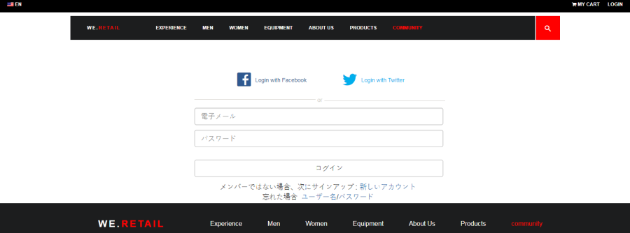
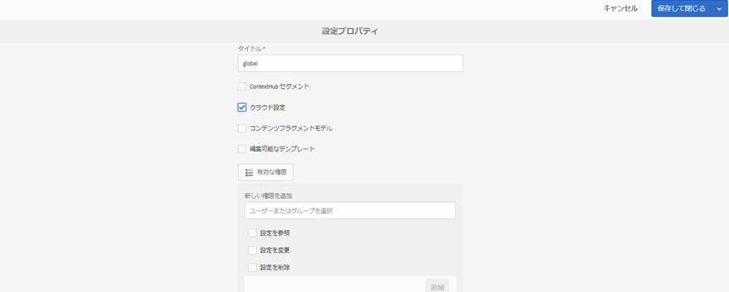
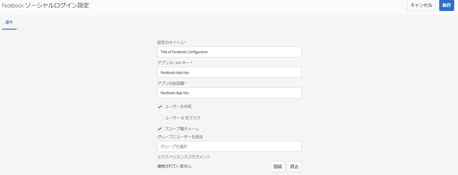
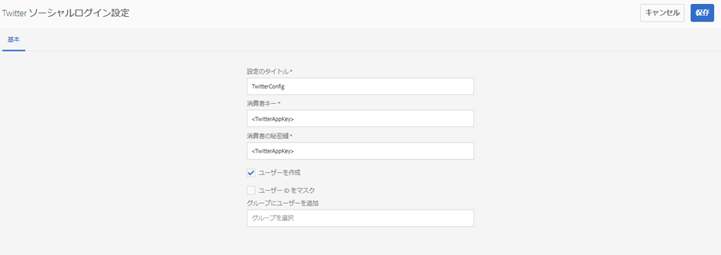
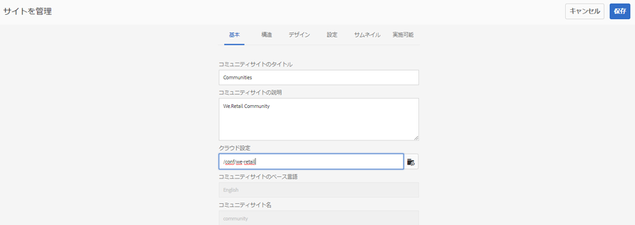
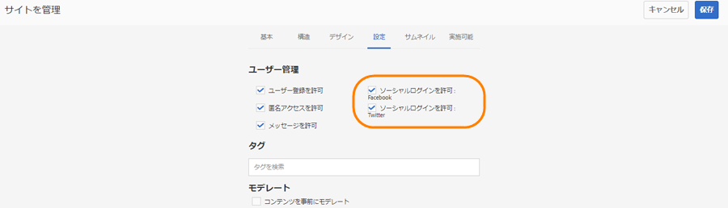

# Facebook と Twitter を使用したソーシャルログイン {#social-login-with-facebook-and-twitter}

Socialログインは、サイトの訪問者にFacebookまたはTwitterアカウントでサインインするオプションを提示する機能です。 したがって、許可されたFacebookまたはTwitterデータをAEMメンバープロファイルに含めます。

## ソーシャルログインの概要 {#social-login-overview}

ソーシャルログイン機能を含めるには、カスタムの Facebook アプリケーションや Twitter アプリケーションを作成する必要があります。**

While the we-retail sample provides sample Facebook and Twitter apps and cloud services, they are not available on a [production website](../../help/sites-administering/production-ready.md).

必要な手順は以下のとおりです。

1. すべての AEM パブリッシュインスタンスで [OAuth 認証を有効](#adobe-granite-oauth-authentication-handler)にします。

   OAuthが有効になっていない場合、ログインに失敗します。

1. **ソーシャル** アプリとクラウドサービスを作成します。

   * Facebookでのログインをサポートするには：

      * [Facebookアプリを作成します](#create-a-facebook-app)。
      * [Facebook Connectクラウドサービスを作成し、公開します](#create-a-facebook-connect-cloud-service)。
   * Twitterでのログインをサポートするには：

      * [Twitterアプリを作成します](#create-a-twitter-app)。
      * [Twitter Connectクラウドサービスを作成し、公開します](#create-a-twitter-connect-cloud-service)。

1. コミュニティサイトに対して[**ソーシャルログインを有効&#x200B;**](#enable-social-login)にします。

以下に示す 2 つの基本的な概念があります。

1. **スコープ** （権限）は、アプリが要求できるデータを指定します。

   * The Facebook and Twitter [Adobe Granite OAuth Application and Provider](#adobe-granite-oauth-application-and-provider) instances, by default, include the basic app permissions within their scope.

1. **フィールド** (params)は、URLパラメーターを使用して要求された実際のデータを指定します。

   * These fields are specified in [AEM Communities Facebook OAuth Provider](#aem-communities-facebook-oauth-provider) and [AEM Communities Twitter OAuth Provider](#aem-communities-twitter-oauth-provider).
   * デフォルトのフィールドは、ほとんどの使用事例で十分ですが、変更することができます。

## 「Facebook ログイン」{#facebook-login}を選択します。

### Facebook API バージョン {#facebook-api-version}

SocialログインとWe-Retail Facebookサンプルは、Facebook Graph APIバージョン1.0のときに開発されました。AEM 6.4 GAおよびAEM 6.3 SP1のソーシャルログインが、新しいバージョンのFacebook Graph API 2.5で動作するように更新されました。

>[!NOTE]
>
>For older AEM versions, if you are facing an exception in logs **Can&#39;t extract a token from this**, upgrade to latest CFP for that AEM release.

For the Facebook Graph API version information, see the [Facebook API changelog](https://developers.facebook.com/docs/apps/changelog).

### Create a Facebook App {#create-a-facebook-app}

Facebookのソーシャルログインを有効にするには、適切に設定されたFacebookアプリが必要です。

Facebookアプリを作成するには、Facebookの手順に従ってhttps://developers.facebook.com/apps/を参照して [ください](https://developers.facebook.com/apps/)。 手順に対する変更は、次の情報には反映されません。

一般的な手順（Facebook API v2.7 の時点）：

* 新しい Facebook アプリを追加します。**
   * For *Platform*, choose Website:
      * For *Site URL*, enter `  https://<server>:<port>.`
      * For *Display Name*, enter a title for use as the Title of the Facebook connect service.
      * *カテゴリ*&#x200B;の場合は、「ペ *ージのアプリ*」を選択することをお勧めしますが、どれでもかまいません。
      * 「製品を追加」で、「Facebook ログイン」を選択します。**
      * For *Valid OAuth redirect URIs*, enter `  https://<server>:<port>.`

>[!NOTE]
>
>開発の場合は、http://localhost:4503が機能します。

Once the application has been created, locate the **[!UICONTROL App ID]** and **[!UICONTROL App Secret]** settings. この情報は、 [Facebookクラウドサービスを設定する際に必要です](#createafacebookcloudservice)。

### Facebook Connect クラウドサービス {#create-a-facebook-connect-cloud-service}

クラウドサービス設定を作成することで、[Adobe Granite OAuth Application and Provider](https://chl-author.corp.adobe.com/content/help/jp/experience-manager/6-4/communities/using/social-login.html#AdobeGraniteOAuthApplicationandProvider) インスタンスが作成されます。このインスタンスが、Facebook アプリケーションと新しいユーザーの追加先のメンバーグループを識別します。

1. AEM オーサーインスタンスで、管理者権限でサインインします。
1. From global navigation, select **[!UICONTROL Tools]** > **[!UICONTROL Cloud Services]** > **[!UICONTROL Facebook Social login configuration]**.
1. **[!UICONTROL コンテキストパス]**&#x200B;設定を選択します。

   **[!UICONTROL コンテキスト]** パスは、コミュニティサイトの作成/編集時に選択したクラウド設定パスと同じにする必要があります。

1. コンテキストパスの下にクラウドサービスを作成できる設定になっているかを確認します。
1. Go to **[!UICONTROL Tools]** > **[!UICONTROL General]** > **[!UICONTROL Configuration Browser]**. コンテキストを選択し、プロパティを編集します。 まだ有効になっていなければ、クラウド設定を有効にします。

   

1. **Facebook クラウドサービス設定を作成または編集します。**

   

   * **[!UICONTROL タイトル]** (必&#x200B;*須*)Facebookアプリを識別する表示タイトルを入力します。 It is recommended to use the same name entered as the *Display Name* for the Facebook app.
   * **[!UICONTROL アプリID/APIキー]** (*必須*)Facebook ***アプリ*** のアプリIDを入力します。 This identifies the [Adobe Granite OAuth Application and Provider](https://helpx.adobe.com/jp/experience-manager/6-3/communities/using/social-login.html#AdobeGraniteOAuthApplicationandProvider) instance created from the dialog.
   * **[!UICONTROL App Secret]** (必&#x200B;*須*)Facebookアプリ ***の*** App Secretを入力します。
   * **[!UICONTROL ユーザーを作成]**&#x200B;オンにすると、Facebook アカウントでログインしたときに AEM ユーザーエントリが作成され、選択されたユーザーグループのメンバーとして追加されます。デフォルトがオンになっている（強く推奨）。
   * **[!UICONTROL Mask User IDs]**:選択を解除したままにします。
   * **[!UICONTROL Scope Email]**:ユーザーの電子メールIDをFacebookから取得する必要があります。
   * **[!UICONTROL [追加ユーザグループ]追加では、[ユーザグループ]を選択し、ユーザを追加するコミュニティサ]** イトの  1つ以上のメンバグループを選択します。
   >[!NOTE]
   >
   >グループはいつでも追加または削除できます。しかし、既存ユーザーのメンバーシップに影響はありません。自動メンバーシップは、このフィールド更新後に作成された新規ユーザーにのみ適用されます。匿名ユーザーが無効になっているサイトの場合は、そのクローズドコミュニティサイト専用の対応するコミュニティメンバーグループにユーザーを追加します。

   * Select **[!UICONTROL SAVE]**.
   * **[!UICONTROL 公開]**.

The result is an [Adobe Granite OAuth Application and Provider](https://helpx.adobe.com/experience-manager/6-3/communities/using/social-login.html#adobe-granite-oauth-application-and-provider) instance which does not require further modification unless adding additional scope (permissions). デフォルトのスコープは、Facebookログインの標準権限です。 追加のスコープが必要な場合は、OSGI設定を直接編集する必要があります。 システムまたはコンソールから直接変更がおこなわれている場合は、上書きしないよう、タッチ UI からクラウドサービス設定を編集しないでください。

### AEM Communities Facebook OAuth Provider {#aem-communities-facebook-oauth-provider}

The AEM Communities provider extends the [Adobe Granite OAuth Application and Provider](#adobe-granite-oauth-application-and-provider) instance.

以下をおこなうには、このプロバイダーを編集する必要があります。

* ユーザーの更新を許可する
* Add additional fields [within scope](#adobe-granite-oauth-application-and-provider)

   * デフォルトで許可されているすべてのフィールドがデフォルトで含まれるわけではありません。

編集が必要な場合は、それぞれの AEM パブリッシュインスタンスで次の設定をします。

1. 管理者権限でサインインします。
1. Navigate to the [Web Console](../../help/sites-deploying/configuring-osgi.md). For example, http://localhost:4503/system/console/configMgr.
1. AEM CommunitiesのFacebook OAuthプロバイダーを探します。
1. 鉛筆アイコンを選択して編集用に開きます。

   

   * **[!UICONTROL OAuthプロバイダID]**

      (必&#x200B;*須*)デフォル *ト値はsoco -facebookです*。 編集しないでください。

   * **[!UICONTROL クラウドサービス設定]**

      デフォルト値は `/etc/  cloudservices /  facebookconnect` です。編集しないでください。

   * **[!UICONTROL OAuthプロバイダーサービスの構成]**

      デフォルト値は `/apps/social/facebookprovider/config/` です。編集しないでください。

   * **[!UICONTROL タグの有効化]**

      編集しない。

   * **[!UICONTROL ユーザパス]**

      ユーザーデータが保存されるリポジトリ内の場所。 コミュニティサイトでは、メンバーがお互いのプロファイルを閲覧できる権限を確保するために、パスをデフォルトの */home/users/community* にする必要があります。

   * **[!UICONTROL フィールドの有効化]**

      オンにすると、その下にリストされているフィールドが、ユーザー認証およびユーザー情報を求める Facebook へのリクエストに指定されます。デフォルト値はオフです。

   * **[!UICONTROL フィールド]**

      「Enable fields」をオンにした場合は、Facebook Graph API の呼び出し時に以下のフィールドが含まれます。これらのフィールドは、クラウドサービス設定で定義された範囲内で許可されている必要があります。追加のフィールドを使用するには、Facebook の承認が必要な場合があります。Facebook ドキュメントの Facebook ログイン権限の節を参照してください。パラメーターとして追加されるデフォルトのフィールドは次のとおりです。

      * id
      * name
      * first_name
      * last_name
      * link
      * locale
      * picture
      * timezone
      * updated_time
      * verified
      * email
   いずれかのフィールドを追加または変更した場合は、対応する Default Sync ハンドラー設定を更新してマッピングを修正してください。

   * **[!UICONTROL ユーザーの更新]**

      オンにすると、ログインするたびにリポジトリ内のユーザーデータが更新され、プロファイルの変更やリクエストされた追加データが反映されます。デフォルト値はオフです。

#### 次の手順 {#next-steps}

続いて以下の手順をおこないますが、この手順は Facebook でも Twitter でも共通です。

* [クラウドサービス設定の公開](#publishcloudservices)
* [コミュニティサイトで有効にする](#enable-social-login)

## Twitter ログイン {#twitter-login}

### Create a Twitter App {#create-a-twitter-app}

Twitter ソーシャルログインを有効にするには、設定された Twitter アプリが必要です。

Follow the latest instructions to create a new Twitter application at [https://apps.twitter.com](https://apps.twitter.com/).

一般的な手順は次のとおりです。

1. Enter a *Name* that will identify your Twitter application to the users of your website.
1. 「*説明*」を入力します。
1. For *website* - enter `https://<server>`.
1. For *Callback URL* - enter `https://server`.

   >[!NOTE]
   >
   >ポートを指定する必要はありません。
   >
   >開発の場合は、https://127.0.0.1/が機能します。

1. Once the application has been created, locate the **[!UICONTROL Consumer (API) Key]** and **[!UICONTROL Consumer (API) Secret]**. This information will be needed for configuring the [Twitter cloud service](#createatwittercloudservice).

#### 権限 {#permissions}

Twitter アプリケーション管理の権限のセクションで、次の設定をします。

* **[!UICONTROL アクセス]**:を選択しま `Read only`す。

   * その他のオプションはサポートされません。

* **[!UICONTROL 追加の権限]**:必要に応じて、を選択し `Request email addresses from users`ます。

   * 選択しなかった場合は、ユーザーの AEM のプロファイルに電子メールアドレスが含まれなくなります。
   * Twitter の説明に、追加でおこなう手順が示されています。

The only REST request made for social login is to *[GET account/verify credentials](https://dev.twitter.com/rest/reference/get/account/verify_credentials)*.

### Twitter Connect クラウドサービスの作成 {#create-a-twitter-connect-cloud-service}

クラウドサービス設定を作成することで、[Adobe Granite OAuth Application and Provider](#adobe-granite-oauth-application-and-provider) インスタンスが作成されます。このインスタンスが、Twitter アプリケーションと新しいユーザーの追加先のメンバーグループを識別します。

1. オーサーインスタンスで、管理者権限でサインインします。
1. From global navigation, select **[!UICONTROL Tools]** > **[!UICONTROL Cloud Services]** > **[!UICONTROL Twitter Social login configuration]**.
1. Choose the **[!UICONTROL context path]** configuration.

   コンテキストパスは、コミュニティサイトの作成または編集時に選択したクラウド設定パスと同じでなければなりません。

1. コンテキストパスの下にクラウドサービスを作成できる設定になっているかを確認します。
1. Go to **[!UICONTROL Tools]** > **[!UICONTROL General]** > **[!UICONTROL Configuration Browser]**. コンテキストを選択し、プロパティを編集します。 まだ有効になっていなければ、クラウド設定を有効にします。

   

1. Twitter クラウドサービス設定を作成または編集します。

   

   * **[!UICONTROL タイトル]**

      (*Required*) Enter a display title that identifies the Twitter App. It is recommended to use the same name entered as the *Display Name* for the Twitter app.

   * **[!UICONTROL 消費者キー]**

      (*Required*) Enter the **Consumer (API) Key** for the Twitter app. This identifies the [Adobe Granite OAuth Application and Provider](https://helpx.adobe.com/jp/experience-manager/6-3/communities/using/social-login.html#AdobeGraniteOAuthApplicationandProvider) instance created from the dialog.

   * **[!UICONTROL 消費者の秘密鍵]**

      (*Required*) Enter the ***Consumer(API) Secret*** for the Twitter App.

   * **[!UICONTROL ユーザーを作成]**

      オンにすると、Twitterアカウントでログインすると、AEMユーザーエントリが作成され、選択したユーザーグループのメンバーとして追加されます。 デフォルトがオンになっている（強く推奨）。

   * **[!UICONTROL ユーザー ID をマスク]**

      選択を解除したままにします。

   * **[!UICONTROL ユーザーグループに追加]**

      Select Add User Group to choose one or more [member groups](https://helpx.adobe.com/jp/experience-manager/6-3/communities/using/users.html) for the community site to which users will be added.
   >[!NOTE]
   >
   >グループはいつでも追加または削除できます。ただし、既存のユーザーのメンバーシップは影響を受けません。 自動メンバーシップは、このフィールド更新後に作成された新規ユーザーにのみ適用されます。匿名ユーザーが無効になっているサイトの場合は、その閉じたコミュニティサイト用に、対応するコミュニティメンバーグループにユーザーを追加します。

1. Select **[!UICONTROL SAVE]** and **[!UICONTROL Publish]**.

The result is an [Adobe Granite OAuth Application and Provider](https://helpx.adobe.com/experience-manager/6-3/communities/using/social-login.html#adobe-granite-oauth-application-and-provider) instance which does not require further modification. デフォルトの範囲には、Twitter にログインするための標準的な権限が含まれています。

### AEM Communities Twitter OAuth Provider {#aem-communities-twitter-oauth-provider}

The AEM Communities configuration extends the [Adobe Granite OAuth Application and Provider](#adobe-granite-oauth-application-and-provider) instance. ユーザー更新を許可するには、このプロバイダーを編集する必要があります。

編集が必要な場合は、それぞれの AEM パブリッシュインスタンスで次の設定をします。

1. 管理者権限でサインインします。
1. Navigate to the [Web Console](../../help/sites-deploying/configuring-osgi.md).

   例：http://localhost:4503/system/console/configMgr

1. AEM CommunitiesのTwitter OAuthプロバイダーを探します。
1. 鉛筆アイコンを選択して編集用に開きます。

   

   * **[!UICONTROL OAuthプロバイダID]**
   (必&#x200B;*須*)デフォルト値 *はsoco -twitterです*。 編集しないでください。

   * **[!UICONTROL クラウドサービス設定]**

      The default value is *conf.*&#x200B;編集しないでください。

   * **[!UICONTROL OAuthプロバイダーサービスの構成]**

      デフォルト値は `/apps/social/twitterprovider/config/` です。編集しないでください。

   * **[!UICONTROL ユーザパス]**

      ユーザーデータが保存されるリポジトリ内の場所。 For a community site, to ensure permissions for members to view one another&#39;s profile, the path should be the default `/home/users/community`.

   * **[!UICONTROL Enable Params]** do not edit
   * **[!UICONTROL URLパラメータ]** ーは編集しない
   * **[!UICONTROL ユーザーの更新]**

      オンにすると、ログインするたびにリポジトリ内のユーザーデータが更新され、プロファイルの変更やリクエストされた追加データが反映されます。デフォルト値はオフです。

#### 次の手順 {#next-steps-1}

続いて以下の手順をおこないますが、この手順は Facebook でも Twitter でも共通です。

* [クラウドサービス設定の公開](#publishcloudservices)
* [コミュニティサイトで有効にする](#enable-social-login)

## ソーシャルログインの有効化 {#enable-social-login}

### AEM Communities サイトコンソール {#aem-communities-sites-console}

Once a cloud service is configured, it may be enabled for the relevant Social Login setting for a community site using the [User Management](https://helpx.adobe.com/jp/experience-manager/6-3/communities/using/sites-console.html#USERMANAGEMENT) Settings sub-panel during community site [creation](https://helpx.adobe.com/jp/experience-manager/6-3/communities/using/sites-console.html#SiteCreation) or [management](https://helpx.adobe.com/jp/experience-manager/6-3/communities/using/sites-console.html#ModifyingSiteProperties).

1. ソーシャルログイン設定を保存したサイト設定コンテキストを選択します。

1. 「一般」タブで、クラウド設定をおこないます。

   

1. 「設定」タブで、「**[!UICONTROL ソーシャルログイン]**」を有効にして「保存」を選択します。

   

## ソーシャルログインのテスト {#test-social-login}

* Ensure [Adobe Granite OAuth Authentication Handler](#adobe-granite-oauth-authentication-handler) has been enabled on all publish instances.
* クラウドサービスが公開されていることを確認します。
* コミュニティサイトが公開されていることを確認します。
* ブラウザーで公開済みサイトを起動します。例：http://localhost:4503/content/sites/engage/en.html
* Select **[!UICONTROL Login In]**.
* Select either **[!UICONTROL Sign in with Facebook]** or **[!UICONTROL Sign in with Twitter]**.
* FacebookまたはTwitterにまだログインしていない場合は、適切な資格情報を使用してログインします。
* FacebookまたはTwitterアプリで表示されるダイアログに応じて、権限を付与する必要がある場合があります。
* ページ上部のツールバーが更新され、ログインが成功したことを反映します。
* Select **[!UICONTROL Profile]**: the Profile page displays the user&#39;s avatar image, first name, and last name. また、許可されたフィールド/パラメーターに従って、FacebookプロファイルまたはTwitterパラメーターの情報も表示されます。

## AEM プラットフォーム OAuth 設定 {#aem-platform-oauth-configurations}

### Adobe Granite OAuth Authentication Handler {#adobe-granite-oauth-authentication-handler}

The `Adobe Granite OAuth Authentication Handler` is not enabled by default and ***must be enabled on all AEM publish instances.***

パブリッシュインスタンスで認証ハンドラーを有効にするには、以下のように OSGi 設定を開いて保存するだけです。

* 管理者権限でサインインします。
* Navigate to the [Web Console](../../help/sites-deploying/configuring-osgi.md).
For example, http://localhost:4503/system/console/configMgr
* Locate `Adobe Granite OAuth Authentication Handler`.
* 設定を編集用に開く場合に選択します。
* 「**[!UICONTROL 保存]**」を選択します。

>[!CAUTION]
>
>Be careful to not confuse the authentication handler with a Facebook or Twitter instance of *Adobe Granite OAuth Application and Provider*.

### Adobe Granite OAuth Application and Provider {#adobe-granite-oauth-application-and-provider}

When a cloud service for Facebook or Twitter is created, an instance of `Adobe Granite OAuth Authentication Handler` is created.

Facebook または Twitter アプリ用に作成されたインスタンスを見つけるには、以下のようにします。

1. 管理者権限でサインインします。
1. Navigate to the [Web Console](../../help/sites-deploying/configuring-osgi.md).

   例：http://localhost:4503/system/console/configMgr

1. Adobe Granite OAuth Application and Providerを探します。

   * Locate the instance where **[!UICONTROL Client ID]** matches the **[!UICONTROL App ID]**.

      

      次のプロパティを除き、設定の他のプロパティは変更しないでください。

   * **[!UICONTROL 設定ID]**

      (*Required*) OAuth configuration IDs must be unique. クラウドサービスの作成時に自動生成されます。

   * **[!UICONTROL クライアント ID]**

      (*Required*) The application ID provided when the cloud service was created.

   * **[!UICONTROL クライアントの秘密鍵]**

      (*Required*) The application secret provided when the cloud service was created.

   * **[!UICONTROL 対象範囲]**

      (*Optional*) Additional scope for what is permitted can be asked  from  the provider. デフォルトで、ソーシャル認証とプロファイルデータの提供に必要な権限が範囲に含まれています。

   * **[!UICONTROL プロバイダID]**

      (*Required*) The provider ID for AEM Communities is set when the cloud service was created. 編集しないでください。For Facebook Connect, the value is *soco -facebook*. For Twitter Connect, the value is *soco -twitter*.

   * **[!UICONTROL グループ]**

      (*Recommended*) One or more member groups to which created users are added. AEMコミュニティの場合は、コミュニティサイトのリストグループに登録することをお勧めします。

   * **[!UICONTROL コールバック URL]**

      (*Optional*) URL configured with the OAuth providers to redirect the client back. 元のリクエストのホストを使用するには、相対 URL を使用します。最初にリクエストされた URL を代わりに使用するには、空のままにします。この  URL .
   >[!NOTE]
   >
   >コールバックのドメインは、プロバイダー（FacebookまたはTwitter）に登録する必要があります。

各OAuth認証ハンドラーの設定に対して、インスタンス内に2つの追加の設定が作成されます。

* Apache Jackrabbit Oakのデフォルトの同期ハンドラ(org.apache.jackrabbit.oak.spi.security.authentication.external.impl.DefaultSyncHandler) — ここで編集を行う必要はありませんが、FacebookフィールドがCQユーザープロファイルノードにマッピングされる方法を確認できます。 また、「同期ハンドラー名」は、OAuthプロバイダー設定のConfig Idと一致します。
* Apache Jackrabbit Oak外部ログインモジュール(org.apache.jackrabbit.oak.spi.security.authentication.external.impl.ExternalLoginModuleFactory)：編集は必要ありませんが、「Identity Provider Name」と「Sync Handler Name」が同じで、対応するOAuthと同期ハンドラーの設定を指している場合があります。

For more information, see [Authentication with Apache Oak External Login Module](https://jackrabbit.apache.org/oak/docs/security/authentication/externalloginmodule.html).

## OAuth ユーザーのトラバーサルパフォーマンス {#oauth-user-traversal-performance}

数十万人ものクエリがFacebookやTwitterのログインを使用して登録したコミュニティサイトでは、サイト訪問者がソーシャルログインを使用する際に行うユーザーのトラバーサルパフォーマンスを、以下のOakインデックスを追加することで改善できます。

ログにトラバーサル警告が記録されている場合は、このインデックスを追加することを推奨します。

オーサーインスタンスで、管理者権限でサインインします。

1. From global navigation: select **Tools,[CRX/DE Lite](../../help/sites-developing/developing-with-crxde-lite.md).**
1. ntBaseLuceneのコピーからntBaseLucene-oauthという名前のインデックスを作成します。

   * ノード下 `/oak:index`
   * ノードを選択 `ntBaseLucene`
   * Select **[!UICONTROL Copy]**
   *  `/oak:index`
   * Select **[!UICONTROL Paste]**
   * Rename Copy of ntBaseLucene to `ntBaseLucene-oauth`

1. ntBaseLucene-oauthノードのプロパティを変更します。

   * **[!UICONTROL indexPath]**: `/oak:index/ntBaseLucene-oauth`
   * **[!UICONTROL name]**: `oauthid-123****`
   * **[!UICONTROL reindex]**: `true`
   * **[!UICONTROL reindexCount]**：`1`

1. ノード/oak:index/ntBaseLucene-oauth/indexRules/nt:base/propertiesの下：

   * cqTagsを除くすべての子ノードを削除します。
   * Rename cqTags to `oauthid-123****`
   * Modify the properties of node `oauthid-123****`

      * **[!UICONTROL name]**: `oauthid-123****`
   * Select **[!UICONTROL Save All]**.

* For the **name** `oauthid-123`, replace *123* with the Facebook ***App ID*** or Twitter ***Consumer (API) Key*** that is the value of the **Client ID** in the [Adobe Granite OAuth Application and Provider](social-login.md#adobe-granite-oauth-application-and-provider) configuration.

   

For additional information and tools, refer to [Oak Queries and Indexing](../../help/sites-deploying/queries-and-indexing.md).

## Dispatcher 設定 {#dispatcher-configuration}

[コミュニティのための Dispatcher の設定](dispatcher.md)を参照してください。
