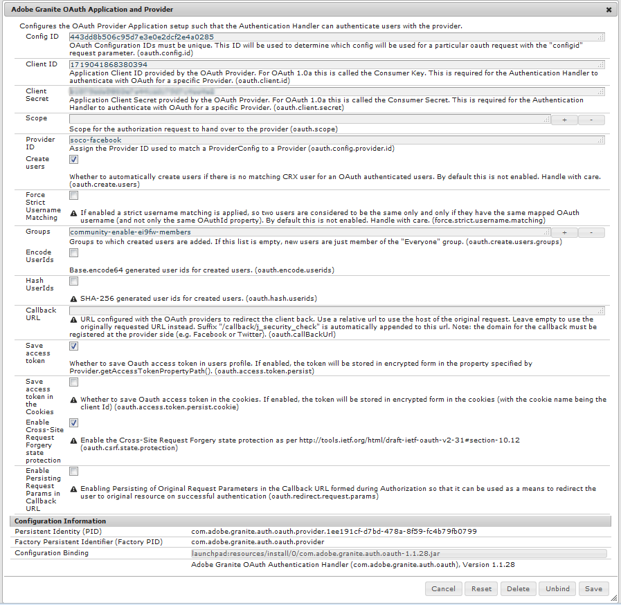

# Facebook と Twitter を使用したソーシャルログイン {#social-login-with-facebook-and-twitter}

ソーシャルログインでは、サイト訪問者が自分のFacebookまたはTwitterアカウントを使用してログインするオプションを提供できます。 そのため、AEM メンバープロファイルには、許可されたFacebookまたはTwitterデータを含めます。

## ソーシャルログインの概要 {#social-login-overview}

ソーシャルログインを含めるには、カスタム FacebookおよびTwitterアプリケーションを作成する *必須* 必要です。

we-retail サンプルは、Facebook、Twitterアプリおよびクラウドサービスのサンプルを提供しますが、[ 実稼動 web サイト ](../../help/sites-administering/production-ready.md) では使用できません。

必要な手順は次のとおりです。

1. すべてのAEM パブリッシュインスタンスで [OAuth 認証を有効にする ](#adobe-granite-oauth-authentication-handler) を行います。

   OAuth が有効になっていない場合、ログインの試みは失敗します。

1. ソーシャルアプリとクラウドサービスの **作成**。

   * facebookへのログインをサポートするには：

      * [Facebook アプリ ](#create-a-facebook-app) を作成します。
      * [Facebook Connect Cloud Service](#create-a-facebook-connect-cloud-service) を作成して公開します。

   * twitterでのログインをサポートするには：

      * [Twitterアプリ ](#create-a-twitter-app) を作成します。
      * [Twitter接続クラウドサービス ](#create-a-twitter-connect-cloud-service) を作成して公開します。

1. コミュニティサイトの [**有効** ソーシャルログイン ](#enable-social-login)。

次の 2 つの基本概念があります。

1. **範囲** （権限）は、アプリがリクエストできるデータを指定します。

   * facebookおよびTwitter [AdobeGranite OAuth Application および Provider](#adobe-granite-oauth-application-and-provider) インスタンスには、デフォルトで、それらの範囲内に基本アプリ権限が含まれています。

1. **Fields** （params）:URL パラメーターを使用してリクエストされた実際のデータを指定します。

   * これらのフィールドは、[AEM Communities Facebook OAuth プロバイダー ](#aem-communities-facebook-oauth-provider) および [AEM Communities Twitter OAuth プロバイダー ](#aem-communities-twitter-oauth-provider) で指定されます。
   * ほとんどのユースケースではデフォルトフィールドで十分ですが、変更可能です。

## Facebook ログイン {#facebook-login}

### Facebook API バージョン {#facebook-api-version}

ソーシャルログインと we-retail Facebook サンプルは、Facebook Graph API がバージョン 1.0 の場合に開発されました。
AEM 6.4 GA およびAEM 6.3 SP1 の時点で、ソーシャルログインが更新され、新しいFacebook Graph API 2.5 バージョンで動作するようになりました。

>[!NOTE]
>
>古いバージョンのAEMでログに例外 **これからトークンを抽出できない** が発生した場合は、そのAEM リリースの最新の CFP にアップグレードしてください。

facebook Graph API のバージョンについては、[Facebook API の変更ログ ](https://developers.facebook.com/docs/apps/changelog) を参照してください。

### facebook アプリケーションの作成 {#create-a-facebook-app}

facebook ソーシャルログインを有効にするには、適切に設定されたFacebook アプリケーションが必要です。

facebook アプリケーションを作成するには、[https://developers.facebook.com/apps/](https://developers.facebook.com/apps/) にあるFacebookの手順に従います。 手順の変更は、次の情報には反映されません。

一般に、Facebook API v2.7 の時点では次のようになります。

* *新しいFacebook アプリを追加する*
   * *Platform* の場合は、「Website」を選択します。
      * *サイト URL* に `  https://<server>:<port>.` と入力します
      * *表示名* には、Facebook Connect サービスのタイトルとして使用するタイトルを入力します。
      * *カテゴリ* の場合は、「ページ用アプリ *を選択することをお勧めしますが* 何でもかまいません。
      * *製品を追加：Facebook ログイン*
      * *有効な OAuth リダイレクト URI* に `  https://<server>:<port>.` と入力します

>[!NOTE]
>
>開発の場合、http://localhost:4503が機能します。

アプリケーションが作成されたら、「アプリ ID **[!UICONTROL および]** アプリの秘密鍵 **[!UICONTROL の設定を見つけ]** す。 この情報は、[Facebook Cloud Service](#createafacebookcloudservice) の設定に必要です。

### facebook Connect Cloud Serviceの作成 {#create-a-facebook-connect-cloud-service}

クラウドサービス設定を作成してインスタンス化された [AdobeGranite OAuth アプリケーションとプロバイダー ](#adobe-granite-oauth-application-and-provider) インスタンスは、新しいユーザーが追加されるFacebook アプリケーションとメンバーグループを特定します。

1. AEM オーサーインスタンスで、管理者権限でログインします。
1. グローバルナビゲーションから、「**[!UICONTROL ツール]**/**[!UICONTROL Cloud Service]**/**[!UICONTROL Facebook ソーシャルログイン設定]**」を選択します。
1. 設定 **[!UICONTROL コンテキストパス]** を選択します。

   **[!UICONTROL コンテキストパス]** は、コミュニティサイトの作成または編集時に選択したクラウド設定パスと同じである必要があります。

1. コンテキストパスが有効でその下にクラウドサービスを作成できるかどうかを確認します。
1. **[!UICONTROL ツール]**/**[!UICONTROL 一般]**/**[!UICONTROL 設定ブラウザー]** に移動します。 コンテキストを選択してプロパティを編集します。 まだ有効になっていない場合は、クラウド設定を有効にします。

   

   * 詳しくは、[設定ブラウザー](/help/sites-administering/configurations.md)のドキュメントを参照してください。

1. **作成/編集** Facebook クラウドサービスの設定。

   

   * **[!UICONTROL タイトル]** （*必須*）Facebook アプリを識別する表示タイトルを入力します。 facebook アプリの *表示名* として入力したのと同じ名前を使用します。
   * **[!UICONTROL アプリ ID/API キー]** （*必須*）Facebook アプリの ***アプリ ID*** を入力します。 これにより、ダイアログから作成された [Adobeの Granite OAuth アプリケーションおよびプロバイダー ](https://helpx.adobe.com/experience-manager/6-3/communities/using/social-login.html#AdobeGraniteOAuthApplicationandProvider) インスタンスが識別されます。
   * **[!UICONTROL アプリの秘密鍵]** （*必須*）Facebook アプリの ***アプリの秘密鍵*** を入力します。
   * **[!UICONTROL ユーザーを作成]** オンにすると、Facebook アカウントでログインした場合、AEM ユーザーエントリが作成され、選択したユーザーグループにメンバーとして追加されます。  デフォルトではオンになっています（強く推奨）。
   * **[!UICONTROL ユーザー ID をマスク]**：選択を解除したままにします。
   * **[!UICONTROL 範囲メール]**：ユーザーのメール ID をFacebookから取得する必要があります。
   * **[!UICONTROL ユーザーグループに追加]** 「ユーザーグループを追加」を選択して、ユーザーを追加するコミュニティサイトに 1 つ以上の [ メンバーグループ ](https://helpx.adobe.com/experience-manager/6-3/communities/using/users.html) を選択します。

   >[!NOTE]
   >
   >グループはいつでも追加または削除できます。 ただし、既存のユーザーのメンバーシップは影響を受けません。 自動メンバーシップは、このフィールドの更新後に作成される新規ユーザーにのみ適用されます。 匿名ユーザーが無効になっているサイトの場合は、閉じられたコミュニティサイト用の対応するコミュニティメンバーグループにユーザーを追加することを選択します。

   * **[!UICONTROL 保存]** を選択します。
   * **[!UICONTROL Publish]**。

その結果、[Adobeの Granite OAuth Application and Provider](https://helpx.adobe.com/experience-manager/6-3/communities/using/social-login.html#adobe-granite-oauth-application-and-provider) インスタンスが生成され、スコープ（権限）を追加しない限り、さらに変更する必要はありません。 デフォルトの範囲は、Facebookへのログインに対する標準の権限です。 範囲を追加する必要がある場合は、OSGi 設定を直接編集する必要があります。 システム/コンソールを介して直接行われた変更がある場合は、上書きを避けるために、タッチ UI からクラウドサービス設定を編集しないでください。

### AEM Communities Facebook OAuth プロバイダー {#aem-communities-facebook-oauth-provider}

AEM Communities プロバイダーは、[Adobe Granite OAuth Application and Provider](#adobe-granite-oauth-application-and-provider) インスタンスを拡張します。

このプロバイダーは、次の操作を行うために編集が必要です：

* ユーザー更新の許可
* 追加フィールド [ 範囲内 ](#adobe-granite-oauth-application-and-provider)

   * デフォルトで許可されているすべてのフィールドがデフォルトで含まれるわけではありません。

編集が必要な場合は、各AEM パブリッシュインスタンスで以下をおこないます。

1. 管理者権限でログインします。
1. [Web コンソール ](../../help/sites-deploying/configuring-osgi.md) に移動します。 例えば、http://localhost:4503/system/console/configMgrです。
1. AEM Communities Facebook OAuth プロバイダーを見つけます。
1. 編集する鉛筆アイコンを選択します。

   

   * **[!UICONTROL OAuth プロバイダー ID]**

     （*必須*）デフォルト値は *soco -facebook* です。 編集しないでください。

   * **[!UICONTROL Cloud Service設定]**

     デフォルト値は `/etc/  cloudservices /  facebookconnect` です。 編集しないでください。

   * **[!UICONTROL OAuth プロバイダーサービス設定]**

     デフォルト値は `/apps/social/facebookprovider/config/` です。 編集しないでください。

   * **[!UICONTROL タグを有効にする]**

     編集しないでください。

   * **[!UICONTROL ユーザーパス]**

     ユーザーデータが格納されるリポジトリ内の場所。 コミュニティサイトの場合、メンバーがお互いのプロファイルを表示するための権限を確保するには、パスをデフォルトの */home/users/community* にしてください。

   * **[!UICONTROL フィールドを有効にする]**

     オンにした場合、リストされるフィールドは、Facebookへのユーザー認証および情報要求で指定されます。 デフォルトでは選択されていません。

   * **[!UICONTROL フィールド]**

     フィールドを有効にすると、Facebook Graph API を呼び出す際に次のフィールドが含まれます。 フィールドは、クラウドサービス設定で定義された範囲内で許可する必要があります。 その他のフィールドには、Facebookの承認が必要な場合があります。 facebook ドキュメントのFacebook ログイン権限の節を参照してください。 パラメーターとして追加されるデフォルトのフィールドは次のとおりです。

      * id
      * name
      * first_name
      * last_name
      * リンク
      * locale
      * 画像
      * timezone
      * updated_time
      * 検証済み
      * email

   フィールドを追加または変更した場合は、対応するデフォルトの同期ハンドラー設定を更新してマッピングを修正します。

   * **[!UICONTROL ユーザーの更新]**

     オンにすると、各ログイン時にリポジトリ内のユーザーデータが更新され、プロファイルの変更やリクエストされた追加データが反映されます。 デフォルトでは選択されていません。

#### 次の手順 {#next-steps}

次の手順は、FacebookとTwitterの両方で同じです。

* [クラウドサービス設定のPublish](#publishcloudservices)
* [コミュニティサイト用にを有効にする](#enable-social-login)

## Twitterログイン {#twitter-login}

### twitterアプリの作成 {#create-a-twitter-app}

twitterソーシャルログインを有効にするには、設定済みのTwitterアプリケーションが必要です。

最新の手順に従って、[https://apps.twitter.com](https://apps.twitter.com/) でTwitterアプリケーションを作成します。

一般的には以下のようになります。

1. Web サイトのユーザーに対するTwitterアプリケーションを識別する *名前* を入力します。
1. 「*説明*」を入力します。
1. *web サイト* の場合 – `https://<server>` と入力します。
1. *コールバック URL* の場合 – `https://server` と入力します。

   >[!NOTE]
   >
   >ポートを指定する必要はありません。
   >
   >開発の場合、https://127.0.0.1/が機能します。

1. アプリケーションが作成されたら、**[!UICONTROL Consumer （API） キー]** および **[!UICONTROL Consumer （API） シークレット]** を見つけます。 この情報は、[Twitterクラウドサービス ](#createatwittercloudservice) を設定するために必要になります。

#### 権限 {#permissions}

twitterアプリケーション管理の「権限」セクションで、次の操作を行います。

* **[!UICONTROL アクセス]**:`Read only` を選択します。

   * その他のオプションはサポートされていません

* **[!UICONTROL 追加の権限]**：必要に応じて `Request email addresses from users` を選択します。

   * 選択しない場合、AEMのユーザープロファイルには、メールアドレスが含まれません。
   * Twitterの手順：実行する追加の手順を示します。

ソーシャルログイン用に行われる REST リクエストは、*[GETアカウント /資格情報の検証 ](https://dev.twitter.com/rest/reference/get/account/verify_credentials)* のみです。

### twitter接続Cloud Serviceを作成する {#create-a-twitter-connect-cloud-service}

クラウドサービス設定を作成してインスタンス化された [AdobeGranite OAuth アプリケーションとプロバイダー ](#adobe-granite-oauth-application-and-provider) インスタンスは、新しいユーザーが追加されるTwitterアプリケーションとメンバーグループを特定します。

1. オーサーインスタンスで、管理者権限でログインします。
1. グローバルナビゲーションから、「**[!UICONTROL ツール]**」/「**[!UICONTROL Cloud Service]**」/「**[!UICONTROL Twitterのソーシャルログイン設定]**」を選択します。
1. **[!UICONTROL コンテキストパス]** 設定を選択します。

   コンテキストパスは、コミュニティサイトの作成または編集時に選択したクラウド設定パスと同じである必要があります。

1. コンテキストパスが有効でその下にクラウドサービスを作成できるかどうかを確認します。
1. **[!UICONTROL ツール]**/**[!UICONTROL 一般]**/**[!UICONTROL 設定ブラウザー]** に移動します。 コンテキストを選択してプロパティを編集します。 まだ有効になっていない場合は、クラウド設定を有効にします。

   

   * 詳しくは、[設定ブラウザー](/help/sites-administering/configurations.md)のドキュメントを参照してください。

1. twitterクラウドサービス設定を作成/編集します。

   

   * **[!UICONTROL タイトル]**

     （*必須*）Twitterアプリを識別する表示タイトルを入力します。 twitterアプリの *表示名* として入力したのと同じ名前を使用します。

   * **[!UICONTROL コンシューマーキー]**

     （*必須*）Twitterアプリの **コンシューマー（API）キー** を入力します。 これにより、ダイアログから作成された [Adobeの Granite OAuth アプリケーションおよびプロバイダー ](https://helpx.adobe.com/experience-manager/6-3/communities/using/social-login.html#AdobeGraniteOAuthApplicationandProvider) インスタンスが識別されます。

   * **[!UICONTROL 消費者の秘密鍵]**

     （*必須*）Twitterアプリの ***Consumer （API） Secret*** を入力します。

   * **[!UICONTROL ユーザーの作成]**

     オンにした場合、Twitterアカウントでログインすると、AEM ユーザーのエントリが作成され、それらのエントリがメンバーとして選択したユーザーグループに追加されます。 デフォルトではオンになっています（強く推奨）。

   * **[!UICONTROL ユーザー ID をマスク]**

     選択を解除したままにします。

   * **[!UICONTROL ユーザーグループに追加]**

     「ユーザーグループを追加」を選択して、ユーザーを追加するコミュニティサイトに 1 つ以上の [ メンバーグループ ](https://helpx.adobe.com/experience-manager/6-3/communities/using/users.html) を選択します。

   >[!NOTE]
   >
   >グループはいつでも追加または削除できます。 ただし、既存のユーザーのメンバーシップは影響を受けません。 自動メンバーシップは、このフィールドの更新後に作成される新規ユーザーにのみ適用されます。 匿名ユーザーが無効になっている Sites の場合、閉じられたコミュニティサイト用の、対応するコミュニティメンバーグループにユーザーを追加します。
   >

1. **[!UICONTROL SAVE]** と **[!UICONTROL Publish]** を選択します。

その結果、[Adobeの Granite OAuth アプリケーションおよびプロバイダー ](https://helpx.adobe.com/experience-manager/6-3/communities/using/social-login.html#adobe-granite-oauth-application-and-provider) インスタンスが生成されます。このインスタンスを後で修正する必要はありません。 デフォルトの範囲は、Twitterログインの標準的な権限です。

### AEM Communities Twitter OAuth プロバイダー {#aem-communities-twitter-oauth-provider}

AEM Communities設定は、[Adobe Granite OAuth Application and Provider](#adobe-granite-oauth-application-and-provider) インスタンスを拡張します。 このプロバイダーは、ユーザーの更新を許可するように編集する必要があります。

編集が必要な場合は、各AEM パブリッシュインスタンスで以下をおこないます。

1. 管理者権限でログインします。
1. [Web コンソール ](../../help/sites-deploying/configuring-osgi.md) に移動します。

   例えば、http://localhost:4503/system/console/configMgrです。

1. AEM CommunitiesTwitterOAuth プロバイダーを見つけます。
1. 編集する鉛筆アイコンを選択します。

   

   * **[!UICONTROL OAuth プロバイダー ID]**

   （*必須*）デフォルト値は *soco -twitter* です。 編集しないでください。

   * **[!UICONTROL Cloud Service設定]**

     デフォルト値は *conf です。「編集しない」を* リックします。

   * **[!UICONTROL OAuth プロバイダーサービス設定]**

     デフォルト値は `/apps/social/twitterprovider/config/` です。編集しないでください。

   * **[!UICONTROL ユーザーパス]**

     ユーザーデータが格納されるリポジトリ内の場所。 コミュニティサイトの場合、メンバーがお互いのプロファイルを表示するための権限を確保するには、パスをデフォルト `/home/users/community` にする必要があります。

   * **[!UICONTROL パラメーターを有効にする]** – 編集しません
   * **[!UICONTROL URL パラメーター]** – 編集しないでください
   * **[!UICONTROL ユーザーの更新]**

     オンにすると、各ログイン時にリポジトリ内のユーザーデータが更新され、プロファイルの変更やリクエストされた追加データが反映されます。 デフォルトでは選択されていません。

#### 次の手順 {#next-steps-1}

次の手順は、FacebookとTwitterの両方で同じです。

* [クラウドサービス設定のPublish](#publishcloudservices)
* [コミュニティサイト用にを有効にする](#enable-social-login)

## ソーシャルログインを有効にする {#enable-social-login}

### AEM Communities Sites コンソール {#aem-communities-sites-console}

クラウドサービスを設定したら、コミュニティサイト [ 作成 ](https://helpx.adobe.com/experience-manager/6-3/communities/using/sites-console.html#SiteCreation) または [ 管理 ](https://helpx.adobe.com/experience-manager/6-3/communities/using/sites-console.html#ModifyingSiteProperties) の際に [ ユーザー管理 ](https://helpx.adobe.com/experience-manager/6-3/communities/using/sites-console.html#USERMANAGEMENT) 設定サブパネルを使用して、コミュニティサイトに関連するソーシャルログイン設定を有効にできます。

1. ソーシャルログイン設定を保存したサイト設定コンテキストを選択します。

1. 「一般」タブで、クラウド設定を指定します。

   

1. 「設定」タブで、「**[!UICONTROL ソーシャルログイン]**」を有効にして「保存」をクリックします。

   

## ソーシャルログインのテスト {#test-social-login}

* すべてのパブリッシュインスタンスで [AdobeGranite OAuth 認証ハンドラー ](#adobe-granite-oauth-authentication-handler) が有効になっていることを確認します。
* クラウドサービスが公開されていることを確認します。
* コミュニティサイトが公開されていることを確認します。
* 公開したサイトをブラウザーで起動します。
例：http://localhost:4503/content/sites/engage/en.html
* **[!UICONTROL ログイン イン]** を選択します。
* **[!UICONTROL Facebookでログイン]** または **[!UICONTROL Twitterでログイン]** を選択します。
* facebookまたはTwitterにまだログインしていない場合は、適切な資格情報でログインします。
* facebookまたはTwitterアプリで表示されるダイアログに応じて、権限を付与する必要が生じる場合があります。
* ページ上部のツールバーが更新され、ログイン成功が反映されます。
* **[!UICONTROL プロファイル]** を選択：プロファイルページには、ユーザーのアバター画像、名、姓が表示されます。 また、許可されたフィールドやパラメーターに従って、FacebookまたはTwitterプロファイルからの情報も表示されます。

## AEM Platform OAuth 設定 {#aem-platform-oauth-configurations}

### Adobe Granite OAuth 認証ハンドラー {#adobe-granite-oauth-authentication-handler}

`Adobe Granite OAuth Authentication Handler` はデフォルトでは有効になっていません。***すべてのAEM パブリッシュインスタンスで有効にする必要があります***。

パブリッシュで認証ハンドラーを有効にするには、OSGi 設定を開いて保存するだけです。

* 管理者権限でログインします。
* [Web コンソール ](../../help/sites-deploying/configuring-osgi.md) に移動します。
例：http://localhost:4503/system/console/configMgr
* `Adobe Granite OAuth Authentication Handler` を見つけます。
* 「」を選択して、編集用に設定を開きます。
* 「**[!UICONTROL 保存]**」を選択します。

>[!CAUTION]
>
>認証ハンドラーを *AdobeGranite OAuth アプリケーションおよびプロバイダー* のFacebookまたはTwitterインスタンスと混同しないように注意してください。

### Adobe Granite OAuth アプリケーションとプロバイダー {#adobe-granite-oauth-application-and-provider}

facebookまたはTwitter用の Cloud Service を作成すると、`Adobe Granite OAuth Authentication Handler` のインスタンスが作成されます。

facebookまたはTwitterアプリケーション用に作成されたインスタンスを見つけるには：

1. 管理者権限でログインします。
1. [Web コンソール ](../../help/sites-deploying/configuring-osgi.md) に移動します。

   例えば、http://localhost:4503/system/console/configMgrです。

1. 「Granite OAuth アプリケーションとプロバイダー」というAdobeを見つけます。

   * **[!UICONTROL クライアント ID]** が **[!UICONTROL アプリ ID]** と一致するインスタンスを見つけます。

     

     次のプロパティ以外は、設定のその他のプロパティは変更しません。

   * **[!UICONTROL 設定 ID]**

     （*必須*） OAuth 設定 ID は一意である必要があります。 Cloud Service の作成時に自動生成されます。

   * **[!UICONTROL クライアント ID]**

     （*必須*） Cloud Service の作成時に指定されたアプリケーション ID。

   * **[!UICONTROL クライアントの秘密鍵]**

     （*必須*） Cloud Service の作成時に提供されたアプリケーションの秘密鍵。

   * **[!UICONTROL 範囲]**

     （*オプション*）許可される内容に関する追加の範囲は、プロバイダーに問い合わせることができます。 デフォルトの範囲は、ソーシャル認証とプロファイルデータを提供するために必要な権限をカバーしています。

   * **[!UICONTROL プロバイダー ID]**

     （*必須*）AEM Communitiesのプロバイダー ID は、Cloud Service の作成時に設定されます。 編集しないでください。 facebook Connect の場合、値は *soco -facebook* です。 twitter接続の場合、値は *soco -twitter* です。

   * **[!UICONTROL グループ]**

     （*推奨*）作成したユーザーを追加する 1 つ以上のメンバーグループ。 AEM Communitiesの場合、コミュニティサイトのメンバーグループをリストすることをお勧めします。

   * **[!UICONTROL コールバック URL]**

     （*任意*）クライアントをリダイレクトして戻す、OAuth プロバイダーで設定された URL。 元のリクエストのホストを使用するには、相対 url を使用します。 最初にリクエストした URL を代わりに使用するには、空のままにします。 この URL には、「/callback/j_security_check」というサフィックスが自動的に追加されます。

   >[!NOTE]
   >
   >コールバックのドメインは、プロバイダー（FacebookまたはTwitter）に登録する必要があります。

OAuth 認証ハンドラー設定ごとに、インスタンスに次の 2 つの追加設定が作成されます。

* Apache Jackrabbit Oak デフォルト同期ハンドラー（org.apache.jackrabbit.oak.spi.security.authentication.external.impl.DefaultSyncHandler） – 編集は必要ありませんが、ユーザーフィールドマッピングを調べると、Facebook フィールドが CQ ユーザープロファイルノードにマッピングされる方法を確認できます。 また、「Sync Handler Name」が OAuth プロバイダー設定の設定 ID と一致することにも注意してください。
* Apache Jackrabbit Oak External Login Module （org.apache.jackrabbit.oak.spi.security.authentication.external.impl.ExternalLoginModuleFactory） – 必要な編集はありませんが、「Identity Provider Name」と「Sync Handler Name」が同じで、対応する OAuth 設定と同期ハンドラー設定をそれぞれ指していることに気付くかもしれません。

詳しくは、[Apache Oak External Login Module による認証 ](https://jackrabbit.apache.org/oak/docs/security/authentication/externalloginmodule.html) を参照してください。

## OAuth ユーザートラバーサルパフォーマンス {#oauth-user-traversal-performance}

facebookやTwitterのログインを使用して数十万人のユーザーが登録するコミュニティサイトの場合、次のOak インデックスを追加すると、サイト訪問者がソーシャルログインを使用したときに実行されるクエリのトラバーサルパフォーマンスを向上させることができます。

ログにトラバーサルの警告が表示される場合は、このインデックスを追加することをお勧めします。

管理者権限でログインしたオーサーインスタンス：

1. グローバルナビゲーションから：「**ツール，[CRX/DE Lite](../../help/sites-developing/developing-with-crxde-lite.md).**」を選択します
1. ntBaseLucene のコピーから ntBaseLucene-oauth という名前のインデックスを作成します。

   * ノード `/oak:index` の下
   * ノード `ntBaseLucene` を選択
   * 「**[!UICONTROL コピー]**」を選択します
   * `/oak:index` を選択します。
   * 「**[!UICONTROL 貼り付け]**」を選択します
   * ntBaseLucene のコピーを `ntBaseLucene-oauth` に名前変更

1. ノード ntBaseLucene-oauth のプロパティを変更します。

   * **[!UICONTROL indexPath]**: `/oak:index/ntBaseLucene-oauth`
   * **[!UICONTROL name]**: `oauthid-123&#x200B;**&#x200B;**`
   * **[!UICONTROL reindex]**: `true`
   * **[!UICONTROL reindexCount]**: `1`

1. /oak:index/ntBaseLucene-oauth/indexRules/nt:base/properties ノードの下：

   * cqTags を除くすべての子ノードを削除します。
   * cqTags から `oauthid-123**&#x200B;**` への名前の変更
   * ノード `oauthid-123**&#x200B;**` のプロパティを変更する

      * **[!UICONTROL name]**: `oauthid-123&#x200B;**&#x200B;**`

   * 「**[!UICONTROL すべて保存]**」を選択します。

* **name** `oauthid-123` については、*123* をFacebook ***アプリ ID*** またはTwitter ***コンシューマー（API） キー*** に置き換えます。これは、[AdobeGranite OAuth Application and Provider](social-login.md#adobe-granite-oauth-application-and-provider) 設定の **クライアント ID** の値です。

  

詳細およびツールについては、[Oak クエリとインデックス作成 ](../../help/sites-deploying/queries-and-indexing.md) を参照してください。

## Dispatcher 設定 {#dispatcher-configuration}

[Communities 用のDispatcherの設定 ](dispatcher.md) を参照してください。
