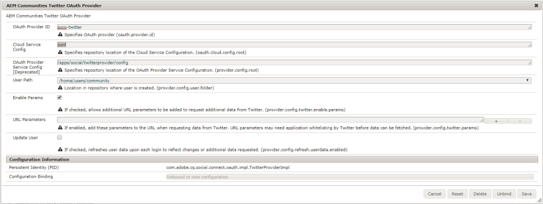

# Facebook と Twitter を使用したソーシャルログイン {#social-login-with-facebook-and-twitter}

ソーシャルログインは、サイト訪問者にFacebookやTwitterアカウントでサインインするオプションを提供する機能です。 したがって、許可されたFacebookデータやTwitterデータがAEMのメンバープロファイルに含まれます。

## ソーシャルログインの概要 {#social-login-overview}

ソーシャルログイン機能を含めるには、カスタムの Facebook アプリケーションや Twitter アプリケーションを作成する必要があります。**

We-Retailのサンプルは、サンプルのFacebook、Twitterのアプリ、クラウドサービスを提供しますが、[実稼動用Webサイト](../../help/sites-administering/production-ready.md)では利用できません。

必要な手順は以下のとおりです。

1. すべての AEM パブリッシュインスタンスで [OAuth 認証を有効](#adobe-granite-oauth-authentication-handler)にします。

   OAuthが有効になっていない場合、ログイン試行は失敗します。

1. **ソーシャルアプリとクラウドサービスを** 作成します。

   * Facebookでのログインをサポートするには：

      * [Facebookアプリ](#create-a-facebook-app)を作成します。
      * [Facebook Connectクラウドサービス](#create-a-facebook-connect-cloud-service)を作成して公開します。
   * Twitterでのログインをサポートするには：

      * [Twitterアプリ](#create-a-twitter-app)を作成します。
      * [Twitter Connectクラウドサービス](#create-a-twitter-connect-cloud-service)を作成して公開します。

1. コミュニティサイトに対して&#x200B;[**ソーシャルログインを有効**](#enable-social-login)にします。

以下に示す 2 つの基本的な概念があります。

1. **Scope** (permissions)は、アプリが要求できるデータを指定します。

   * FacebookおよびTwitter [AdobeGranite OAuth ApplicationおよびProvider ](#adobe-granite-oauth-application-and-provider)のインスタンスには、デフォルトで、その範囲内の基本的なアプリ権限が含まれます。

1. **Fields** (params)は、URLパラメーターを使用してリクエストされた実際のデータを指定します。

   * これらのフィールドは、[AEM CommunitiesFacebook OAuthプロバイダー](#aem-communities-facebook-oauth-provider)および[AEM CommunitiesTwitter OAuthプロバイダー](#aem-communities-twitter-oauth-provider)で指定されています。
   * デフォルトのフィールドはほとんどの使用事例で十分ですが、変更することができます。

## 「Facebook ログイン」{#facebook-login}を選択します。

### Facebook API バージョン {#facebook-api-version}

ソーシャルログインとWeb小売業用Facebookサンプルは、Facebook Graph APIのバージョン1.0のときに開発されました。
AEM 6.4 GA以降およびAEM 6.3 SP1ソーシャルログインが、新しいバージョンのFacebook Graph API 2.5で動作するように更新されました。

>[!NOTE]
>
>古いバージョンのAEMでは、ログ&#x200B;**Can&#39;t extract a token from this**&#x200B;に例外が発生する場合、AEMリリースの最新のCFPにアップグレードしてください。

Facebook Graph APIのバージョン情報については、[Facebook API変更ログ](https://developers.facebook.com/docs/apps/changelog)を参照してください。

### Create a Facebook App {#create-a-facebook-app}

Facebookのソーシャルログインを有効にするには、適切に設定されたFacebookアプリが必要です。

Facebookアプリを作成するには、[https://developers.facebook.com/apps/](https://developers.facebook.com/apps/)にあるFacebookの説明に従ってください。 手順に対する変更は、次の情報には反映されません。

一般的な手順（Facebook API v2.7 の時点）：

* 新しい Facebook アプリを追加します。**
   * *プラットフォーム*&#x200B;の場合は、「Webサイト」を選択します。
      * *サイトURL*&#x200B;に対して、`  https://<server>:<port>.`と入力します
      * 「*表示名*」に、Facebook接続サービスのタイトルとして使用するタイトルを入力します。
      * *カテゴリ*&#x200B;の場合は、*ページのアプリ*&#x200B;を選択することを推奨しますが、どれでもかまいません。
      * 「製品を追加」で、「Facebook ログイン」を選択します。**
      * *有効なOAuthリダイレクトURI*&#x200B;に対して、`  https://<server>:<port>.`と入力します。

>[!NOTE]
>
>開発のために、http://localhost:4503が動作します。

アプリケーションが作成されたら、**[!UICONTROL アプリID]**&#x200B;と&#x200B;**[!UICONTROL アプリシークレット]**&#x200B;の設定を探します。 この情報は、[Facebookクラウドサービス](#createafacebookcloudservice)を設定する際に必要です。

### Facebook Connect クラウドサービス {#create-a-facebook-connect-cloud-service}

クラウドサービス設定を作成することで、[Adobe Granite OAuth Application and Provider](#adobe-granite-oauth-application-and-provider) インスタンスが作成されます。このインスタンスが、Facebook アプリケーションと新しいユーザーの追加先のメンバーグループを識別します。

1. AEM オーサーインスタンスで、管理者権限でサインインします。
1. グローバルナビゲーションから、**[!UICONTROL ツール]**/**[!UICONTROL Cloud Services]**/**[!UICONTROL Facebookソーシャルログイン設定]**&#x200B;を選択します。
1. **[!UICONTROL コンテキストパス]**&#x200B;設定を選択します。

   **[!UICONTROL コンテキスト]** パスは、コミュニティサイトの作成/編集時に選択したクラウド設定パスと同じでなければなりません。

1. コンテキストパスの下にクラウドサービスを作成できる設定になっているかを確認します。
1. **[!UICONTROL ツール]** > **[!UICONTROL 一般]** > **[!UICONTROL 設定ブラウザー]**&#x200B;に移動します。 コンテキストを選択し、プロパティを編集します。 まだ有効になっていなければ、クラウド設定を有効にします。

   

   * 詳しくは、[設定ブラウザー](/help/sites-administering/configurations.md)のドキュメントを参照してください。

1. **Facebook クラウドサービス設定を作成または編集します。**

   

   * **[!UICONTROL タイトル]** (*必須*)Facebookアプリを識別する表示タイトルを入力します。Facebookアプリの&#x200B;*表示名*&#x200B;と同じ名前を使用することをお勧めします。
   * **[!UICONTROL アプリID/APIキー]** (*必須*)Facebookアプリの ***アプリ*** IDを入力します。これは、ダイアログから作成された[AdobeGranite OAuth ApplicationおよびProvider](https://helpx.adobe.com/jp/experience-manager/6-3/communities/using/social-login.html#AdobeGraniteOAuthApplicationandProvider)インスタンスを識別します。
   * **[!UICONTROL アプリの秘密]** (*必須*)Facebookアプリの ***アプリ*** 秘密鍵証明書を入力します。
   * **[!UICONTROL ユーザーを作成]**&#x200B;オンにすると、Facebook アカウントでログインしたときに AEM ユーザーエントリが作成され、選択されたユーザーグループのメンバーとして追加されます。デフォルトはオンになっています（強く推奨）。
   * **[!UICONTROL Mask User IDs]**:選択を解除したままにします。
   * **[!UICONTROL Scope Email]**:ユーザーの電子メールIDをFacebookから取得する必要があります。
   * **[!UICONTROL [ユーザグル追加ープ追加]には、[ユーザグループ]を選択し、ユーザを追加するコミュニティサイトの1つまたは複数の]** メンバ  グループを選択します。

   >[!NOTE]
   >
   >グループはいつでも追加または削除できます。しかし、既存ユーザーのメンバーシップに影響はありません。自動メンバーシップは、このフィールド更新後に作成された新規ユーザーにのみ適用されます。匿名ユーザーが無効になっているサイトの場合は、そのクローズドコミュニティサイト専用の対応するコミュニティメンバーグループにユーザーを追加します。

   * 「**[!UICONTROL 保存]**」を選択します。
   * **[!UICONTROL 公開]**.

その結果、[AdobeGranite OAuth ApplicationとProvider](https://helpx.adobe.com/experience-manager/6-3/communities/using/social-login.html#adobe-granite-oauth-application-and-provider)のインスタンスが生成されます。このインスタンスは、追加の範囲（権限）を追加しない限り、さらに変更を行う必要はありません。 デフォルトの範囲は、Facebookログインの標準権限です。 追加の範囲が必要な場合は、OSGI設定を直接編集する必要があります。 システムまたはコンソールから直接変更がおこなわれている場合は、上書きしないよう、タッチ UI からクラウドサービス設定を編集しないでください。

### AEM Communities Facebook OAuth Provider  {#aem-communities-facebook-oauth-provider}

AEM Communitiesプロバイダーは、[AdobeGranite OAuth Application and Provider](#adobe-granite-oauth-application-and-provider)インスタンスを拡張します。

以下をおこなうには、このプロバイダーを編集する必要があります。

* ユーザーの更新を許可する
* 範囲](#adobe-granite-oauth-application-and-provider)内の追加追加フィールド[

   * デフォルトで許可されているすべてのフィールドがデフォルトで含まれるわけではありません。

編集が必要な場合は、それぞれの AEM パブリッシュインスタンスで次の設定をします。

1. 管理者権限でサインインします。
1. [Webコンソール](../../help/sites-deploying/configuring-osgi.md)に移動します。例えば、http://localhost:4503/system/console/configMgrのように指定します。
1. AEM CommunitiesのFacebook OAuthプロバイダーを探します。
1. 鉛筆アイコンを選択して編集用に開きます。

   

   * **[!UICONTROL OAuthプロバイダーID]**

      （*必須*）デフォルト値は&#x200B;*soco -facebook*&#x200B;です。 編集しないでください。

   * **[!UICONTROL Cloud Service設定]**

      デフォルト値は `/etc/  cloudservices /  facebookconnect` です。編集しないでください。

   * **[!UICONTROL OAuthプロバイダーサービスの構成]**

      デフォルト値は `/apps/social/facebookprovider/config/` です。編集しないでください。

   * **[!UICONTROL タグを有効にする]**

      編集しない。

   * **[!UICONTROL User Path]**

      ユーザーデータが保存されるリポジトリ内の場所。 コミュニティサイトでは、メンバーがお互いのプロファイルを閲覧できる権限を確保するために、パスをデフォルトの */home/users/community* にする必要があります。

   * **[!UICONTROL フィールドの有効化]**

      オンにすると、その下にリストされているフィールドが、ユーザー認証およびユーザー情報を求める Facebook へのリクエストに指定されます。デフォルト値はオフです。

   * **[!UICONTROL フィールド]**

      「Enable fields」をオンにした場合は、Facebook Graph API の呼び出し時に以下のフィールドが含まれます。これらのフィールドは、クラウドサービス設定で定義された範囲内で許可されている必要があります。追加のフィールドを使用するには、Facebook の承認が必要な場合があります。Facebook ドキュメントの Facebook ログイン権限の節を参照してください。パラメーターとして追加されるデフォルトのフィールドは次のとおりです。

      * id
      * name
      * first_name
      * last_name
      * link
      * locale
      * picture
      * timezone
      * updated_time
      * verified
      * email

   いずれかのフィールドを追加または変更した場合は、対応する Default Sync ハンドラー設定を更新してマッピングを修正してください。

   * **[!UICONTROL ユーザーの更新]**

      オンにすると、ログインするたびにリポジトリ内のユーザーデータが更新され、プロファイルの変更やリクエストされた追加データが反映されます。デフォルト値はオフです。

#### 次の手順 {#next-steps}

続いて以下の手順をおこないますが、この手順は Facebook でも Twitter でも共通です。

* [クラウドサービス設定の公開](#publishcloudservices)
* [コミュニティサイトで有効にする](#enable-social-login)

## Twitter ログイン {#twitter-login}

### Create a Twitter App {#create-a-twitter-app}

Twitter ソーシャルログインを有効にするには、設定された Twitter アプリが必要です。

最新の手順に従って、[https://apps.twitter.com](https://apps.twitter.com/)に新しいTwitterアプリを作成します。

一般的な手順は次のとおりです。

1. Webサイトのユーザーに対してTwitterアプリを識別する&#x200B;*名前*&#x200B;を入力します。
1. 「*説明*」を入力します。
1. *webサイト*&#x200B;の場合 — `https://<server>`と入力します。
1. *コールバックURL*&#x200B;の場合 — `https://server`と入力します。

   >[!NOTE]
   >
   >ポートを指定する必要はありません。
   >
   >開発のために、https://127.0.0.1/が動作します。

1. アプリケーションが作成されたら、**[!UICONTROL コンシューマー(API)キー]**&#x200B;と&#x200B;**[!UICONTROL コンシューマー(API)シークレット]**&#x200B;を探します。 この情報は、[Twitterクラウドサービス](#createatwittercloudservice)の設定に必要です。

#### 権限 {#permissions}

Twitter アプリケーション管理の権限のセクションで、次の設定をします。

* **[!UICONTROL アクセス]**:を選択し `Read only`ます。

   * その他のオプションはサポートされません。

* **[!UICONTROL 追加の権限]**:必要に応じて、を選択 `Request email addresses from users`します。

   * 選択しなかった場合は、ユーザーの AEM のプロファイルに電子メールアドレスが含まれなくなります。
   * Twitter の説明に、追加でおこなう手順が示されています。

ソーシャルログインに対して行われるREST要求は、*[GETアカウント/verify credentials](https://dev.twitter.com/rest/reference/get/account/verify_credentials)*&#x200B;に対してのみです。

### Twitter Connect クラウドサービスの作成 {#create-a-twitter-connect-cloud-service}

クラウドサービス設定を作成することで、[Adobe Granite OAuth Application and Provider](#adobe-granite-oauth-application-and-provider) インスタンスが作成されます。このインスタンスが、Twitter アプリケーションと新しいユーザーの追加先のメンバーグループを識別します。

1. オーサーインスタンスで、管理者権限でサインインします。
1. グローバルナビゲーションから、**[!UICONTROL ツール]**/**[!UICONTROL Cloud Services]**/**[!UICONTROL Twitterのソーシャルログイン設定]**&#x200B;を選択します。
1. **[!UICONTROL コンテキストパス]**&#x200B;の構成を選択します。

   コンテキストパスは、コミュニティサイトの作成または編集時に選択したクラウド設定パスと同じでなければなりません。

1. コンテキストパスの下にクラウドサービスを作成できる設定になっているかを確認します。
1. **[!UICONTROL ツール]** > **[!UICONTROL 一般]** > **[!UICONTROL 設定ブラウザー]**&#x200B;に移動します。 コンテキストを選択し、プロパティを編集します。 まだ有効になっていなければ、クラウド設定を有効にします。

   

   * 詳しくは、[設定ブラウザー](/help/sites-administering/configurations.md)のドキュメントを参照してください。

1. Twitter クラウドサービス設定を作成または編集します。

   

   * **[!UICONTROL タイトル]**

      （*必須*）Twitterアプリを識別する表示タイトルを入力します。 Twitterアプリの&#x200B;*表示名*&#x200B;と同じ名前を使用することをお勧めします。

   * **[!UICONTROL 消費者キー]**

      （*必須*）Twitterアプリの&#x200B;**コンシューマー(API)キー**&#x200B;を入力します。 これは、ダイアログから作成された[AdobeGranite OAuth ApplicationおよびProvider](https://helpx.adobe.com/experience-manager/6-3/communities/using/social-login.html#AdobeGraniteOAuthApplicationandProvider)インスタンスを識別します。

   * **[!UICONTROL 消費者の秘密鍵]**

      （*必須*）Twitterアプリの&#x200B;***コンシューマー(API)シークレット***&#x200B;を入力します。

   * **[!UICONTROL ユーザーを作成]**

      オンにした場合、Twitterアカウントでログインすると、AEMユーザーエントリが作成され、選択したユーザーグループにメンバーとして追加されます。 デフォルトはオンになっています（強く推奨）。

   * **[!UICONTROL ユーザー ID をマスク]**

      選択を解除したままにします。

   * **[!UICONTROL ユーザーグループに追加]**

      「追加ユーザーグループ」を選択して、ユーザーを追加するコミュニティサイト用に1つ以上の[メンバーグループ](https://helpx.adobe.com/experience-manager/6-3/communities/using/users.html)を選択します。
   >[!NOTE]
   >
   >グループはいつでも追加または削除できます。ただし、既存のユーザーのメンバーシップは影響を受けません。 自動メンバーシップは、このフィールド更新後に作成された新規ユーザーにのみ適用されます。匿名ユーザーが無効になっているサイトの場合は、その非公開のコミュニティサイト用の、対応するコミュニティメンバーグループにユーザーを追加します。

1. 「**[!UICONTROL 保存]**」と「**[!UICONTROL 発行]**」を選択します。

結果は、[AdobeGranite OAuth ApplicationおよびProvider](https://helpx.adobe.com/experience-manager/6-3/communities/using/social-login.html#adobe-granite-oauth-application-and-provider)のインスタンスが返され、これ以上の変更は必要ありません。 デフォルトの範囲には、Twitter にログインするための標準的な権限が含まれています。

### AEM Communities Twitter OAuth Provider  {#aem-communities-twitter-oauth-provider}

AEM Communitiesの構成は、[AdobeGranite OAuth Application and Provider](#adobe-granite-oauth-application-and-provider)インスタンスを拡張します。 ユーザー更新を許可するには、このプロバイダーを編集する必要があります。

編集が必要な場合は、それぞれの AEM パブリッシュインスタンスで次の設定をします。

1. 管理者権限でサインインします。
1. [Webコンソール](../../help/sites-deploying/configuring-osgi.md)に移動します。

   例：http://localhost:4503/system/console/configMgr

1. AEM CommunitiesのTwitter OAuthプロバイダーを見つけます。
1. 鉛筆アイコンを選択して編集用に開きます。

   

   * **[!UICONTROL OAuthプロバイダーID]**

   （*必須*）デフォルト値は&#x200B;*soco -twitter*&#x200B;です。 編集しないでください。

   * **[!UICONTROL Cloud Service設定]**

      デフォルト値は&#x200B;*confです。*&#x200B;編集しないでください。

   * **[!UICONTROL OAuthプロバイダーサービスの構成]**

      デフォルト値は `/apps/social/twitterprovider/config/` です。編集しないでください。

   * **[!UICONTROL User Path]**

      ユーザーデータが保存されるリポジトリ内の場所。 コミュニティサイトでは、メンバーが互いのプロファイルを表示する権限を確保するために、パスをデフォルト`/home/users/community`にする必要があります。

   * **[!UICONTROL Enable]** Paramsdo not edit
   * **[!UICONTROL URL]** パラメータが編集されません
   * **[!UICONTROL ユーザーの更新]**

      オンにすると、ログインするたびにリポジトリ内のユーザーデータが更新され、プロファイルの変更やリクエストされた追加データが反映されます。デフォルト値はオフです。

#### 次の手順 {#next-steps-1}

続いて以下の手順をおこないますが、この手順は Facebook でも Twitter でも共通です。

* [クラウドサービス設定の公開](#publishcloudservices)
* [コミュニティサイトで有効にする](#enable-social-login)

## ソーシャルログインの有効化 {#enable-social-login}

### AEM Communities サイトコンソール {#aem-communities-sites-console}

クラウドサービスを設定すると、コミュニティサイト[作成](https://helpx.adobe.com/jp/experience-manager/6-3/communities/using/sites-console.html#SiteCreation)または[管理](https://helpx.adobe.com/jp/experience-manager/6-3/communities/using/sites-console.html#ModifyingSiteProperties)の間に、[ユーザー管理](https://helpx.adobe.com/jp/experience-manager/6-3/communities/using/sites-console.html#USERMANAGEMENT)設定サブパネルを使用して、コミュニティサイトの関連するソーシャルログイン設定で有効にできます。

1. ソーシャルログイン設定を保存したサイト設定コンテキストを選択します。

1. 「一般」タブで、クラウド設定をおこないます。

   

1. 「設定」タブで、「**[!UICONTROL ソーシャルログイン]**」を有効にして「保存」を選択します。

   

## ソーシャルログインのテスト {#test-social-login}

* [AdobeGranite OAuth Authentication Handler](#adobe-granite-oauth-authentication-handler)がすべての発行インスタンスで有効になっていることを確認します。
* クラウドサービスが公開済みであることを確認します。
* コミュニティサイトが公開済みであることを確認します。
* ブラウザーで公開済みサイトを起動します。
例：http://localhost:4503/content/sites/engage/en.html
* 「**[!UICONTROL ログイン]**」を選択します。
* 「**[!UICONTROL Facebookでサインイン]**」または「**[!UICONTROL Twitterでサインイン]**」を選択します。
* FacebookまたはTwitterにまだログインしていない場合は、適切な資格情報を使用してログインします。
* FacebookアプリまたはTwitterアプリで表示されるダイアログに応じて権限を付与する必要がある場合があります。
* ページ上部のツールバーが更新され、ログインが成功したことを反映しています。
* **[!UICONTROL プロファイル]**&#x200B;を選択：プロファイルページには、ユーザーのアバター画像、名、姓が表示されます。 また、許可されたfields/paramsに従って、FacebookまたはTwitterプロファイルーからの情報も表示されます。

## AEM プラットフォーム OAuth 設定 {#aem-platform-oauth-configurations}

### Adobe Granite OAuth Authentication Handler {#adobe-granite-oauth-authentication-handler}

`Adobe Granite OAuth Authentication Handler`はデフォルトでは有効になっておらず、すべてのAEM発行インスタンスで&#x200B;***を有効にする必要があります。***

パブリッシュインスタンスで認証ハンドラーを有効にするには、以下のように OSGi 設定を開いて保存するだけです。

* 管理者権限でサインインします。
* [Webコンソール](../../help/sites-deploying/configuring-osgi.md)に移動します。
例：http://localhost:4503/system/console/configMgr
* `Adobe Granite OAuth Authentication Handler`を探します。
* 設定を編集用に開く場合に選択します。
* 「**[!UICONTROL 保存]**」を選択します。

>[!CAUTION]
>
>認証ハンドラーと、*AdobeGranite OAuth Application and Provider*&#x200B;のFacebookまたはTwitterのインスタンスとを混同しないように注意してください。

### Adobe Granite OAuth Application and Provider {#adobe-granite-oauth-application-and-provider}

FacebookまたはTwitterのクラウドサービスが作成されると、`Adobe Granite OAuth Authentication Handler`のインスタンスが作成されます。

Facebook または Twitter アプリ用に作成されたインスタンスを見つけるには、以下のようにします。

1. 管理者権限でサインインします。
1. [Webコンソール](../../help/sites-deploying/configuring-osgi.md)に移動します。

   例：http://localhost:4503/system/console/configMgr

1. AdobeGranite OAuth Application and Providerを探します。

   * **[!UICONTROL クライアントID]**&#x200B;が&#x200B;**[!UICONTROL アプリID]**&#x200B;と一致するインスタンスを探します。

      

      次のプロパティを除き、configの他のプロパティは変更しないでください。

   * **[!UICONTROL Config ID]**

      （*必須*） OAuth構成IDは一意である必要があります。 クラウドサービスの作成時に自動生成。

   * **[!UICONTROL クライアント ID]**

      （*必須*）クラウドサービスの作成時に指定されたアプリケーション ID。

   * **[!UICONTROL クライアントの秘密鍵]**

      （*必須*）クラウドサービスの作成時に指定されたアプリケーション秘密鍵。

   * **[!UICONTROL 対象範囲]**

      （*オプション*）プロバイダーから許可される範囲を追加します。 デフォルトで、ソーシャル認証とプロファイルデータの提供に必要な権限が範囲に含まれています。

   * **[!UICONTROL プロバイダーID]**

      （*必須*）クラウドサービスの作成時に、AEM CommunitiesのプロバイダーIDが設定されます。 編集しないでください。Facebook Connectの場合、値は&#x200B;*soco -facebook*&#x200B;です。 Twitter Connectの場合、値は&#x200B;*soco -twitter*&#x200B;です。

   * **[!UICONTROL グループ]**

      （*推奨*）ユーザーを作成した1つ以上のメンバーグループが追加されます。 AEM Communitiesの場合は、コミュニティサイトのメンバーグループをリストすることをお勧めします。

   * **[!UICONTROL コールバック URL]**

      （*オプションの*） OAuthプロバイダーがクライアントをリダイレクトして戻すように構成したURL。 元のリクエストのホストを使用するには、相対 URL を使用します。最初にリクエストされた URL を代わりに使用するには、空のままにします。この  URL .
   >[!NOTE]
   >
   >コールバック用のドメインは、プロバイダー（FacebookまたはTwitter）に登録する必要があります。

OAuth認証ハンドラーの設定ごとに、このインスタンスに2つの追加の設定が作成されます。

* Apache Jackrabbit Oakデフォルト同期ハンドラ(org.apache.jackrabbit.oak.spi.security.authentication.external.impl.DefaultSyncHandler) — 編集は必要ありませんが、FacebookフィールドがCQユーザープロファイルノードにマッピングされる方法を確認できます。 また、&#39;Sync Handler Name&#39;は、OAuthプロバイダー設定のConfig Idと一致します。
* Apache Jackrabbit Oak外部ログインモジュール(org.apache.jackrabbit.oak.spi.security.authentication.external.impl.ExternalLoginModuleFactory)：編集は必要ありませんが、「IDプロバイダー名」と「同期ハンドラー名」は、それぞれ対応するOAuthと同期ハンドラーの設定を指しています。

詳しくは、「[Apache Oak外部ログインモジュールでの認証](https://jackrabbit.apache.org/oak/docs/security/authentication/externalloginmodule.html)」を参照してください。

## OAuth ユーザーのトラバーサルパフォーマンス {#oauth-user-traversal-performance}

数十万人ものユーザーがFacebookやTwitterのログインを使用して登録したコミュニティサイトでは、サイト訪問者がソーシャルログインを使用する際に行うクエリのトラバーサルパフォーマンスを、以下のOakインデックスを追加することで改善できます。

ログにトラバーサル警告が記録されている場合は、このインデックスを追加することを推奨します。

オーサーインスタンスで、管理者権限でサインインします。

1. グローバルナビゲーションから：**ツール、[CRX/DE Lite](../../help/sites-developing/developing-with-crxde-lite.md)を選択します。**
1. ntBaseLuceneのコピーからntBaseLucene-oauthという名前のインデックスを作成します。

   * ノード`/oak:index`の下
   * ノードを選択`ntBaseLucene`
   * **[!UICONTROL コピー]**&#x200B;を選択
   *  `/oak:index`
   * **[!UICONTROL 貼り付け]**&#x200B;を選択
   * ntBaseLuceneのコピーの名前を`ntBaseLucene-oauth`に変更

1. ノードntBaseLucene-oauthのプロパティの変更：

   * **[!UICONTROL indexPath]**:  `/oak:index/ntBaseLucene-oauth`
   * **[!UICONTROL name]**: `oauthid-123****`
   * **[!UICONTROL reindex]**:  `true`
   * **[!UICONTROL reindexCount]**：`1`

1. ノード/oak:index/ntBaseLucene-oauth/indexRules/nt:base/propertiesの下：

   * cqTagsを除くすべての子ノードを削除します。
   * cqTagsの名前を`oauthid-123****`に変更します
   * ノード`oauthid-123****`のプロパティを変更します

      * **[!UICONTROL name]**:  `oauthid-123****`
   * 「**[!UICONTROL すべて保存]**」を選択します。

* **name** `oauthid-123`の場合、*123*&#x200B;をFacebook ***App ID***&#x200B;またはTwitter ***Consumer (API) Key***&#x200B;に置き換えます。これは&#x200B;**ClientID&lt;a10>は、[AdobeGranite OAuth Application and Provider](social-login.md#adobe-granite-oauth-application-and-provider)構成内にあります。**

   

追加の情報とツールについては、[Oakクエリとインデックス作成](../../help/sites-deploying/queries-and-indexing.md)を参照してください。

## Dispatcher 設定 {#dispatcher-configuration}

[コミュニティのための Dispatcher の設定](dispatcher.md)を参照してください。
