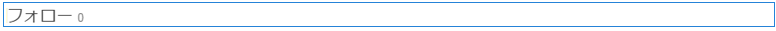

# ソーシャルグラフの使用 {#using-social-graph}

## 概要 {#introduction}

The ability for a community member to follow [activities](activities.md) as well as be followed is established through two components: `Follow` and `Following`.

The `Follow` component must be associated with another resource, and this association is already established for community members and features.

The `Following` component simply lists the members that are either following the current member or are being followed by the current member. This social graph of the relationships between members is included in the user profile established for a [community site](overview.md#communitiessites).

## フォロー中コンポーネントをページに追加 {#adding-following-to-a-page}

作成者モードでページにコンポー `Following` ネントを追加する場合は、コンポーネントを見つけ `Communities / Following` て、ソーシャルグラフを表示するページ上の位置にドラッグします。

For necessary information, visit [Communities Components Basics](basics.md).

[必要なクライアント側ライブラリが含まれる場合](essentials-socialgraph.md#essentials-for-client-side) 、次のようにコンポー `Following` ネントが表示されます。

## フォロー中コンポーネントの設定 {#configuring-following}

Currently, it is necessary to set the property to determine whether the component displays the `follows` relationship, or the `following` relationship.

## 追加情報 {#additional-information}

詳しくは、開発者向けの[ソーシャルグラフの重要事項](essentials-socialgraph.md)ページを参照してください。
