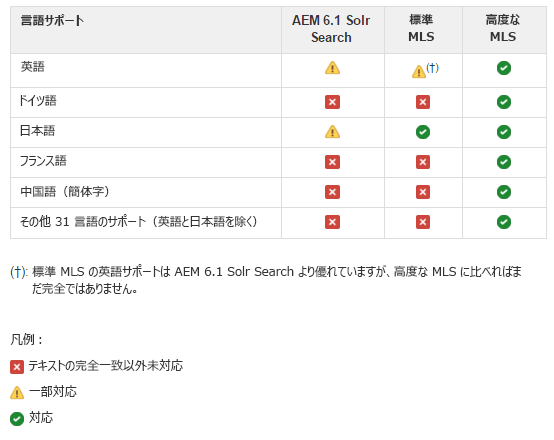

# SRP 用の Solr 設定  {#solr-configuration-for-srp}

## AEM プラットフォーム用の Solr {#solr-for-aem-platform}

別々のコレクションを使用することで、1 つの [Apache Solr](https://lucene.apache.org/solr/) を[ノードストア](../../help/sites-deploying/data-store-config.md)（Oak）と[共通ストア](working-with-srp.md)（SRP）の間で共有できます。

Oak と SRP のコレクションがどちらも高頻度で使用される場合は、パフォーマンス上の理由から 2 つ目の Solr をインストールすることもできます。

実稼動環境では、[SolrCloudモード](#solrcloud-mode)を使用すると、スタンドアロンモード（単一のローカルSolr設定）よりもパフォーマンスが向上します。

### 要件 {#requirements}

Apache Solr のダウンロードとインストール：

* [バージョン 7.0](https://archive.apache.org/dist/lucene/solr/7.0.0/)

* Solr には Java 1.7 以降が必要です。
* サービスは不要
* 実行モードの選択：

   * スタンドアロンモード
   * [SolrCloud モード](#solrcloud-mode)（実稼動環境で推奨）

* 多言語検索(MLS)の選択

   * [標準の MLS のインストール](#installing-standard-mls)
   * [高度な MLS のインストール](#installing-advanced-mls)

## SolrCloud モード {#solrcloud-mode}

[](https://cwiki.apache.org/confluence/display/solr/SolrCloud) 実稼動環境ではSolrCloudmodeを使用することをお勧めします。SolrCloudモードで実行する場合は、多言語検索(MLS)をインストールする前に、SolrCloudをインストールして設定する必要があります。

SolrCloud の手順に従い、以下をインストールすることを推奨します。

* 同じサーバー上の 3 つの SolrCloud ノード.
* 外部のApache ZooKeeper。

また、メモリ使用量とガベージコレクションを調整するために、JVM を設定することを推奨します。

### JVM の設定例  {#jvm-configuration-example}

```shell
JVM_OPTS="-server -Xmx2048m -XX:MaxPermSize=768M -XX:+UseConcMarkSweepGC -XX:+CMSClassUnloadingEnabled -Xloggc:../logs/gc.log -XX:+PrintGCDetails -XX:+PrintGCDateStamps -Djava.awt.headless=true"
```

### SolrCloud セットアップコマンド {#solrcloud-setup-commands}

SolrCloud モードで実行する場合は、MLS をインストールする前に、以下の SolrCloud セットアップコマンドを理解して使用する必要があります。

#### 1. 設定を ZooKeeper にアップロード  {#upload-a-configuration-to-zookeeper}

リファレンス：
[https://cwiki.apache.org/confluence/display/solr/Command+Line+Utilities](https://cwiki.apache.org/confluence/display/solr/Command+Line+Utilities)

用途：
sh./scripts/cloud-scripts/zkcli.sh \
-cmd upconfig \
-zkhost *server:port* \
-confname *myconfig-name *\
-solrhome *solr-home-path* \
-confdir *config-dir*

#### 2. コレクションを作成 {#create-a-collection}

リファレンス：
[https://cwiki.apache.org/confluence/display/solr/Solr+Start+Script+Reference#SolrStartScriptReference-Create](https://cwiki.apache.org/confluence/display/solr/Solr+Start+Script+Reference#SolrStartScriptReference-Create)

使用方法:
./bin/solr create \
-c *mycollection-name*\
-d *config-dir* \
-n *myconfig-name* \
-p *port*\
-s *シャード数* \
-rf *レプリカ数*

#### 3. コレクションを設定セットにリンク {#link-a-collection-to-a-configuration-set}

コレクションを ZooKeeper にアップロードした設定にリンクします。

リファレンス：
[https://cwiki.apache.org/confluence/display/solr/Command+Line+Utilities](https://cwiki.apache.org/confluence/display/solr/Command+Line+Utilities)

用途：
sh./scripts/cloud-scripts/zkcli.sh \
-cmd linkconfig \
-zkhost *server:port* \
-collection *mycollection-name* \
-confname *myconfig-name*

### 標準の MLS と高度な MLS の比較 {#comparison-of-standard-and-advanced-mls}

AEM Communities の多言語検索（MLS）は、英語を含め、サポートされるすべての言語にまたがる検索の質を向上させる目的で、Solr プラットフォーム用に構築された機能です。

AEM Communities の MLS は、標準の MLS と高度な MLS のどちらかを利用できます。標準の MLS には Solr 設定だけが含まれ、プラグインやリソースファイルは含まれていません。高度な MLS は、より包括的なソリューションであり、Solr 設定に加えてプラグインと関連リソースを含んでいます。

標準の MLS には、以下の言語のコンテンツ検索の機能強化が含まれています。

* 英語：単語の派生を一致させるためのステマーを改善しました。
* 日本語：半角文字の日本語のトークン化を改善しました。

高度な MLS には、下の言語のコンテンツ検索の機能強化が含まれています。

* 英語：ステマーをレマチザーで置き換えました。
* ドイツ語：decompounderを追加しました。
* フランス語：配信処理を追加しました。
* 中国語（簡体）:よりスマートなトークン化機能を追加しました。
* 様々な言語：ステマー、ストップワードリスト、およびノーマライザーを追加しました。

高度な MLS では、合計で以下の 33 の言語がサポートされます。

| アラビア語 | ドイツ語 | ノルウェー語 |
|---|---|---|
| ブルガリア語 | ギリシャ語 | ポーランド語 |
| 簡体字中国語 | ハイチ語 | ポルトガル語 |
| 中国語 (繁体) | ヘブライ語 | ルーマニア語 |
| チェコ語 | ハンガリー語 | ロシア語 |
| デンマーク語 | インドネシア語 | スロバキア語 |
| オランダ語 | イタリア語 | スロベニア語 |
| 英語 | 日本語 | スペイン語 |
| エストニア語 | 韓国語 | スウェーデン語 |
| フィンランド語 | ラトビア語 | タイ語 |
| フランス語 | リトアニア語 | トルコ語 |

#### AEM 6.1 Solr 検索、標準の MLS、高度な MLS の比較  {#comparison-of-aem-solr-search-standard-mls-and-advanced-mls}

**注意**:AEM 6.1は、AEM 6.1 Communities FP3以前を表します。



### 標準の MLS のインストール {#installing-standard-mls}

標準の多言語検索（MLS）をサポートするには、SRP コレクション（MSRP または DSRP）について、以下の 2 つの Solr の設定ファイルを変更する必要があります。

* **schema.xml**
* **solrconfig.xml**

Solr 4.10用の標準のMLSファイル(schema.xml、solrconfig.xml)。

Solr 5.x用の標準のMLSファイル(schema.xml、solrconfig.xml)

標準の MLS ファイルは AEM リポジトリに格納されます。

**注意**：Solr ファイルは msrp/ フォルダーに格納されていますが、DSRP にも対応します（変更不要）。

**ダウンロード手順**:必要に応 `solrX` じて、ま `solr4` たはで `solr5` 置き換えます。

1. CRXDE|Liteを使用して、次の場所を特定します。

   * `/libs/social/config/datastore/msrp/solrX/schema.xml`
   * `/libs/social/config/datastore/msrp/solrX/solrconfig.xml`

1. Solrがデプロイされているローカルサーバーにダウンロードします。

   * `jcr:content`ノードの`jcr:data`プロパティを見つけます。
   * `view`を選択してダウンロードを開始します。
   * ファイルが適切な名前とエンコーディング(UTF8)で保存されていることを確認します。

1. スタンドアロンモードまたはSolrCloudモードのインストール手順に従います。

#### SolrCloud モード - 標準の MLS {#solrcloud-mode-standard-mls}

1. SolrをSolrCloudモードでインストールして設定します。
1. 以下の手順で新しい設定を用意します。

   1. `solr-install-dir*/myconfig/`のようなnew-config-dir*を作成します。

   1. 既存のSolr設定ディレクトリの内容を&#x200B;*new-config-dir*&#x200B;にコピーします。

      * Solr4の場合：コピー`solr-install-dir/example/solr/collection1/conf/`
      * Solr5の場合：コピー`solr-install-dir/server/solr/configsets/data_driven_schema_configs/`
   1. ダウンロードした&#x200B;**schema.xml**&#x200B;と&#x200B;**solrconfig.xml**&#x200B;を&#x200B;*new-config-dir*&#x200B;にコピーして、既存のファイルを上書きします。


1. [新しい設定をZooKeeperにア](#upload-a-configuration-to-zookeeper) ップロードします。
1. シャードの数、レプリカ数および設定名など、必要なパラメーターを設定して[コレクションを作成](#create-a-collection)します。
1. コレクションの作成中に設定名が提供されなかった場合は、[新しく作成したコレクション](#link-a-collection-to-a-configuration-set)をZooKeeperにアップロードした設定とリンクします。

1. MSRPの場合は、[MSRPインデックス再作成ツール](msrp.md#msrp-reindex-tool)を実行します（新しいインストールでない場合）。

#### スタンドアロンモード - 標準の MLS {#standalone-mode-standard-mls}

1. スタンドアロンモードでSolrをインストールします。
1. Solr5 を実行している場合、以下のコマンドで collection1 を作成します（Solr4 と同様）。

   * `./bin/solr start`
   * `./bin/solr create_core -c collection1 -d sample_techproducts_configs`

1. 例えば以下の Solr 設定ディレクトリに **schema.xml** と **solrconfig.xml** にバックアップします。

   * Solr4の場合：`solr-install-dir/example/solr/collection1/conf/`
   * Solr5用に作成：`solr-install-dir/server/solr/collection1/conf/`

1. ダウンロードした&#x200B;**schema.xml**&#x200B;と&#x200B;**solrconfig.xml**&#x200B;を同じディレクトリにコピーします。

1. Solrを再起動します。
1. MSRPの場合は、[MSRPインデックス再作成ツール](#msrpreindextool)を実行します（新しいインストールでない場合）。

### 高度な MLS のインストール {#installing-advanced-mls}

高度な MLS をサポートするための SRP コレクション（MSRP または DSRP）については、カスタムスキーマと Solr 設定に加え、新しい Solr プラグインが必要です。必要な項目はすべて、ダウンロード可能なzipファイルにパッケージ化されます。 また、Solrがスタンドアロンモードでデプロイされる場合に使用するインストールスクリプトも含まれています。

高度なMLSパッケージを入手するには、ドキュメントのデプロイセクションの[AEM Advanced MLS](deploy-communities.md#aem-advanced-mls)を参照してください。

SolrCloud モードまたはスタンドアロンモードのどちらかのインストールを開始するには：

* AEM-SOLR-MLS zipアーカイブをSolrをホストするサーバーにダウンロードします。
* アーカイブを解凍します。

#### SolrCloud モード - 高度な MLS {#solrcloud-mode-advanced-mls}

インストール手順 - 以下のとおり、Solr4 と Solr5 で少し違いがある点に注意してください。

1. SolrをSolrCloudモードでインストールして設定します。
1. 高度な MLS パッケージの内容をディスクに抽出します。内容は次のとおりです。

   * **schema.xml**
   * **solrconfig.xml**
   * **stopwords/**&#x200B;フォルダー
   * **profiles/**&#x200B;フォルダー
   * **extra-libs/** フォルダー

1. 以下の手順で新しい設定を用意します。

   1. *new-config-dir*&#x200B;を作成します。

      * 例： `solr-install-dir/myconfig/`
      * サブフォルダー`stopwords/`と`lang/`を作成します。
   1. 既存のSolr設定ディレクトリの内容を&#x200B;*new-config-dir*&#x200B;にコピーします。

      * Solr4の場合：コピー`solr-install-dir/example/solr/collection1/conf/`
      * Solr5の場合：コピー`solr-install-dir/server/solr/configsets/data_driven_schema_configs/`
   1. 抽出した&#x200B;**schema.xml**&#x200B;と&#x200B;**solrconfig.xml**&#x200B;を&#x200B;*new-config-dir*&#x200B;にコピーして、既存のファイルを上書きします。
   1. Solr5の場合：`solr_install_dir/server/solr/configsets/sample_techproducts_configs/conf/lang/*.txt`を`new-config-dir/lang/`にコピーします
   1. 抽出した&#x200B;**stopwords/**&#x200B;フォルダーを&#x200B;*new-config-dir*&#x200B;にコピーし、`new-config-dir/stopwords/*.txt`にします。


1. [新しい設定をZooKeeperにア](#upload-a-configuration-to-zookeeper) ップロードします。
1. 以下のとおり、新しい **profiles/** フォルダーをコピーします。

   * Solr4の場合：各ノードのresources/フォルダーにコピーします。
   * Solr5の場合：各Solrインストールのserver/resources/フォルダーにをコピーします。 すべてのノードが同じSolrインストールディレクトリにある場合、この手順は1回だけ実行されます。

1. SolrCloudの各ノードのsolr-homeディレクトリ（solr.xmlを含む）に&#x200B;**lib/**&#x200B;フォルダーを作成します。 以下の場所から各ノードの新しいlib/フォルダーにjarをコピーします。

   * 高度な MLS のパッケージから抽出した **extra-libs/**
   * *solr-install-dir/contrib/extraction/lib/*.jar
   * *solr-install-dir/dist/solr-cell*.jar
   * *solr-install-dir/contrib/clustering/lib/*.jar
   * *solr-install-dir/dist/solr-clustering*.jar
   * *solr-install-dir/contrib/langid/lib/*.jar
   * *solr-install-dir/dist/solr-langid*.jar
   * *solr-install-dir/contrib/velocity/lib/*.jar
   * *solr-install-dir/dist/solr-velocity*.jar
   * *solr-install-dir/contrib/analysis-extras/lib/*.jar
   * *solr-install-dir/contrib/analysis-extras/lucene-libs/*.jar

1. シャードの数、レプリカ数および設定名など、必要なパラメーターを設定して[コレクションを作成](#create-a-collection)します。
1. 設定の名前をコレクション作成中に指定しなかった&#x200B;**&#x200B;場合は、ZooKeeper にアップロードした設定に[新しく作成したこのコレクションをリンク](#link-a-collection-to-a-configuration-set)します。。

1. MSRPの場合は、[MSRPインデックス再作成ツール](#msrpreindextool)を実行します（新しいインストールでない場合）。

#### スタンドアロンモード - 高度な MLS {#standalone-mode-advanced-mls}

高度な MLS のパッケージには、インストールスクリプトが同梱されています。

スタンドアロンの Solr サーバーをホストしているサーバーにパッケージの内容を抽出したら、必要なリソースと設定ファイルをインストールするために、インストールスクリプトを実行します。

* スタンドアロンモードの Solr をインストールします。。
* Solr5 を実行している場合、以下のコマンドで collection1 を作成します（Solr4 と同様）。

   * `./bin/solr start`
   * `./bin/solr create_core -c collection1 -d sample_techproducts_configs`

* インストールスクリプトを実行します。[-v 4|5] [-d solrhome] [-c collectionpath]をインストールします。
ここで、

   * -d solhome

      Solrインストールディレクトリ

   * -c collectionpath

      Solr内のコレクションパス

   * --help

      印刷コマンドラインオプション

   * -v [4|5]

      solrのバージョンを設定

* Solr 4.10.4 の場合の例：

   * Install.bat -v 4 -d c:/solr-4.10.4 -c c:/solr-4.10.4/example/solr/collection1

* Solr 5.4.0 の場合の例：

   * Install.sh -v 5 -d /tmp/solr-5.4.0 -c /tmp/solr-5.4.0/server/solr/collection1

**注意**：

* インストールスクリプトは、新しいバージョンをインストールする前に、「.orig」を追加してschema.xmlとsolrconfig.xmlをバックアップします。

### solrconfig.xml について {#about-solrconfig-xml}

**solrconfig.xml** は、自動コミットの間隔と検索表示を制御するファイルであり、テストと調整が必要です。

`<autoCommit>`:デフォルトでは、AutoCommit間隔は、安定したストレージに対するハードコミットで、15秒に設定されています。検索の表示は、デフォルトでコミット前のインデックスを使用します。

コミットによる変更を反映するように更新されたインデックスを使用するように検索を変更するには、含まれる`openSearcher`をtrueに変更します。

`autoSoftCommit`:「ソフト」コミットでは、変更が表示（インデックスが更新）されますが、変更が安定したストレージ（ハードコミット）に同期されることは保証されません。その結果、パフォーマンスが向上します。 デフォルトでは、`autoSoftCommit`は無効で、含まれる`maxTime`は —1に設定されています。
