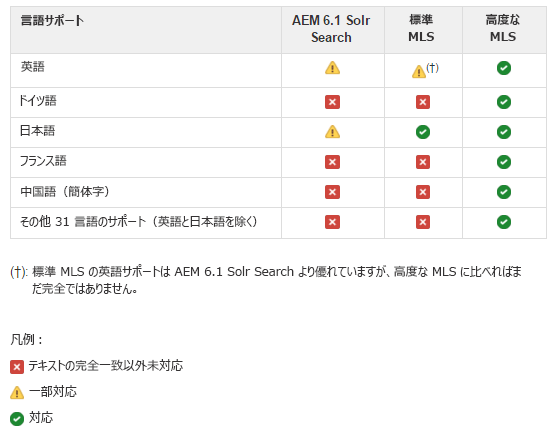

# SRP 用の Solr 設定 {#solr-configuration-for-srp}

## AEM Platform用Solr {#solr-for-aem-platform}

[Apache Solr](https://solr.apache.org/)のインストールは、異なるコレクションを使用して、[node store](../../help/sites-deploying/data-store-config.md) （Oak）と[common store](working-with-srp.md) （SRP）の間で共有できます。

Oak コレクションとSRP コレクションの両方を集中的に使用する場合は、パフォーマンス上の理由から2番目のSolrをインストールできます。

実稼動環境の場合、[SolrCloud モード ](#solrcloud-mode)では、スタンドアロンモード（単一のローカル Solr セットアップ）よりもパフォーマンスが向上します。

### 要件 {#requirements}

Apache Solrをダウンロードしてインストールします。

* [バージョン 7.0](https://archive.apache.org/dist/lucene/solr/7.0.0/)

* SolrにはJava™ 1.7以降が必要です
* サービスは必要ありません
* 実行モードの選択：

   * スタンドアロンモード
   * [SolrCloud モード ](#solrcloud-mode) （実稼動環境に推奨）

* 多言語検索（MLS）の選択

   * [標準MLSのインストール](#installing-standard-mls)
   * [高度なMLSのインストール](#installing-advanced-mls)

## SolrCloud モード {#solrcloud-mode}

実稼動環境には、[SolrCloud](https://solr.apache.org/guide/6_6/solrcloud.html) モードをお勧めします。 SolrCloud モードで実行する場合は、多言語検索（MLS）をインストールする前に、SolrCloudをインストールして設定する必要があります。

インストールする場合は、SolrCloudの手順に従うことをお勧めします。

* 同じサーバー上の3つのSolrCloud ノード。
* 外部Apache ZooKeeper。

また、メモリ使用量とガベージコレクションを調整するようにJVMを設定することをお勧めします。

### JVMの設定例 {#jvm-configuration-example}

```shell
JVM_OPTS="-server -Xmx2048m -XX:+UseConcMarkSweepGC -XX:+CMSClassUnloadingEnabled -Xloggc:../logs/gc.log -XX:+PrintGCDetails -XX:+PrintGCDateStamps -Djava.awt.headless=true"
```

### SolrCloud セットアップ コマンド {#solrcloud-setup-commands}

SolrCloud モードで実行する場合、MLSのインストールの前に、次のSolrCloud セットアップ コマンドの使用と知識が必要です。

#### &#x200B;1. ZooKeeperへの設定のアップロード {#upload-a-configuration-to-zookeeper}

リファレンス：
[https://solr.apache.org/guide/6_6/command-line-utilities.html](https://solr.apache.org/guide/6_6/command-line-utilities.html)

使用状況：
sh ./scripts/cloud-scripts/zkcli.sh \
-cmd upconfig \
-zkhost *サーバー:port* \
-confname *myconfig-name *\
-solrhome *solr-home-path* \
-confdir *config-dir*

#### &#x200B;2. コレクションの作成 {#create-a-collection}

リファレンス：
[https://solr.apache.org/guide/6_6/solr-control-script-reference.html#SolrControlScriptReference-Create](https://solr.apache.org/guide/6_6/solr-control-script-reference.html#SolrControlScriptReference-Create)

使用状況：
./bin/solr create \
-c *mycollection-name*\
-d *config-dir* \
-n *myconfig-name* \
-p *ポート*\
-s *シャード数* \
-rf *number-of-replicas*

#### &#x200B;3. コレクションを設定セットにリンクする {#link-a-collection-to-a-configuration-set}

ZooKeeperにアップロード済みの設定にコレクションをリンクします。

リファレンス：
[https://solr.apache.org/guide/6_6/command-line-utilities.html](https://solr.apache.org/guide/6_6/command-line-utilities.html)

使用状況：
sh ./scripts/cloud-scripts/zkcli.sh \
-cmd linkconfig \
-zkhost *サーバー:port* \
-collection *mycollection-name* \
-confname *myconfig-name*

### 標準MLSと高度MLSの比較 {#comparison-of-standard-and-advanced-mls}

AEM Communities用の多言語検索（MLS）は、Solr プラットフォーム用に構築されており、英語を含むサポートされているすべての言語で検索を向上させます。

AEM CommunitiesのMLSは、標準MLSまたは高度なMLSとして使用できます。 標準MLSにはSolr設定のみが含まれており、プラグインやリソースファイルは含まれていません。 Advanced MLSは、より包括的なソリューションであり、Solr設定設定とプラグインおよび関連リソースが含まれています

標準MLSには、次の言語のコンテンツ検索の機能強化が含まれています。

* 英語：単語の派生を一致させようとした際のステマーが改善されました。
* 日本語：半角文字の日本語トークン化を改善しました。

Advanced MLSには、次の言語のコンテンツ検索の機能強化が含まれています。

* 英語：ステンマーを補綴に置き換えました。
* ドイツ語：decompounderを追加しました。
* フランス語：エリジョン処理を追加しました。
* 中国語（簡体字）：よりスマートなトークナイザーを追加しました。
* 様々な言語：ステマー、ストップワードリスト、および正規化機能を追加しました。

Advanced MLSでは、次の33の言語がサポートされています。

| アラビア語 | ドイツ語 | ノルウェー語 |
|---|---|---|
| ブルガリア語 | ギリシャ語 | ポーランド語 |
| 簡体字中国語 | ハイチ語 | ポルトガル語 |
| 中国語 (繁体字) | ヘブライ語 | ルーマニア語 |
| チェコ語 | ハンガリー語 | ロシア語 |
| デンマーク語 | インドネシア語 | スロバキア語 |
| オランダ語 | イタリア語 | スロベニア語 |
| 英語 | 日本語 | スペイン語 |
| エストニア語 | 韓国語 | スウェーデン語 |
| フィンランド語 | ラトビア語 | タイ語 |
| フランス語 | リトアニア語 | トルコ語 |

#### AEM 6.1 Solr検索、標準MLS、および高度なMLSの比較 {#comparison-of-aem-solr-search-standard-mls-and-advanced-mls}

**注**: AEM 6.1は、AEM 6.1 Communities FP3以前を指します。



### 標準MLSのインストール {#installing-standard-mls}

SRP コレクション（MSRPまたはDSRP）の場合、標準多言語検索（MLS）をサポートするには、Solrの設定ファイルの2つを変更する必要があります。

* **schema.xml**
* **solrconfig.xml**

Solr 4.10の標準MLS ファイル（schema.xml、solrconfig.xml）。

Solr 5.xの標準MLS ファイル（schema.xml、solrconfig.xml）。

標準MLS ファイルは、AEM リポジトリに保存されます。

**メモ**: Solr ファイルはmsrp/ フォルダーに保存されますが、DSRP用でもあります（変更は必要ありません）。

**手順をダウンロード**: `solrX`を`solr4`または`solr5`に置き換えます。

1. CRXDE|Liteを使用して、次を探します。

   * `/libs/social/config/datastore/msrp/solrX/schema.xml`
   * `/libs/social/config/datastore/msrp/solrX/solrconfig.xml`

1. Solrがデプロイされているローカルサーバーにダウンロードします。

   * `jcr:content` ノードの`jcr:data` プロパティを見つけます。
   * ダウンロードを開始するには、`view`を選択します。
   * ファイルが適切な名前とエンコーディング（UTF8）で保存されていることを確認します。

1. スタンドアロンモードまたはSolrCloud モードのインストール手順に従います。

#### SolrCloud モード – 標準MLS {#solrcloud-mode-standard-mls}

1. SolrCloud モードでSolrをインストールして設定します。
1. 新しい設定を準備します。

   1. `solr-install-dir*/myconfig/`などのnew-config-dir*を作成

   1. 既存のSolr設定ディレクトリの内容を&#x200B;*new-config-dir*&#x200B;にコピーします

      * Solr4の場合：`solr-install-dir/example/solr/collection1/conf/`をコピー
      * Solr5の場合：`solr-install-dir/server/solr/configsets/data_driven_schema_configs/`をコピー

   1. ダウンロードした&#x200B;**schema.xml**&#x200B;および&#x200B;**solrconfig.xml**&#x200B;を&#x200B;*new-config-dir*&#x200B;にコピーして、既存のファイルを上書きします。

1. [新しい設定](#upload-a-configuration-to-zookeeper)をZooKeeperにアップロードします。
1. [ シャード数、レプリカ数、設定名など、必要なパラメーターを指定してコレクション ](#create-a-collection)を作成します。
1. コレクションの作成中に構成名が*提供されなかった場合、[この新しく作成されたコレクション ](#link-a-collection-to-a-configuration-set)をZooKeeperにアップロードされた設定にリンクします。

1. MSRPの場合は、このインストールが新しいものでない限り、[MSRP インデックス再作成ツール ](msrp.md#msrp-reindex-tool)を実行します。

#### スタンドアロンモード – 標準MLS {#standalone-mode-standard-mls}

1. スタンドアロンモードでSolrをインストールします。
1. Solr5を実行している場合は、collection1 （Solr4と同様）を作成します。

   * `./bin/solr start`
   * `./bin/solr create_core -c collection1 -d sample_techproducts_configs`

1. Solr設定ディレクトリの&#x200B;**schema.xml**&#x200B;と&#x200B;**solrconfig.xml**&#x200B;をバックアップします。次に例を示します。

   * Solr4の場合：`solr-install-dir/example/solr/collection1/conf/`
   * Solr5用に作成されました：`solr-install-dir/server/solr/collection1/conf/`

1. ダウンロードした&#x200B;**schema.xml**&#x200B;と&#x200B;**solrconfig.xml**&#x200B;を同じディレクトリにコピーします。

1. Solrを再起動します。
1. MSRPの場合は、このインストールが新しいものでない限り、[MSRP インデックス再作成ツール ](#msrpreindextool)を実行します。

### 高度なMLSのインストール {#installing-advanced-mls}

SRP コレクション（MSRPまたはDSRP）が高度なMLSをサポートするには、カスタムスキーマとSolr設定に加えて、新しいSolr プラグインが必要です。 必要なアイテムはすべて、ダウンロード可能なzip ファイルにパッケージ化されます。 さらに、Solrをスタンドアロンモードでデプロイする場合に使用するインストールスクリプトも含まれています。

詳細MLS パッケージを取得するには、ドキュメントのデプロイセクションの[AEMの詳細MLS](deploy-communities.md#aem-advanced-mls)を参照してください。

SolrCloudまたはスタンドアロンモードのインストールを開始するには：

* AEM-SOLR-MLS zip アーカイブをサーバーホスティング Solrにダウンロードします。
* アーカイブを解凍します。

#### SolrCloud モード – 高度なMLS {#solrcloud-mode-advanced-mls}

インストール手順 – Solr4とSolr5に関するいくつかの違いに注意してください。

1. SolrCloud モードでSolrをインストールして設定します。
1. Advanced MLS パッケージの内容をディスクに抽出します。 その内容は、次のとおりです。

   * **schema.xml**
   * **solrconfig.xml**
   * **stopwords/** フォルダー
   * **profiles/** フォルダー
   * **extra-libs/** フォルダー

1. 新しい設定を準備します。

   1. *new-config-dir*&#x200B;を作成

      * `solr-install-dir/myconfig/`など
      * サブフォルダー`stopwords/`および`lang/`を作成

   1. 既存のSolr設定ディレクトリの内容を&#x200B;*new-config-dir*&#x200B;にコピーします

      * Solr4の場合：`solr-install-dir/example/solr/collection1/conf/`をコピー
      * Solr5の場合：`solr-install-dir/server/solr/configsets/data_driven_schema_configs/`をコピー

   1. 抽出した&#x200B;**schema.xml**&#x200B;および&#x200B;**solrconfig.xml**&#x200B;を&#x200B;*new-config-dir*&#x200B;にコピーして、既存のファイルを上書きします。
   1. Solr5の場合：`solr_install_dir/server/solr/configsets/sample_techproducts_configs/conf/lang/*.txt`を`new-config-dir/lang/`にコピー
   1. 抽出した&#x200B;**stopwords/** フォルダーを&#x200B;*new-config-dir*&#x200B;にコピーすると、`new-config-dir/stopwords/*.txt`になります

1. [新しい設定](#upload-a-configuration-to-zookeeper)をZooKeeperにアップロードします
1. 新しい&#x200B;**プロファイル/** フォルダーをコピー…

   * Solr4の場合：各ノードのリソース/フォルダーにコピーします。
   * Solr5の場合：各Solr インストールのserver/resources/ フォルダーにコピーします。 すべてのノードが同じSolr インストールディレクトリ内にある場合、この手順は1回だけ実行されます。

1. SolrCloudの各ノードのsolr-home ディレクトリ （solr.xmlを含む）に&#x200B;**lib/** フォルダーを作成します。 次の場所のjarを各ノードの新しいlib/ フォルダーにコピーします。

   * **extra-libs/**&#x200B;が高度なMLS パッケージから抽出されました
   * *solr-install-dir/contrib/extraction/lib/*.jar
   * *solr-install-dir/dist/solr-cell*.jar
   * *solr-install-dir/contrib/clustering/lib/*.jar
   * *solr-install-dir/dist/solr-clustering*.jar
   * *solr-install-dir/contrib/langid/lib/*.jar
   * *solr-install-dir/dist/solr-langid*.jar
   * *solr-install-dir/contrib/velocity/lib/*.jar
   * *solr-install-dir/dist/solr-velocity*.jar
   * *solr-install-dir/contrib/analysis-extras/lib/*.jar
   * *solr-install-dir/contrib/analysis-extras/lucene-libs/*.jar

1. [ シャード数、レプリカ数、設定名など、必要なパラメーターを指定してコレクション ](#create-a-collection)を作成します。
1. コレクションの作成中に構成名が&#x200B;*not*&#x200B;だった場合、[この新しく作成されたコレクション ](#link-a-collection-to-a-configuration-set)をZooKeeperにアップロードされた設定にリンクします。

1. MSRPの場合は、このインストールが新しいものでない限り、[MSRP インデックス再作成ツール ](#msrpreindextool)を実行します。

#### スタンドアロンモード – 高度なMLS {#standalone-mode-advanced-mls}

インストールスクリプトは、Advanced MLS パッケージに含まれています。

パッケージの内容がスタンドアロンのSolr サーバーをホストするサーバーに抽出されたら、インストールスクリプトを実行して必要なリソースと設定ファイルをインストールします。

* スタンドアロンモードでSolrをインストールします。
* Solr5を実行している場合は、collection1 （Solr4と同様）を作成します。

   * `./bin/solr start`
   * `./bin/solr create_core -c collection1 -d sample_techproducts_configs`

* インストールスクリプトを実行します：Install [-v 4|5] [-d solrhome] [-c collectionpath]
どこで：

   * -d solrhome

     Solr インストールディレクトリ

   * -c collectionpath

     Solrのコレクションパス

   * --help

     コマンドラインオプションの印刷

   * -v [4|5]

     Solrのバージョンを設定

* Solr 4.10.4の例：

   * Install.bat -v 4 -d c:/solr-4.10.4 -c c:/solr-4.10.4/example/solr/collection1

* Solr 5.4.0の例：

   * Install.sh -v 5 -d /tmp/solr-5.4.0 -c /tmp/solr-5.4.0/server/solr/collection1

**メモ**：

* インストールスクリプトは、&quot;.orig&quot;を追加して新しいバージョンをインストールする前に、schema.xmlとsolrconfig.xmlをバックアップします

### solrconfig.xmlについて {#about-solrconfig-xml}

**solrconfig.xml** ファイルは、自動コミット間隔と検索表示を制御し、テストと調整が必要です。

`<autoCommit>`: デフォルトでは、安定ストレージへのハードコミットであるAutoCommit間隔は15秒に設定されています。 検索表示は、デフォルトではプリコミットインデックスを使用します。

コミットによる変更を反映するために更新されたインデックスを使用するように検索を変更するには、含まれている`openSearcher`をtrueに変更します。

`autoSoftCommit`: 「ソフト」コミットでは、変更が表示されます（インデックスが更新されます）が、変更が安定したストレージに同期されるとは限りません（ハードコミット）。 その結果、パフォーマンスが向上します。 デフォルトでは、`autoSoftCommit`は無効になっており、含まれている`maxTime`は–1に設定されています。
