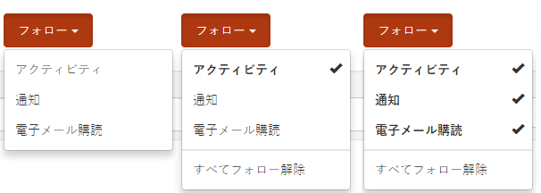
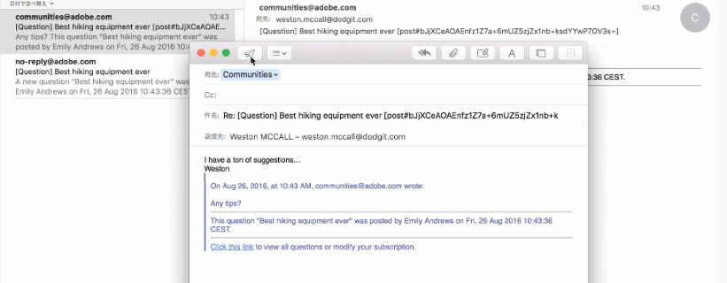
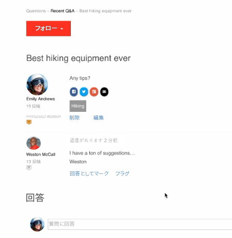

# コミュニティの購読  {#communities-subscriptions}

## 概要 {#overview}

コミュニティ[FP1](deploy-communities.md#latestfeaturepack)の時点で、コミュニティメンバーは、購読と呼ばれる機能を使用して、電子メールでコミュニティとやり取りすることができます。

購読は[通知](notifications.md)と似ています。会員がブログ記事、フォーラムトピック、QnAの質問に従う場合に購読できるからです。

購読が通知と異なるのは以下の点です。

* 会員は、他の会員をフォローする場合は、引き受けることができない。
* メンバーが実行する唯一のアクションは、次のとき`Email Subscriptions`を選択することです。
* 電子メールの返信が設定されている場合、メンバーは受信した電子メールに返信するだけで、効果的にコンテンツを投稿できます。

### 要件 {#requirements}

**電子メールの設定**

購読を機能させ、メンバーが電子メールで返信できるようにするには、電子メールを設定する必要があります。

電子メールを設定する手順については、[電子メールの設定](email.md)を参照してください。

**購読とフォローの有効化**

購読とフォローの両方を有効にするようコンポーネントを設定する必要があります。**&#x200B;購読を使用できる機能は、[blog](blog-feature.md)、[forum](forum.md)、[QnA](working-with-qna.md)です。

## フォローからの購読 {#subscriptions-from-following}

「**フォロー**」ボタンを使用すると、エントリをアクティビティや購読、通知としてフォローできます。「**フォロー**」ボタンを選択するたびに、選択のオン/オフを切り替えることができます。

フォロー方法が選択されると、ボタンのテキストが「**フォロー中**」に変わります。 便宜上、`Unfollow All`を選択して、すべてのメソッドをオフにすることができます。

「**フォロー**」ボタンには、電子メール購読を有効にするようにフォーラム、QnA、またはブログが設定されている場合にのみ、`Email Subscriptions`オプションが含まれます。 このボタンは、次のように表示されます。

* 有効なフォーラム、QnA、またはブログのメイン機能ページで、その機能に基づくすべてのアクティビティに関する電子メールを送信します。

* フォーラムトピック、QnA質問、ブログ記事など、特定の参加者に関するアクティビティがある場合は、その参加者に電子メールが送信されます。

## 電子メールによる返信 {#reply-by-email}

[電子メールによる返信の設定](email.md#configure-polling-importer)が電子メールでおこなわれている場合、購読したメンバーは、投稿されたコンテンツとオンラインコンテンツへのリンクが含まれた電子メールを受け取ります。

これらのメンバーが電子メールに返信すると、返信に入力したコンテンツがオンラインコンテンツとして投稿されます。

返信の投稿にかかる時間は、[ポーリングインポーターの更新間隔](email.md#configure-polling-importer)で制御します。

