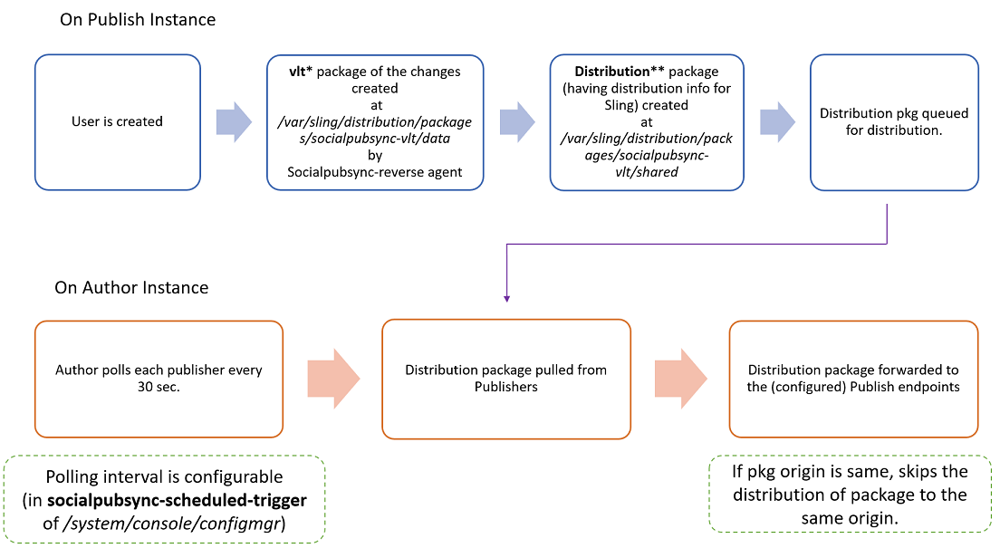
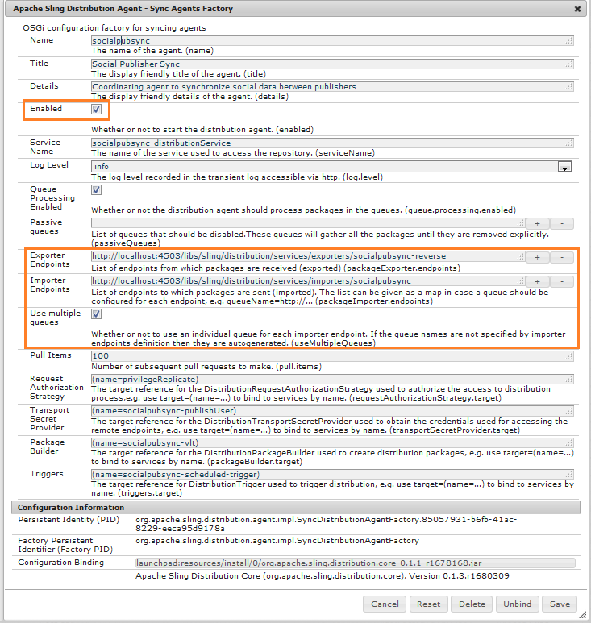
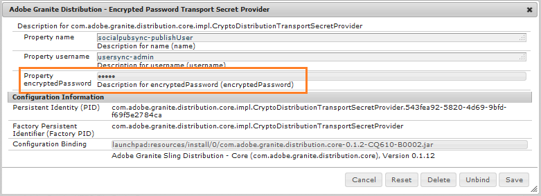
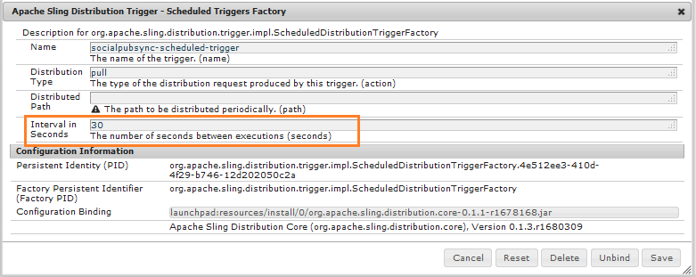
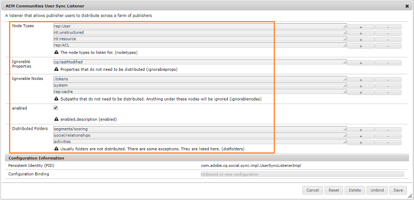
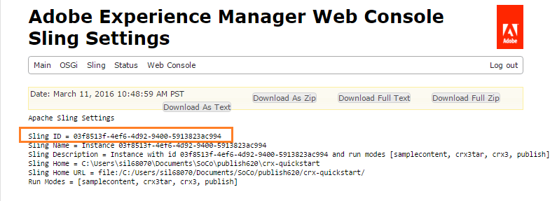

# コミュニティのユーザーの同期 {#communities-user-synchronization}

## はじめに {#introduction}

Adobe Experience Manager （AEM） Communitiesでは、パブリッシュ環境から（設定されている権限に応じて）、*サイト訪問者*&#x200B;が&#x200B;*メンバー*&#x200B;になり、*ユーザーグループ*&#x200B;を作成し、*メンバープロファイル*&#x200B;を編集できます。

*ユーザーデータ*&#x200B;は、*ユーザー*、*ユーザープロファイル*、*ユーザーグループ*&#x200B;を指します。

*メンバー*&#x200B;とは、オーサー環境に登録されたユーザーではなく、パブリッシュ環境に登録された&#x200B;*ユーザー*&#x200B;を指します。

ユーザーデータについて詳しくは、[ ユーザーとユーザーグループの管理](/help/communities/users.md)を参照してください。

## パブリッシュファーム間でのユーザーの同期 {#synchronizing-users-across-a-publish-farm}

設計上、パブリッシュ環境で作成されたユーザーデータは、オーサー環境には表示されません。

オーサー環境で作成されたほとんどのユーザーデータは、オーサー環境に残ることを目的としており、パブリッシュインスタンスに同期またはレプリケートされません。

[ トポロジ ](/help/communities/topologies.md)が[ パブリッシュファーム ](/help/sites-deploying/recommended-deploys.md#tarmk-farm)である場合、1つのパブリッシュインスタンスで行われた登録と変更は、他のパブリッシュインスタンスと同期する必要があります。 メンバーはログインして、任意のパブリッシュノードでデータを確認できる必要があります。

ユーザー同期が有効になっている場合、ユーザーデータはファーム内のパブリッシュインスタンス間で自動的に同期されます。

### ユーザー同期の設定手順 {#user-sync-setup-instructions}

パブリッシュファーム全体で同期を有効にする方法の詳細な手順については、[ ユーザー同期](/help/sites-administering/sync.md)を参照してください。

## バックグラウンドでのユーザー同期 {#user-sync-in-the-background}



* **vlt パッケージ**

  これは、パブリッシャーで行われたすべての変更のzip ファイルです。パブリッシャー間で配布する必要があります。 発行者の変更は、変更イベントリスナーによって選択されたイベントを生成します。 これにより、すべての変更を含むvlt パッケージが作成されます。

* **配布パッケージ**

  Slingの配布情報が含まれています。 つまり、コンテンツを配布する場所と、最後に配布した日時に関する情報です。

## 各種操作の結果 {#what-happens-when}

### Communities Sites コンソールからのサイトの公開 {#publish-site-from-communities-sites-console}

作成者では、コミュニティサイトが[ コミュニティサイトコンソール ](/help/communities/sites-console.md)から公開されると、関連するページを[ レプリケート ](/help/sites-deploying/configuring.md#replication-reverse-replication-and-replication-agents)し、Slingはメンバーシップを含む動的に作成されたコミュニティユーザーグループを配布します。

### 公開時にユーザーが作成またはプロファイルを編集 {#user-is-created-or-edits-profile-on-publish}

設計上、パブリッシュ環境で作成されたユーザーとプロファイル（自己登録、ソーシャルログイン、LDAP認証など）は、オーサー環境には表示されません。

トポロジーが[パブリッシュファーム](/help/communities/topologies.md)であり、ユーザー同期が正しく設定されると、Sling 配布を使用して&#x200B;*ユーザー*&#x200B;と&#x200B;*ユーザープロファイル*&#x200B;がパブリッシュファーム間で同期されます。

### 新しいコミュニティグループがパブリッシュで作成される {#new-community-group-is-created-on-publish}

パブリッシュインスタンスから開始されますが、コミュニティグループの作成（新しいサイトページと新しいユーザーグループが作成される）は、実際にはオーサーインスタンスで実行されます。

プロセスの一環として、新しいサイトページはすべてのパブリッシュインスタンスにレプリケートされます。 動的に作成されたコミュニティユーザーグループとそのメンバーシップは、すべてのパブリッシュインスタンスにSling配布されます。

### セキュリティコンソールを使用してユーザーやユーザーグループが作成される場合 {#users-or-user-groups-are-created-using-security-console}

設計上、パブリッシュ環境で作成されたユーザーデータは、オーサー環境には表示されず、逆に表示されます。

[ ユーザー管理およびセキュリティ ](/help/sites-administering/security.md) コンソールを使用してパブリッシュ環境に新しいユーザーを追加すると、必要に応じて、ユーザー同期によって新しいユーザーとそのグループメンバーシップが他のパブリッシュインスタンスに同期されます。 ユーザー同期により、セキュリティコンソールによって作成されたユーザーグループも同期されます。

### ユーザーが公開時にコンテンツを投稿 {#user-posts-content-on-publish}

ユーザー生成コンテンツ（UGC）の場合、パブリッシュインスタンスに入力されたデータは、[設定されたSRP](/help/communities/srp-config.md)を通じてアクセスされます。

## ベストプラクティス {#bestpractices}

デフォルトでは、ユーザー同期は&#x200B;**無効**&#x200B;です。 ユーザー同期を有効にするには、OSGi の既存の設定を変更する必要があります&#x200B;*。* ユーザー同期を有効にした結果、新しい設定が追加されることはありません。

ユーザーデータがオーサー上に作成されていなくても、ユーザー同期はオーサー環境を使用してユーザーデータ配布を管理します。

**前提条件**

1. ）1 つのパブリッシャーでユーザーおよびユーザーグループが既に作成されている場合は、ユーザー同期を設定して有効にする前に、ユーザーデータをすべてのパブリッシャーと[手動で同期](/help/sites-administering/sync.md#manually-syncing-users-and-user-groups)することをお勧めします。

   ユーザー同期を有効にすると、新しく作成されたユーザーとグループのみが同期されます。

1. 最新のコードがインストールされていることを確認します。

   * [AEM プラットフォームのアップデート](https://helpx.adobe.com/jp/experience-manager/kb/aem62-available-hotfixes.html)
   * [AEM Communities の更新](/help/communities/deploy-communities.md#latestfeaturepack)

AEM Communitiesでユーザーの同期を有効にするには、次の設定が必要です。 Sling コンテンツ配信が失敗しないように、これらの設定が正しいことを確認します。

### Apache Sling Distribution Agent - Sync Agents Factory {#apache-sling-distribution-agent-sync-agents-factory}

この設定は、パブリッシャー間で同期されるコンテンツを取得します。 設定はオーサーインスタンス上にあります。 著者は、そこにあるすべてのパブリッシャーと、すべての情報をどこで同期するかを追跡する必要があります。

設定のデフォルト値は、1つのパブリッシュインスタンス用です。 ユーザー同期は、パブリッシュファームなど、複数のパブリッシュインスタンスを同期するのに役立つため、追加のパブリッシュインスタンスを設定に追加する必要があります。

**コンテンツはどのように同期されていますか？**

オーサーインスタンスは、パブリッシャーのエクスポーターエンドポイントにpingを送信します。 特定の発行者（n）でユーザーが作成または更新されるたびに、作成者はエクスポーターエンドポイントからコンテンツを取得し、[ コンテンツを他の発行者（n-1、コンテンツを取得する発行者とは別）にプッシュします。](/help/communities/sync.md#main-pars-image-1413756164)

Apache Sling Sync Agents設定を設定するには：

1. AEM オーサーインスタンスの管理者権限でログインします。
1. [Web コンソール ](/help/sites-deploying/configuring-osgi.md)にアクセスします。 例：[https://localhost:4502/system/console/configMgr](https://localhost:4502/system/console/configMgr)
1. **Apache Sling Distribution Agent - Sync Agents Factory**&#x200B;を探します。

   * 既存の設定を選択して編集用に開きます（鉛筆アイコン）。

     検証名：**socialpubsync.**

   * 「**有効**」チェックボックスを選択します。
   * 「**複数のキューを使用」を選択します。**
   * **エクスポーターエンドポイント**&#x200B;と&#x200B;**インポーターエンドポイント**&#x200B;を指定します（さらにエクスポーターとインポーターエンドポイントを追加できます）。

     これらのエンドポイントは、コンテンツを取得する場所とコンテンツをプッシュする場所を定義します。 オーサーは、指定されたエクスポーターエンドポイントからコンテンツを取得し、コンテンツを取得したパブリッシャー以外のパブリッシャーにプッシュします。

   

### Adobe Granite Distribution - Encrypted Password Transport Secret Provider {#adobe-granite-distribution-encrypted-password-transport-secret-provider}

オーサーは、オーサーからパブリッシュにユーザーデータを同期する権限を持つため、許可されたユーザーを識別できます。

すべてのパブリッシュインスタンスで作成された[承認済みユーザー](/help/sites-administering/sync.md#createauthuser)は、パブリッシャーがオーサーと接続し、オーサー上のSling ディストリビューションを設定するのに役立ちます。 この承認済みユーザーには、必要なすべての[ACL](/help/sites-administering/sync.md#howtoaddacl)があります。

パブリッシャーにデータをインストールするか、パブリッシャーから取得する場合、作成者は、この設定で設定された資格情報（ユーザー名とパスワード）を使用してパブリッシャーに接続します。

承認済みユーザーを使用してオーサーをパブリッシャーに接続するには：

1. AEM オーサーインスタンスの管理者権限でログインします。
1. [Web コンソール ](/help/sites-deploying/configuring-osgi.md)にアクセスします。

   例：[https://localhost:4502/system/console/configMgr](https://localhost:4502/system/console/configMgr)
1. **Adobe Granite Distribution - Encrypted Password Transport Secret Providerを探します。**
1. 既存の設定を選択して編集用に開きます（鉛筆アイコン）。

   プロパティ **socialpubsync** - **publishUser.**&#x200B;を確認します

1. ユーザー名とパスワードを[承認済みユーザー](/help/sites-administering/sync.md#createauthorizeduser)に設定します。

   例：**usersync - admin**



### Apache Sling Distribution Agent - Queue Agents Factory {#apache-sling-distribution-agent-queue-agents-factory}

この設定は、パブリッシャー間で同期するデータを設定するために使用されます。 **許可ルート**&#x200B;で指定されたパスでデータが作成/更新されると、「var/community/distribution/diff」がアクティブになり、作成されたレプリケーターがパブリッシャーからデータを取得し、他のパブリッシャーにインストールします。

同期するデータ（ノードパス）を設定するには：

1. パブリッシュインスタンスの管理者権限でログインします。
1. [Web コンソール ](/help/sites-deploying/configuring-osgi.md)にアクセスします。

   例：[https://localhost:4503/system/console/configMgr](https://localhost:4503/system/console/configMgr)

1. **Apache Sling Distribution Agent - Queue Agents Factory**&#x200B;を探します。
1. 既存の設定を選択して編集用に開きます（鉛筆アイコン）。

   検証名：**socialpubsync -reverse**

1. 「**有効**」チェックボックスをオンにして保存します。
1. **許可ルート**&#x200B;でレプリケートするノード パスを指定します。
1. 各&#x200B;**publish** インスタンスについて、これを繰り返します。

   

### Adobe花崗岩ディストリビューション - Diff Observer Factory {#adobe-granite-distribution-diff-observer-factory}

この設定により、パブリッシャー間でグループメンバーシップが同期されます。
1つのパブリッシャーのグループのメンバーシップを変更しても、他のパブリッシャーのメンバーシップが更新されない場合は、**参照:members**&#x200B;が&#x200B;**見たプロパティ名**&#x200B;に追加されていることを確認してください。

メンバーの同期を確保するには、次の手順に従います。

1. パブリッシュインスタンスの管理者権限でログインします。
1. [Web コンソール ](/help/sites-deploying/configuring-osgi.md)にアクセスします。

   例：[https://localhost:4503/system/console/configMgr](https://localhost:4503/system/console/configMgr)

1. **Adobe Granite Distribution - Diff Observer Factory**&#x200B;を探します。
1. 既存の設定を選択して編集用に開きます（鉛筆アイコン）。

   **エージェント名：socialpubsync -reverse**&#x200B;を確認します。

1. 「**有効**」チェックボックスを選択します。
1. **見たプロパティ名**&#x200B;のpropertyNameの説明として&#x200B;**rep:members**&#x200B;を指定し、保存します。

   

### Apache Sling配布トリガー - スケジュールされたトリガーファクトリ {#apache-sling-distribution-trigger-scheduled-triggers-factory}

この設定では、パブリッシャー間で変更を同期するために、ポーリング間隔（パブリッシャーがping送信され、オーサーが変更を取り込む間隔）を設定できます。

作成者は30秒ごとにパブリッシャーに投票します（デフォルト）。 フォルダー`/var/sling/distribution/packages/  socialpubsync -  vlt /shared`にパッケージが存在する場合、そのパッケージを取得し、他のパブリッシャーにインストールします。

ポーリング間隔を変更するには：

1. AEM オーサーインスタンスの管理者権限でログインします。
1. [Web コンソール ](/help/sites-deploying/configuring-osgi.md)にアクセスします。例：[https://localhost:4502/system/console/configMgr](https://localhost:4502/system/console/configMgr)
1. **Apache Sling Distribution トリガー - スケジュールされたトリガーファクトリ**&#x200B;を探します

   * 既存の設定を選択して編集用に開きます（鉛筆アイコン）。

     **socialpubsync -scheduled-トリガー**&#x200B;を確認します

   * 間隔を秒単位で目的の間隔に設定し、保存します。

   

### AEM Communities User Sync Listener {#aem-communities-user-sync-listener}

サブスクリプションに不一致があるSling ディストリビューションの問題とその後の問題については、**AEM Communities User Sync Listener**&#x200B;設定で次のプロパティが設定されているかどうかを確認してください。

* NodeTypes
* IgnorableProperties
* IgnorableNodes
* DistributedFolders

購読、フォロー、通知を同期するには

各AEM パブリッシュインスタンスで、次の操作を行います。

1. 管理者権限でログインします。
1. [Web コンソール ](/help/sites-deploying/configuring-osgi.md)にアクセスします。 例：[https://localhost:4503/system/console/configMgr](https://localhost:4503/system/console/configMgr)
1. **AEM Communities User Sync Listener**&#x200B;を探します。
1. 既存の設定を選択して編集用に開きます（鉛筆アイコン）

   検証名：**socialpubsync -scheduled-トリガー**

1. 次の&#x200B;**NodeTypes**&#x200B;を設定します。

   `rep:User`

   `nt:unstructured`

   `nt:resource`

   `rep:ACL`

   `sling:Folder`

   `sling:OrderedFolder`

   このプロパティで指定されたノードタイプは同期され、通知情報（ブログと設定に続く）は異なるパブリッシャー間で同期されます。

1. **DistributedFolders**&#x200B;で同期するすべてのフォルダーを追加します。 例：

   `segments/scoring`

   `social/relationships`

   `activities`

1. **ignorablenodes**&#x200B;を次のように設定します。

   `.tokens`

   `system`

   `rep:cache` （スティッキーセッションが使用されているため、このノードを別のパブリッシャーに同期する必要はありません）。

   

### 一意のSling ID {#unique-sling-id}

AEM オーサーインスタンスは、Sling IDを使用して、データの送信元と、パッケージを返送する必要がある（または必要ない）パブリッシャーを特定します。

パブリッシュファーム内のすべてのパブリッシャーが一意のSling IDを持っていることを確認します。 パブリッシュファーム内の複数のパブリッシュインスタンスでSling IDが同じ場合、ユーザーの同期が失敗します。 作成者は、パッケージの取得元とインストール先を把握していないため、

パブリッシュファーム内のパブリッシャーの一意のSling IDを各パブリッシュインスタンスで確保するには：

1. [https://_host :port_/system/console/status-slingsettings](https://localhost:4503/system/console/status-slingsettings)を参照します。
1. **Sling ID**&#x200B;の値を確認してください。

   

   あるパブリッシュインスタンスの Sling ID が他のパブリッシュインスタンスの Sling ID と一致する場合は、次のようにします。

1. 一致するSling IDを持つパブリッシュインスタンスのいずれかを停止します。
1. `crx-quickstart/launchpad/felix` ディレクトリで、*sling.id.fileという名前のファイルを検索して削除します。*

   例えば、Linux システムの場合は次のようになります。

   `rm -i $(find . -type f -name sling.id.file)`

   例えば、Windows システムの場合は次のようになります。

   Windows エクスプローラーを使用して`sling.id.file`を検索

1. パブリッシュインスタンスを開始します。 起動時に、新しいSling IDが割り当てられます。
1. **Sling ID**&#x200B;が一意であることを検証します。

すべてのパブリッシュインスタンスの Sling ID が一意になるまでこの手順を繰り返します。

### Vault Package Builder Factory {#vault-package-builder-factory}

アップデートを正しく同期するには、ユーザー同期のためにVault パッケージビルダーを変更する必要があります。
`/home/users`で、`*/rep:cache` ノードが作成されます。これは、ノードのプリンシパル名にクエリを実行すると、このキャッシュを直接使用できるかどうかを確認するために使用されるキャッシュです。

`rep :cache` ノードがパブリッシャー間で同期されている場合、ユーザーの同期を停止できます。

アップデートがパブリッシャー間で適切に同期されるようにするには、各AEM パブリッシュインスタンスで次の手順を実行します。

1. [Web コンソール ](/help/sites-deploying/configuring-osgi.md)へのアクセス

   例：[https://localhost:4503/system/console/configMgr](https://localhost:4503/system/console/configMgr)
1. **Apache Sling Distribution Packaging - Vault Package Builder Factory**&#x200B;を探します

   ビルダー名：socialpubsync-vlt.

1. 編集アイコンを選択します。
1. 2つのパッケージノードフィルターを追加します。
   * `/home/users|-.*/.tokens`
   * `/home/users|-.*/rep:cache`
1. ポリシー処理
   * 既存の担当者:policy ノードを新しいノードで上書きするには、3番目のパッケージフィルターを追加します：`/home/users|+.*/rep:policy`
   * ポリシーが配布されないようにするには、次のように設定します：`Acl Handling: IGNORE`

   

## AEM CommunitiesでのSling配布のトラブルシューティング {#troubleshoot-sling-distribution-in-aem-communities}

Slingの配布に失敗した場合は、次のデバッグ手順を試してください。

1. **設定が正しく追加されていないか[確認](/help/sites-administering/sync.md#improperconfig)**

   複数の設定が追加または編集されないようにしてください。代わりに、既存のデフォルト設定を編集する必要があります。
1. **設定を確認**

   [ ベストプラクティス ](/help/communities/sync.md#main-pars-header-863110628)に記載されているように、すべての[設定](/help/communities/sync.md#bestpractices)がAEM オーサーインスタンスで適切に設定されていることを確認します。

1. **許可されたユーザー権限を確認**

   パッケージが正しくインストールされていない場合は、最初のパブリッシュインスタンスで作成された[承認済みユーザー](/help/sites-administering/sync.md#createauthuser)に正しいACLがあることを確認してください。

   これを検証するには、[作成済みの承認済みユーザー](/help/sites-administering/sync.md#createauthuser)の代わりに、オーサーインスタンスの[Adobe Granite Distribution - Encrypted Password Transport Secret Provider](/help/sites-administering/sync.md#adobegraniteencpasswrd)設定を変更して、管理者ユーザーの資格情報を使用します。 次に、パッケージのインストールを再試行します。 ユーザーの同期が管理者の資格情報で正常に機能する場合は、作成されたパブリッシュユーザーに適切なACLがないことを意味します。

1. **差分オブザーバーファクトリ設定を確認**

   特定のノードのみがパブリッシュファーム間で同期されない場合（例：グループメンバーが同期されない場合）、[Adobe Granite Distribution - Diff Observer Factory](/help/sites-administering/sync.md#diffobserver)設定が有効であり、**担当者：メンバー**&#x200B;が&#x200B;**見た目のプロパティ名**&#x200B;に設定されていることを確認します。

1. **AEM Communities User Sync Listener設定を確認します。** 作成したユーザーが同期されていても、サブスクリプションとフォローが機能していない場合は、AEM Communities User Sync Listener設定に次の条件が設定されていることを確認します。

   * ノードの種類 – **rep:User、nt:unstructured**、**nt:resource**、**rep:ACL**、**sling:Folder**、および&#x200B;**sling:OrderedFolder**&#x200B;に設定されています。
   * Ignorable nodes- **.tokens**、**system**、**rep:cache**&#x200B;に設定されています。
   * 配布フォルダー – 配布するフォルダーに設定します。

1. **パブリッシュインスタンス**&#x200B;でのユーザー作成時に生成されたチェックログ

   上記の設定が適切に設定されていてもユーザー同期が機能しない場合は、ユーザー作成時に生成されたログを確認してください。

   ログの順序が次のように同じかどうかを確認します。

   ```shell
   15.05.2016 18:33:01.523 *INFO* [sling-oak-observation-7422] com.adobe.cq.social.sync.impl.PublisherSyncServiceImpl Handing these paths to the distribution subsystem: [/home/users/C, /home/users/C/Cw-5avWqilmqsNn5hCvK]
   15.05.2016 18:33:01.523 *INFO* [sling-oak-observation-7422] org.apache.sling.distribution.agent.impl.SimpleDistributionAgent [agent][socialpubsync-reverse] REQUEST-START DSTRQ2: ADD paths=[/home/users/C, /home/users/C/Cw-5avWqilmqsNn5hCvK], user=communities-user-admin
   15.05.2016 18:33:01.523 *INFO* [sling-oak-observation-7431] com.adobe.cq.social.sync.impl.PublisherSyncServiceImpl Handing these paths to the distribution subsystem: [/home/users/C/Cw-5avWqilmqsNn5hCvK, /home/users/C/Cw-5avWqilmqsNn5hCvK/profile, /home/users/C/Cw-5avWqilmqsNn5hCvK/rep:policy]
   15.05.2016 18:33:01.523 *INFO* [sling-oak-observation-7431] org.apache.sling.distribution.agent.impl.SimpleDistributionAgent [agent][socialpubsync-reverse] REQUEST-START DSTRQ3: ADD paths=[/home/users/C/Cw-5avWqilmqsNn5hCvK, /home/users/C/Cw-5avWqilmqsNn5hCvK/profile, /home/users/C/Cw-5avWqilmqsNn5hCvK/rep:policy], user=communities-user-admin
   15.05.2016 18:33:01.757 *INFO* [sling-oak-observation-7431] org.apache.jackrabbit.vault.packaging.impl.JcrPackageDefinitionImpl unwrapping package sling/distribution:socialpubsync-vlt_1463337181554_ebb27ad9-a861-4405-9342-d64c916654e2:0.0.1
   15.05.2016 18:33:01.820 *INFO* [sling-oak-observation-7422] org.apache.jackrabbit.vault.packaging.impl.JcrPackageDefinitionImpl unwrapping package sling/distribution:socialpubsync-vlt_1463337181554_58811273-5861-48fe-95d2-4aff367b99c3:0.0.1
   15.05.2016 18:33:02.023 *INFO* [sling-oak-observation-7430] com.adobe.cq.social.sync.impl.PublisherSyncServiceImpl Handing these paths to the distribution subsystem: [/home/users/C/Cw-5avWqilmqsNn5hCvK/profile]
   15.05.2016 18:33:02.023 *INFO* [sling-oak-observation-7430] org.apache.sling.distribution.agent.impl.SimpleDistributionAgent [agent][socialpubsync-reverse] REQUEST-START DSTRQ4: ADD paths=[/home/users/C/Cw-5avWqilmqsNn5hCvK/profile], user=communities-user-admin
   15.05.2016 18:33:02.273 *INFO* [sling-oak-observation-7430] org.apache.jackrabbit.vault.packaging.impl.JcrPackageDefinitionImpl unwrapping package sling/distribution:socialpubsync-vlt_1463337182039_f34f4fa6-10b9-42eb-8740-4da9d4d38f99:0.0.1
   ```

デバッグするには：

1. ユーザーの同期を無効にします。
1. AEM オーサーインスタンスで、管理者権限でログインします。

   1. [Web コンソール ](/help/sites-deploying/configuring-osgi.md)にアクセスします。 例：[https://localhost:4502/system/console/configMgr](https://localhost:4502/system/console/configMgr)
   1. 設定&#x200B;**Apache Sling Distribution Agent - Sync Agents Factory**&#x200B;を探します。
   1. 「**有効**」チェックボックスの選択を解除します。

      オーサーインスタンス（エクスポーターとインポーター）でユーザー同期を無効にすると、エンドポイントは無効になり、オーサーインスタンスは静的になります。 **vlt** パッケージは、作成者がpingまたは取得していません。

      これで、パブリッシュインスタンスでユーザーを作成すると、**vlt** パッケージが&#x200B;*/var/sling/distribution/packages/ socialpubsync - vlt /data* ノードに作成されます。 これらのパッケージがオーサーによって別のサービスにプッシュされた場合。 このデータをダウンロードして抽出し、すべてのプロパティが他のサービスにプッシュされていることを確認できます。

1. パブリッシャーに移動し、パブリッシャーでユーザーを作成します。 その結果、イベントが作成されます。
1. ユーザー作成時に作成されたログ ](/help/communities/sync.md#troubleshoot-sling-distribution-in-aem-communities)の[順序を確認してください。
1. **vlt** パッケージが&#x200B;**/var/sling/distribution/packages/socialpubsync-vlt/data**&#x200B;に作成されているかどうかを確認します。
1. 次に、AEM オーサーインスタンスでユーザー同期を有効にします。
1. 発行者で、**Apache Sling Distribution Agent - Sync Agents Factory**のエクスポーターまたはインポーターエンドポイントを変更します。
パッケージデータをダウンロードして抽出し、どのプロパティが他のパブリッシャーにプッシュされているか、どのデータが失われるかを確認できます。
